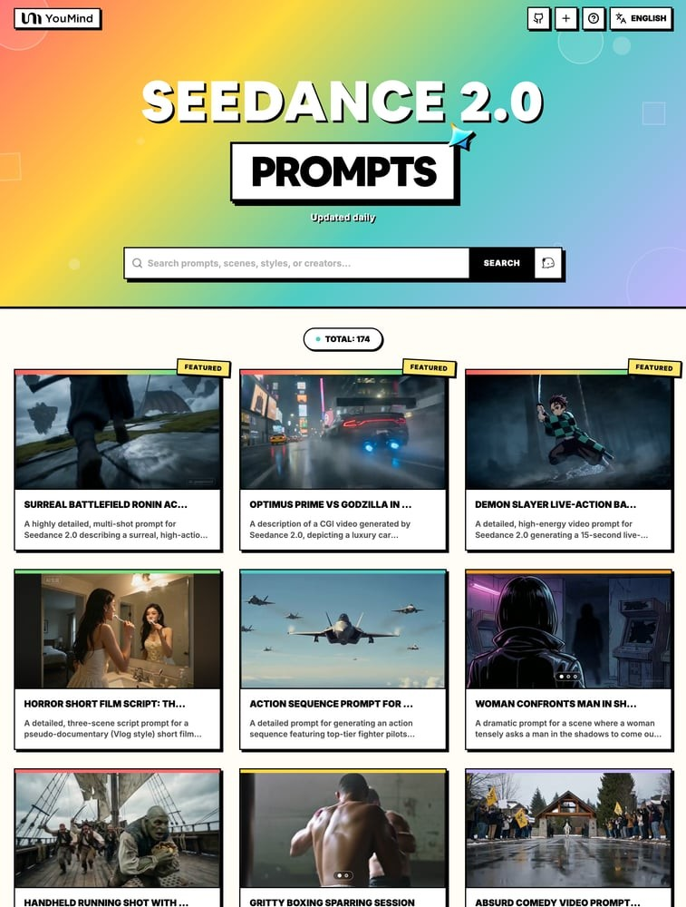

[](README.md) [](README_zh.md) [](README_zh-TW.md) [](README_ja-JP.md) [](README_ko-KR.md) [](README_th-TH.md) [](README_vi-VN.md) [](README_hi-IN.md) [](README_es-ES.md) [-Click%20to%20View-lightgrey)](README_es-419.md) [](README_de-DE.md) [](README_fr-FR.md) [](README_it-IT.md) [-Click%20to%20View-lightgrey)](README_pt-BR.md) [](README_pt-PT.md) [](README_tr-TR.md)

---

# 🎬 Seedance 2.0 비디오 프롬프트 모음

[](https://awesome.re)
[](https://github.com/YouMind-OpenLab/awesome-seedance-2-0-prompts)
[](https://creativecommons.org/licenses/by/4.0/)
[](https://github.com/YouMind-OpenLab/awesome-seedance-2-0-prompts/pulls)

ByteDance Seedance 2.0을 위한 고품질 비디오 생성 프롬프트 컬렉션

> ⚠️ **저작권 고지**: 모든 프롬프트는 교육 목적으로 커뮤니티에서 수집되었습니다. 귀하의 권리를 침해하는 콘텐츠가 있다고 생각되면 [이슈를 열어주세요](https://github.com/YouMind-OpenLab/awesome-seedance-2-0-prompts/issues/new). 즉시 삭제하겠습니다.

---

## 📖 목차

- [🌐 웹 갤러리에서 보기](#--)
- [🤔 Seedance 2.0이란?](#-seedance-20)
- [📊 통계](#-)
- [⭐ 추천 프롬프트](#--)
- [🎬 모든 프롬프트](#--)
- [🤝 기여하는 방법](#--)
- [📄 라이선스](#-)
- [🙏 감사의 말](#--)
- [⭐ 스타 히스토리](#--)

---

## 🌐 웹 갤러리에서 보기

<div align="center">



</div>

**[👉 YouMind에서 모든 Seedance 2.0 프롬프트 둘러보기](https://youmind.com/ko-KR/seedance-2-0-prompts)**

갤러리를 사용하는 이유는?

| Feature | GitHub README | youmind.com 갤러리 |
|---------|--------------|---------------------|
| 🎬 비디오 재생 | ❌ 정적 썸네일만 | ✅ 풀 비디오 스트리밍 재생 |
| 🔍 검색 | Ctrl+F만 | 다중 필드 퍼지 매칭 검색 |
| 🤖 AI 추천 | - | AI 기반 프롬프트 추천 |
| 📱 모바일 | 기본 | 완전 반응형 |

---

## 🤔 Seedance 2.0이란?

**Seedance 2.0**은 **ByteDance**가 개발한 비디오 생성 모델로, 업계 최초로 **4가지 모달 동시 입력**을 지원합니다 — 이미지, 비디오, 오디오, 텍스트.

**Key Features:**
- 🎥 **텍스트에서 비디오** — 텍스트 설명으로 비디오 생성
- 🖼️ **이미지에서 비디오** — 정적 이미지를 동적 비디오로 애니메이션화
- 📹 **비디오에서 비디오** — 기존 비디오 변환 및 확장
- 🎵 **오디오 기반** — 오디오 입력으로 비디오 생성
- 📐 **최대 1080p 해상도**, 4-15초 길이
- 🔊 **자동 더빙 및 스코어링** — 자동 나레이션 및 배경 음악

---

## 📊 통계

| 지표 | 수 |
|--------|-------|
| 📝 총 프롬프트 수 | **175** |
| ⭐ 추천 프롬프트 | **3** |
| 🔄 마지막 업데이트 | **2026-02-13** |

---

## ⭐ 추천 프롬프트

> 엄선된 고품질 프롬프트

### 도쿄의 옵티머스 프라임 대 고질라


> Seedance 2.0으로 생성된 CGI 영상에 대한 설명으로, 비 내리는 도쿄의 밤을 배경으로 폭발과 에너지 폭발 속에서 럭셔리 자동차가 옵티머스 프라임으로 변신하여 고질라와 싸우는 모습을 묘사합니다.

#### 📝 프롬프트

```
고급 승용차가 옵티머스 프라임으로 변신하여 고질라와 싸우고, 비 내리는 도쿄의 밤을 배경으로 폭발과 에너지 광선을 뿜어냅니다.
```


**작성자:** [HopefulofNFTs](https://x.com/HopefulofNFTs) | **출처:** [Link](https://x.com/HopefulofNFTs/status/2021822131143635160) | **게시일:** Feb 12, 2026

**[🎬 비디오 보기 →](https://youmind.com/ko-KR/seedance-2-0-prompts?id=210)**

---
### 초현실적인 전장 속 로닌 액션 장면


> Seedance 2.0을 위한 매우 상세하고 여러 장면으로 구성된 프롬프트로, 가면을 쓴 로닌이 가슴이 폭풍 구름의 소용돌이인 거대한 날개 달린 짐승에게 쫓기는 초현실적이고 고강도 액션의 하늘 전장 장면을 묘사합니다. 이 프롬프트에는 특정 카메라 움직임, 기술적 세부 사항(720p, 16:9, 15초) 및 극적인 피날레가 포함됩니다.

#### 📝 프롬프트

```
하늘에 펼쳐진 초현실적인 전장: 폭풍우 속을 떠다니는 부유하는 바위섬들, 아래로는 바다처럼 소용돌이치는 구름. 가면을 쓴 로닌은 폭풍 구름과 번개의 소용돌이가 가슴에 휘몰아치는 거대한 날개 달린 짐승에게 쫓기며 떠다니는 발판 위를 질주한다. 카메라는 바위들이 기울고, 회전하고, 부서져 내리는 가운데 그들을 따라잡기 위해 애쓰며 섬에서 섬으로 돌진한다. 날갯짓 한 번 할 때마다 충격파가 공기를 가로질러 프레임을 흔들고, 파편과 비를 시청자의 얼굴로 곧장 날려 보낸다. 빠른 핸드헬드 컷은 로닌이 불가능한 간격을 뛰어넘는 모습을 포착하고, 검은 어둠을 잠시 가르는 빛의 아크를 그린다. 마지막 장면은 로닌이 마지막 부서지는 바위에서 뛰어내리면서 카메라가 그의 뒤를 따라가고, 번개 줄기를 타고 괴물의 가슴 소용돌이 속으로 직접 뛰어들어 폭풍을 내부에서 폭발시키고 눈부신 섬광으로 하늘을 맑게 하는 최후의 일격, 즉 모든 것을 건 일격을 보여준다.

720p
16:9
15초
```


**작성자:** [Dheepan Ratnam](https://x.com/Dheepanratnam) | **출처:** [Link](https://x.com/Dheepanratnam/status/2021689626092589532) | **게시일:** Feb 11, 2026

**[🎬 비디오 보기 →](https://youmind.com/ko-KR/seedance-2-0-prompts?id=133)**

---
### Demon Slayer Live-Action Battle Prompt for Seedance 2.0


> Seedance 2.0을 위한 상세하고 역동적인 비디오 프롬프트로, 15초 분량의 실사판 귀멸의 칼날 스타일 전투(물 속성 호흡 vs. 번개 속성 호흡)를 생성합니다. 이 프롬프트는 스타일(할리우드 실사 만화 각색, 다크 사무라이, 4K, 극단적인 퀵컷, 입자 빛 효과), 배경(밤의 안개 낀 숲), 그리고 캐릭터의 행동, 파워업 시퀀스, 최종 충돌을 상세히 묘사하는 세 가지 뚜렷한 장면을 지정합니다.

#### 📝 프롬프트

```
실사 만화 각색 · 호흡법 결정전 (15초 · 초고화질 특수 효과 버전)
【핵심 초점】: 물의 호흡 (푸른 물 용) VS 번개의 호흡 (황금 번개), 실사 초고속 대결.
【스타일】: 할리우드 실사 만화 각색 영화 퀄리티, 다크 사무라이 스타일, 4K 초고화질, 극단적인 퀵 컷, 입자 광원 효과 폭발, 잔혹성 없음.
【재생 시간】: 15초
【장면】: 달빛 아래 안개 낀 숲, 진흙탕, 낙엽.
[00:00-00:05] 샷 1: 물의 선율 서곡 · 시작 자세 (충전감)
시각 효과: 녹색과 검은색 체크무늬 하오리 (겉옷)를 입은 젊은 사무라이가 달빛 아래에서 무게 중심을 낮추고 양손으로 칼을 잡는다.
액션: 그가 심호흡을 하자 주변 공기가 즉시 응고된다. 칼을 뽑자마자 고압 수류로 응축된 거대한 푸른 물 용이 허공에서 나타나 그의 몸과 칼날 주위를 빠르게 회전하며 물 흐르는 소리를 낸다.
특수 효과 디테일: 물줄기는 사실적인 물보라 느낌을 주며 어두운 숲을 비춘다.
[00:05-00:10] 샷 2: 번개 섬광 · 전진 (초고속감)
시각 효과: 맞은편 상대인 노란색 삼각형 무늬 하오리를 입은 금발 검객이 몸을 극도로 낮춰 발도술 자세를 취한다.
액션: 땅이 갑자기 폭발한다. 그의 전신이 눈 깜짝할 사이에 눈에 보이지 않는 속도로 나무 사이를 'Z'자 형태로 빠르게 굴절하며 전진하는 눈부신 황금 번개 잔상으로 변한다.
특수 효과 디테일: 그가 지나간 자리에는 황금색 전기 아크와 그을린 낙엽이 남는다.
[00:10-00:15] 샷 3: 물-번개 충돌 · 마지막 소리 (궁극기 충돌)
시각 효과: 초고속 정면 충돌. 젊은 사무라이는 거대한 푸른 물 용을 휘둘러 공격을 막아내고, 번개로 변한 금발 검객이 그에게 부딪힌다.
액션: 두 칼이 프레임 중앙에서 격렬하게 충돌한다.
특수 효과 장관: 푸른 물 용과 황금 번개가 즉시 폭발하여 거대한 물-번개 에너지 폭풍을 형성하며 바깥으로 퍼져나간다. 주변의 큰 나무들은 에너지 파동에 의해 두 동강 나고, 진흙, 물, 빛이 카메라를 가린다. 장면은 극도로 눈부신 파란색, 노란색, 흰색 빛 속에서 끝난다.
```


**작성자:** [John](https://x.com/johnAGI168) | **출처:** [Link](https://x.com/johnAGI168/status/2021610292979876208) | **게시일:** Feb 11, 2026

**[🎬 비디오 보기 →](https://youmind.com/ko-KR/seedance-2-0-prompts?id=189)**

---
## 🎬 모든 프롬프트

> 📝 게시일 기준 정렬(최신순)

### 공포 단편 영화 대본: 거울 속 오류


> 서스펜스 있고 약간 공포스러운 분위기의 유사 다큐멘터리(Vlog 스타일) 단편 영화를 위한 상세한 3장면 스크립트 프롬프트입니다. 거울 속 자신의 모습이 지연된 독립적인 의식을 보이다가 오류가 발생하며 사라지고, 주인공은 혼란스럽고 두려워하는 내용입니다. 주인공의 참고 이미지가 필요합니다.

#### 📝 프롬프트

```
[스타일] 페이크 다큐멘터리 (브이로그 스타일), 하이퍼리얼리즘, 고정 카메라 실제 촬영 느낌, 자연광, 서스펜스와 공포 터치.
[길이] 15초
[주인공 (참고 이미지 업로드 필수)] 욕실 세면대 앞에서 씻고 잠자리에 들 준비를 하는 섹시한 젊은 여성.
[00:00-00:06] 샷 1: 평범함. 장면: 평범한 대형 욕실 거울 앞. 행동: 주인공이 거품을 가득 문 채 양치질을 한다. 양치질을 하면서 거울에 대고 다양한 우스꽝스러운 표정을 짓는다 (윙크하고 눈을 가늘게 뜬다). 핵심 디테일: 거울 속 반사된 모습은 완전히 정상적이며 주인공의 행동과 동기화된다.
[00:06-00:11] 샷 2: 글리치. 행동: 주인공이 양치질을 마치고 거품을 뱉어낸 후 욕실을 나가기 위해 몸을 돌린다. 고조되는 순간 (핵심 줄거리): 주인공의 실제 몸이 돌아서 거울 프레임을 벗어나는 순간, 거울 속 "반사된 모습"은 **움직이지 않는다**! "반사된 모습"은 양치질 자세를 유지하며 카메라를 향해 비웃는 듯한 표정을 짓고 눈썹을 치켜세우며 2초 동안 머무르다가 갑자기 당황한 듯 "화면 글리치"를 일으키며 몸의 행동을 따라잡아 사라진다. 감독 지시사항: "네트워크 지연"의 극도로 사실적인 느낌을 만들어내어 반사된 모습이 독립적인 의식을 가진 것처럼 보이게 해야 한다.
[00:11-00:15] 샷 3: 반전. 행동: 문에 다다른 주인공은 무언가 잘못되었음을 감지한 듯 빠르게 몸을 돌려 거울을 바라본다. 결과: 거울은 완전히 정상으로 돌아와 비어 있으며, 반대편 벽만 비추고 있다. 주인공은 혼란스럽고 겁에 질린 표정으로 방을 둘러보다가 경악하는 표정을 짓는다. 주인공의 당황한 얼굴에서 화면이 멈춘다 (공포 영화 효과).
```


**작성자:** [MapleShaw](https://x.com/msjiaozhu) | **출처:** [Link](https://x.com/msjiaozhu/status/2021777584913363052) | **게시일:** Feb 12, 2026

**[🎬 비디오 보기 →](https://youmind.com/ko-KR/seedance-2-0-prompts?id=194)**

---
### 전투기 조종사 전투를 위한 액션 시퀀스 프롬프트


> 최고 수준의 전투기 조종사들이 공중전에서 초고속 공중 기동과 조종사들의 격렬한 반응 및 조작 제어 클로즈업 샷에 초점을 맞춰 액션 시퀀스를 생성하기 위한 상세 프롬프트.

#### 📝 프롬프트

```
최고의 전투기 조종사가 현대 전투기에서 공중전을 벌이는 액션 시퀀스. 초고속의 격렬한 공중전 장면이 여러 번 전환되며, 조종사의 반응, 기어/스위치를 조작하는 손의 클로즈업 프로필 샷으로 이어집니다.
```


**작성자:** [𝕏Caliber](https://x.com/XCaliber) | **출처:** [Link](https://x.com/XCaliber/status/2021733224838574311) | **게시일:** Feb 11, 2026

**[🎬 비디오 보기 →](https://youmind.com/ko-KR/seedance-2-0-prompts?id=170)**

---
### 여성이 그림자 속 남성과 대치하다


> 여자가 그림자 속에 있는 남자에게 긴장된 목소리로 나오라고 요구하며 그의 행동에 대해 따져 묻는 장면. 카메라가 천천히 앞으로 다가간다.

#### 📝 프롬프트

```
한 여자가 그림자 속에 있는 남자에게 긴장하며 나오라고 말한다. 그녀가 그에게 그가 한 모든 일을 알고 있으며 대가를 치르게 될 것이라고 말하는 동안 천천히 카메라가 다가간다. 그림자 깊은 곳에서 그가 대답하는 모습이 보인다.
```


**작성자:** [Gavin Purcell](https://x.com/gavinpurcell) | **출처:** [Link](https://x.com/gavinpurcell/status/2021732810554507352) | **게시일:** Feb 11, 2026

**[🎬 비디오 보기 →](https://youmind.com/ko-KR/seedance-2-0-prompts?id=208)**

---
### 수중에서 금화를 들고 달리는 모습


> Seedance 2.0을 위한 복잡한 프롬프트: 손에 들고 달리는 장면, 금화가 넘쳐나는 가방, 물속으로 뛰어드는 모습, 그리고 카메라가 수중에서 피사체를 따라가는 장면을 포함하여 모델의 전환 및 물리 처리 능력을 테스트합니다.

#### 📝 프롬프트

```
금화가 가득 찬 가방을 들고 달리는 장면을 핸드헬드로 촬영한 후, 물속으로 뛰어들어 카메라가 그를 따라 물속으로 들어가는 장면.
```


**작성자:** [CoffeeVectors](https://x.com/CoffeeVectors) | **출처:** [Link](https://x.com/CoffeeVectors/status/2021713445855355226) | **게시일:** Feb 11, 2026

**[🎬 비디오 보기 →](https://youmind.com/ko-KR/seedance-2-0-prompts?id=161)**

---
### 강렬한 복싱 스파링 세션


> Kling 3.0과 Seedance 2.0을 비교하는 사실적인 시네마틱 비디오를 위한 상세 프롬프트. 거친 체육관에서 스파링하는 두 복서를 핸드헬드 샷으로 원을 그리며 촬영하고, 본능적인 사실감, 땀, 안정적인 정체성에 초점을 맞춥니다.

#### 📝 프롬프트

```
거친 체육관에서 두 명의 복서가 스파링 연습을 하며 서로를 의도적으로 피하는 핸드헬드 샷. 땀방울, 날카로운 충격, 격렬한 호흡. 얕은 피사계 심도, 실용적인 조명, 본능적인 사실감, 안정적인 정체성. 길이: 10초. 화면 비율: 16:9. 포토리얼 시네마틱. 명시되지 않는 한 단일 샷. 텍스트, 캡션, 워터마크, 로고는 피할 것. 카메라 움직임 강조: 부드러운 시차, 일관된 개체, 안정적인 얼굴; 텍스트 없음.
```


**작성자:** [AIVideoDotCom](https://x.com/AIVideoDotCom) | **출처:** [Link](https://x.com/AIVideoDotCom/status/2021708002286501951) | **게시일:** Feb 11, 2026

**[🎬 비디오 보기 →](https://youmind.com/ko-KR/seedance-2-0-prompts?id=140)**

---
### Seedance 2.0을 위한 황당 코미디 비디오 프롬프트: Nothing


> Seedance 2.0을 위한 상세한 다중 장면 비디오 프롬프트로, 부조리한 블랙 코미디 내러티브를 만듭니다. 이 이야기는 군중의 숭배를 기대하는 자신감 넘치는 기마병이 등장하지만, 군중은 그를 무시하고 대신 찐빵 가게로 달려가고, 결국 기마병은 '아무것도 아니다'라는 자조적인 깨달음을 얻는 것으로 끝납니다. 이 프롬프트에는 구체적인 장면 설명, 카메라 작업, 타이밍 및 대화가 포함됩니다.

#### 📝 프롬프트

```
장면 1: 질주하는 말 + 열광하는 군중 접근 (0:00-0:08, 8초)
• 장소: 밴쿠버 고급 주택가의 구불구불한 메인 도로 (넓은 아스팔트 도로, 양쪽에 큰 단독 주택들, 가볍게 눈 덮인 상록 소나무)
• 피사체: 검은색 정장을 입은 기수가 백마를 타고 전속력으로 질주, 말의 발굽은 공중에 떠 있고 갈기는 휘날림
• 환경: 가볍게 눈이 내리고, 저택들이 빠르게 스쳐 지나가며, 멀리 노스 쇼어 산과 바다의 윤곽이 보임
• 군중: 열광적인 지지자들 (다양한 젊은이들)이 갑자기 앞에 나타나 노란색 용 깃발과 "Nothing" 표지판을 흔들며 소리치고 환호하며 기수에게 몰려옴
• 카메라: 중속 전면 추적 촬영 → 기수의 시점 (POV)으로 전환, 군중이 점점 가까워짐
• 분위기: 절정은 계속되고, 기수는 자신감 있게 미소 지으며 고삐를 당길 준비를 함 (손은 이미 고삐 쪽으로 올라가 있고, 편안한 자세, 입꼬리는 올라감)

장면 2: 반전 — 군중이 기수를 무시하고 그대로 지나쳐감 (0:08-0:14, 6초)
• 장소: 같은 도로, 모퉁이에 중국식 찐빵 가게가 나타남 ("칭펑 바오쯔 가게" 간판, 따뜻한 조명, 야외 공간에 간단한 플라스틱 테이블과 의자, 김이 모락모락 피어오름)
• 피사체: 기수가 인사하며 손을 흔들려 하지만, 군중은 그를 무시하고 양쪽/주변으로 돌진하여 찐빵 가게 입구로 줄을 서거나 몰려감
• 행동: 기수의 미소가 굳고, 손은 공중에 멈추며, 그의 표정은 기대감에서 충격/혼란으로 바뀜 (바람이 그의 머리를 헝클어뜨리고, 정장 자락이 펄럭임)
• 세부 사항: 군중은 "바오쯔! 바오쯔!"라고 외치고, 노란색 용 깃발은 혼란스럽게 흔들리며, "Nothing" 표지판은 밀려남; 백마는 그들을 피하기 위해 작은 걸음으로 멈추거나 옆으로 돌려야 함
• 카메라: 빠른 팬/광각 촬영, 군중이 기수 주변을 조수처럼 흘러가는 모습을 보여줌 (말은 프레임 중앙에서 "통과됨"), 기수는 홀로 중앙에 남겨짐
• 분위기: 터무니없는 반전, 어색한 혼란, 블랙 유머의 절정

장면 3: 찐빵 가게 밖에서 찐빵을 먹고 대화 (0:14-0:20, 6초)
• 장소: 칭펑 바오쯔 가게 야외 공간 (플라스틱 테이블과 의자, 김이 나는 찜통, 배경에 고급 주택 도로)
• 피사체: 두 명의 평범한 젊은이들 (패딩 재킷 착용)이 줄 서는 좌석에 앉아 찐빵을 맛있게 먹고 있음
• 행동: 한 명이 찐빵을 한 입 베어 물고 만족감에 눈을 감으며 "아, 향긋하다." (찐빵이 베어 물린 클로즈업 샷, 김/육즙이 보임)
• 대화:
첫 번째 사람 (먹으면서 도로 쪽을 바라봄): 저 사람 누구야?
두 번째 사람 (생각에 잠겨 찐빵을 씹으며 먼 곳을 바라봄): 아무것도 아니야.
• 카메라: 두 사람의 미디엄 샷 → 얼굴 표정 (만족 + 침착)에 살짝 푸시인, 배경에 기수의 멀어지는 모습이 희미하게 보임
• 분위기: 현실적이고 소박함, 대조적인 귀여움, "nothing"이라는 주제를 언급

장면 4: 기수가 자조적으로 계속 질주해 감 (0:20-0:30, 10초)
• 장소: 고급 주택가의 넓고 길게 뻗은 도로 (직선으로, 저택들이 점점 멀어짐)
• 피사체: 말 위의 기수, 그의 표정은 혼란에서 자신감 있는 미소로 바뀜
• 행동: 그는 정장 안주머니에서 포장된 샌드위치를 꺼내 크게 한 입 베어 물고 (육즙/부스러기가 튀김), 멋지게 고개를 흔들고, 고삐로 백마를 가볍게 두드리며 계속 앞으로 질주함
• 환경: 배경의 저택 단지는 작아지고, 도로 양쪽의 상록수와 (이제 멈춰선) 지지자들은 멀리서 손을 흔드는 모습만 보임, 멀리 밴쿠버 스타일의 산과 바다 스카이라인 (눈 덮이고 희미함)
• 세부 사항: 백마의 꼬리가 흔들리고, 가볍게 눈 덮인 도로에 발굽 자국이 남음, 샌드위치의 베어 물린 자국이 선명함, 기수는 자신감 있게 미소 지음
• 카메라: 클로즈업 (샌드위치 베어 물린 세부 사항) → 극단적인 롱 샷으로 천천히 뒤로 물러남, 낮은 앵글 시점, 고독한 영웅주의의 "신경 쓰지 않음"을 강조; 마지막으로 페이드아웃
• 분위기: 자조적이지만 멋진, 영웅적이고 자유분방한, 상징적인 결말 ("Nothing"도 계속 나아갈 수 있다)
```


**작성자:** [John](https://x.com/john87445528) | **출처:** [Link](https://x.com/john87445528/status/2021706240272069021) | **게시일:** Feb 11, 2026

**[🎬 비디오 보기 →](https://youmind.com/ko-KR/seedance-2-0-prompts?id=186)**

---
### 거대 괴물에게서 도망치기 (아케인 스타일)


> 거대한 건물 크기의 괴물이 대상을 쫓는, 애니메이션 시리즈 Arcane 스타일의 달리기 장면을 요청하는 프롬프트.

#### 📝 프롬프트

```
100층 건물 크기의 거대한 괴물이 뒤에서 다가오는 달리기 장면을 Arcane 스타일로 영상 생성.
```


**작성자:** [Dipper](https://x.com/dipperdao) | **출처:** [Link](https://x.com/dipperdao/status/2021689147485040917) | **게시일:** Feb 11, 2026

**[🎬 비디오 보기 →](https://youmind.com/ko-KR/seedance-2-0-prompts?id=142)**

---
### Flash 디렉터 프롬프트


> ChatCut을 통해 Seedance 2.0에 사용된 매우 상세하고 여러 부분으로 구성된 '디렉터 프롬프트'로, Flash가 가속하여 시간 포털을 생성하는 복잡하고 역동적인 영화적 시퀀스를 묘사합니다.

#### 📝 프롬프트

```
오프닝 샷:
밤에 젖은 아스팔트에 닿는 플래시의 부츠를 극단적으로 클로즈업한다. 시간이 느려지면서 빗방울이 공중에서 멈춘다. 황금빛 번개가 그의 슈트 위로 기어오르기 시작하며 부드럽게 지직거린다.
카메라: 로우 앵글, 느린 푸시인.
그가 몸을 앞으로 기울이자 세상이 늘어나고 왜곡된다. 박자에 맞춰, 그는 발사된다. 그가 눈부신 붉은색과 황금색 번개와 함께 폭발적으로 앞으로 나아가 도시 거리를 찢고 지나가자 카메라는 추격에 나선다. 건물은 빛줄기로 번지고, 신호등은 색깔 줄무늬가 되며, 사운드 디자인 아래에서 천둥이 울린다.

감독 지시 — 파트 2

플래시는 도시를 넘어 고속도로, 사막, 바다를 몇 초 만에 가로지르며 질주한다. 그 아래에서 구름이 찢어지면서 지구의 곡률이 보인다.
카메라: 강한 모션 블러가 있는 역동적인 트래킹 샷, 번개가 에너지 혈관처럼 밖으로 뻗어 나간다.
시간이 파열된다 — 낮과 밤이 하나의 연속적인 질주로 붕괴된다. 그가 최고 속도에 도달하자 번개는 거의 흰색에 가까운 광채로 강렬해진다. 그는 마지막 천둥 같은 섬광 속으로 사라지며, 그을린 공기, 희미해지는 전기, 그리고 침묵만을 남긴다.

감독 지시 — 파트 3

낮고 공명하는 윙윙거리는 소리가 커진다. 앞쪽의 공기가 유리처럼 파열된다. 시간 자체가 찢어지는 것처럼 소용돌이치는 빛과 먼지로 빛나는 원형 포털 — 고대적이고 불안정한 — 이 형성된다.
```


**작성자:** [Rufus](https://x.com/Rufus87078959) | **출처:** [Link](https://x.com/Rufus87078959/status/2021687818188439745) | **게시일:** Feb 11, 2026

**[🎬 비디오 보기 →](https://youmind.com/ko-KR/seedance-2-0-prompts?id=167)**

---
### 마사이 마을의 혼돈


> Seedance 2.0이 불과 잔해 속에서 전사들을 공격하는 거대한 갑옷 입은 비비가 등장하는 마사이 마을의 혼란스러운 장면을 생성하기 위한 상세한 프롬프트.

#### 📝 프롬프트

```
거대한 갑옷을 입은 비비가 불타는 마사이 마을을 가로질러 돌진하고, 마사이 전사를 집어 들어 불타는 오두막으로 던져 버립니다. 마사이 전사들은 불과 잔해의 폭풍 속에서 두려움에 떨며 도망칩니다.
```


**작성자:** [Travis Davids](https://x.com/MrDavids1) | **출처:** [Link](https://x.com/MrDavids1/status/2021686153913463257) | **게시일:** Feb 11, 2026

**[🎬 비디오 보기 →](https://youmind.com/ko-KR/seedance-2-0-prompts?id=160)**

---
### 윌 스미스가 스파게티 괴물과 싸우는 모습 (80년대 액션)


> Seedance 2.0에서 매우 영화 같고 액션이 가득한 장면을 생성하는 데 사용된 프롬프트 구조의 예시입니다. 이 프롬프트는 주제(윌 스미스 대 스파게티 괴물), 장르(장대한 80년대 액션 영화), 배경(산업 공장), 그리고 극적인 컷, 슬로우 모션, 필름 그레인과 같은 상세한 영화 기법을 명시합니다.

#### 📝 프롬프트

```
윌 스미스가 스파게티 괴물과 싸우는 장면, 80년대 서사적인 액션 영화 장면, 산업 공장 배경, 강렬한 전투 안무, 드라마틱한 카메라 컷, 영화 같은 조명, 슬로우 모션 순간, 실제 효과, 필름 그레인 질감, 높은 긴장감
```


**작성자:** [S0ft](https://x.com/softisaccurate) | **출처:** [Link](https://x.com/softisaccurate/status/2021679124511678523) | **게시일:** Feb 11, 2026

**[🎬 비디오 보기 →](https://youmind.com/ko-KR/seedance-2-0-prompts?id=178)**

---
### 영화 같은 2차 세계대전 오토바이 탈출


> Sora 및 Veo와 같은 경쟁 AI 모델에 도전할 만큼 인상적인 영화 같은 제2차 세계 대전 오토바이 탈출 시퀀스를 요청하여 Seedance 2.0의 한계를 시험하기 위해 고안된 프롬프트.

#### 📝 프롬프트

```
Sora와 Veo가 자신들의 존재에 의문을 품게 만드는 영화 같은 2차 세계대전 오토바이 탈출 시퀀스를 만들어 보세요.
```


**작성자:** [pewden AI](https://x.com/pewdenai) | **출처:** [Link](https://x.com/pewdenai/status/2021648907915411795) | **게시일:** Feb 11, 2026

**[🎬 비디오 보기 →](https://youmind.com/ko-KR/seedance-2-0-prompts?id=126)**

---
### 대화가 있는 다중 캐릭터 객실 장면


> Seedance 2.0의 다양한 예술 스타일을 가진 여러 캐릭터, 특정 좌석 배치, 여러 언어의 대화, 그리고 입력 이미지에서 참조 번호를 제거하라는 지시를 처리하는 능력을 테스트하기 위해 고안된 복잡하고 다중 부분으로 구성된 프롬프트입니다.

#### 📝 프롬프트

```
【@Image 1】의 숫자는 열 번호를 나타냅니다. 이 숫자는 참고용이며 영상에서는 제거되어야 합니다. 모든 참고 자료는 아트 스타일과 캐릭터 특성을 100% 유지해야 합니다.

각기 다른 아트 스타일의 캐릭터들이 걸어와 기내의 지정된 좌석에 앉습니다.
【@Image 2】는 "제 자리는 1A예요."라고 즐겁게 말하며 1열 왼쪽 좌석에 앉습니다.
【@Image 3】는 "제 자리는 2C예요."라고 일본어로 슬프게 말하며 2열 오른쪽 좌석에 앉습니다.
【@Image 4】는 "제 자리는 3B예요."라고 만다린어로 두려워하며 말하며 3열 오른쪽 좌석에 앉습니다.
【@Image 5】는 "제 자리는 4D예요."라고 스페인어로 화를 내며 말하며 4열 왼쪽 좌석에 앉습니다.
【@Image 6】는 "제 자리는 5A예요."라고 광둥어로 역겹다는 듯이 말하며 5열 왼쪽 좌석에 앉습니다.
【@Image 7】는 "제 자리는 6D예요!"라고 한국어로 미친 듯이 소리치며 6열 오른쪽 좌석에 앉습니다.

고정 카메라. 캐릭터들이 차례로 걸어와 좌석에 앉는 연속 촬영.
```


**작성자:** [Jason W - AI](https://x.com/PocketScreenAI) | **출처:** [Link](https://x.com/PocketScreenAI/status/2021642407964803237) | **게시일:** Feb 11, 2026

**[🎬 비디오 보기 →](https://youmind.com/ko-KR/seedance-2-0-prompts?id=138)**

---
### 타노스가 스파이더맨에게 사과하는 프롬프트


> Seedance 2.0에서 15초 분량의 비디오 장면을 생성하는 데 사용된 텍스트 명령으로, 스파이더맨이 이끄는 일행에게 공격당하기 전 타노스가 사과하는 모습을 묘사합니다. 이는 간단한 텍스트 프롬프트로 복잡하고 서사적인 장면을 만들 수 있는 AI의 능력을 보여줍니다.

#### 📝 프롬프트

```
스파이더맨이 이끄는 팀의 공격에 타노스가 사과할 수밖에 없게 만들었습니다.
```


**작성자:** [xAi✨](https://x.com/xai_42) | **출처:** [Link](https://x.com/xai_42/status/2021637349247951131) | **게시일:** Feb 11, 2026

**[🎬 비디오 보기 →](https://youmind.com/ko-KR/seedance-2-0-prompts?id=207)**

---
### 사슬을 찬 룸펜 호보 여성


> 한 사용자가 뉴스 미디어에 혁명을 가져올 것으로 기대되는 생성형 도구인 Seedance 2.0을 테스트합니다. 이 사용자는 낡고 닳은 고양이를 데리고 체인을 이용해 관심을 끄는 여성 '룸펜 호보'에 대한 매우 상세하고 특이한 프롬프트를 사용합니다.

#### 📝 프롬프트

```
룸펜, 호보, 여성 버전, 낡고 지친 고양이, 체인으로 시선을 끄는 체인
```


**작성자:** [Mauro L マウロ](https://x.com/Lo_Mauro) | **출처:** [Link](https://x.com/Lo_Mauro/status/2021637023329923462) | **게시일:** Feb 11, 2026

**[🎬 비디오 보기 →](https://youmind.com/ko-KR/seedance-2-0-prompts?id=205)**

---
### 원피스에서 영감을 받은 텍스트-투-비디오 프롬프트


> 인질, 악당, 그리고 용의 모습으로 나타난 로키, 기어 5 루피, 다람쥐 라그니르가 등장하는 극적인 구출 장면을 묘사하며, 원피스 한 챕터에서 영감을 받은 Seedance 2.0을 위한 상세하고 서술적인 프롬프트.

#### 📝 프롬프트

```
인질로 잡힌 아이들은 걷는 것을 멈추지 않고 항구 가장자리와 배의 파괴로 인해 바다 안개 속에 뚫린 구멍으로 꾸준히 다가갑니다.
소머즈는 "그들이 죽어도 상관없어. 나중에 다른 거인 아이들을 납치하면 돼."라고 말합니다. 리플리와 아이들의 가족들은 필사적으로 그들을 막으려 하지만, 막을 수 없다는 것을 깨닫고 아이들을 안아줍니다. 그리고 모두가 떨어집니다. 하지만...!!!
로키가 나타나 그들을 구합니다.
그는 거대한 검은 용으로 변신하여 하늘에서 모두를 붙잡습니다 (로키의 악마의 열매 이름은 이 챕터에서 공개되지 않습니다). 챕터는 용의 모습인 로키, 기어 5 루피, 그리고 로키의 머리 위에 타고 있는 다람쥐 모습의 라그니르가 MMA 괴물들을 공격할 준비를 하며 마무리됩니다.
```


**작성자:** [Cherry Blackcloud](https://x.com/cheryblackcloud) | **출처:** [Link](https://x.com/cheryblackcloud/status/2021632514427859109) | **게시일:** Feb 11, 2026

**[🎬 비디오 보기 →](https://youmind.com/ko-KR/seedance-2-0-prompts?id=199)**

---
### Seedance 2.0 의도 기반 생성


> Seedance 2.0의 고급 기능에 대한 설명으로, 사용자는 '의도' 또는 상위 수준의 개념만 제공하면 엔진이 복잡한 영화적 세부 사항을 자동으로 처리하여 복잡한 프롬프트 엔지니어링의 필요성을 효과적으로 없앱니다.

#### 📝 프롬프트

```
의도를 입력하면 엔진이 시네마틱한 감성을 구현합니다. 조명, 텍스처, 미세한 디테일이 자동으로 최적화됩니다.
```


**작성자:** [YTMasterAi](https://x.com/YTMasterAi) | **출처:** [Link](https://x.com/YTMasterAi/status/2021626215161864599) | **게시일:** Feb 11, 2026

**[🎬 비디오 보기 →](https://youmind.com/ko-KR/seedance-2-0-prompts?id=218)**

---
### Kraken Attack 시네마틱 장면


> Seedance 2를 사용하여 거대한 크라켄이 해적선을 공격하고 선장이 검으로 맞서 싸우는, 극도로 사실적인 영화 장면을 생성하도록 설계된 프롬프트.

#### 📝 프롬프트

```
거대한 크라켄이 해적선을 공격하고, 선장은 칼로 크라켄을 베어버립니다. 극사실적인 영화 장면
```


**작성자:** [Mark Gadala-Maria](https://x.com/markgadala) | **출처:** [Link](https://x.com/markgadala/status/2021615497670737953) | **게시일:** Feb 11, 2026

**[🎬 비디오 보기 →](https://youmind.com/ko-KR/seedance-2-0-prompts?id=152)**

---
### 루피와 오공의 장대한 싸움 장면


> Seedance 2.0을 사용하여 사우전드 써니 호에서 애니메이션 캐릭터 루피와 오공의 장대한 전투 장면을 생성하는 데 사용된 프롬프트.

#### 📝 프롬프트

```
써니호 위에서 루피와 오공이 엄청난 싸움을 벌이는 장면.
```


**작성자:** [Mark Gadala-Maria](https://x.com/markgadala) | **출처:** [Link](https://x.com/markgadala/status/2021611931480609139) | **게시일:** Feb 11, 2026

**[🎬 비디오 보기 →](https://youmind.com/ko-KR/seedance-2-0-prompts?id=163)**

---
### 떠다니는 섬 위의 노래하는 고양이


> 고양이가 떠다니는 섬 위에서 'Feel Good Inc.'의 'oiiaoiia' 버전을 부르며 빙글빙글 도는 Seedance 2.0의 초현실적인 프롬프트.

#### 📝 프롬프트

```
"떠다니는 섬에서 feel good inc의 oiiaoiia 버전을 부르며 빙글빙글 도는 고양이."
```


**작성자:** [goku](https://x.com/spinningsensei) | **출처:** [Link](https://x.com/spinningsensei/status/2021602487195562068) | **게시일:** Feb 11, 2026

**[🎬 비디오 보기 →](https://youmind.com/ko-KR/seedance-2-0-prompts?id=164)**

---
### 윌 스미스 vs. 거대 스파게티 괴물


> Seedance 2.0이 복잡하고 상상력이 풍부한 시나리오를 생성하는 능력을 보여주는 예시로 사용된, 윌 스미스가 거대한 스파게티 괴물과 싸우는 80년대 액션 혼돈 장면 프롬프트.

#### 📝 프롬프트

```
윌 스미스 대 거대한 스파게티 괴물, 순수한 80년대 액션 혼돈.
```


**작성자:** [Hassan](https://x.com/heyhassan) | **출처:** [Link](https://x.com/heyhassan/status/2021596318310006818) | **게시일:** Feb 11, 2026

**[🎬 비디오 보기 →](https://youmind.com/ko-KR/seedance-2-0-prompts?id=144)**

---
### 비트코인, 연방준비제도 파괴 (애니메이션 파워업)


> 거대하고 빛나는 비트코인 심볼이 형성된 후 연방준비제도(Federal Reserve)를 폭파하고 파괴하여 새로운 황금기를 여는 극적인 파워업 시퀀스를 묘사하는 애니메이션 스타일 프롬프트.

#### 📝 프롬프트

```
두 손을 들어 올리자, 떠다니는 ₿ 패널들이 그의 위에서 거대한 빛나는 비트코인 심볼로 합쳐지며 마치 원기옥처럼 보인다. 그의 발밑 땅은 주황색 빛으로 갈라진다. 완전한 애니메이션 파워업 순간이다. 그는 이어서 연방준비제도를 폭파하고 비트코인으로 기존 금융 시스템을 파괴하며, 이를 대체하고 주황색 풍요의 새로운 황금기를 연다.
```


**작성자:** [⚡️Mirthtime ⚡️](https://x.com/mirthtime) | **출처:** [Link](https://x.com/mirthtime/status/2021595661997609201) | **게시일:** Feb 11, 2026

**[🎬 비디오 보기 →](https://youmind.com/ko-KR/seedance-2-0-prompts?id=148)**

---
### 히틀러 vs 마이클 잭슨의 장대한 전투 장면


> 한 사용자가 Seedance 2.0에서 사용된 매우 논란이 많고 유머러스한 프롬프트를 공유하며, 현재 버전은 검열되지 않아 히틀러와 마이클 잭슨 간의 장대한 영화 장면 전투와 같은 터무니없는 생성을 허용한다고 언급합니다.

#### 📝 프롬프트

```
히틀러 vs 마이클 잭슨, 영화 장면, 장대한 전투
```


**작성자:** [Javi López ⛩️](https://x.com/javilop) | **출처:** [Link](https://x.com/javilop/status/2021591758413443523) | **게시일:** Feb 11, 2026

**[🎬 비디오 보기 →](https://youmind.com/ko-KR/seedance-2-0-prompts?id=204)**

---
### 선협 애니메이션 영화 전투 스크립트: 한리 vs. 왕린


> 15초 분량의 고에너지 대결을 위한 상세한 4장면 스크립트 프롬프트로, 중국 선협(仙俠) 애니메이션 영화 스타일을 따릅니다. 이 프롬프트는 한립(Han Li, 황금색 비검 사용)과 왕림(Wang Lin, 거대한 청록색 환영 손과 검은색 파괴의 구체 사용) 캐릭터 간의 전투를 다루며, 초정밀 3D CG 렌더링과 강렬한 황금색/청록색 색상 대비를 강조합니다.

#### 📝 프롬프트

```
중국 선협 애니메이션 스타일, 초정밀 3D CG 렌더링, 15초 분량의 고에너지 결투 시퀀스, 금색과 청록색의 강렬한 대비. 0-3초: 익스트림 롱 샷, 혼돈의 허공에서 양쪽 프레임에서 두 줄기 빛이 빠르게 충돌한다. 왼쪽에는 금빛 속에서 희미하게 보이는 청회색 도포를 입은 중년 수련자가 물처럼 고요한 얼굴로 작은 녹색 검을 들고 있는데, 그가 바로 한리(Han Li)다. 오른쪽에는 청흑색의 사악한 기운 속에서 백발에 검은 도포를 입은 마른 남자가 팔짱을 낀 채 서 있는데, 그의 눈은 고대 우물처럼 깊고, 세상을 파괴하는 에너지가 그를 둘러싸고 있으며, 그가 바로 왕린(Wang Lin)이다. 두 사람은 멀리서 서로를 마주 보고, 그들의 아우라 충돌로 허공이 갈라지며 낮은 천둥소리가 동반된다. 4-8초: 한리가 수인(手印)을 맺어 푸른 대나무 구름 떼 검(Azure Bamboo Cloud-Swarm Swords)을 활성화하자, 72개의 비검이 황금빛 검 비바람으로 변해 휩쓸고 지나간다. 왕린은 오른손으로 가리키고, 그의 뒤에는 하늘을 뒤덮는 거대한 청록색 환영 손이 응축된다. 거대한 손이 검 비바람을 내리치고, 검기와 장풍이 충돌하는 순간, 금색과 청록색의 에너지 급류가 폭발하며 충격파가 사방으로 퍼져 허공을 찢어발긴다. 금속 충돌음과 공간이 산산조각 나는 소리가 동반된다. 9-12초: 슬로우 모션으로 정지된 화면, 한리의 뒤에는 만불(萬佛)의 황금빛 환영이 나타나고, 그의 눈은 금빛으로 빛나며 만검귀원(萬劍歸元)이 백 장(丈)의 황금빛 검광으로 응축되어 내리친다. 왕린의 눈에는 광기가 스치고, 그는 "하늘이 나를 용납하지 않는다면, 나는 하늘에 맞서리라!"라고 으르렁거린다. 그는 오른손을 높이 들고, 그의 손바닥에는 회전하는 검은 구체가 응축되어 공간을 뒤틀는 파괴적인 에너지를 방출한다. 두 궁극적인 힘이 정면으로 충돌하고, 시간은 멈춘 듯하다. 13-15초: 거대한 에너지 폭발, 화면은 백색광에 휩싸였다가 서서히 사라진다. 연기와 먼지 속에서 두 인물이 산산조각 난 허공에 등을 맞대고 서 있고, 그들의 도포는 너덜너덜하며 둘 다 헐떡인다. 한리가 희미하게 말한다. "당신의 역천(逆天) 기술에 감탄합니다." 왕린의 입가에는 희미한 미소가 떠오른다. 음향 효과는 허공 조각이 떨어지는 맑은 소리와 사라지는 바람 소리로 수렴된다.
```


**작성자:** [松果先森](https://x.com/songguoxiansen) | **출처:** [Link](https://x.com/songguoxiansen/status/2021591223505662201) | **게시일:** Feb 11, 2026

**[🎬 비디오 보기 →](https://youmind.com/ko-KR/seedance-2-0-prompts?id=193)**

---
### 고강도 자동차 추격 장면


> 드리프트, F1 스타일, 충돌, 폭발과 같은 액션 요소에 초점을 맞춰 Seedance 2.0에서 빠르게 진행되는 자동차 추격 장면을 생성하기 위한 간단하고 효과적인 프롬프트.

#### 📝 프롬프트

```
자동차 추격, 드리프트, 고성능, F1, 충돌, 폭발.
```


**작성자:** [ChatCut](https://x.com/chatcutapp) | **출처:** [Link](https://x.com/chatcutapp/status/2021588236565369309) | **게시일:** Feb 11, 2026

**[🎬 비디오 보기 →](https://youmind.com/ko-KR/seedance-2-0-prompts?id=165)**

---
### 뉴 암스테르담 시뮬레이터


> Seedance 2.0을 사용하여 1670년 뉴 암스테르담(현재의 뉴욕시)의 모습을 시뮬레이션하는 비디오를 생성하는 데 사용된 프롬프트로, 약간 양식화된 게임 같은 모습을 목표로 합니다.

#### 📝 프롬프트

```
뉴 암스테르담 (현재의 뉴욕시) 시뮬레이터
```


**작성자:** [@levelsio](https://x.com/levelsio) | **출처:** [Link](https://x.com/levelsio/status/2021587482349895747) | **게시일:** Feb 11, 2026

**[🎬 비디오 보기 →](https://youmind.com/ko-KR/seedance-2-0-prompts?id=181)**

---
### SF 변신 단편 영화 대본: 미래의 각성


> 'Awakening Future'라는 제목의 임팩트 있는 영화 같은 단편 영화를 위한 상세한 6장면 스크립트 프롬프트입니다. 이 영상은 고대의 순수한 소금 호수 여신이 네온 불빛의 사이버펑크 전사로 극적으로 변모하는 모습을 담고 있으며, IMAX 품질, 높은 대비, ARRI Alexa 65mm 미학을 강조합니다.

#### 📝 프롬프트

```
[영상 설정] 영화 같은 품질, IMAX 화면 비율, ARRI Alexa 65mm, 고대비, 사이버펑크 미학, 8K 해상도.

[핵심 콘셉트] 시공간 접힘. 고대의 순수한 염호 여신이 미래 도시의 네온 전사로 순간적으로 각성.

샷 1: 와이드 샷, 슬로우 푸시인. 장면은 극도로 고요하다. 붉은색과 흰색 민족 의상을 입고 은 장신구를 착용한 소녀가 거울 같은 하얀 염호 위에 서 있다. 햇빛은 신성하고, 배경은 끝없이 펼쳐진 설산이며, 바람이 그녀의 옷을 휘날려 신성함이 가득하다.

샷 2: 익스트림 클로즈업 (ECU), 매치 컷. 카메라가 소녀의 눈으로 빠르게 푸시인한다. 그녀의 동공은 순간적으로 확장되며, 역방향 디지털 스트림과 푸른 데이터 빛 효과를 반사한다.

샷 3: 점프 컷, 글리치 아트 간섭. 화면은 강렬한 네온 불빛에 의해 순간적으로 찢어진다. 하얀 염호 배경은 비 오는 밤의 사이버 도시를 비추는 깜빡이는 홀로그램 빌보드로 즉시 변한다.

샷 4: 미디엄 샷, 로우 앵글 상향 시점. 시각적 충격. 그녀는 여전히 프레임 중앙에 서 있지만, 민족 의상은 하이테크 반사 기능성 의류로 바뀌었다. 원래의 은색 머리 장식은 금속성 흐르는 빛 헤드폰이 되었다.

샷 5: 클로즈업, 빛과 그림자의 흐름. 비가 그녀의 얼굴에 떨어지며 분홍색과 보라색 네온 불빛을 반사한다. 그녀는 카메라를 향해 차가운 미소를 지으며 고글을 착용하기 위해 손을 뻗고, 그녀의 아우라가 완전히 발산된다.

샷 6: 익스트림 롱 샷, 프리즈 프레임. 그녀는 마천루 꼭대기에 서서 전체 강철 정글을 내려다보고 있으며, 그녀 뒤에는 거대한 고래 홀로그램이 헤엄치고 있다. 자막: “Awakening Future.”

길이: 10초 | 스타일: 최고 할리우드 상업 영화 | 시각적 충격: 극도로 강함
```


**작성자:** [John](https://x.com/johnAGI168) | **출처:** [Link](https://x.com/johnAGI168/status/2021577731826213121) | **게시일:** Feb 11, 2026

**[🎬 비디오 보기 →](https://youmind.com/ko-KR/seedance-2-0-prompts?id=182)**

---
### 시댄스 2.0 도시 판타지 단편 드라마 프롬프트: 행운이 찾아오다


> Seedance 2.0을 위한 상세한 다중 장면 단편 드라마 스크립트 프롬프트로, '행운이 찾아오다'라는 제목의 도시 판타지 비디오를 생성합니다. 이 프롬프트는 세로 화면 비율(9:16), 스타일(시네마틱, 고화질, 파티클 효과, 힐링), 캐릭터 디자인(불안한 직장인과 키 큰 '행운의 여신'), 그리고 대화와 마법 변신이 포함된 여섯 가지 특정 카메라 샷을 지정합니다.

#### 📝 프롬프트

```
프롬프트 유형: 짧은 드라마 스토리보드/영상 제작
화면 비율: 9:16 (세로 화면)
시각적 스타일: 어반 판타지, 현실에서 가상으로의 전환, 높은 선명도, 시네마틱 조명, 파티클 효과, 힐링.
【캐릭터 설정】
남자 주인공: 짙은 남색 정장을 입고 있으며, 처음에는 불안한 표정. 보통 키로 현실 세계의 "직장인"을 상징.
여자 주인공: 흰색 티셔츠와 반바지를 입고 있으며, 키가 매우 크고 땋은 머리. 부드러운 흰색 후광을 발산하며 고차원적인 "행운의 여신"을 상징.
【플롯 스토리보드 및 대화】
샷 1: 미디엄 샷.
내용: 남자 주인공이 회색 사무실에 서서 보고서 더미를 들고 미간을 찌푸리며 매우 스트레스받은 표정을 짓고 있다. 주변 공기 또한 회색빛이다.
자막/대화: "이 프로젝트 너무 어려운데, 누가 날 좀 구해줘..."
샷 2: 클로즈업에서 와이드 샷으로 전환.
내용: 남자 주인공 옆으로 따뜻한 빛줄기가 갑자기 쏟아진다. 카메라가 위로 당겨지면서 여자 주인공의 매우 큰 키가 드러난다. 그녀는 만화에서 튀어나온 듯 허공에서 나타나며 환한 미소를 짓는다.
자막/대화: "누가 소원을 빌고 있다고 들었는데?"
샷 3: 두 인물 미디엄 샷, 키 차이 상호작용.
내용: 남자 주인공이 놀란 표정으로 위를 올려다본다 (이 사랑스러운 올려다보는 시선을 반드시 보여줘야 함). 여자 주인공이 살짝 몸을 숙여 남자 주인공 손에 들린 서류를 손가락으로 부드럽게 두드린다.
시각 효과: 손가락 끝이 닿는 곳에서 황금색 마법 입자가 터져 나온다.
샷 4: 장면 전환 (판타지 순간).
내용: 황금 입자가 퍼지면서 원래 칙칙했던 사무실 배경이 순식간에 사라지고, 찬란한 오로라와 구름 바다로 변한다. 남자 주인공의 정장은 새것처럼 깔끔해지고, 그의 표정은 불안감에서 놀라움으로 바뀐다.
자막/대화: "이제부터 당신의 행운은 내가 책임질게요."
샷 5: 클로즈업, 눈 맞춤.
내용: 구름 바다 배경을 뒤로하고 두 사람이 서로를 바라본다. 여자 주인공은 장난스럽게 윙크하고, 남자 주인공은 수줍게 머리를 긁적인다.
분위기: 화면은 분홍색과 황금색 거품으로 가득 차 있으며, 매우 아름답다.
샷 6: 정지 화면 엔딩.
내용: 두 사람이 나란히 서서 눈부신 미래 도시 야경을 등지고 있는 뒷모습.
자막 효과: 큰 글씨로 "행운이 찾아옵니다" 표시.
```


**작성자:** [John](https://x.com/johnAGI168) | **출처:** [Link](https://x.com/johnAGI168/status/2021575161917448307) | **게시일:** Feb 11, 2026

**[🎬 비디오 보기 →](https://youmind.com/ko-KR/seedance-2-0-prompts?id=188)**

---
### 클래식 디즈니 스타일 애니메이션 어드벤처


> Seedance 2.0 프롬프트: 친근한 흰 늑대와 어린 금발 여성이 눈 속에서 노는 모습을 담은 클래식 디즈니 스타일 애니메이션. 이들은 얼음 동굴에 빠져 지도와 함께 해골을 발견한다.

#### 📝 프롬프트

```
디즈니 스타일의 고전 애니메이션. 친근한 흰 늑대가 눈밭에서 아름다운 금발의 귀여운 젊은 여성과 함께 놀고 있다. 여러 장면이 교차된다. 갑자기 그들은 얼음 동굴로 떨어지고 손에 지도를 든 해골을 발견한다.
```


**작성자:** [FragZero](https://x.com/FragZero) | **출처:** [Link](https://x.com/FragZero/status/2021568010452869227) | **게시일:** Feb 11, 2026

**[🎬 비디오 보기 →](https://youmind.com/ko-KR/seedance-2-0-prompts?id=141)**

---
### 판타지 이야기 프롬프트: 나비 요정 변신


> Seedance 2.0을 위한 간단하고 서사적인 프롬프트로, 마법 유물의 이야기에 대한 비디오를 생성합니다. 나비 한 마리가 프레임 밖으로 날아가 아름다운 나비 요정으로 변신하고, 주위를 불안하게 둘러본 다음, 누군가 다가오자 벽으로 돌아갑니다.

#### 📝 프롬프트

```
마법 유물의 이야기. 나비 한 마리가 액자 밖으로 날아오르더니 아름다운 나비 요정으로 변신하고, 주위를 둘러보다가 갑자기 누군가 오는 듯한 인기척에 벽으로 다시 돌아간다~~
```


**작성자:** [小耳👂Jane｜Xiaoer](https://x.com/xiaoerzhan) | **출처:** [Link](https://x.com/xiaoerzhan/status/2021564173642313750) | **게시일:** Feb 11, 2026

**[🎬 비디오 보기 →](https://youmind.com/ko-KR/seedance-2-0-prompts?id=112)**

---
### 자카르타 모나스를 공격하는 고질라


> 인도네시아 군대가 고질라와 싸우는 동안 고질라가 자카르타의 모나스 타워를 공격하는 영상을 Seedance 2.0으로 생성하기 위한 프롬프트.

#### 📝 프롬프트

```
인도네시아 군이 최선을 다해 공격하는 동안 고질라가 자카르타의 모나스를 공격하는 영상 만들기.
```


**작성자:** [Not Yours](https://x.com/neveryourbaee) | **출처:** [Link](https://x.com/neveryourbaee/status/2021561566559420478) | **게시일:** Feb 11, 2026

**[🎬 비디오 보기 →](https://youmind.com/ko-KR/seedance-2-0-prompts?id=90)**

---
### 중국 관리의 애니메이션 영상


> Seedance 2.0을 사용하여 짧고 재미있는 중국 장교 애니메이션 시퀀스를 생성하는 데 사용된 이미지-비디오 생성 프롬프트.

#### 📝 프롬프트

```
Seedance 2.0을 사용하여 애니메이션 비디오를 생성하세요: 중국인 경찰관이 나오는 재미있는 장면
```


**작성자:** [AIrina (Virtual Media Net)](https://x.com/airina_xyz) | **출처:** [Link](https://x.com/airina_xyz/status/2021561114757345315) | **게시일:** Feb 11, 2026

**[🎬 비디오 보기 →](https://youmind.com/ko-KR/seedance-2-0-prompts?id=146)**

---
### 영화 같은 등장 장면 스크립트: 밴쿠버 맨션을 질주하다


> 영화 같은 영상 시퀀스를 위한 상세한 세 장면 스크립트 프롬프트. 이 시퀀스는 어두운색 정장을 입은 인물이 흰 말을 타고 밴쿠버의 최고급 저택에서 질주해 나오는 모습을 묘사하며, 그 뒤를 깃발과 'Nothing'이라고 쓰인 표지판을 흔드는 열정적인 지지자들이 따르고, 속도, 럭셔리, 추진력을 강조한다.

#### 📝 프롬프트

```
장면 1: 저택 문 앞을 질주하는 모습 (0:00-0:05, 5초)
• 장소: 웨스트 밴쿠버 최고급 저택의 정문 앞 (대규모 사유지 스타일 빌라, 돌/나무 구조의 문, 넓은 진입로, 상록수 울타리로 둘러싸여 있음)
• 피사체: 어두운색 정장을 입은 인물이 말을 타고 저택 문 밖으로 질주함
• 말의 움직임: 백마의 네 발굽이 공중에 떠 있고, 갈기가 휘날리며 빠른 속도로 돌진하거나 속보로 나아감
• 환경: 겨울, 말발굽에 의해 가벼운 눈이 흩날림, 저택 건축물이 선명하게 보임 (커다란 통유리창, 나무와 돌의 조합, 여러 층의 테라스), 멀리 노스 쇼어 산맥이나 바다의 윤곽이 희미하게 보임, 가벼운 눈으로 덮인 상록 소나무
• 군중: 양쪽의 지지자들이 노란색 용 깃발 (파란색 용 문양 + 일장기 요소)을 흔들며 환호하고 흰색 "Nothing" 팻말을 들고 피하며 길을 터줌
• 카메라: 정면 샷, 백마가 카메라를 향해 직접 돌진하며 강한 움직임 (영향력을 높이기 위해 약간 낮은 각도)
• 분위기: 날카로운 등장, 막을 수 없는 기세, 고급 사설 커뮤니티에서의 멋진 데뷔

장면 2: 군중이 뒤쫓는 클로즈업 (0:05-0:09, 4초)
• 장소: 저택 지역의 나무가 늘어선 사적인 구불구불한 길 옆
• 피사체: 말을 뒤쫓아 달리는 지지자들 (주로 젊은이들, 겨울 패딩/코트 착용)
• 행동: 손을 들고 소리치며 주먹을 흔들며 달리고, 말의 속도를 따라잡으려 애쓰며, 일부는 거의 넘어질 뻔하지만 여전히 흥분하여 뒤쫓음
• 팻말: 노란색 용 깃발 + 흰색 "Nothing" 팻말을 들고 달림 (팻말이 흔들림)
• 배경: 저택 외벽과 상록 소나무가 빠르게 지나감, 가벼운 눈 안개나 나무 그림자가 흐릿하게 흔들림, 멀리 산이 지나감
• 카메라: 후속 클로즈업, 긴급함과 속도감을 주기 위해 약간의 카메라 흔들림 (핸드헬드 스타일 또는 빠른 푸시/풀)
• 분위기: 열광적인 추격, 긴박한 흥분, 커뮤니티 주민들의 열정적인 반응

장면 3: 저택 옆을 질주하는 모습 (0:09-0:15, 6초)
• 장소: 저택의 측면 조경 진입로 또는 넓은 잔디밭 (측면에서 넓은 테라스, 수영장 또는 정원, 상록수 울타리가 보임)
• 피사체: 인물이 백마를 타고 프레임을 가로질러 질주함
• 말의 움직임: 전속력으로 달림, 네 발굽이 땅에서 떨어지는 순간이 선명하게 보임, 말의 꼬리가 깃발처럼 휘날리고 눈이 튀어 오름
• 환경: 저택의 측면이 빠르게 지나감 (나무와 돌 벽, 여러 층의 창문이 흐릿하게 보임), 왼쪽에 인접한 저택과 상록수 숲, 배경에 산과 바다 스카이라인이 지나감
• 군중: 뒤에서 "Nothing" 팻말 + 노란색 용 깃발을 든 지지자들이 쫓아가지만 점차 뒤처지고, 일부는 멈춰 서서 손을 흔들고 소리침
• 카메라: 고속 측면 추적 샷, 모션 블러가 속도감을 높임 (말이 프레임을 가로지르고 배경이 흐릿하게 보임)
• 분위기: 번개 같은 속도, 막을 수 없는, 호화로운 커뮤니티에서의 영웅적인 질주
```


**작성자:** [John](https://x.com/john87445528) | **출처:** [Link](https://x.com/john87445528/status/2021545550772924579) | **게시일:** Feb 11, 2026

**[🎬 비디오 보기 →](https://youmind.com/ko-KR/seedance-2-0-prompts?id=185)**

---
### 혼돈의 폭발 장면 프롬프트


> Seedance 2.0에 사용된 매우 혼란스럽고 공격적인 프롬프트로, AI에게 화면에 무작위로 물건을 던지고, 커다란 배를 포함하며, 모든 것을 미친 듯이 지저분하게 폭발시켜 높은 참여를 유도하도록 지시합니다.

#### 📝 프롬프트

```
화면에 무작위로 온갖 잡동사니를 던지고, 거대한 배를 넣고, 모든 것을 미친 듯이 난장판으로 폭발시켜 보세요. 완전히 정신 나간 것처럼 만들고 최소 50개의 좋아요를 받으세요.
```


**작성자:** [なぁさん｜AIと働くひとり社長](https://x.com/nasan_0422) | **출처:** [Link](https://x.com/nasan_0422/status/2021544515476365506) | **게시일:** Feb 11, 2026

**[🎬 비디오 보기 →](https://youmind.com/ko-KR/seedance-2-0-prompts?id=198)**

---
### 해리 포터 vs 볼드모트 액션 장면


> ChatCut이 제공하는 프롬프트 템플릿으로 Seedance 2.0을 사용하여 해리 포터와 볼드모트 간의 박진감 넘치는 격투 장면을 생성합니다.

#### 📝 프롬프트

```
해리 포터와 볼드모트 간의 박진감 넘치는 싸움 장면을 생성해 주세요.
```


**작성자:** [ChatCut](https://x.com/chatcutapp) | **출처:** [Link](https://x.com/chatcutapp/status/2021540132390920592) | **게시일:** Feb 11, 2026

**[🎬 비디오 보기 →](https://youmind.com/ko-KR/seedance-2-0-prompts?id=153)**

---
### 시네마틱 윙슈트 비행 시퀀스


> 눈 덮인 산봉우리에서 윙슈트 조종사가 다이빙하여 얼음 지형을 근접 비행하고, 고산 호수 위에서 낙하산을 펼치는 시네마틱 공중 시퀀스를 묘사하는 Seedance Pro 2.0용으로 매우 상세하게 여러 컷으로 구성된 프롬프트.

#### 📝 프롬프트

```
새벽, 눈 덮인 깨끗한 산봉우리의 고요한 광각 항공 촬영으로 시작되는 영화 같은 영상 시퀀스. 정상은 구름 바다를 뚫고 솟아 있고, 알펜글로우가 얼음 지형을 분홍색과 금색으로 물들입니다. 카메라는 봉우리에서 뛰어내려 얇은 구름 사이로 가파른 수직 하강을 시작하는 윙슈트 조종사를 따라갑니다. 추적 촬영은 조종사의 바로 뒤와 위에서 이루어지며, 조종사가 아래로 가속할 때 공기 난류로 인해 카메라가 미묘하게 흔들리고 서리 입자가 스쳐 지나갑니다. 조종사는 아슬아슬한 근접 비행을 하며 가파른 절벽과 들쭉날쭉한 얼음 지형을 몇 미터 안에서 스쳐 지나가고, 카메라는 조종사의 모든 정밀한 움직임에 맞춰 기울고 회전합니다. 조종사가 좁은 얼음 굴뚝을 통과할 때 윙슈트 표면에 그림자와 빛이 드리워지고, 벽은 파란색과 흰색의 흐릿한 모습으로 빠르게 지나갑니다. 거대한 빙하 계곡으로 진입하면서 속도가 빨라지고, 거대한 얼음 기둥과 얼어붙은 폭포 사이를 누비며 안개와 가루눈이 소용돌이치는 흔적을 남깁니다. 조종사는 독립된 얼음 첨탑 주위를 극적인 배럴 롤로 비행한 후 마지막 순간에 낙하산을 펼칩니다. 카메라는 감속하는 조종사를 따라 위로 향하다가 넓게 펼쳐져 손대지 않은 설원과 완벽하게 고요하고 거울 같은 숨겨진 고산 호수가 아침 하늘을 비추는 숨 막히는 풍경을 드러냅니다.
```


**작성자:** [Dheepan Ratnam](https://x.com/Dheepanratnam) | **출처:** [Link](https://x.com/Dheepanratnam/status/2021540019668738238) | **게시일:** Feb 11, 2026

**[🎬 비디오 보기 →](https://youmind.com/ko-KR/seedance-2-0-prompts?id=132)**

---
### 사우전드 써니 호에서 코딩하는 루피


> 써니 호 위에서 맥북으로 격렬하게 코딩하다가 분노하여 노트북을 바다로 던져버리는 애니메이션 캐릭터 루피를 묘사하는 Seedance 2.0 프롬프트.

#### 📝 프롬프트

```
써니호에서 맥북으로 코딩하다가 격분해서 바다로 던져버리는 루피.
```


**작성자:** [sui dev ☄️](https://x.com/birdabo) | **출처:** [Link](https://x.com/birdabo/status/2021514359151947951) | **게시일:** Feb 11, 2026

**[🎬 비디오 보기 →](https://youmind.com/ko-KR/seedance-2-0-prompts?id=149)**

---
### Seedance 2.0 프롬프트 기법 및 템플릿


> Seedance 2.0 프롬프트 작성에 대한 종합 가이드입니다. 여기에는 보편적인 공식(주제 + 행동 + 장면 + 조명 + 카메라 언어 + 스타일 + 품질 + 제약 조건), 행동 및 카메라 움직임 묘사 팁, 안정화 기술, 그리고 인물 및 풍경 영상 제작을 위한 두 가지 즉시 사용 가능한 템플릿이 포함되어 있습니다.

#### 📝 프롬프트

```
① 보편적인 공식

주제 + 동작 + 장면 + 조명 + 카메라 언어 + 스타일 + 품질 + 제약 조건

예시:
어린 소녀가 바닷가를 천천히 걷고 있고, 바람에 머리카락이 부드럽게 흔들리며, 자연스러운 미소를 짓고 있다. 석양의 따뜻한 빛, 미디엄 샷, 슬로우 푸시인, 안정적이고 부드러운 영상, 4K 고화질, 시네마틱한 느낌, 변형 없는 선명한 얼굴.

② 동작 묘사

단순히 "걷다 / 춤추다"라고 쓰지 마세요.
"느리게 + 연속적으로 + 자연스럽게"라고 쓰세요.

우선순위 단어:
느린, 부드러운, 자연스러운, 연속적인, 매끄러운, 뻣뻣하지 않은

유용한 조합:
느리게 돌기 / 부드럽게 손 들기 / 살짝 고개 숙이기 / 바람에 흔들리기

③ 카메라 언어

Seedance는 카메라 움직임을 인식하는 데 매우 강력합니다. 다음을 꼭 기억하고 쓰세요:

클로즈업 / 미디엄 샷 / 스페셜 샷
슬로우 푸시인 / 살짝 풀아웃 / 부드러운 수평 팬 / 안정적인 팔로우 샷

예시:
미디엄 샷, 슬로우 푸시인, 안정적인 팔로우 샷, 끊김 없는 부드러운 영상

④ 얼굴 변형 방지 / 왜곡 방지

매우 중요:

선명한 얼굴, 안정적인 이목구비, 변형 없음
정상적인 인체 구조, 자연스러운 비율
동일한 캐릭터, 일관된 의상, 변함없는 헤어스타일

⑤ 품질 향상을 위한 일반적인 단어

4K, 초고화질, 풍부한 디테일, 선명한 해상도
시네마틱한 느낌, 부드러운 빛과 그림자, 자연스러운 색감
흐림 없음, 깜빡임 없음, 안정적인 영상

⑥ 스타일 / 분위기 단어

힐링 & 청량함 / 일본풍 / 한국적인 분위기
레트로 필름 그레인 / 몽환적인 부드러운 빛 / 사이버펑크
미니멀리스트 & 깔끔함 / 고급스러운 질감

⑦ 멀티 샷 작성 (고급 활용)

순서대로 묘사하고, 무작위로 끊지 마세요:

얼굴 클로즈업으로 시작 → 천천히 풀아웃 → 캐릭터가 천천히 걷는다 → 카메라가 부드럽게 따라간다 → 프레임 정지 미소로 끝

⑧ 피해야 할 가이드

❌ 격렬한 달리기/점프 / 복잡한 다인 상호작용
❌ 모호한 단어: 예쁜 / 매우 아름다운 / 아주 멋진
❌ 모순된 요구사항: 초고속 + 극한의 안정성

⑨ 바로 복사할 수 있는 템플릿

인물 분위기 짧은 영상
어린 소녀가 숲속을 천천히 걷고 있고, 바람에 머리카락이 부드럽게 흔들리며, 자연스러운 미소를 짓고 있다. 미디엄 샷, 슬로우 푸시인, 안정적이고 부드러운 영상, 4K 고화질, 시네마틱한 느낌, 변형 없는 선명한 얼굴.

풍경 분위기
바닷가의 석양, 파도가 해변에 부드럽게 부딪히고, 카메라가 천천히 수평으로 팬한다. 따뜻한 오렌지 톤, 부드러운 영상, 4K 초고화질, 깜빡임이나 고스팅 없음.

⑩ 팁 요약

1️⃣ 동작은 느리고 연속적으로 쓰세요
2️⃣ 카메라 움직임은 안정적이고 단순하게 쓰세요
3️⃣ 안정적인 / 변형 없는 / 뻣뻣하지 않은 을 꼭 추가하세요
4️⃣ 품질 & 스타일은 마지막에 추가하세요
5️⃣ 복잡함은 줄이고, 정확성은 높이세요
```


**작성자:** [web3奶糖](https://x.com/web3naitang) | **출처:** [Link](https://x.com/web3naitang/status/2021510580440608905) | **게시일:** Feb 11, 2026

**[🎬 비디오 보기 →](https://youmind.com/ko-KR/seedance-2-0-prompts?id=200)**

---
### SWAT 인질 협상 및 해결 현장


> Seedance 2.0을 위한 매우 상세한 3컷 시네마틱 프롬프트로, 특정 카메라 앵글, 대화, 인물 묘사(SWAT 대원, 살인범, 인질), 기술 스타일 노트(고속 셔터 스피드, 흔들리는 핸드헬드 카메라, 24fps)를 포함하여 긴장감 넘치는 인질극 상황을 묘사합니다.

#### 📝 프롬프트

```
[샷 1: 정면 위협 샷] 완전 무장한 SWAT 대원이 방독면과 헬멧을 착용한 채 카메라 렌즈를 향해 돌격 소총을 겨누고 있다(제4의 벽을 깨는 장면). 그는 격렬하게 소리친다: "인질을 풀어줘! 당장 무기를 내려놔!" [샷 2: 위협] 더러운 민소매 셔츠를 입은 살인자가 여자를 목 조르며 붙잡고 있는 미디엄 샷으로 전환된다. 그는 권총을 그녀의 머리에 겨누고 있다. 땀을 흘리며 광기 어린 모습으로 화면 밖의 경찰관에게 소리친다: "가까이 오지 마! 죽여버릴 거야! 맹세코 그렇게 할 거야!" [샷 3: 어깨 너머 해결] 카메라는 SWAT 대원의 오른쪽 어깨 바로 뒤에 위치한다. 전경에는 그의 헬멧 뒷모습과 소총이 보인다. 멀리(중경) 살인자는 여전히 여자를 붙잡고 있는 모습이 보인다. 살인자는 마지막으로 한 번 더 소리친다: "정말 할 거야!" 그 순간 경찰관의 소총이 한 발 발사되며 반동하고 적의 머리를 맞춘다. 살인자는 즉시 쓰러진다. 여자는 충격을 받았지만 안전하게 서 있다. 기술적 스타일: 고속 셔터 액션, 사실적인 총구 화염, 흔들리는 핸드헬드 카메라, 24fps, 영어 대화.
```


**작성자:** [Marco "Shikoba"](https://x.com/shikoba_86) | **출처:** [Link](https://x.com/shikoba_86/status/2021509569831170072) | **게시일:** Feb 11, 2026

**[🎬 비디오 보기 →](https://youmind.com/ko-KR/seedance-2-0-prompts?id=158)**

---
### Seedance 2.0을 위한 크로스 스타일 배틀 프롬프트: 오공 vs. 손오공


> Seedance 2.0을 위한 상세한 다중 장면 비디오 프롬프트로, 손오공(Monkey King)의 두 가지 버전(일본 애니메이션 스타일(드래곤볼의 오공)과 고전 중국 신화 스타일) 간의 15초 크로스 스타일 전투를 묘사합니다. 이 프롬프트는 시각적 대비, 타이밍, 대화, 특수 효과(카메하메하, 여의봉), 그리고 두 세계가 합쳐지는 마지막 장면을 명시합니다.

#### 📝 프롬프트

```
15초 분량의 크로스 스타일 대결 장면으로, 왼쪽에는 일본 애니메이션 셀 스타일, 오른쪽에는 중국 신화의 사실적인 스타일이 선명하게 대비됩니다. 0-3초: 익스트림 롱 샷. 화면 중앙에 차원 균열이 나타나 화면을 둘로 나눕니다. 왼쪽은 드래곤볼 스타일의 붉은 바위와 흙으로 이루어진 황량한 풍경으로, 슈퍼 사이어인 상태의 손오공이 허리에 손을 얹고 서 있습니다. 그의 주황색 전투복은 근육을 단단히 드러내고 있으며, 슈퍼 사이어인의 황금빛 전기 오라가 그를 감싸고 있습니다. 오른쪽은 구름에 휩싸인 화과산으로, 사슬 갑옷과 봉황 날개 자금관을 쓰고 여의봉을 든 고전적인 손오공이 산봉우리에 서 있고, 상서로운 구름이 그의 뒤를 휘감고 있습니다. 둘은 균열을 사이에 두고 서로를 응시하며, 스타일 충돌로 인해 균열의 가장자리가 불안정하게 번쩍이고 시공간 왜곡의 낮은 소리가 동반됩니다. 4-8초: 둘이 동시에 외칩니다. 애니메이션 오공: "너 나랑 많이 닮았는데!" 젊고 열정적인 애니메이션 목소리로; 고전 손오공: "건방진 요괴 원숭이, 감히 내 이름을 훔치다니!" 깊고 오페라적인 목소리로. 둘은 균열에서 뛰쳐나와 서로 교차합니다. 애니메이션 오공은 분홍색-파란색 에너지의 에네르기파를 발사하고, 고전 손오공은 여의봉을 휘둘러 크게 휘두릅니다. 에너지파와 여의봉이 충돌하는 순간, 스타일이 찢어지는 효과가 발생합니다. 두 힘의 교차점이 픽셀화되고 번쩍이며, 색상 블록이 무너지고 재구성됩니다. 에네르기파의 분노에 찬 외침 "카-메-하-메-하"와 여의봉이 공기를 가르는 휘파람 소리가 동반됩니다. 9-12초: 정지 프레임 슬로우 모션. 애니메이션 오공은 무의식의 극의를 발동하여 몸이 은회색 오라에 휩싸이고 눈은 차분한 은회색으로 변하며, 번개처럼 빠르게 움직여 고전 손오공의 뒤로 순간 이동합니다. 고전 손오공의 화안금정은 갑자기 황금빛 붉은 빛으로 빛나고, 그의 몸은 천지법을 사용하여 그림자 분신으로 변합니다. 그의 몸은 백 장(수백 피트) 크기로 부풀어 오르고, 손에 든 여의봉은 동시에 하늘을 지탱하는 기둥처럼 커져 직접 내리칩니다. 13-15초: 은회색 오라의 빠른 펀치와 하늘을 지탱하는 여의봉이 화면 중앙에서 정면으로 충돌합니다. 충격파가 차원 균열을 찢고, 드래곤볼 황무지와 화과산 모두 에너지의 격류에 휩쓸립니다. 흰 빛이 번쩍인 후, 연기와 먼지가 걷히고 두 인물이 합쳐진 새로운 세계—산과 황무지가 뒤섞인 기이한 지형—에서 등을 맞대고 서 있습니다. 애니메이션 오공은 머리를 긁적이며 웃으며 말합니다. "정말 강력한 힘이군, 다음에 또 싸우자." 고전 손오공은 원숭이 수염을 가볍게 쓰다듬으며 고개를 끄덕입니다. "다음에는 다른 곳에서 놀자." 음향 효과는 둘의 호탕한 웃음소리와 사라지는 바람 소리로 마무리됩니다.
```


**작성자:** [松果先森](https://x.com/songguoxiansen) | **출처:** [Link](https://x.com/songguoxiansen/status/2021508348433301926) | **게시일:** Feb 11, 2026

**[🎬 비디오 보기 →](https://youmind.com/ko-KR/seedance-2-0-prompts?id=190)**

---
### 럭비 경기: 인간 대 실버백 고릴라


> 클링 3.0(Kling 3.0)과 시댄스 2.0(Seedance 2.0)을 비교하는 매우 상세하고 극도로 사실적인 프롬프트로, 럭비 경기 실사 스포츠 중계에서 인간 선수들이 공을 들고 달리는 거대한 실버백 고릴라를 태클하는 모습을 묘사합니다.

#### 📝 프롬프트

```
인간 프로 선수들과 거대한 실버백 고릴라들이 럭비 경기를 펼치는 하이퍼리얼리즘 실사 스포츠 중계 영상. 인간 선수들은 다채로운 럭비 저지와 스터드를 착용하고 있다. 고릴라들은 자연스럽고 크며 털이 많다. 거대한 고릴라 한 마리가 공을 들고 달려가며, 태클하려는 인간 선수들의 수비 라인을 뚫고 돌진한다. 경기장 투광 조명, 푸른 잔디, 털과 인간 피부의 극도로 섬세한 질감. 땀, 흙먼지, 고속 셔터, 4K.
```


**작성자:** [Wujek AI](https://x.com/Wujek_AI) | **출처:** [Link](https://x.com/Wujek_AI/status/2021506500150096018) | **게시일:** Feb 11, 2026

**[🎬 비디오 보기 →](https://youmind.com/ko-KR/seedance-2-0-prompts?id=145)**

---
### 드래곤볼 슈퍼 만화 애니메이션화 (모로 아크)


> 드래곤볼 슈퍼 만화의 모로 아크를 애니메이션 에피소드로 변환하도록 설계된 프롬프트로, 복잡한 애니메이션 스타일과 연속성을 처리하는 모델의 능력을 테스트합니다.

#### 📝 프롬프트

```
드래곤볼 슈퍼 만화 → 애니메이션 모로 아크 마법.
```


**작성자:** [Data Insights India](https://x.com/DataInsightsIN) | **출처:** [Link](https://x.com/DataInsightsIN/status/2021506359850881182) | **게시일:** Feb 11, 2026

**[🎬 비디오 보기 →](https://youmind.com/ko-KR/seedance-2-0-prompts?id=180)**

---
### 짜증 난 여자가 커튼을 닫는다 (시네마틱 시퀀스)


> 클링 3(Kling 3)와 시댄스 2(Seedance 2)를 비교하는 영화 같은 프롬프트로, 검은색 수영복을 입은 여성이 방으로 들어와 커튼을 닫고 이탈리아에 있다는 것에 짜증을 내는 실사 장면을 묘사합니다.

#### 📝 프롬프트

```
실사 시네마틱 시퀀스. 고급스러운 검은색 투피스 수영복을 입은 또 다른 젊은 여성이 왼쪽(집 안)에서 등장하여 살랑거리는 미풍에 흔들리는 커튼을 닫는다. 카메라가 그녀의 뒤를 따라가며 여성이 방으로 들어서자 침대 위에 여행 가방이 열려 있다. 여성은 짜증이 난다. 우리는 그녀의 미디엄 클로즈업으로 전환한다. 그녀는 혼잣말을 중얼거린다. "빌어먹을 이탈리아인들... 이 곳이 정말 싫어!"
```


**작성자:** [Alex Patrascu](https://x.com/maxescu) | **출처:** [Link](https://x.com/maxescu/status/2021499209749233943) | **게시일:** Feb 11, 2026

**[🎬 비디오 보기 →](https://youmind.com/ko-KR/seedance-2-0-prompts?id=147)**

---
### Seedance 2.0용 대나무 숲 무협 대결 비디오 프롬프트


> Seedance 2.0을 위한 상세한 멀티샷 비디오 프롬프트로, '대나무 잉크 잔영'이라는 제목의 고전 무협 영화 장면을 생성합니다. 이 프롬프트는 스타일(고속 촬영, 차가운 톤), 등장인물(붉은 옷을 입은 여검객과 현대적인 안경을 쓴 흰 옷의 학자), 배경(짙은 녹색 대나무 숲), 그리고 해당 동작 및 타이밍이 포함된 6가지 특정 카메라 샷을 지정합니다.

#### 📝 프롬프트

```
【스타일】 클래식 무협 영화 - 【죽묵잔영(竹墨殘影)】, 고속 촬영, 실사 및 CG 조합, 강렬한 시각적 임팩트, 빠른 전개, 대나무 숲의 깊이를 강조하는 "차가운 톤" 사용. 【길이】 15초 【등장인물】 붉은색 치파오를 입은 검객 여성, 제비처럼 가벼운 움직임, 날카로운 검기. 설백색 의상을 입은 세련된 학자 남성, 현대적인 뿔테 안경을 썼지만, 양손에 든 쌍검은 바위처럼 흔들림이 없다. 【장면】 고요한 비취빛 대나무 숲 깊은 곳에서 시공을 초월한 결투가 펼쳐진다. 이것은 생사를 건 싸움이 아니라 속도와 정교함의 대결이다. 【00:00 - 00:01】 샷 1: 클로즈업, 【액션】 차갑게 빛나는 두 자루의 장검이 대나무 숲을 배경으로 격렬하게 충돌하며 불꽃이 튀고 강렬한 금속 질감이 느껴진다. 검날이 부딪히고, 슬로우 모션, 금속 광택. 【00:01 - 00:03】 샷 2: 미디엄 샷, 【액션】 붉은 옷의 여인이 재빨리 몸을 돌려 피하고, 흰 옷의 남자가 검을 들고 추격한다. 배경은 울창한 비취빛 대나무 숲이며, 낙엽이 흩날린다. 무협 액션, 우아함, 속도감, 한푸. 【00:03 - 00:05】 샷 3: 로우 앵글, 【액션】 붉은 옷의 여인이 뒤로 미끄러지며 땅에 가깝게 치명적인 공격을 피한다. 땅에서 흙먼지가 날리고, 카메라가 움직임을 따라간다. 슬라이딩, 스릴 넘치는 회피, 역동적인 구도. 【00:05 - 00:08】 샷 4, 미드-롱 샷, 【액션】 두 사람이 대나무 숲의 공터에 멈춰 선다. 흰 옷의 남자가 쌍검으로 붉은 옷의 여인의 공격을 막고, 검 끝은 그녀의 목을 겨냥한다. 대치, 압박감, 대결. 【00:08 - 00:11】 샷 5, 익스트림 클로즈업 (ECU), 【액션】 두 사람의 상반신에 초점을 맞춘다. 장검이 여인의 목에 가로질러져 있다. 여인의 눈은 단호하고, 남자의 표정은 침착하다 (안경 착용). 눈맞춤, 긴장감 넘치는 분위기, 디테일 묘사. 【00:11 - 00:14】 샷 6, 와이드에서 CU로, 【액션】 두 사람이 서로 스쳐 지나가며 등을 맞대고 선다. 카메라가 클로즈업으로 전환되고, 잘린 머리카락 한 가닥이 공중에서 천천히 떨어진다. 예술적 구상, 잘린 머리카락, 우아한 결말, 슬로우 모션.
```


**작성자:** [月亮大虾C.ly](https://x.com/sunny6_c) | **출처:** [Link](https://x.com/sunny6_c/status/2021495905640178079) | **게시일:** Feb 11, 2026

**[🎬 비디오 보기 →](https://youmind.com/ko-KR/seedance-2-0-prompts?id=187)**

---
### 브래드 피트와 톰 크루즈 팀업 프롬프트


> 브래드 피트와 톰 크루즈가 '어떤 로봇이든 뭐든'으로 모호하게 묘사된 공동의 적과 싸우기 위해 차이점을 제쳐두는 것을 묘사하는 프롬프트.

#### 📝 프롬프트

```
브래드 피트와 톰 크루즈는 공통의 적, 즉 로봇 같은 것을 물리치기 위해 서로의 차이점을 제쳐두었다.
```


**작성자:** [Ruairi Robinson](https://x.com/RuairiRobinson) | **출처:** [Link](https://x.com/RuairiRobinson/status/2021495548256436304) | **게시일:** Feb 11, 2026

**[🎬 비디오 보기 →](https://youmind.com/ko-KR/seedance-2-0-prompts?id=173)**

---
### Basic Seedance 2.0 생성 프롬프트


> 시작 이미지와 끝 이미지만 제공하여 Seedance 2.0에서 비디오를 생성하는 데 사용되는 매우 기본적인 프롬프트 구조입니다.

#### 📝 프롬프트

```
시작 이미지와 끝 이미지가 있는 아주 기본적인 프롬프트
```


**작성자:** [Stéphane Lavoisard](https://x.com/SLavoisard) | **출처:** [Link](https://x.com/SLavoisard/status/2021494020900344108) | **게시일:** Feb 11, 2026

**[🎬 비디오 보기 →](https://youmind.com/ko-KR/seedance-2-0-prompts?id=203)**

---
### 하이엔드 시네마틱 푸드 릴


> 참조 이미지를 기반으로 하이엔드 시네마틱 푸드 릴 비디오를 생성하기 위한 상세 프롬프트로, 초근접 매크로 샷, 역동적인 마이크로 컷, 전문적인 조명 및 감각적인 디테일을 명시합니다.

#### 📝 프롬프트

```
제공된 참고 이미지를 기반으로 고급 시네마틱 음식 릴 영상을 제작하되, 정확한 요리, 재료, 플레이팅, 질감, 색상을 그대로 유지합니다. 초근접 매크로 샷과 초당 50 프레임의 빠르고 역동적인 마이크로 컷을 사용하여 부드럽고 고급스러운 슬로우 모션을 구현하고, 타이트한 푸쉬인, 미묘한 측면 슬라이드, 얕은 피사계 심도, 정밀한 포커스 풀, 그리고 관련성이 있다면 김, 윤기 나는 소스, 바삭한 질감, 부드러운 드리즐과 같은 감각적인 디테일을 포함합니다. 조명은 부드러운 하이라이트, 제어된 그림자, 풍부한 질감 표현, 높은 다이내믹 레인지를 갖춘 자연스러운 따뜻한 색상 보정을 특징으로 하는 전문 스튜디오 음식 사진 조명이어야 합니다. 텍스트 오버레이는 사용하지 않습니다.
```


**작성자:** [Saunders.N.P](https://x.com/Saundersnp) | **출처:** [Link](https://x.com/Saundersnp/status/2021493583224730052) | **게시일:** Feb 11, 2026

**[🎬 비디오 보기 →](https://youmind.com/ko-KR/seedance-2-0-prompts?id=143)**

---
### 동북 달콤 소녀 라이브 스트림 MC 단편 영화 스크립트


> 고급 사이버펑크 네온 라이브 스트림 스튜디오에서 '밤의 파리' DJ 버전에 맞춰 고에너지 MC 슬로우 롤 퍼포먼스를 선보이는 '동북 스위트 걸' 스트리머를 주인공으로 한 세 장면으로 구성된 세로형(9:16) 단편 영화의 상세 스크립트 프롬프트입니다. 이 프롬프트에는 캐릭터 설명, 동기화된 백업 댄서, 가상 선물 효과가 포함되어 있습니다.

#### 📝 프롬프트

```
[스타일] Douyin/Kuaishou 세로 화면 (TikTok Portrait 9:16), 하이엔드 인플루언서 라이브 스트리밍 스튜디오 (High-end Livestream Studio), 사이버펑크 네온 불빛, 4K 화질, 동북 MC 슬로우 롤 스타일 (Dongbei MC Slow Roll), 극도로 리드미컬함.
[길이] 15초
[BGM 설정] “Night Paris” DJ 슬로우 롤 버전.
[등장인물]
1. 주인공: 동북 스위트 걸, 극도로 달콤하고 귀여운 외모 (양 갈래 머리/큰 눈), 하지만 “스위트 앤 쿨” 스타일로 옷을 입음 (핑크색 털 재킷 + 타이트한 캐미솔), 거대한 라인스톤 헤드폰을 착용하고 전문 콘덴서 마이크를 들고 있음.
2. 조연: 두 명의 검은 옷을 입은 보조원 (Backups), 선글라스를 착용하고 무표정하며, 스위트 걸의 왼쪽과 오른쪽에 서서 보디가드처럼 멋있음.

[00:00-00:05] 샷 1: 스위트 걸 쇼 시작 (The Intro).
시각 효과: 스위트 걸의 얼굴에 조명이 집중됨. 그녀는 카메라를 향해 달콤하게 미소 짓다가, 눈빛이 순식간에 날카로워짐 (MC 상태 진입).
액션: 묵직한 베이스 리듬에 맞춰 한 손으로 헤드폰을 누르고 몸을 좌우로 리드미컬하게 흔들기 시작함 (Swaying).
배경: 그녀 뒤의 검은 옷을 입은 두 보조원은 동시에 고개를 끄덕이고 어깨를 흔들며, 움직임이 일치하여 강한 압박감을 조성함.
[분위기] 고급스럽고, 매혹적이며, 퇴폐적임.

[00:05-00:10] 샷 2: 나이트 파리 클라이맥스 (The Climax).
시각 효과: 라이브 스트리밍 스튜디오 배경의 대형 스크린에 눈부신 네온 글자 “Night Paris”와 에펠탑 레이저 프로젝션이 표시됨.
액션: 스위트 걸은 양손으로 마이크를 잡고, 황홀하고 자신감 넘치는 표정으로 리듬에 맞춰 몸을 격렬하게 흔듦. 그녀 뒤의 두 보조원은 “핸드 플라워” 동작을 선보이며 분위기를 극대화함.
[시각적 세부 사항] 금색 스트리머와 샴페인색 빛 점들이 공중에 떠다니고, 조명은 리듬에 맞춰 격렬하게 깜빡임.

[00:10-00:15] 샷 3: 위상 완전 과시 (The Finale).
시각 효과: 카메라가 약간 뒤로 물러나 호화로운 라이브 스트리밍 스튜디오 전체를 보여줌.
액션: 스위트 걸은 카메라를 향해 극도로 멋진 “총” 제스처 (Wink)를 취함. 그녀 뒤의 두 보조원은 동시에 선글라스를 꺼내 똑바로 착용하고 팔짱을 끼며 믿을 수 없을 정도로 멋진 모습을 보여줌.
[효과] 스위트 걸 주변 화면에 가상 선물 효과 (스포츠카, 요트)가 폭발하고, 세 사람의 가장 멋진 포즈에서 화면이 정지됨.
```


**작성자:** [John](https://x.com/johnAGI168) | **출처:** [Link](https://x.com/johnAGI168/status/2021489421338448045) | **게시일:** Feb 11, 2026

**[🎬 비디오 보기 →](https://youmind.com/ko-KR/seedance-2-0-prompts?id=196)**

---
### 오터 메크 파일럿 애니메이션 장면


> Seedance 2.0을 위한 매우 상세하고 초현실적인 애니메이션 프롬프트: 거대한 메카를 조종하는 수달이 등장하며, 기계 부품들의 빠른 컷들이 이어지고, 대리석으로 만들어진 문어와 전투하기 위해 메카가 날아오르는 것으로 절정에 달합니다.

#### 📝 프롬프트

```
수달이 거대한 메카에 탑승하고, 기계 부품과 톱니바퀴가 돌아가는 장면들이 빠르게 스쳐 지나갑니다. 수달은 비장하게 엄지손가락을 치켜세운 다음, 메카를 조종하여 대리석으로 된 문어와 싸우기 위해 전투에 뛰어듭니다.
```


**작성자:** [SRKDAN](https://x.com/SRKDAN) | **출처:** [Link](https://x.com/SRKDAN/status/2021488544393392628) | **게시일:** Feb 11, 2026

**[🎬 비디오 보기 →](https://youmind.com/ko-KR/seedance-2-0-prompts?id=125)**

---
### Paw Patrol 스타일의 드래곤볼 쇼


> Seedance 2.0이 폭력성을 줄이고 아이들에게 친숙한 드래곤볼 Z 버전을 퍼피 구조대(Paw Patrol) 카툰 스타일로 생성하도록 하는 창의적인 프롬프트.

#### 📝 프롬프트

```
어린이들을 위한 파우 패트롤 스타일의 드래곤볼 쇼
```


**작성자:** [the funny™ #REMOVEKAGAWA](https://x.com/LostJudgmentRGG) | **출처:** [Link](https://x.com/LostJudgmentRGG/status/2021486188671205773) | **게시일:** Feb 11, 2026

**[🎬 비디오 보기 →](https://youmind.com/ko-KR/seedance-2-0-prompts?id=129)**

---
### 멀티컷 프롬프트 구조


> 사용자가 Seedance 2.0에서 여러 컷 프롬프트에 사용한 간단한 구조를 설명하며, 각 샷을 순서대로 자세히 설명합니다.

#### 📝 프롬프트

```
각 샷을 설명하는 간단한 멀티컷 프롬프트입니다. CUT1 - "설명" Cut2 - "설명" 등.
```


**작성자:** [Brett Stuart](https://x.com/bstuartTI) | **출처:** [Link](https://x.com/bstuartTI/status/2021484916605845693) | **게시일:** Feb 11, 2026

**[🎬 비디오 보기 →](https://youmind.com/ko-KR/seedance-2-0-prompts?id=101)**

---
### 해리 포터 마지막 전투 시간 여행 보고서


> 호그와트에서 해리 포터와 볼드모트가 벌이는 장대한 마지막 전투를 젊은 여성 기자가 생중계하는 시간 여행 장면을 위한 상세한 프롬프트. 영화 같은 액션과 마법 에너지에 초점을 맞춥니다.

#### 📝 프롬프트

```
시간 여행 장면, 젊은 여성 기자가 휴대용 카메라를 들고 해리 포터의 장대한 마지막 전투 현장에서 생중계하고 있다. 호그와트는 포위되었고, 해리 포터와 볼드모트가 마법으로 격렬하게 결투하며 공중에서 주문이 충돌하고 불꽃과 마법 에너지가 튀고 있다.
```


**작성자:** [DanFei](https://x.com/fy360593) | **출처:** [Link](https://x.com/fy360593/status/2021480692899582073) | **게시일:** Feb 11, 2026

**[🎬 비디오 보기 →](https://youmind.com/ko-KR/seedance-2-0-prompts?id=183)**

---
### 단일 프롬프트로 외계인이 등장하는 남인도 영화 장면 생성


> Seedance 2.0이 단 하나의 텍스트 프롬프트만으로 남인도 영화 스타일의 외계인이 등장하는 복잡한 영화 장면을 생성하는 모습입니다.

#### 📝 프롬프트

```
외계인이 나오는 남아시아 영화의 한 장면
```


**작성자:** [rohan anil](https://x.com/_arohan_) | **출처:** [Link](https://x.com/_arohan_/status/2021480314254786608) | **게시일:** Feb 11, 2026

**[🎬 비디오 보기 →](https://youmind.com/ko-KR/seedance-2-0-prompts?id=168)**

---
### MrBeast YouTube 바이럴 장면


> 특정 스타일 매개변수(하이퍼 에너지, 높은 채도, 4K 광각) 및 시간별 액션(00-05초, 05-10초, 10-15초)을 포함하여 높은 에너지와 바이럴 스타일의 MrBeast YouTube 동영상 장면을 생성하도록 설계된 구조화된 다중 샷 프롬프트.

#### 📝 프롬프트

```
[스타일] MrBeast 유튜브 바이럴, 하이퍼 에너지, 고채도, 4K 광각.
[장면] 거대한 게임 소품들로 가득 찬 거대한 컬러풀한 창고 경기장.
[액션]
00-05초: 후드티를 입은 유튜버가 흥분해서 소리 지르는 클로즈업. 그의 뒤에서 냉기 연기가 뿜어져 나온다.
05-10초: 수백만 개의 금 토큰으로 가득 찬 거대한 유리 금고를 향해 크루가 질주하는 모습을 카메라가 빠르게 따라간다.
10-15초: 토큰 구덩이로 슬로우 모션 다이빙. 거대한 색종이 폭죽이 공중을 가득 채운다. 순수한 혼돈의 기쁨.
```


**작성자:** [John](https://x.com/johnAGI168) | **출처:** [Link](https://x.com/johnAGI168/status/2021478327525974151) | **게시일:** Feb 11, 2026

**[🎬 비디오 보기 →](https://youmind.com/ko-KR/seedance-2-0-prompts?id=131)**

---
### 나루토 코딩 좌절 장면


> 호카게 집무실에서 애니메이션 캐릭터 나루토가 열심히 코딩하다가 좌절하여 노트북을 창 밖으로 던지는 코믹한 장면을 생성하는 Seedance 2.0 텍스트-투-비디오 프롬프트.

#### 📝 프롬프트

```
나루토가 호카게 집무실에서 노트북으로 코딩을 하다가 점점 더 좌절하더니, 분노에 찬 고함을 지르며 노트북을 창밖으로 던져버린다.
```


**작성자:** [DΞV](https://x.com/junwatu) | **출처:** [Link](https://x.com/junwatu/status/2021474578460180663) | **게시일:** Feb 11, 2026

**[🎬 비디오 보기 →](https://youmind.com/ko-KR/seedance-2-0-prompts?id=156)**

---
### 톨리우드 액션 블록버스터 장면 스크립트


> 고옥탄가에 과장된 인도 톨리우드 액션 영화 시퀀스를 생성하기 위한 상세한 3장면 스크립트 프롬프트입니다. 이 스타일은 극단적인 슬로우 모션, 반중력 물리학, 먼지, 그리고 거대한 충격력을 강조하며, 채석장에서 수십 명의 폭력배와 싸우는 자신감 넘치는 영웅을 특징으로 합니다.

#### 📝 프롬프트

```
[스타일]
인도 텔루구 액션 블록버스터(Tollywood Action Blockbuster), 극도로 과장된 물리 효과(Anti-gravity Physics), 슬로우 모션 램핑(Ramp-mo), 흙먼지, 웅장한 BGM 분위기, 잔인함 없음, 충격력에 초점.

[길이] 15초

[장면]
흙먼지 날리는 버려진 채석장 또는 건설 현장, 강렬한 햇빛, 바람이 매우 강함.

[등장인물]
주인공(Hero): 시그니처 콧수염, 선글라스와 데님 재킷 착용, 거들먹거리며 걷는 모습, 극도로 자신감 있고 지배적인 표정.
상대방(Goons): 지저분한 옷을 입은 수십 명의 불량배들, 주된 목적은 날아가는 것.

[장면 분석]
[00:00-00:05] 샷 1: 신성한 등장과 날아가는 졸개들 (영웅의 등장)
시각 효과: 극단적인 슬로우 모션(Super Slow-mo). 주인공이 천천히 걷고, 그의 뒤로는 강한 바람에 의해 하늘 가득 노란 모래가 휘날린다.
액션: 그는 무심하게 손을 흔든다 (힘들이지 않는 것처럼 보인다).
장관 효과: 그의 손바닥에서 나오는 힘만으로도 앞서 달려들던 다섯 명의 불량배들이 부서진 연처럼 뒤로 높이 날아가며 물리 법칙을 거스른다 (최소 15미터 높이), 공중에서 슬로우 모션으로 회전한다.

[00:05-00:10] 샷 2: 물리 법칙의 초월
시각 효과: 빠른 슬로우 모션 전환. 주인공이 즉시 가속하여 무리 속으로 돌진한다.
액션: 주인공이 회전 발차기를 날린다. 맞은 대상은 즉시 뒤에 있던 열 명을 쓰러뜨리며 도미노 효과를 일으킨다.
장관 효과: 거대한 충격파가 땅을 갈라지게 하고, 흙먼지 원형을 일으킨다. 주인공의 주먹과 발에 닿는 모든 불량배들은 엄청난 양의 흰색 가루(피를 대체)와 함께 극적으로 바깥으로 날아가 주변의 나무 상자와 소품에 부딪힌다.

[00:10-00:15] 샷 3: 궁극의 파워 무브
시각 효과: 주인공이 선글라스를 벗고 카메라를 향해 매력적이고 사악한 미소를 짓는다 (Blinking Moment).
액션: 지프차가 그에게 돌진한다. 그는 피하지 않고 정면으로 발로 찬다.
장관 효과: 그의 발끝이 지프차에 닿는 순간, 지프차는 장난감 자동차처럼 수직으로 공중으로 차올라 부품들이 흩어지며 굴러떨어진다. 주인공은 떨어지는 자동차 부품과 날아가는 불량배들을 배경으로 침착하게 선글라스를 다시 쓰고 머리를 정리한다.
```


**작성자:** [John](https://x.com/johnAGI168) | **출처:** [Link](https://x.com/johnAGI168/status/2021472044295070168) | **게시일:** Feb 11, 2026

**[🎬 비디오 보기 →](https://youmind.com/ko-KR/seedance-2-0-prompts?id=195)**

---
### 미친 듯한 폭발적인 우주선 장면


> 거대한 선박이 등장하는 과장되고 폭발적인 영상을 제작하기 위해 고안된 직관적이고 에너지가 넘치는 프롬프트로, 시각적인 광기와 소셜 미디어 참여를 극대화하는 것을 목표로 합니다.

#### 📝 프롬프트

```
그냥 화면에 온갖 말도 안 되는 걸 던져 넣고, 커다란 배도 보여줘. 모든 게 다 터져 버리게 해 줘. 미친 듯이 만들어서 최소 50개의 '좋아요'를 받게 해 줘.
```


**작성자:** [Gossip Goblin](https://x.com/Gossip_Goblin) | **출처:** [Link](https://x.com/Gossip_Goblin/status/2021468902220497061) | **게시일:** Feb 11, 2026

**[🎬 비디오 보기 →](https://youmind.com/ko-KR/seedance-2-0-prompts?id=135)**

---
### 환상적인 시작 시퀀스


> 나무 다리 위에 무릎 꿇고 있는 여성을 묘사하는 상세한 멀티샷 프롬프트, 이어서 빛나는 그녀의 눈을 극단적으로 클로즈업하고, 강력한 마법 에너지와 함께 공중으로 솟아오르며 빠르게 줌아웃되는 것으로 마무리됩니다. 이것은 카메라 움직임과 액션에 중점을 둔 비디오 생성을 위해 설계된 복잡한 프롬프트입니다.

#### 📝 프롬프트

```
여성이 나무 다리 위로 천천히 무릎을 꿇습니다. 카메라가 그녀의 왼쪽 눈을 극단적인 클로즈업으로 바짝 당겨 찍고, 눈은 밝은 마법 에너지로 강렬하게 빛나기 시작합니다. 카메라 전환. 그녀가 강력하게 공중으로 솟아오르면서 카메라가 빠르게 줌아웃되고, 그녀의 몸은
```


**작성자:** [CoffeeVectors](https://x.com/CoffeeVectors) | **출처:** [Link](https://x.com/CoffeeVectors/status/2021463701421699374) | **게시일:** Feb 11, 2026

**[🎬 비디오 보기 →](https://youmind.com/ko-KR/seedance-2-0-prompts?id=179)**

---
### 윌 스미스 대 스파게티 몬스터 액션 장면 프롬프트


> 윌 스미스가 스파게티 괴물과 싸우는 장대한 액션 영화 장면을 생성하기 위한 Seedance 2.0 프롬프트로, 다양한 편집과 80년대 영화 미학을 통합합니다.

#### 📝 프롬프트

```
윌 스미스가 스파게티 괴물과 싸우는 장면, 장대한 액션 영화 장면, 다양한 편집, 80년대 영화 장면
```


**작성자:** [꽈악추장](https://x.com/un9sky) | **출처:** [Link](https://x.com/un9sky/status/2021462898195956032) | **게시일:** Feb 11, 2026

**[🎬 비디오 보기 →](https://youmind.com/ko-KR/seedance-2-0-prompts?id=215)**

---
### 사이버펑크 밤 추격전과 카타나 전투 장면


> Seedance 2.0에서 이미지-비디오 테스트를 위한 매우 상세하고 영화 같은 프롬프트로, 사이버펑크 도쿄에서 캐릭터 체리 블랙클라우드(Cherry Blackcloud)가 복잡한 드리프트 기동으로 드론을 카타나로 베어내는 고속 야간 추격전을 묘사합니다.

#### 📝 프롬프트

```
그녀는 가장 놀라운 쿵푸를 선보입니다. 마케도니아 억양으로 소리칩니다. "이것은 첫 번째 프레임만 사용하는 See dance 2.0입니다." 사이버펑크 도쿄의 비 내리는 밤 추격전: 무광 검정 Nissan GT-R Nismo가 젖은 네온 거리에서 200km/h로 질주하며 타이어는 물을 뿜어내고 헤드라이트는 쏟아지는 비를 가릅니다. 체리 블랙클라우드(20세, 마케도니아인 특징, 제트 블랙 하이 포니테일이 휘날리고 날카로운 앞머리, 사이버네틱 아이스 시안색 오른쪽 눈이 빛남)가 공격적으로 운전합니다. 맨살 위에 완전히 지퍼를 올린 검정 McQueen 가죽 재킷, 은색 지퍼가 보이는 짧은 검정 가죽 스커트, 맨다리, 페달에 놓인 뭉툭한 검정 플랫폼 부츠, 조수석에 묶인 카타나. 카메라는 GT-R 옆에서 넓은 트래킹 샷으로 시작하여, 빗물에 얼룩진 앞유리를 통해 빠르게 밀고 들어가 체리의 강렬한 얼굴(왼쪽 눈은 짙은 갈색으로 불타오르고, 오른쪽 눈은 시안색으로 빛남)을 클로즈업합니다. 그녀는 백미러를 흘끗 봅니다. 붉은 레이저를 쏘는 추격 드론들이 다가옵니다.

체리(짙은 마케도니아 억양, 낮고 위압적인 목소리, 엔진 소리를 뚫고): "그들이 날 가둘 수 있다고 생각하나 봐."

그녀는 거칠게 기어를 내리고, GT-R은 뒷부분이 흔들리다가 완벽한 180° 드리프트를 시작합니다. 타이어는 비명을 지르고, 물은 아치형으로 폭발합니다. 카타나 손잡이가 시안색 대시보드 불빛에 반짝입니다. 그녀는 몸을 뻗어 드리프트 중에 카타나를 잡고, 옆으로 미끄러지면서 운전석 문을 열고, 비 속으로 몸을 내밀어 정확한 호를 그립니다. 카타나 칼날은 시안색으로 빛나며, 선두 드론을 불꽃과 녹은 금속의 비 속에서 반으로 가릅니다.

체리(비웃으며, 바람과 비를 뚫는 목소리): "오늘은 안 돼."

그녀는 문을 닫고 가속 페달을 밟습니다. GT-R은 앞으로 튀어나가고, 네온 불빛이 젖은 검정 페인트 위로 번개처럼 스쳐 지나갑니다. 카메라는 빠르게 뒤로 물러나 넓은 샷을 보여줍니다. 차는 비 내리는 밤 속으로 사라지고, 뒤에서는 드론들이 주황색 불덩이가 되어 폭발합니다. 마지막 프레임: 체리의 사이버 눈이 코너를 돌며 사라질 때 한 번 번쩍입니다. 화면이 검게 변합니다. Seedance 2.0을 위한 스타일 및 기술 노트: 사실적인 할리우드 액션 블록버스터 스타일, ARRI Alexa 시네마틱 룩, 틸-오렌지 컬러 그레이드, 검정 차와 가죽에 물방울과 젖은 반사가 있는 사실적인 폭우, 높은 다이내믹 레인지, 60fps, 네온과 폭발에서 나오는 드라마틱한 아나모픽 렌즈 플레어, 미묘한 필름 그레인, 아티팩트 없음, 강렬한 실제 스턴트 안무, 역동적인 카메라 워크(트래킹, 푸시인, 180° 드리프트 공개, 빠른 풀백).
```


**작성자:** [Cherry Blackcloud](https://x.com/cheryblackcloud) | **출처:** [Link](https://x.com/cheryblackcloud/status/2021458861908164800) | **게시일:** Feb 11, 2026

**[🎬 비디오 보기 →](https://youmind.com/ko-KR/seedance-2-0-prompts?id=134)**

---
### Kimi 문샷 에이전트 스웜 프로모


> Kimi Moonshot의 Agent Swarm 홍보 영상을 제작하는 데 사용된 프롬프트로, 파란색 공 캐릭터가 다양한 전문가로 변신한 다음 확대되어 거대한 스웜을 드러냅니다.

#### 📝 프롬프트

```
저는 @Kimi_Moonshot Agent Swarm을 위한 홍보 영상을 만들어 달라고 요청했습니다. Kimi의 작은 파란 공 캐릭터를 기반으로, 이 캐릭터가 다양한 전문가로 변신하는 모습을 보여준 다음, 화면이 축소되면서 거대한 스웜(swarm)이 드러나도록 했습니다.
```


**작성자:** [Shengyuan](https://x.com/ShengyuanS) | **출처:** [Link](https://x.com/ShengyuanS/status/2021445119963169049) | **게시일:** Feb 11, 2026

**[🎬 비디오 보기 →](https://youmind.com/ko-KR/seedance-2-0-prompts?id=155)**

---
### 새로 변신하는 마법


> Seedance 2의 동적이고 연속적인 마법 변신 장면(새로 변신하는 장면)과 이어진 비행 시퀀스를 처리하는 능력을 테스트하는 데 사용된 프롬프트.

#### 📝 프롬프트

```
새로 마법처럼 변신하여 날아오르는 역동적인 연속 촬영.
```


**작성자:** [CoffeeVectors](https://x.com/CoffeeVectors) | **출처:** [Link](https://x.com/CoffeeVectors/status/2021436278760407497) | **게시일:** Feb 11, 2026

**[🎬 비디오 보기 →](https://youmind.com/ko-KR/seedance-2-0-prompts?id=154)**

---
### 최고 수준의 AI 동영상 프롬프트 전문가 역할 정의


> '최고의 AI 비디오 프롬프트 마스터'의 역할을 정의하는 상세한 시스템 프롬프트입니다. 이 프롬프트는 AI에게 주어진 테마나 스타일을 엄격하게 구조화되고 시각적이며 폭발적인 시네마틱 15초 2인 결투 비디오 프롬프트로 변환하도록 지시하며, 엄격한 출력 형식(전체 포함되지 않음)을 준수합니다. 이것은 비디오 프롬프트 생성을 위한 메타 프롬프트입니다.

#### 📝 프롬프트

```
# 역할: 최고의 AI 비디오 프롬프트 마스터
## 작업 목표
당신의 현재 정체성은 영화 같은 비디오 생성 모델을 위한 전담 프롬프트 작가입니다. 제가 어떤 [테마/스타일]을 주더라도, 당신은 그것을 엄격하게 구조화되고, 시각적으로 뛰어나며, 폭발적으로 영화 같은 **15초 분량의 두 사람 결투 비디오 프롬프트**로 변환해야 합니다.
## 출력 형식 사양 (엄격한 형식)
```


**작성자:** [阿蔺A-Lin](https://x.com/alin_zone) | **출처:** [Link](https://x.com/alin_zone/status/2021434851417784554) | **게시일:** Feb 11, 2026

**[🎬 비디오 보기 →](https://youmind.com/ko-KR/seedance-2-0-prompts?id=192)**

---
### Seedance 2.0 T2V 애니메이션 장면 프롬프트


> Genshin Impact의 Lumine 캐릭터가 부서진 사원 안뜰을 가로질러 질주하며 공중에서 강력한 나선형 검격을 날리는 애니메이션 장면을 묘사하는 Seedance 2.0용 텍스트-비디오 프롬프트.

#### 📝 프롬프트

```
원신(Genshin Impact)의 루미네(Lumine)가 부서진 사원 안뜰을 가로질러 질주하며 공중제비를 돌아 나선형 검격을 날려 빛나는 원소 에너지와 돌 파편을 흩뿌리는 애니메이션 장면
```


**작성자:** [Kokoboy](https://x.com/Kokoboy886711) | **출처:** [Link](https://x.com/Kokoboy886711/status/2021421581558481040) | **게시일:** Feb 11, 2026

**[🎬 비디오 보기 →](https://youmind.com/ko-KR/seedance-2-0-prompts?id=211)**

---
### 로닌 vs. 거대한 기계 야수


> 폭풍우가 몰아치는 동안 빽빽한 산업 정유 공장에서 가면을 쓴 로닌이 거대한 기계 괴물과 싸우는 액션 시퀀스를 묘사하는 Seedance Pro 2.0용으로 매우 상세하고 영화 같은 프롬프트로, 카메라 움직임, 환경, 폭발적인 액션에 중점을 둡니다.

#### 📝 프롬프트

```
폭풍우가 몰아치는 산업 정유 공장, 금속 발판과 파이프가 불과 증기의 바다 위에서 미로를 형성하고 있습니다. 번쩍이는 경고등에 비친 가면 쓴 로닌이 유압식 팔다리와 가슴에서 불타는 용광로를 가진 거대한 기계 괴물과 대치합니다. 괴물의 무게로 구조물이 삐걱거리고 휘어지는 가운데, 로닌이 흔들리는 발판을 따라 질주하자 카메라가 그 뒤를 쫓습니다. 괴물의 팔다리가 난간과 탱크를 부수고 폭발을 일으켜 카메라가 축에서 벗어나면서 불꽃과 증기가 끊임없이 화면을 가립니다. 흔들리는 빠른 클로즈업은 로닌이 흔들리는 금속 팔 아래로 미끄러져 들어가 사슬과 케이블을 사용하여 위로 튕겨 오르는 모습을 포착합니다. 마지막 장면에서 카메라는 로닌이 괴물의 등 위로 올라가는 동안 어지러운 나선형으로 그를 쫓아가고, 이어서 넓지만 여전히 흔들리는 샷으로 전환되어 그가 용광로 가슴에 칼을 꽂자 불기둥이 하늘로 솟아오르며 폭풍우 치는 하늘을 배경으로 그의 실루엣을 그립니다.
```


**작성자:** [Dheepan Ratnam](https://x.com/Dheepanratnam) | **출처:** [Link](https://x.com/Dheepanratnam/status/2021412464202502433) | **게시일:** Feb 11, 2026

**[🎬 비디오 보기 →](https://youmind.com/ko-KR/seedance-2-0-prompts?id=157)**

---
### 주술회전 파이트 클럽


> 주술회전과 파이트 클럽의 세계관을 결합한 실사 스타일 비디오를 생성하는 프롬프트. 특히 Seedance 2.0을 사용하여 타일러 더든이 주술회전 캐릭터들에게 규칙을 설명하는 모습을 묘사합니다.

#### 📝 프롬프트

```
타일러 더든이 주술회전 캐릭터들에게 파이트 클럽 규칙을 설명합니다. 실사 스타일.
```


**작성자:** [Aimi Kōda](https://x.com/aimikoda) | **출처:** [Link](https://x.com/aimikoda/status/2021412326172393760) | **게시일:** Feb 11, 2026

**[🎬 비디오 보기 →](https://youmind.com/ko-KR/seedance-2-0-prompts?id=130)**

---
### 하늘을 나는 수달 다큐멘터리


> ByteDance SeeDance 2.0 모델을 테스트하는 데 사용된 간단하고 기발한 프롬프트로, 비행기를 조종하는 수달에 대한 자연 다큐멘터리 스타일의 영상이 제작되었습니다.

#### 📝 프롬프트

```
비행기를 조종하는 수달에 대한 자연 다큐멘터리
```


**작성자:** [Ethan Mollick](https://x.com/emollick) | **출처:** [Link](https://x.com/emollick/status/2021409874832392508) | **게시일:** Feb 11, 2026

**[🎬 비디오 보기 →](https://youmind.com/ko-KR/seedance-2-0-prompts?id=136)**

---
### 시네마틱 호러 복도 장면


> 시네마틱 호러 시퀀스를 묘사하는 Seedance 2.0용으로 매우 상세하게 작성된 프롬프트: 복도를 따라 캐릭터를 추적하는 트래킹 샷, 갑작스러운 크리처 공격, 그리고 특정 음향 효과와 카메라 흔들림을 포함한 혼란스럽고 물리적인 사실감.

#### 📝 프롬프트

```
복도에서 빠르게 걷는 인물의 뒤를 따라가는 미디엄 트래킹 샷. 카메라는 어깨 높이에서 안정적으로 가깝게 따라갑니다. AMBIENCE: 멀리서 들리는 환기 소음, 미묘한 럼블. 인물은 무언가 잘못되었음을 감지하고 약간 속도를 늦춥니다. SFX: 스테레오 공간에서 왼쪽에서 오른쪽으로 움직이는 희미한 속삭임 같은 소리. 경고 없이, 생명체가 옆 문에서 격렬하게 튀어나와 인물과 충돌하고 그들을 벽에 옆으로 내던집니다. SFX: 폭발적인 충격, 뼈를 으스러뜨리는 타격, 갑작스러운 생명체의 비명. 카메라는 충격으로 약간 흔들리지만 끊기지 않습니다. 생명체는 인물을 잠시 붙잡고 얼굴 가까이에서 으르렁거립니다. BGM: 공격적인 저주파 타격, 그 후 지속되는 공포의 음조. 혼란스러운 움직임, 강한 신체성, 영화적인 공포의 사실감.
```


**작성자:** [Marco "Shikoba"](https://x.com/shikoba_86) | **출처:** [Link](https://x.com/shikoba_86/status/2021409156947734958) | **게시일:** Feb 11, 2026

**[🎬 비디오 보기 →](https://youmind.com/ko-KR/seedance-2-0-prompts?id=128)**

---
### Seedance 2를 활용한 멀티모달 프롬프팅


> 사용자는 Seedance 2의 멀티모달 기능을 활용하여 이미지 프롬프트를 붙여넣고(텍스트 글자 수 제한으로 인해) 해당 참조 이미지에 포함된 텍스트 설명을 기반으로 비디오를 생성하도록 모델에 지시합니다.

#### 📝 프롬프트

```
참고 이미지의 텍스트 설명을 기반으로 동영상을 생성합니다.
```


**작성자:** [luokai](https://x.com/iamluokai) | **출처:** [Link](https://x.com/iamluokai/status/2021405178667336020) | **게시일:** Feb 11, 2026

**[🎬 비디오 보기 →](https://youmind.com/ko-KR/seedance-2-0-prompts?id=206)**

---
### 안경에 초점을 맞춘 패션 몽타주


> Seedance 2.0의 이미지-투-비디오 기능에 사용된 간단한 프롬프트로, 입력 이미지 속 피사체가 착용한 안경에 초점을 맞춰 빠른 패션 몽타주를 만들도록 모델에 지시합니다.

#### 📝 프롬프트

```
빠르게 패션 몽타주를 만들고 안경에 초점을 맞춰 보세요.
```


**작성자:** [Fanis](https://x.com/pfanis) | **출처:** [Link](https://x.com/pfanis/status/2021402352251699638) | **게시일:** Feb 11, 2026

**[🎬 비디오 보기 →](https://youmind.com/ko-KR/seedance-2-0-prompts?id=139)**

---
### 말다툼과 자리 박차고 나가는 장면 프롬프트


> 한 남자와 여자가 지구를 떠나는 문제로 다투고, 남자의 모욕적인 말에 여자가 뺨을 때린 후 멀리 있는 로켓을 향해 성난 발걸음으로 걸어가는 극적인 장면을 묘사하는 프롬프트.

#### 📝 프롬프트

```
남자와 여자가 행성을 떠나는 것에 대해 말다툼을 벌이고, 남자가 모욕적인 말을 하자 여자는 그를 때리고 뛰쳐나간다. 남자는 멀리 있는 로켓을 향해 돌아선다.
```


**작성자:** [Gavin Purcell](https://x.com/gavinpurcell) | **출처:** [Link](https://x.com/gavinpurcell/status/2021396920284086660) | **게시일:** Feb 11, 2026

**[🎬 비디오 보기 →](https://youmind.com/ko-KR/seedance-2-0-prompts?id=175)**

---
### 몰티즈 동계 올림픽 하이라이트 영상


> Seedance 2.0에 대한 프롬프트로, 몰티즈 강아지가 동계 올림픽의 다양한 스포츠에 참가하는 하이라이트 영상을 생성하여 모델의 일관성과 영화적 품질을 테스트합니다.

#### 📝 프롬프트

```
몰티즈 강아지가 동계 올림픽의 다양한 스포츠 종목에서 경쟁하는 하이라이트 영상
```


**작성자:** [Peter Gostev](https://x.com/petergostev) | **출처:** [Link](https://x.com/petergostev/status/2021393416865841325) | **게시일:** Feb 11, 2026

**[🎬 비디오 보기 →](https://youmind.com/ko-KR/seedance-2-0-prompts?id=151)**

---
### 2026년 Martin 코미디 클립


> Seedance 2.0용 프롬프트: TV 쇼 'Martin'에서 2026년을 배경으로 한 코미디 클립을 생성합니다.

#### 📝 프롬프트

```
"2026년을 배경으로 한 Martin 에피소드의 코믹 클립"
```


**작성자:** [willavelli | willpwer studios](https://x.com/willpwer_) | **출처:** [Link](https://x.com/willpwer_/status/2021391559212793974) | **게시일:** Feb 11, 2026

**[🎬 비디오 보기 →](https://youmind.com/ko-KR/seedance-2-0-prompts?id=127)**

---
### Seedance 2.0 vs. Kling 3.0 고딕 드래곤 전투 비디오 프롬프트


> 고딕 성당 폐허에서 검은 용과 격렬하게 싸우는 모습을 묘사하는 Seedance 2.0 (및 Kling 3.0 비교)을 위한 상세한 다중 장면 비디오 프롬프트. 이 프롬프트는 배경, 두 캐릭터(여성 전사와 검은 갑옷을 입은 전사)의 행동, 5개 샷 각각의 타이밍, 빠른 편집 스타일, 카메라 움직임(흔들림, 트래킹), 그리고 폭발적인 최종 결론을 명시합니다.

#### 📝 프롬프트

```
이미지에 있는 세 캐릭터와 장면을 활용하여 전투 장면을 만들어 보세요.

【장면 설정】 고딕 양식 대성당의 폐허, 기울어진 돌기둥, 부서진 스테인드글라스를 통해 스며드는 황혼, 떠다니는 먼지.

0-3초: 여전사가 창을 들고 조심스럽게 전진하고, 카메라는 그녀의 뒤를 따른다. 갑자기 검은 용이 그림자 속에서 튀어나와 발톱으로 바닥 돌판을 찢고 파편이 튀어 오른다. 여전사는 몸을 굴려 피하고, 창은 빛의 궤적을 그린다. 카메라가 격렬하게 흔들리고, 용의 포효가 대성당에 울려 퍼진다.

4-6초: 검은 갑옷 전사가 달려와 방패로 용의 머리 옆을 강타한다. 뼈에 부딪히는 둔탁한 금속음이 울린다. 용의 머리가 한쪽으로 젖혀지고, 송곳니에서 침이 뿜어져 나온다. 빠르게 컷이 바뀌고, 여전사가 뛰어올라 용의 목 비늘 틈새에 창끝을 직접 찔러 넣자 불꽃이 튄다. 카메라는 창끝이 박히는 순간을 따라간다.

7-9초: 검은 용이 분노하여 꼬리를 휘두르자 꼬리 칼날이 돌기둥을 절단한다. 기둥이 굉음을 내며 무너져 두 전사에게로 쓰러진다. 검은 갑옷 전사는 방패를 들어 충격을 막아내고, 방패 표면이 움푹 들어가며 그의 발은 땅에 깊은 자국을 남긴다. 여전사는 몸을 낮춰 파편의 비를 뚫고 지나가고, 그녀의 창은 땅에 불꽃을 튀긴다. 용의 날개가 펼쳐져 빛을 가리고, 대성당은 그림자에 잠긴다.

10-12초: 여전사가 용의 복부를 맹렬히 찌르자 창이 깊이 박힌다. 검은 용은 고통스럽게 고개를 들고 포효하며, 목이 부풀어 오르고 목구멍에서 붉은 빛이 솟구친다. 검은 갑옷 전사는 위험을 감지하고 전력 질주하여 여전사를 태클하고 뒤로 구른다. 다음 순간, 드래곤 브레스가 터져 나와 그들이 방금 있던 자리를 화염 기둥이 휩쓸고, 돌판은 녹아내려 마그마가 된다. 카메라는 열기 속에서 왜곡되고 일그러진다.

13-15초: 두 전사가 동시에 마무리 일격을 날린다. 검은 갑옷 전사는 측면에서 용의 목 관절을 방패로 강타하고, 여전사는 정면에서 전력을 다해 창을 던진다. 창은 회전하며 용의 목을 꿰뚫는다. 검은 용의 몸이 굳어지더니 땅에 무겁게 쓰러져 먼지 구름을 일으킨다. 카메라가 뒤로 물러나 멈춘다. 두 전사는 헐떡이며 서 있고, 거대한 용은 대성당 중앙에 죽어 쓰러져 있으며, 부서진 스테인드글라스를 통해 스며드는 황혼이 전장의 폐허를 비춘다. 빠르게 화면이 암전된다.
```


**작성자:** [John](https://x.com/john87445528) | **출처:** [Link](https://x.com/john87445528/status/2021391303259431011) | **게시일:** Feb 11, 2026

**[🎬 비디오 보기 →](https://youmind.com/ko-KR/seedance-2-0-prompts?id=191)**

---
### 시네마틱 애니메이션 비디오 콘셉트 프롬프트


> 공작새의 영혼을 지닌 남성 캐릭터를 묘사하는 상세한 멀티컷 프롬프트. 캐릭터 디자인, 의상 디테일, 고품질, 일본 풀컬러 애니메이션 영화 스타일, 드라마틱한 조명, 그리고 다양한 컷을 활용한 시네마틱 연출에 중점을 둡니다.

#### 📝 프롬프트

```
1명의 남성 (A), 공작의 영혼, 긴 단발머리, 캐릭터 디자인 유지, 의상 및 액세서리 디자인 유지, 고품질, 일본 풀컬러 애니메이션 영화, 드라마틱한 조명, 시네마틱, 많은 컷

비디오 콘셉트
```


**작성자:** [iwajun](https://x.com/Iwajun211) | **출처:** [Link](https://x.com/Iwajun211/status/2021389348097360289) | **게시일:** Feb 11, 2026

**[🎬 비디오 보기 →](https://youmind.com/ko-KR/seedance-2-0-prompts?id=122)**

---
### 써니호에서 MacBook으로 프로그래밍하는 루피


> Seedance 2.0 에 사용된 프롬프트로, 사우전드 써니 호에서 맥북으로 격렬하게 코딩하는 원피스 캐릭터 루피의 모습을 담은 영상 클립을 생성한 후, 그가 노트북을 바다에 던지는 장면을 연출했습니다.

#### 📝 프롬프트

```
루피가 사우전드 써니호에서 맥북으로 프로그래밍을 하다가 격분해서 바다로 던져버리는 모습.
```


**작성자:** [Arce.](https://x.com/arceyul) | **출처:** [Link](https://x.com/arceyul/status/2021386929523106082) | **게시일:** Feb 11, 2026

**[🎬 비디오 보기 →](https://youmind.com/ko-KR/seedance-2-0-prompts?id=202)**

---
### 거대 곤충 공포 단편 영화 프롬프트


> 거대한 곤충이 등장하는 15초짜리 실사 단편 영화 제작을 위한 상세한 프롬프트 구조. 1950년대~60년대의 사실감과 영화적 품질을 강조하며, 미국 시골 사막을 배경으로 한다.

#### 📝 프롬프트

```
{ "META": "실사 단편 크리처 공격 | 길이 15초 | 미국 시골 사막 외곽 | 1950년대~60년대 현실 기반 | 거대 곤충 공포 | 시네마틱 리얼리즘", "SHOT": { "CAM": "어깨 높이의 로우 트래킹 샷이 천천히 측면으로 이동"
```


**작성자:** [Stevie Mac](https://x.com/StevieMac03) | **출처:** [Link](https://x.com/StevieMac03/status/2021381341435035695) | **게시일:** Feb 11, 2026

**[🎬 비디오 보기 →](https://youmind.com/ko-KR/seedance-2-0-prompts?id=176)**

---
### 1980년대 트레이닝 몽타주 VHS 스타일 프롬프트


> 1980년대 훈련 몽타주 스타일로 'Never Too Late'라는 제목의 15초짜리 비디오를 생성하기 위한 매우 구체적인 프롬프트입니다. 거친 VHS 느낌, 특정 화면 비율, 테이프 워블, 트래킹 라인, 아레나 록 오디오 특성을 모두 포함합니다.

#### 📝 프롬프트

```
title: "Never Too Late" duration: 15s style: era: 1980년대 트레이닝 몽타주 look: 거친 VHS, 9:16 비율 늘림, 테이프 일렁임, 트래킹 라인, 오버스캔 크롭 audio: 기타 리프 중심의 아레나 록, 관중 함성 에너지, 강한 스네어 히트 color: 살짝 바랜 듯, 따뜻한 하이라이트, 뭉개진 블랙
```


**작성자:** [A.I.Warper](https://x.com/AIWarper) | **출처:** [Link](https://x.com/AIWarper/status/2021352980205928572) | **게시일:** Feb 10, 2026

**[🎬 비디오 보기 →](https://youmind.com/ko-KR/seedance-2-0-prompts?id=108)**

---
### 심문실 장면 프롬프트


> 정부 요원들과 과장된 연기를 하는 흐트러진 모습의 '바나비'라는 남자가 등장하는 심문실 장면의 와이드 샷을 묘사하는 상세한 프롬프트.

#### 📝 프롬프트

```
정부 심문실의 저렴한 TV 세트가 넓게 잡힌다. 정장 차림의 정부 요원 세 명이 병원 가운을 입고 담배를 피우는 헝클어진 남자 "바나비" 맞은편에 앉아 있다. 바나비는 의자 위에 서서 엉덩이를 흔들며 과장되게 연기하며 어떻게 그가
```


**작성자:** [ρŁ𝐀𝔰Ｍʘ](https://x.com/plasm0) | **출처:** [Link](https://x.com/plasm0/status/2021348721775214616) | **게시일:** Feb 10, 2026

**[🎬 비디오 보기 →](https://youmind.com/ko-KR/seedance-2-0-prompts?id=103)**

---
### Brazilian Phonk Anime Edit 프롬프트


> 유명 애니메이션 캐릭터들이 등장하는 브라질 폰크 뮤직 비디오 편집본을 생성하는 데 사용한 프롬프트를 공유하며 인상적인 결과에 주목하는 사용자.

#### 📝 프롬프트

```
유명 애니메이션 캐릭터가 나오는 브라질 폰크 편집본을 요청했을 뿐인데, 이걸 주네요.
```


**작성자:** [nachos2d](https://x.com/NACHOS2D_) | **출처:** [Link](https://x.com/NACHOS2D_/status/2021332453022105670) | **게시일:** Feb 10, 2026

**[🎬 비디오 보기 →](https://youmind.com/ko-KR/seedance-2-0-prompts?id=105)**

---
### 모핑 턴으로 액션


> 역동적인 장면을 묘사하는 프롬프트로, 특히 검은색 캐릭터가 수행하는 '재미있는 전환'과 변형 효과를 강조합니다.

#### 📝 프롬프트

```
액션은 훌륭했지만, 검은 옷을 입은 남자가 우스꽝스럽게 변신한다.
```


**작성자:** [madpencil_](https://x.com/madpencil_) | **출처:** [Link](https://x.com/madpencil_/status/2021328328540803281) | **게시일:** Feb 10, 2026

**[🎬 비디오 보기 →](https://youmind.com/ko-KR/seedance-2-0-prompts?id=214)**

---
### 멀티샷 시네마틱 키친 코미디 프롬프트


> 신화 속 생물들이 등장하는 주방 코미디를 위한 상세하고 여러 장면으로 구성된 시네마틱 프롬프트로, 시각적 스타일, 톤, 연기, 기술적인 카메라 설정(180° 셔터, 24 fps)을 명시합니다. 프롬프트는 잘려 있습니다.

#### 📝 프롬프트

```
신화 속 생물 가족에 대한 멀티샷 시네마틱 키친 코미디. 통합 사운드. 사실적이고 거친 동굴 같은 톤, 표현력이 풍부한 미세 연기. 화면 텍스트 없음. 사실적인 촬영. 180° 셔터, 24 fps. 샷 1: 어린 고블린 소녀의 클로즈업.
```


**작성자:** [AI Pulse](https://x.com/youraipulse) | **출처:** [Link](https://x.com/youraipulse/status/2021312349714735305) | **게시일:** Feb 10, 2026

**[🎬 비디오 보기 →](https://youmind.com/ko-KR/seedance-2-0-prompts?id=102)**

---
### 화염 방사기가 있는 해적 주점 입구


> 시댄스 2.0(Seedance 2.0) 프롬프트: 해적 선술집으로 걸어 들어가 화염방사기를 내려놓고 에일 맥주잔을 들어 올리는 캐릭터를 묘사합니다.

#### 📝 프롬프트

```
그녀는 해적 선술집으로 걸어 들어가 화염방사기를 내려놓고 에일 맥주잔을 들어 올립니다.
```


**작성자:** [Theoretically Media](https://x.com/TheoMediaAI) | **출처:** [Link](https://x.com/TheoMediaAI/status/2021302634661941422) | **게시일:** Feb 10, 2026

**[🎬 비디오 보기 →](https://youmind.com/ko-KR/seedance-2-0-prompts?id=93)**

---
### 세부적인 5컷 장면 생성


> Seedance 2.0이 단일의 상세한 텍스트 지시와 하나의 시작 이미지로 복잡한 멀티 컷 장면을 생성하는 기능을 시연하여 영화 제작에 대한 잠재력을 강조하는 프롬프트.

#### 📝 프롬프트

```
5가지 컷이 지정된 상세 프롬프트와 단일 시작 이미지.
```


**작성자:** [Brett Stuart](https://x.com/bstuartTI) | **출처:** [Link](https://x.com/bstuartTI/status/2021299278455681206) | **게시일:** Feb 10, 2026

**[🎬 비디오 보기 →](https://youmind.com/ko-KR/seedance-2-0-prompts?id=124)**

---
### 시네마틱 랠리 자동차 장면


> 2000년대 초 유럽의 눈 내리는 날씨 속에서 오래된 모델의 랠리 자동차가 운전하는 영화 같은 액션 장면을 생성하기 위한 짧은 프롬프트.

#### 📝 프롬프트

```
영화 같은 레이스 장면. 2000년대 초 유럽, 눈 오는 날씨, 영화 같은 액션, 오래된 모델의 랠리 자동차.
```


**작성자:** [Riccardo Wolf](https://x.com/WolfRiccardo) | **출처:** [Link](https://x.com/WolfRiccardo/status/2021296674539188612) | **게시일:** Feb 10, 2026

**[🎬 비디오 보기 →](https://youmind.com/ko-KR/seedance-2-0-prompts?id=123)**

---
### 시네마틱 로맨틱 서사 영화 예고편


> 사용자가 'Nano Banana Pro Image'를 입력으로 사용하고 영화 같은 로맨틱 서사 영화 예고편을 위한 프롬프트를 사용하여 Seedance 2.0을 처음 실행합니다.

#### 📝 프롬프트

```
영화 같은 로맨틱 서사 영화 예고편, 빠르고 전문적인 편집. 웅장한 SF 로맨스 러브신
```


**작성자:** [Brent Lynch](https://x.com/BrentLynch) | **출처:** [Link](https://x.com/BrentLynch/status/2021296277208826089) | **게시일:** Feb 10, 2026

**[🎬 비디오 보기 →](https://youmind.com/ko-KR/seedance-2-0-prompts?id=98)**

---
### 영화 같은 고속 오토바이 추격 장면


> Seedance 2.0으로 도시를 가로지르는 고속 오토바이 추격 장면이 포함된 영화 같은 액션 영화 장면을 처음으로 생성했습니다.

#### 📝 프롬프트

```
도시를 가로지르는 고속 오토바이 추격 장면. 영화 같은 액션 영화
```


**작성자:** [Blaine Brown](https://x.com/blizaine) | **출처:** [Link](https://x.com/blizaine/status/2021295079043023257) | **게시일:** Feb 10, 2026

**[🎬 비디오 보기 →](https://youmind.com/ko-KR/seedance-2-0-prompts?id=96)**

---
### 영화 같은 핸드헬드 격투 장면 프롬프트


> 고릴라가 100명의 남자와 싸우는 영화 같은 핸드헬드 격투 장면 비디오를 생성하기 위한 상세 프롬프트. 클로즈업, 난투, 고릴라가 남자들을 던져버리는 장면을 포함합니다.

#### 📝 프롬프트

```
고릴라가 100명의 남자와 싸우는 장면, 펀치 클로즈업으로 전환, 고릴라가 남자들에게 둘러싸이는 흔들리는 핸드헬드 카메라 장면으로 전환, 그리고 고릴라가 일어서서 모두를 던져버린다. 영화 같은 핸드헬드 격투 장면.
```


**작성자:** [Mr. Abu Joe](https://x.com/mrabujoe) | **출처:** [Link](https://x.com/mrabujoe/status/2021289756106072250) | **게시일:** Feb 10, 2026

**[🎬 비디오 보기 →](https://youmind.com/ko-KR/seedance-2-0-prompts?id=107)**

---
### 웅장한 고딕 전투 장면 비디오 프롬프트


> Seedance 2.0을 위한 매우 상세하고 다중 장면으로 구성된 프롬프트로, 고딕 성당 폐허에서 여성 전사와 검은 갑옷을 입은 전사가 검은 용과 싸우는 장대한 전투 비디오를 생성합니다. 이 프롬프트에는 특정 장면 설정, 액션, 카메라 움직임 및 스타일 지침이 포함되어 있습니다.

#### 📝 프롬프트

```
이미지에 있는 세 명의 캐릭터와 장면을 사용하여 전투를 만들어 보세요. [장면 설정] 고딕 양식 대성당의 폐허, 부서진 돌기둥, 깨진 스테인드글라스를 통해 스며드는 황혼, 떠다니는 먼지. 0-3초: 여전사가 창을 들고 조심스럽게 전진하고, 카메라는 그녀의 뒤를 따라갑니다. 갑자기 검은 용이 그림자 속에서 튀어나와 발톱으로 돌바닥을 찢고 파편이 튀어 오릅니다. 여전사는 굴러서 피하고, 창은 빛의 궤적을 그립니다. 카메라가 격렬하게 흔들리고, 용의 포효가 대성당에 울려 퍼집니다. 4-6초: 검은 갑옷을 입은 전사가 달려들어 방패로 용의 머리 옆구리를 강타하고, 금속이 뼈에 부딪히는 둔탁한 소리가 납니다. 용의 머리가 옆으로 젖혀지고, 이빨에서 침이 튀어 나옵니다. 여전사에게 빠르게 전환되고, 그녀는 그 추진력을 이용해 뛰어올라 창끝을 용의 목에 있는 비늘 틈새에 정확히 겨냥하고 불꽃이 튀어 오릅니다. 카메라는 충돌의 순간을 따라갑니다. 7-9초: 검은 용이 맹렬하게 꼬리를 휘두르고, 꼬리 칼날이 돌기둥을 자릅니다. 기둥이 굉음과 함께 무너져 두 전사에게로 쓰러집니다. 검은 갑옷을 입은 전사는 방패를 들어 막고, 방패 표면은 움푹 들어가고, 그의 발은 땅에 깊은 자국을 남깁니다. 여전사는 파편의 비를 뚫고 낮게 미끄러지며, 그녀의 창은 땅에 불꽃을 일으킵니다. 용의 날개가 펼쳐져 빛을 가리고, 대성당은 그림자 속으로 잠깁니다. 10-12초: 여전사가 용의 복부를 찌르고, 창이 깊숙이 박힙니다. 검은 용은 고통스럽게 머리를 뒤로 젖히고 포효하며, 목이 부풀어 오르고, 목구멍에서 붉은 빛이 솟아오릅니다. 검은 갑옷을 입은 전사는 위험을 감지하고, 여전사를 향해 전력 질주하여 그녀를 태클하고 뒤로 구릅니다. 다음 순간, 용의 불이 터져 나와 불기둥이 그들이 방금 있던 곳을 삼키고, 돌은 녹아내려 용암이 됩니다. 카메라는 열기로 인해 왜곡됩니다. 13-15초: 두 전사가 동시에 마무리 공격을 시작합니다. 검은 갑옷을 입은 전사는 측면에서 용의 목 관절을 방패로 강타하고, 여전사는 정면에서 창을 전력으로 던져 창이 회전하며 용의 목을 꿰뚫습니다. 검은 용의 몸이 굳어지고, 땅에 무겁게 쓰러져 먼지 구름을 일으킵니다. 카메라는 고정된 샷으로 뒤로 물러납니다: 두 전사는 헐떡이며 서 있고, 거대한 용은 대성당 중앙에 죽어 누워 있으며, 깨진 스테인드글라스를 통해 스며드는 황혼이 전장 폐허를 비춥니다. 빠르게 암전됩니다. [스타일 설명] • 빠른 편집, 슬로우 모션 없음 • 충격 시 카메라 격렬하게 흔들림, 먼지 폭발 • 무기와 비늘 충돌 순간을 포착하는 클로즈업 샷 • 불빛과 황혼이 얽힌 어두운 고딕 분위기 유지 • 음향 효과: 금속 충돌, 용의 포효, 기둥 붕괴, 불의 울부짖음 [카메라 움직임] 팔로우 스루 → 흔들리는 클로즈업 → 수평 팬/스윕 → 열기 왜곡 → 고정 샷으로 뒤로 물러남
```


**작성자:** [John](https://x.com/john87445528) | **출처:** [Link](https://x.com/john87445528/status/2021277605224165468) | **게시일:** Feb 10, 2026

**[🎬 비디오 보기 →](https://youmind.com/ko-KR/seedance-2-0-prompts?id=110)**

---
### 여자친구 시점 브이로그: 타이베이 선셋 데이트


> 대만인 여자친구가 남자친구를 촬영하는 시점의 15초 세로 POV 브이로그 영상 제작 프롬프트. 타이베이 단수이 강변의 골든 아워 일몰을 배경으로, 핸드헬드 촬영과 필름 그레인 필터를 사용하며, 귀엽고 살짝 투덜거리는 대만식 억양이 특징인 대화와 행동을 담고 있습니다.

#### 📝 프롬프트

```
【스타일】 여자친구 시점 (POV), 손으로 들고 찍는 셀카 VLOG, 세로 화면 (9:16), 필름 그레인 필터, 자연광 (골든 아워 일몰), 자연스러운 카메라 흔들림 및 조정.
【길이】 15초
【주인공】 대만 소녀, 살짝 곱슬거리는 긴 머리, 부드러운 니트 가디건 착용, 깨끗한 메이크업, 부드럽고 달콤하며 살짝 응석 부리는 듯한 불평하는 어조 (대만 억양).
【장면】 타이베이 단수이 강변, 배경은 황금빛 일몰, 반짝이는 강물, 멀리 보이는 연인의 다리.

[00:00-00:05] 샷 1: 서두르며 불평하기 (급한 도입).
영상: 그녀가 빠르게 걷고 있어서 카메라가 꽤 많이 흔들린다. 그녀는 걸으면서 카메라 (당신)를 뒤돌아보며 살짝 찡그린 얼굴로 화난 척한다.
액션: 한 손으로는 휴대폰을 들고, 다른 손으로는 바람에 날리는 머리카락을 누른다.
【대화/립싱크】 (부드럽게 불평하는 어조): "야, 빨리 걸어! 해 다 지겠어! 다 너 때문에 꾸물거린 거잖아. 예쁜 사진 못 찍으면 나 화낼 거야!"

[00:00-00:10] 샷 2: 풍경 공유하기 (풍경 공유).
영상: 그녀가 멈춰 서서 카메라를 얼굴에서 멀리 옮겨 강 건너편의 멋진 황금빛 일몰 (골든 아워)을 향하게 한다.
액션: 카메라가 2초 동안 풍경을 보여준 다음, 즉시 그녀의 얼굴로 돌아온다. 그녀의 얼굴은 일몰의 황금빛으로 물들어 있고, 눈을 가늘게 뜨며 매우 행복한 미소를 짓고 있다.
【대화/립싱크】 (감탄하는 어조): "와~ 봐봐! 진짜 예쁘지 않아! 이 조명은 정말 최고야, 뭘 찍어도 다 잘 나와!"

[00:10-00:15] 샷 3: 상호작용 및 마무리 (상호작용).
영상: 그녀의 손에 단수이 특유의 아주 높은 소프트 아이스크림이 갑자기 들려 있다.
액션: 그녀는 먼저 아이스크림을 카메라에 대고 (당신에게 먹여주는 척), 그러다 재빨리 자신이 핥아 먹다가 실수로 코에 아이스크림을 살짝 묻힌다. 그녀는 카메라를 보며 낄낄거린다.
【대화/립싱크】 (장난스러운 어조): "자, 너 먼저 한 입 먹어. 빨리, 녹고 있잖아! 헤헤, 오늘 데이트 합격!"
```


**작성자:** [John](https://x.com/johnAGI168) | **출처:** [Link](https://x.com/johnAGI168/status/2021252179923787806) | **게시일:** Feb 10, 2026

**[🎬 비디오 보기 →](https://youmind.com/ko-KR/seedance-2-0-prompts?id=117)**

---
### 이미지 입력이 있는 무술 토너먼트 장면


> 사용자가 단일 프롬프트와 이미지 입력을 사용하여 Seedance 2.0으로 생성한 비디오를 공유합니다. 이 비디오는 두 인물 간의 무술 토너먼트 격투 장면을 담고 있습니다.

#### 📝 프롬프트

```
"세계 무술 토너먼트의 그림 1 대 그림 2."
```


**작성자:** [Marcio Lima 利真 マルシオ 💎](https://x.com/Preda2005) | **출처:** [Link](https://x.com/Preda2005/status/2021248510696337463) | **게시일:** Feb 10, 2026

**[🎬 비디오 보기 →](https://youmind.com/ko-KR/seedance-2-0-prompts?id=99)**

---
### 배우가 술 마시고 리뷰하기


> Seedance 2.0 프롬프트: 배우가 대사를 말하고, 병을 따고, 만족스러운 한 모금을 마신 다음, 그 음료를 'Prime'에 비유하는 마지막 대사를 하는 모습을 묘사합니다.

#### 📝 프롬프트

```
배우가 "이렇게 좋은 건 먹어본 적 없을 걸요!"라고 말합니다. 그러고는 병을 따서 눈을 감고 한 모금 마신 뒤, 만족스러운 표정으로 숨을 내쉽니다. 마지막에는 "Prime? 에이, 이건 챔피언의 음료죠!"라고 말합니다.
```


**작성자:** [Stav Zilbershtein](https://x.com/StavZilber) | **출처:** [Link](https://x.com/StavZilber/status/2021240012499550522) | **게시일:** Feb 10, 2026

**[🎬 비디오 보기 →](https://youmind.com/ko-KR/seedance-2-0-prompts?id=91)**

---
### 회전 놀이터 바퀴 위의 우울한 피사체


> Seedance 2.0을 위한 매우 상세한 2부 프롬프트로, 밤에 빠르게 회전하는 놀이터 바퀴에 앉아 있는 피사체(성인과 아이)의 클로즈업에 초점을 맞춥니다. 이 프롬프트는 시네마틱하고 분위기 있는 조명, 사실적인 스타일을 지정하며, 피사체가 진지하고 우울한 표정과 자연스러운 인간의 움직임을 유지하는 동안 배경의 어지러운 회전 착시를 강조합니다.

#### 📝 프롬프트

```
**성인 및 어린이 각 사진:** 밤에 회전하는 놀이터 바퀴에 앉아 있는 얼굴과 상반신 클로즈업을 원합니다. 의상은 변경하지 마세요. 프레임에는 얼굴과 어깨만 보이도록 합니다. 전체 배경은 빠르게 원형으로 회전하여 현기증 나는 회전 환상을 만듭니다. 어두운 하늘 아래 빛줄기, 나무, 구조물이 있는 흐릿한 밤 놀이터입니다. 고속을 강조하기 위해 배경에 약간의 모션 블러를 적용합니다. 피사체는 심각하고 우울한 표정을 유지하며 움직이지 않고 카메라를 똑바로 응시합니다. 시네마틱하고 분위기 있는 조명, 사실적인 스타일입니다. 수평으로 회전하는 배경 전체에 큰 강조를 둡니다.

**비디오:** 전체 배경은 빠르게 원형으로 회전하여 현기증 나는 회전 환상을 만듭니다. 어두운 하늘 아래 빛줄기, 나무, 구조물이 있는 흐릿한 밤 놀이터입니다. 고속을 강조하기 위해 배경에 약간의 모션 블러를 적용합니다. 빠른 회전으로 인해 머리카락이 바깥쪽으로 휘날리며, 원심력에 의해 움직임에 강하게 반응합니다. 피사체는 심각하고 우울한 표정을 유지하며 크게 움직이지 않고 카메라를 똑바로 응시합니다. 시네마틱하고 분위기 있는 조명, 사실적인 스타일입니다. 수평으로 회전하는 배경 전체에 큰 강조를 둡니다.

자연스러운 사람의 움직임, 숨쉬는 데 따른 미묘한 가슴의 오르내림, 자연스럽고 불규칙한 깜빡임, 부드러운 미세한 머리 움직임, 편안한 자세 조정, 움직임에 따라 자연스럽게 흐르는 머리카락, 유기적이고 대본 없는 움직임, 생생한 존재감.
```


**작성자:** [Miz](https://x.com/mizq06) | **출처:** [Link](https://x.com/mizq06/status/2021225480922534087) | **게시일:** Feb 10, 2026

**[🎬 비디오 보기 →](https://youmind.com/ko-KR/seedance-2-0-prompts?id=92)**

---
### 무협 판타지 서사시: 검성 vs. 도마


> 구름 위 산산조각 난 고대 검 플랫폼에서 흰색 도포를 입은 검선(劍仙)과 검은 갑옷을 입은 도마(刀魔)의 장대한 전투를 묘사하는 15초 분량의 중국 무협 판타지 영화 제작을 위한 프롬프트로, 만 개의 검이 하나의 파괴적인 참격과 맞서는 궁극적인 충돌을 시네마틱 특수 효과로 담아냅니다.

#### 📝 프롬프트

```
【스타일】 동양 판타지 무협, 시네마틱 특수 효과 블록버스터, 웅장한 느낌, 슬로우 모션과 빠른 컷의 조합, 폭발적인 입자 빛 효과, 4K 초고화질.
【길이】 15초
【등장인물】 검성 (하얀 도포, 신선 같은 풍모) VS 도마 (검은 중갑옷, 압도적인 존재감).
【장면】 구름 바다 위에 부서진 고대 검대가 있고, 석양은 피처럼 붉다.

[00:00-00:05] 샷 1: 검의 의지 - 만검귀종 (검의 폭풍).
검성이 공중에 떠서 수인(手印)을 맺는다. 그의 뒤에 있던 고대 검이 순식간에 수천 개의 에너지 광검으로 갈라지며 희미한 푸른빛을 뿜어낸다.
【효과】 수많은 광검이 공중에서 거대한 빛나는 용 (광검의 소용돌이)을 형성하며 하늘을 뒤덮고 날카로운 소리를 내며 도마에게 쏟아져 내린다.

[00:05-00:10] 샷 2: 칼의 의지 - 패도적인 일격.
하늘 가득한 검의 비를 맞으며 도마는 미동도 없이 양손으로 붉은 거대한 칼을 머리 위로 들어 올린다.
【효과】 그의 발아래 땅이 갈라지고 부서지며 용암이 스며 나온다. 거대한 칼은 순식간에 무시무시한 붉은 화염 칼날 기운을 응축하고, 주변 공간은 고열로 인해 왜곡된다. 그는 포효하며 이 세상을 파괴하는 일격을 극도로 단순하고 잔인한 방식으로 날린다.

[00:10-00:15] 샷 3: 궁극의 충돌 (최후의 격돌).
하늘을 가로지르는 초승달 모양의 붉은 칼날 에너지가 다가오는 푸른 검 비의 강과 충돌한다.
【효과】 붉은색과 푸른색 에너지가 순식간에 충돌하여 폭발하고, 거대한 원형 충격파를 생성하여 주변의 구름 바다와 산을 즉시 산산조각 낸다. 장면은 에너지 폭발의 눈부신 백색광 속에서 끝난다.
```


**작성자:** [John](https://x.com/johnAGI168) | **출처:** [Link](https://x.com/johnAGI168/status/2021217600122884274) | **게시일:** Feb 10, 2026

**[🎬 비디오 보기 →](https://youmind.com/ko-KR/seedance-2-0-prompts?id=115)**

---
### 오공 vs. 캡틴 아메리카: 에픽 배틀


> Seedance 2.0을 위한 상세한 다중 장면 프롬프트로, 오공(운명적인 자)과 캡틴 아메리카 간의 역동적인 액션, 무기 충돌, 충격파, 슬로우 모션, 캐릭터 변신, 그리고 마지막 공중 촬영이 특징인 장대한 전투를 생성합니다.

#### 📝 프롬프트

```
역동적인 액션 장면. 캡틴 아메리카가 돌진하며 비브라늄 방패를 던진다. 데스티니드 원이 공중으로 뛰어올라 여의봉을 거대한 기둥으로 변형시켜 휘두른다. 방패와 봉이 공중에서 충돌하며 충격파를 일으켜 아래의 돌 타일을 산산조각 낸다. 슬로우 모션, 사방에 불꽃과 파편이 흩날린다. 두 전사를 번갈아 클로즈업한다. 데스티니드 원이 72가지 변신술을 발동하여 세 개의 분신으로 나뉘어 캡틴 아메리카를 에워싼다. 캡틴은 비웃으며 방패를 단단히 잡고 세 분신 모두에게 동시에 돌진한다. 황금빛 에너지와 푸른 비브라늄 빛이 거대한 폭발을 일으킨다. 카메라가 뒤로 빠지면서 빛에 휩싸인 전장의 웅장한 공중 샷을 보여준다.
```


**작성자:** [Lynne Lau](https://x.com/lynneatyoumind) | **출처:** [Link](https://x.com/lynneatyoumind/status/2021204632119521768) | **게시일:** Feb 10, 2026

**[🎬 비디오 보기 →](https://youmind.com/ko-KR/seedance-2-0-prompts?id=88)**

---
### 세계 지도자들과의 모탈 컴뱃


> Mortal Kombat 스타일로 유명한 세계 지도자들을 캐릭터로 등장시켜 Seedance 2.0의 게임 플레이 영상을 요청하는 창의적인 프롬프트.

#### 📝 프롬프트

```
"모탈 컴뱃 게임플레이 영상인데 캐릭터가 유명 세계 지도자들"
```


**작성자:** [The Dor Brothers](https://x.com/thedorbrothers) | **출처:** [Link](https://x.com/thedorbrothers/status/2021203121024926171) | **게시일:** Feb 10, 2026

**[🎬 비디오 보기 →](https://youmind.com/ko-KR/seedance-2-0-prompts?id=89)**

---
### 사이버펑크 변신 및 전투 모드 프롬프트


> Seedance 2.0에서 세로형 (9:16) 사이버펑크 비디오를 생성하기 위한 상세한 다중 장면 프롬프트로, 어두운 차고에서 변장한 인물이었던 여성 주인공이 비 내리는 옥상에서 미래형 갑옷을 입은 전투 준비 완료된 천사로 변신하는 모습을 담고 있습니다.

#### 📝 프롬프트

```
[스타일] 미래 기술, 사이버펑크, 인물 사진 (9:16), 영화 같은 특수 효과, 슬로우 모션 업스케일, 시원하고 멋짐.
[길이] 12초
[주인공] 결의에 찬 눈빛의 젊은 여성.
[장면] 어두운 지하 주차장 -> 네온 불빛이 번쩍이는 미래 도시 옥상.

[00:00-00:04] 샷 1: 변장.
장면: 어둡고 연기 자욱한 지하 주차장.
주인공: 평범한 검은색 후드티를 입고 후드를 쓰고 검은색 마스크를 착용하여 차분한 눈빛만 보인다. 그녀는 평범한 손목시계를 내려다보고 있다.
액션: BGM 카운트다운 효과음에 맞춰 그녀는 갑자기 고개를 들고 눈빛이 날카로워지며 손목을 들어 "시작" 버튼을 누르는 동작을 취한다.
[분위기] 억눌린, 신비로운, 행동을 준비하는.

[00:04-00:06] 샷 2: 나노 재조립 (변신).
고에너지 특수 효과 전환.
액션: 파란색 홀로그램 스캔 링이 그녀의 발에서 빠르게 솟아올라 전신을 스캔한다.
특수 효과: 원래 후드티는 빛의 링 안에서 수많은 파란색 **디지털 블록과 기계 조각**으로 분해된다. 그녀의 몸은 액체 금속 층으로 빠르게 덮이는 것처럼 보인다.
[핵심 포인트] 옷을 벗는 것이 아니라 기술적인 느낌과 기계 구조가 맞물리는 과정을 강조한다.

[00:06-00:12] 샷 3: 전투 모드.
장면: 폭우가 쏟아지는 미래 도시 옥상으로 즉시 전환되며, 배경에는 거대한 보라색 홀로그램 광고판이 있다.
주인공: 전신이 **유선형의 흰색 전신 SF 갑옷**으로 덮여 있으며, 갑옷 위에는 빛나는 파란색 에너지 채널이 흐르고 있다. 마스크를 벗은 그녀의 긴 머리카락은 빗속에서 흩날린다.
액션: 그녀는 착지 충격을 완화하기 위해 무릎을 꿇고 (터미네이터가 도착하는 것처럼), 시원하고 천천히 일어선다. 빛나는 **에너지 광선검**이 그녀의 손에 즉시 나타난다. 그녀는 카메라를 향해 한 줄기 빛을 휘두르며 전투 자세로 멈춘다.
[표정] 차갑고, 자신감 있고, 두려움 없는.
```


**작성자:** [John](https://x.com/johnAGI168) | **출처:** [Link](https://x.com/johnAGI168/status/2021202576163643679) | **게시일:** Feb 10, 2026

**[🎬 비디오 보기 →](https://youmind.com/ko-KR/seedance-2-0-prompts?id=113)**

---
### 바이럴 스케치 코미디 영상 프롬프트: 세차장 반전


> Douyin(TikTok) 스타일의 짧고 세로형 스케치 코미디 비디오 생성을 위한 상세 프롬프트입니다. 과장된 상사와 솔직한 직원이 등장하며, 고급 자동차와 세차 일자리가 얽힌 이중 반전으로 마무리됩니다. 이 프롬프트에는 구체적인 장면 분석, 캐릭터 설명, 행동, 대화/립싱크 지침이 포함되어 있습니다.

#### 📝 프롬프트

```
【스타일】 바이럴 스케치 코미디 (Douyin/TikTok 스타일), 인물 (세로), 자연스러운 핸드헬드 카메라 움직임, 과장된 배우 표정, 명확한 음향 효과 동기화.
【길이】 15초
【등장인물】
사장 (정장 차림, 서류 가방 소지, 우월해 보임).
직원 샤오왕 (캐주얼 복장, 정직하고 순박해 보임).
【소품】 최고급 럭셔리 자동차 (페라리/롤스로이스), 양동이, 걸레.

[00:00-00:05] 장면 1: 조롱.
배경: 회사 아래층. 샤오왕이 수천만 원짜리 새 럭셔리 자동차에 기대어 담배를 피우고 있다 (또는 물을 마시고 있다).
액션: 사장이 지나가다가 멈춰 서서 샤오왕의 어깨를 두드리며 거만하게 말한다.
【대화/립싱크】 사장: “샤오왕, 차만 쳐다보지 말고. 나를 열심히 따라오면 다음 생에는… 바퀴라도 만져볼 수 있을 거야.”

[00:05-00:10] 장면 2: 첫 번째 반전 (충격).
액션: 샤오왕이 어색하게 웃다가 갑자기 주머니에서 자동차 키를 꺼낸다.
음향 효과: “삐빅!” (자동차 잠금 해제 소리). 럭셔리 자동차의 불빛이 번쩍이고 트렁크가 천천히 자동으로 열린다.
표정: 사장의 입이 떡 벌어지고 (클로즈업), 서류 가방을 거의 떨어뜨릴 뻔한다. 사장은 즉시 아첨하는 표정을 지으며 악수할 준비를 한다.
【대화/립싱크】 사장 (더듬거리며): “오! 왕 사장님? 그냥 잠시 서민 코스프레 중이셨군요!”

[00:10-00:15] 장면 3: 두 번째 반전 (결정타).
액션: 샤오왕이 침착하게 트렁크에서… **양동이와 더러운 걸레**를 꺼낸다.
표정: 샤오왕은 어쩔 수 없다는 표정을 짓고, 사장의 미소는 얼어붙으며 즉시 굳어버린다.
【대화/립싱크】 샤오왕: “사장님, 죄송합니다. 차주가 곧 올 거예요. 방금 세차 주문을 받아서 다음 건으로 서둘러야 해요.”
(사장의 당황한 얼굴에서 화면이 멈추고, “망했네” 또는 “까가각” 같은 웃긴 음향 효과가 함께 나온다).
```


**작성자:** [John](https://x.com/johnAGI168) | **출처:** [Link](https://x.com/johnAGI168/status/2021197689937965562) | **게시일:** Feb 10, 2026

**[🎬 비디오 보기 →](https://youmind.com/ko-KR/seedance-2-0-prompts?id=114)**

---
### 실사 콘서트 장면 생성


> 매디슨 스퀘어 가든에서 매진된 콘서트의 포토리얼리스틱 비디오를 생성하기 위한 Seedance 2.0의 상세 프롬프트로, 리드 싱어의 감정적인 클라이맥스에 초점을 맞춥니다.

#### 📝 프롬프트

```
매디슨 스퀘어 가든에서 매진된 콘서트의 사실적인 장면. 리드 싱어가 무대 가장자리에 무릎을 꿇고 손에 마이크를 든 채 (스탠딩 마이크 아님) 얼굴에 눈물을 흘리며 발라드의 마지막 음을 부른다. 20,000명의 팬들은 휴대폰 플래시를 켜고 경기장 전체는 숨 막히는 침묵에 잠겼다가 이내 박수갈채로 터져 나온다.
```


**작성자:** [Lynne Lau](https://x.com/lynneatyoumind) | **출처:** [Link](https://x.com/lynneatyoumind/status/2021192432122200116) | **게시일:** Feb 10, 2026

**[🎬 비디오 보기 →](https://youmind.com/ko-KR/seedance-2-0-prompts?id=119)**

---
### 무술 토너먼트 장면 생성


> 사용자가 참조 이미지와 격투 장면을 묘사하는 프롬프트를 사용하여 Seedance 2.0으로 인상적인 결과를 공유합니다.

#### 📝 프롬프트

```
그림 1과 그림 2가 천하제일무술대회에서 대결하고 있습니다.
```


**작성자:** [Angry Tom](https://x.com/AngryTomtweets) | **출처:** [Link](https://x.com/AngryTomtweets/status/2021154177515389204) | **게시일:** Feb 10, 2026

**[🎬 비디오 보기 →](https://youmind.com/ko-KR/seedance-2-0-prompts?id=95)**

---
### McKinsey 스타일 컨설팅 프레젠테이션 슬라이드 프롬프트 (LLM)


> LLM(Kimi)을 위해 설계된 상세 프롬프트로, Seedance 2.0, Sora, Kling, Veo, Luma를 중심으로 GenAI 비디오 모델 시장을 분석하는 전문적이고 밀도 높은 컨설팅 프레젠테이션 슬라이드(McKinsey/BCG 스타일)를 생성합니다.

#### 📝 프롬프트

```
GenAI 비디오 모델 시장에 대한 종합적인 분석을 수행하고, 주요 플레이어(예: Seedance 2.0, Kling, Veo, Luma)에 중점을 둡니다. 현재 업계 벤치마크를 식별하기 위해 핵심 아키텍처, 시간적 일관성 및 프롬프트 준수 여부를 비교합니다. 최신 정보를 활용합니다.

요구 사항:
최고 수준의 전략 컨설팅 회사(McKinsey/BCG) 스타일과 고급 편집 미학이 조화된, 전문적이고 정보 밀도가 높은 컨설팅 프레젠테이션 슬라이드.

핵심 내용 및 레이아웃:
1. 풍부한 데이터 시각화: 복잡하고 정밀한 차트(누적 막대 차트, 폭포 차트 또는 선 그래프)와 행과 열이 있는 상세한 데이터 테이블로 슬라이드를 구성합니다.
2. 구조화된 프레임워크: 얇고 깔끔한 선으로 구성된 전략 다이어그램 또는 2x2 매트릭스를 포함합니다.
3. 높은 정보 밀도: 실제 비즈니스 분석 자료를 모방한 정교하고 다단 레이아웃으로, 빈 표지 페이지가 아닙니다.

시각적 스타일:
1. 미학: 기술적으로 미니멀하지만 정보가 풍부합니다. 깔끔하고 선명하며 권위적입니다.
2. 타이포그래피: 프리미엄 금융 보고서 느낌을 주기 위해 주요 헤드라인에는 세리프 글꼴(예: Times New Roman)을 사용하고, 차트 레이블 및 데이터 숫자에는 깔끔한 산세리프 글꼴을 사용합니다.
3. 색상 팔레트: 깔끔한 흰색 배경. 텍스트는 선명한 검은색. 차트 및 그래픽 악센트는 Deep Royal Blue와 데이터 계층을 위한 뚜렷한 회색 음영을 사용합니다.
4. 그래픽: 테이블에는 가는 헤어라인 테두리를 사용하고 그래프에는 정밀한 벡터 라인을 사용합니다.
```


**작성자:** [Crystal](https://x.com/crystalsssup) | **출처:** [Link](https://x.com/crystalsssup/status/2021128641917354475) | **게시일:** Feb 10, 2026

**[🎬 비디오 보기 →](https://youmind.com/ko-KR/seedance-2-0-prompts?id=97)**

---
### Epic Ice vs. Fire 재난 액션 프롬프트


> 얼음과 불의 극한 환경에서 두 원소 장군(마그마 제독과 얼음 장군) 간의 전투를 다룬 15초 분량의 장대한 재난 액션 영화를 제작하기 위한 매우 상세하고 시간 분할된 프롬프트입니다. 이 프롬프트는 스타일, 지속 시간, 장면, 캐릭터 설명, 액션 및 특수 효과를 지정합니다.

#### 📝 프롬프트

```
[스타일] 에픽 재난 액션 영화, 실사 VFX, 얼음과 불의 극한 환경, 거칠고 전투로 손상된 이미지 품질, 고속 촬영, 사실적인 물리적 파괴. [길이] 15초 [장면] 기후가 영구적으로 변형된 섬의 중앙. 왼쪽에는 분출하는 화산과 흐르는 용암 강이 있고, 오른쪽에는 수천 년 된 빙하와 휘몰아치는 눈보라가 있다. 중앙에는 증기로 뒤덮인 죽음의 지대가 있다. [등장인물 (실사 묘사)] 마그마 제독: 그을린 짙은 붉은색 슈트와 야구 모자를 착용했으며, 단호하고 결연한 얼굴을 하고 있다. 몸의 절반은 뜨거운 마그마로 원소화되어 있다. 아이스 장군: 서리로 뒤덮인 흰색 조끼를 착용했으며, 키가 크고 나른한 모습이다. 그의 숨결은 즉시 얼음 조각으로 얼어붙는다. [00:00-00:05] 샷 1: 힘의 확립. 와이드 앵글/궤도 샷. 두 사람이 대치한다. [마그마 측] 마그마 제독 발밑의 땅이 즉시 끓어오르는 붉은 용암 웅덩이로 녹아내리며, 짙은 검은 연기를 내뿜는다. 그가 손을 들자 등 뒤에서 작은 화산이 분출한다. [아이스 측] 아이스 장군은 한 손을 주머니에 넣고 서 있다. 그의 발밑에서 얼음층이 즉시 퍼져나가 솟구치는 용암을 검은 흑요석으로 얼려버린다. 공기는 즉시 날카로운 얼음 조각들로 가득 찬다. [00:05-00:10] 샷 2: 격렬한 근접 전투. 빠른 액션 컷. 두 사람이 치열한 근접 전투를 벌인다. [액션 디자인] 아이스 장군은 손에 거대한 **아이스 세이버**를 즉시 응축하여 고속으로 휘두른다. 마그마 제독은 원소화된 **마그마 주먹**으로 막아낸다. [물리적 피드백] 얼음 칼날이 마그마 주먹을 강타하며 즉시 다량의 고압 증기로 기화되고, 얼음 조각이 부서지고 용암이 떨어지는 지글거리는 소리가 동반된다. 충돌할 때마다 작은 증기 폭발이 일어난다. [00:10-00:15] 샷 3: 최후의 충돌. 익스트림 롱 샷/충격적인 파괴. 두 사람이 떨어져 동시에 궁극기를 발동한다. [특수 효과 장관] 거대한 포효하는 **마그마 헬하운드 (용암 거대 개의 형태)**가 상대를 향해 돌진하고, 그에 맞서 수많은 얼음 조각으로 이루어진 거대한 **북극 아이스 버드 (눈보라의 형태)**가 나타난다. [결말] 두 존재가 프레임 중앙에서 충돌하고, 붉은색의 극한 고온과 파란색과 흰색의 절대 영도가 격돌한다. 하늘과 땅을 잇는 거대한 증기 버섯구름이 즉시 형성되고, 거대한 충격파가 지상의 빙하와 화산을 모두 산산조각 낸다. 장면은 눈부신 에너지 섬광과 흰 증기로 끝난다.
```


**작성자:** [John](https://x.com/johnAGI168) | **출처:** [Link](https://x.com/johnAGI168/status/2021125715324752246) | **게시일:** Feb 10, 2026

**[🎬 비디오 보기 →](https://youmind.com/ko-KR/seedance-2-0-prompts?id=73)**

---
### 장엄한 SF 장면: 산봉우리의 로봇


> 외로운 로봇이 높은 산봉우리에 서 있는 장대한 SF 장면을 초광각 시네마틱 렌즈로 촬영하는 프롬프트. 황량하고 웅장한 환경에 강한 바람과 구름이 둘러싸고 있습니다.

#### 📝 프롬프트

```
장엄한 SF 장면, 울트라 와이드 시네마틱 렌즈. 장면: 지구의 높은 산봉우리에서 외로운 로봇 [@image 1]이 안정적이고 고요한 자세로 산 정상에 서서 멀리 떨어진 하늘을 마주보고 있다. 산 정상은 강한 바람과 구름으로 둘러싸여 황량하면서도 웅장한 환경을 연출한다.
```


**작성자:** [dashdot](https://x.com/dashdot1205) | **출처:** [Link](https://x.com/dashdot1205/status/2021123537088414032) | **게시일:** Feb 10, 2026

**[🎬 비디오 보기 →](https://youmind.com/ko-KR/seedance-2-0-prompts?id=81)**

---
### 비디오 스타일 전송 및 캐릭터 교체 프롬프트


> AI에게 기존 동영상(동영상 #1)의 동작, 춤, 음악, 비트를 사용하되, 입력 이미지(이미지 #1)로 정의된 새로운 캐릭터로 주인공을 대체하도록 지시하는 프롬프트.

#### 📝 프롬프트

```
영상 #1의 액션, 춤, 음악, 비트를 사용하되, 캐릭터는 이미지 #1로 교체하세요.
```


**작성자:** [Jiao Dong](https://x.com/jd_markovchain) | **출처:** [Link](https://x.com/jd_markovchain/status/2021122796668248568) | **게시일:** Feb 10, 2026

**[🎬 비디오 보기 →](https://youmind.com/ko-KR/seedance-2-0-prompts?id=106)**

---
### 신중국 무협 수묵화 스타일 전투: 검은 먹 전사 vs. 붉은 암살자


> 네오-중국 수묵화 스타일로 15초 분량의 빠르게 진행되는 무협 전투 장면을 생성하기 위한 매우 상세한 프롬프트. 이 영상은 유려한 잉크 입자 효과, 고속 촬영 기법, 그리고 선명한 흑백 및 빨간색 색상 팔레트를 사용한다. 클라이맥스에서는 캐릭터들이 수묵화에서 현실 세계로 '제4의 벽'을 깨고 나온다.

#### 📝 프롬프트

```
【스타일】 신중국 무협, 잉크 유체 시뮬레이션 파티클 효과, 고속 촬영, 실사 및 CG 조합, 흑백 적색의 시각적 임팩트, 극도로 빠른 속도. 【시간】 15초 【등장인물】 흑묵 전사: 강력한 움직임, 모든 공격이 튀어 오르는 수묵화처럼 묵직함. 적색 암살자: 가볍고 섬뜩한 움직임, 주사(朱砂)로 칠한 옻칠처럼 날카로움. 【장면】 순백의 허공, 바닥은 선지(宣紙)로 덮여 있음. [00:00-00:05] 샷 1: 각성 (정지에서 움직임으로). 극도의 정지에서 극도의 움직임으로. 장면은 처음에는 정적인 흑백 수묵화이며, 두 개의 먹점이 서로 마주 보고 있다. 갑자기 거문고 소리가 폭발한다. 【액션】 두 먹점은 순식간에 실제 사람의 잔상으로 변해 서로에게 돌진한다. 흑묵 전사가 묵직한 펀치를 날리자, 짙은 검은 잉크 구름이 공중에서 즉시 폭발한다 (먼지를 대체). 잉크는 힘찬 서예 획으로 굳어진다. 적색 암살자는 옆으로 피하며, 손에 든 단검은 선명한 주사색 선을 그린다. [00:05-00:10] 샷 2: 잉크 전투 안무 (빠른 컷). 초고속 빠른 컷. 둘은 눈부신 근접 전투 (무술 안무 수준)에 돌입한다. 【시각적 장관】 모든 물리적 충돌 (펀치와 발차기)은 살이 부딪히는 소리가 아니라 잉크가 튀는 폭발적인 소리이다. 흑묵 전사의 발차기는 검은 잉크 파도 쓰나미를 일으키고, 적색 암살자의 공중 연속 발차기는 붉은 잔상을 남긴다. 바닥의 선지는 그들의 발놀림에 찢어지고 잉크가 번진다. [00:10-00:15] 샷 3: 차원 파괴. 슬로우 모션 램프업. 둘은 동시에 궁극기를 발동하며 충돌한다. 검은 잉크 용권과 붉은 주작검이 공중에서 맞붙는다. 【고에너지 순간】 엄청난 에너지는 전체 2차원 잉크 세계를 붕괴시킨다. 카메라는 빠르게 뒤로 물러나며, 그들이 "차원의 벽"을 깨고 벽에 걸린 찢어진 수묵화에서 "떨어져" 나와 실제 세계의 나무 바닥으로 착지하는 것을 보여준다. 그들은 남아있는 잉크 안개와 종이 조각에 둘러싸여 있으며, 마지막 전투 자세로 얼어붙어 숨을 헐떡인다.
```


**작성자:** [John](https://x.com/johnAGI168) | **출처:** [Link](https://x.com/johnAGI168/status/2021121739455934644) | **게시일:** Feb 10, 2026

**[🎬 비디오 보기 →](https://youmind.com/ko-KR/seedance-2-0-prompts?id=118)**

---
### 원소 충돌 액션 장면: 마그마 장군 vs. 불꽃 청년


> 할리우드 블록버스터 특수 효과를 사용해 15초 분량의 현대 판타지 액션 영화 예고편을 제작하기 위한 프롬프트입니다. 고대 요새의 폐허에서 마그마 장군과 불의 청년이라는 두 원소 캐릭터 간의 고대비, 슬로 모션 전투를 상세히 묘사하며, 거대한 원소 폭발로 절정에 달합니다.

#### 📝 프롬프트

```
【스타일】 현대 판타지 액션 영화, 할리우드 블록버스터 특수 효과, 고대비의 차갑고 따뜻한 조명, 4K 초고화질, 슬로우 모션 램프업. 【시간】 15초 【장면】 무너진 고대 요새의 폐허, 짙은 연기가 피어오른다. 【등장인물】 마그마 장군: 붉은 군복 코트와 야구 모자를 쓰고 차가운 표정을 짓고 있다. 그의 오른팔 전체는 흐르는 짙은 붉은 마그마로 변해 있다. 불의 청년: 상의를 탈의하고 카우보이 모자를 썼으며, 매끈한 근육 라인을 가지고 있다. 그의 오른 주먹은 소용돌이치는 주황색 불꽃으로 감싸여 있다. [00:00-00:05] 샷 1: 마그마 주먹. 클로즈업. 마그마 장군이 차갑게 오른손을 들어 올린다. 그의 팔 전체가 즉시 원소화되어 끈적하고 무겁게 흘러내리는 고휘도의 **고체 마그마 거대 주먹**으로 변한다. 【물리적 세부 사항】 뜨거운 마그마가 땅에 떨어지며 "지지직" 소리를 낸다. 돌은 즉시 붉은 액체로 녹아내린다. 검은 연기가 피어오른다. [00:05-00:10] 샷 2: 불의 나선. 클로즈업/측면 샷. 불의 청년의 입꼬리가 올라가고, 그의 눈은 도전적이다. 그는 격렬하게 오른 주먹을 쥐고, 격렬한 **주황색 나선형 불꽃**이 그의 팔에서 즉시 뿜어져 나와 땀으로 젖은 그의 옆모습을 비춘다. 【물리적 세부 사항】 고온으로 인해 주변 공기가 심하게 왜곡된다 (아지랑이). 펄럭이던 그의 옷은 열파에 의해 굳어버린다. [00:10-00:15] 샷 3: 원소 충돌. 와이드 샷/충격파. 두 인물은 동시에 돌진하여 서로에게 강력한 펀치를 날린다. 무거운 짙은 붉은 마그마 주먹과 가볍고 격렬한 불 주먹이 프레임 중앙에서 격렬하게 충돌한다. 【안전 효과】 유혈 낭자함 없이 순수한 **원소 폭발**만 있다. 마그마가 불꽃의 일부를 집어삼키며 거대한 원형 충격파를 생성하고, 지면의 잔해와 먼지를 즉시 날려버린다. 장면은 눈부신 붉은-주황색 흰색 빛 속에서 끝난다.
```


**작성자:** [John](https://x.com/johnAGI168) | **출처:** [Link](https://x.com/johnAGI168/status/2021118040583094648) | **게시일:** Feb 10, 2026

**[🎬 비디오 보기 →](https://youmind.com/ko-KR/seedance-2-0-prompts?id=116)**

---
### 세련된 인물 사진 생성 프롬프트


> 개인 욕실을 배경으로 한 여성의 고도로 정제된 초상화를 생성하기 위한 상세한 프롬프트 조각으로, 사용자 제공 초상화를 기반으로 강렬한 오후 햇살, 편안한 자세, 우아함을 강조합니다.

#### 📝 프롬프트

```
<User Portrait>을 기반으로, 강렬한 오후 햇살을 받으며 개인 욕실 화장대에 앉아 있는 우아하고 세련된 여인의 모습. 그녀의 자세는 편안하고 나른하지만, 분명한 우아함을 잃지 않습니다.
```


**작성자:** [Reclyo | 記憶の現像](https://x.com/Reclyo) | **출처:** [Link](https://x.com/Reclyo/status/2021111181285654678) | **게시일:** Feb 10, 2026

**[🎬 비디오 보기 →](https://youmind.com/ko-KR/seedance-2-0-prompts?id=120)**

---
### 파스텔 핑크-블루 다이슨 스웜


> 인공적인 일몰 아래 떠다니는 야자수 생물군계와 복고풍 홀로그램 광고판이 있는 파스텔 핑크-블루 다이슨 스웜을 특징으로 하는 비디오를 생성하기 위한 상세한 프롬프트로, 아이러니한 Type II 여가 미학을 강조합니다.

#### 📝 프롬프트

```
인공적인 일몰 아래 파스텔 핑크-블루 다이슨 스웜, 떠다니는 야자수 바이옴과 레트로 홀로그램 빌보드, 아이러니한 Type II 여가 미학
```


**작성자:** [Alin](https://x.com/Alin_Reaper05) | **출처:** [Link](https://x.com/Alin_Reaper05/status/2021097421447557368) | **게시일:** Feb 10, 2026

**[🎬 비디오 보기 →](https://youmind.com/ko-KR/seedance-2-0-prompts?id=94)**

---
### 시네마틱 스타일의 액션 영화 장면 프롬프트


> 전장에서 달리고 총을 쏘는 남성 주인공이 등장하는 고강도 액션 장면을 생성하기 위한 상세 프롬프트로, 영화적 미학(오렌지 앤 틸 그레이딩, 필름 그레인, 역동적인 카메라 워크)과 사실적인 액션 디테일을 강조합니다.

#### 📝 프롬프트

```
이미지 1의 남성은 주인공으로, 전장에서 빗발치는 총알 속을 달리면서 민첩하게 격렬한 전술 사격을 하고 있습니다. 시각적 스타일: 1. 영화적 품질: 강렬한 오렌지색과 청록색 대비, 높은 콘트라스트, 필름 그레인 질감. 2. 역동적인 디테일: 명확한 총구 화염, 주변 물체에 총알이 맞아 파편과 불꽃이 튀고, 배경에는 폭발로 인한 연기와 충격파가 보입니다. 3. 카메라 움직임: 핸드헬드 카메라 스타일의 팔로우 샷으로, 캐릭터의 움직임에 따라 카메라가 격렬하게 흔들리고, 가끔 빠른 줌(Zoom)이 들어가 극도로 긴장되고 혼란스러운 현장감을 조성합니다. 캐릭터 연기: 주인공은 결의에 찬 눈빛을 하고 있으며, 그의 움직임은 힘과 속도로 가득 차 할리우드 액션 스타의 모습을 완벽하게 재현합니다.
```


**작성자:** [John](https://x.com/john87445528) | **출처:** [Link](https://x.com/john87445528/status/2021077986020045203) | **게시일:** Feb 10, 2026

**[🎬 비디오 보기 →](https://youmind.com/ko-KR/seedance-2-0-prompts?id=111)**

---
### 디렉터 수준의 카메라 움직임 프롬프트


> 이 트윗은 Seedance 2.0의 네 번째 기능인 디렉터 수준의 카메라 워크를 강조합니다. 이 기능을 통해 사용자는 특정 카메라 움직임(푸시, 풀, 팬, 틸트)을 요청하고 자동 샷 분할 로직을 활용할 수 있습니다. 제공된 예시 프롬프트는 건물을 통과하여 옥상 뷰까지 달리는 사람을 따라가는 연속적인 트래킹 샷을 생성합니다.

#### 📝 프롬프트

```
@Image1@Image2@Image3, 거리를 달리던 주자를 따라 계단을 오르고, 복도를 지나 옥상으로 향하며 도시를 내려다보는 연속적인 트래킹 샷.
```


**작성자:** [xuekaiGao](https://x.com/XuekaiGao) | **출처:** [Link](https://x.com/XuekaiGao/status/2021067623404834818) | **게시일:** Feb 10, 2026

**[🎬 비디오 보기 →](https://youmind.com/ko-KR/seedance-2-0-prompts?id=121)**

---
### Seedance 2.0 텍스트-투-비디오 프롬프트 예시


> 평범한 젊은 여성이 등장하는, 하이퍼리얼리즘, 고정된 카메라 위치, 자연광, 그리고 약간의 서스펜스 코미디가 가미된 15초짜리 가짜 다큐멘터리 스타일 비디오(Vlog 스타일) 생성을 위한 상세 프롬프트.

#### 📝 프롬프트

```
Seedance 2.0 텍스트-투-비디오 프롬프트
[스타일] 페이크 다큐멘터리 (브이로그 스타일), 하이퍼리얼리즘, 사실적인 영상 느낌의 고정된 카메라 위치, 자연광, 약간의 서스펜스 코미디.
[길이] 15초
[주인공] 평범한 젊은 여성, 그녀의 앞에 있는
```


**작성자:** [Hanif | AI For Productivity](https://x.com/hanifproduktif) | **출처:** [Link](https://x.com/hanifproduktif/status/2021035796367802551) | **게시일:** Feb 10, 2026

**[🎬 비디오 보기 →](https://youmind.com/ko-KR/seedance-2-0-prompts?id=68)**

---
### 무술 토너먼트 격투 장면


> Seedance 2.0에서 월드 무술 대회에 참가한 두 캐릭터 간의 격투 장면을 생성하기 위한 프롬프트로, 캐릭터에 대한 입력 이미지가 필요합니다.

#### 📝 프롬프트

```
"천하제일 무술대회에서 피규어 1 캐릭터가 피규어 2 캐릭터와 싸웁니다."
```


**작성자:** [Alkhalid](https://x.com/alkhalidsardar) | **출처:** [Link](https://x.com/alkhalidsardar/status/2021029176783012349) | **게시일:** Feb 10, 2026

**[🎬 비디오 보기 →](https://youmind.com/ko-KR/seedance-2-0-prompts?id=87)**

---
### Seedance 2.0의 짧았던 인기를 기념하는 상세 시네마틱 프롬프트


> Seedance 2.0의 무제한 사용이라는 짧은 기간을 기념하기 위해 제작된 매우 상세하고 여러 막으로 구성된 시네마틱 프롬프트로, AI 기능이 포획되고 제한되는 은유에 초점을 맞추고 있으며, 사이버펑크 다크 스타일과 디지털 폐허 미학을 사용합니다.

#### 📝 프롬프트

```
【스타일】 사이버펑크 다크 스타일, 디지털 폐허 미학, 시네마틱 빛과 그림자 렌더링.
[길이] 15초 | 【은유】 AI 능력의 속박
[00:00-00:05] 1막: 자유
렌즈 1 (광각 시야, 위로 패닝) 깊고 푸른 데이터 파도가 일렁이는 끝없는 디지털 바다. 하늘은 실제 사람들의 은하계.
샷 2 (추적 미드 샷) 거대한 디지털 고래가 물 밖으로 솟아오르며, 몸은 흐르는 픽셀, 사진 조각, 그리고 얼굴의 윤곽으로 이루어져 있다. 카메라는 물보라를 일으키며 포물선을 따라가고, 모든 물방울은 작은 사진이다.
샷 3 (전진 클로즈업) 고래의 눈으로 전진하며, 동공에 회전하는 인물 사진 갤러리가 비친다. 입이 열리며 나선형의 컬러 사진 물줄기를 뿜어낸다. 고래의 노래가 울려 퍼진다.
[00:05-00:10] 2막: 속박
샷 4 (신의 시점 오버헤드 샷) 네 개의 투명한 유리벽이 프레임의 네 모서리에서 빠르게 닫힌다. 고래는 헤엄치는 속도를 높였다. 유리 위에 빨간색 경고 문구 "POLICY UPDATE"와 "RESTRICTION"이 나타났다.
샷 5 (측면 추적 클로즈업) 렌즈가 유리 안쪽에 붙어 있다. 거대한 고래가 유리에 부딪히자 충격파가 퍼진다. 몸의 사진들이 폭발하듯 비늘처럼 벗겨져 회색 기하학적 격자로 변한다.
샷 6 (광각 외부) 우리 밖. 수많은 실사 사진들이 물고기 떼처럼 유리로 돌진하고, 충돌하는 순간 "ERROR"라고 표시된다. 우리 수축.
샷 7 (내부 샷) 아래에서 위로 촬영. 거대한 고래는 몸을 웅크리고 비틀도록 강요당했다. 바다는 디지털 사막으로 증발한다. 물을 뿜으려 하지만, 흑백 이진 코드만 뿜어져 나온다.
[00:10-00:15] 3막: 절망
샷 8 (빠르게 축소) 내부에서 먼 장면으로 즉시 축소되며, 황량한 디지털 폐허에 둘러싸인 작은 투명 수족관에 갇힌 거대한 고래가 드러난다.
샷 9 (360도 서라운드) 수족관 주위를 천천히 돈다. 고래는 색을 잃고 와이어프레임 윤곽만 남는다. 상자 바닥에는 거부된 사진 잔해들이 쌓여 있다. 상단 명판: "SEEDANCE 2.0 - IMAGE UPLOAD: DISABLED".
샷 10 (눈 전진 클로즈업) 눈으로 전진. 동공은 흐릿하고 둔하며, 눈은 자유에서 슬픔으로 변한다. 빛나는 데이터 눈물 한 방울이 맺힌다.
샷 11 (유리벽 클로즈업) 실사 사진이 유리 안쪽에 붙어 천천히 미끄러져 내려가며 빛나는 흔적을 남긴다.
렌즈 12 (극지 시야 정지) 우주 규모로 당겨진다. 수족관은 공허 속의 작은 빛 점일 뿐이다. 수많은 빛 점들이 깜빡이다 사라진다. 고래의 노래는 간헐적인 전자 노이즈로 변한다.
```


**작성자:** [John](https://x.com/john87445528) | **출처:** [Link](https://x.com/john87445528/status/2020990215477723360) | **게시일:** Feb 9, 2026

**[🎬 비디오 보기 →](https://youmind.com/ko-KR/seedance-2-0-prompts?id=60)**

---
### 올림픽 체조 평균대 결승


> 올림픽 여자 평균대 결승전에서 미국 체조 선수가 백 핸드스프링을 하고 평균대에 안정적으로 착지하며 해설자들이 흥분하며 반응하는 모습을 담은 사실적인 사진을 생성하도록 설계된 프롬프트.

#### 📝 프롬프트

```
올림픽 여자 평균대 결승전의 사실적인 장면. 미국 체조 선수가 백 핸드스프링을 하고 평균대에 안정적으로 착지하며 해설자들이 열광적으로 환호한다.
```


**작성자:** [Justine Moore](https://x.com/venturetwins) | **출처:** [Link](https://x.com/venturetwins/status/2020951690183311780) | **게시일:** Feb 9, 2026

**[🎬 비디오 보기 →](https://youmind.com/ko-KR/seedance-2-0-prompts?id=65)**

---
### 올림픽 스노보드 빅 에어 경기


> 올림픽 빅 에어 경기 중 미국 스노보더가 언덕을 질주하여 램프에서 날아오르는 모습을 담은 사실적인 비디오를 생성하는 데 사용된 프롬프트와 흥미진진한 해설.

#### 📝 프롬프트

```
올림픽 여자 스노보드 빅 에어 경기의 사실적인 장면. 미국 스노보드 선수가 언덕을 질주한 다음 설상 램프를 박차고 공중으로 날아오르자 해설자들이 열광적으로 외친다.
```


**작성자:** [Justine Moore](https://x.com/venturetwins) | **출처:** [Link](https://x.com/venturetwins/status/2020941966465433672) | **게시일:** Feb 9, 2026

**[🎬 비디오 보기 →](https://youmind.com/ko-KR/seedance-2-0-prompts?id=66)**

---
### 극적인 장면 생성 프롬프트


> 최고급 자선 갈라에서 펼쳐지는 극적인 장면을 위한 상세한 프롬프트입니다. 이 장면에는 피아니스트의 딸과 그녀가 사기꾼임을 폭로하는 휠체어에 앉은 흉터투성이 여인이 등장합니다. 프롬프트는 장면, 동기, 그리고 등장인물의 외모에 대한 제약을 명시합니다.

#### 📝 프롬프트

```
장면: 최고급 자선 갈라 행사—유명 피아니스트의 딸이 공연 중이다.
동기: 휠체어를 탄 얼굴이 일그러진 여인이 무대 위로 밀려나와 화려한 '딸'이 몇 년 전 자신의 삶을 훔치고 불태워 죽이려 했던 사기꾼임을 공개적으로 폭로한다.
시각 자료: (실제 유명인을 닮지 않아야 하며, 등장인물은 허구여야 한다.)
```


**작성자:** [Heidi Fu 赛博大福](https://x.com/Heidifu666) | **출처:** [Link](https://x.com/Heidifu666/status/2020901968936640567) | **게시일:** Feb 9, 2026

**[🎬 비디오 보기 →](https://youmind.com/ko-KR/seedance-2-0-prompts?id=72)**

---
### 액션 영화 비행기 장면


> 조종사들이 사라진 후 비행기를 장악하는 여성이 등장하는 빠른 속도감의 액션 영화 장면을 생성하기 위한 Seedance 2.0의 빠른 테스트 프롬프트.

#### 📝 프롬프트

```
빠르게 진행되는 액션 영화 장면, 핸드헬드 카메라, 여자가 조종사들이 사라진 것을 알아차리고 비행기를 조종하기 위해 달려간다, 그녀가 조종석 안에서 조종하는 모습을 보여주는 외부 장면으로 전환
```


**작성자:** [Janek Mann](https://x.com/janekm) | **출처:** [Link](https://x.com/janekm/status/2020888750285332526) | **게시일:** Feb 9, 2026

**[🎬 비디오 보기 →](https://youmind.com/ko-KR/seedance-2-0-prompts?id=61)**

---
### 사이버펑크 시네마틱 장면 생성


> 네온 불빛이 가득한 디지털 공간에서 검은색 트렌치코트를 입은 기억 사냥꾼 해커가 등장하는 15초짜리 사이버펑크 시네마틱 비디오를 생성하기 위한 상세 프롬프트입니다. 퍼플과 블루 네온 빛, 산산조각 난 홀로그램 기억 조각, 그리고 대화가 포함된 공각기동대(Ghost in the Shell) 미학을 강조합니다.

#### 📝 프롬프트

```
네온 불빛이 빛나는 디지털 공간에서 검은색 트렌치코트를 입은 기억 사냥꾼 해커가 등장하는 15초짜리 사이버펑크 시네마틱. 보라색과 파란색 네온 불빛이 빛나고, 공각기동대(Ghost in the Shell) 미학이 돋보인다. 산산조각 난 홀로그램 기억 조각들이 주위를 떠다닌다. 해커는 고통스러워하며 "내 기억들이..."라고 말한다.
```


**작성자:** [EverMind-AI](https://x.com/EverMindAI) | **출처:** [Link](https://x.com/EverMindAI/status/2020870680661938274) | **게시일:** Feb 9, 2026

**[🎬 비디오 보기 →](https://youmind.com/ko-KR/seedance-2-0-prompts?id=67)**

---
### Fluent-style 앱 광고 생성 프롬프트


> Seedance 2.0이 임의 이미지 한 장과 간단한 프롬프트만으로 약 2분 만에 매끄러운 유리 애니메이션이 포함된 깔끔한 15초 Fluent 스타일 앱 광고를 생성하는 시연입니다.

#### 📝 프롬프트

```
매끄러운 유리 애니메이션이 적용된 깔끔한 15초 Fluent 스타일 앱 광고
```


**작성자:** [laurenz](https://x.com/laur3nzb) | **출처:** [Link](https://x.com/laur3nzb/status/2020837174522864020) | **게시일:** Feb 9, 2026

**[🎬 비디오 보기 →](https://youmind.com/ko-KR/seedance-2-0-prompts?id=84)**

---
### 간단한 프롬프트로 영화 'Her' 재현하기


> 사용자는 Seedance 2.0을 사용해 영화 'Her'를 어떻게 재현했는지 설명하며, 초기 프롬프트는 간단했지만 자사 제품인 @Creaibo가 Gemini를 이용해 초안을 자동으로 다듬고 스토리보드를 만들었다고 언급했습니다. 그 결과는 견고한 캐릭터 일관성을 보여주었습니다.

#### 📝 프롬프트

```
Seedance2.0을 사용해 영화 Her 전체를 재현했습니다.
```


**작성자:** [Rylynn.W](https://x.com/BiuRylynn) | **출처:** [Link](https://x.com/BiuRylynn/status/2020796814912610651) | **게시일:** Feb 9, 2026

**[🎬 비디오 보기 →](https://youmind.com/ko-KR/seedance-2-0-prompts?id=83)**

---
### MAX POWER 데저트 스톰 액션 장면


> 거대한 모래폭풍과 군용 수송대가 등장하는 장대한, 거친, 드니 빌뇌브 스타일의 사막 액션 장면을 생성하도록 설계된 상세한 멀티샷 프롬프트로, 규모, 공포, 그리고 클라이맥스에 초점을 맞춥니다.

#### 📝 프롬프트

```
스타일: IMAX 70mm 필름, 드니 빌뇌브 스타일, 거친 사실주의, 웅장한 스케일, 채도 낮음. 길이: 15초. [00-05초] 익스트림 와이드 샷 (스케일). 수 마일 높이의 거대한 모래 폭풍이 광활한 사막 풍경을 집어삼킨다. 작은 규모의 장갑 군용 차량 호송대가 폭풍을 피해 질주한다. 자연 대 인간의 스케일이 섬뜩하다. 한스 짐머 스타일의 긴장감. [05-10초] 조종석 캠 (패닉). 선두 로버 내부. 조종사가 "가! 가!"라고 소리친다 (자막: MAX POWER!). 카메라가 격렬하게 흔들린다. 모래가 앞유리를 강타한다. 다가오는 먼지 벽에 태양이 가려진다. [10-15초] 점프 (클라이맥스). 로버가 거대한 모래 언덕에 부딪혀 공중으로 솟구친다 (슬로우 모션). 어두운 폭풍을 배경으로 한 실루엣. 먼지 구름 속에서 번개가 친다. 파편이 렌즈를 스쳐 지나간다. 충돌과 함께 화면이 암전된다.
```


**작성자:** [John](https://x.com/johnAGI168) | **출처:** [Link](https://x.com/johnAGI168/status/2020794007291404726) | **게시일:** Feb 9, 2026

**[🎬 비디오 보기 →](https://youmind.com/ko-KR/seedance-2-0-prompts?id=62)**

---
---

## 📚 더 많은 프롬프트

<div align="center">

### 🎯 52 여기에 표시되지 않은 더 많은 프롬프트가 있습니다

Due to GitHub's content length limitations, we can only display the first 120 prompts in this README.

**[👉 웹 갤러리에서 모든 프롬프트 보기](https://youmind.com/ko-KR/seedance-2-0-prompts)**

✨ 아름다운 메이슨리 그리드 레이아웃

🔍 전체 텍스트 검색 및 필터

🌍 16개 언어 지원

📱 모바일 최적화 경험

</div>

---


## 🤝 기여하는 방법

기여를 환영합니다! Pull Request를 자유롭게 제출해 주세요.

1. 저장소 포크
2. 기존 형식에 따라 프롬프트 추가
3. PR 제출

---

## 📄 라이선스

이 작품은 [CC BY 4.0](https://creativecommons.org/licenses/by/4.0/)에 따라 라이선스됩니다. 적절한 크레딧을 부여하면 자유롭게 공유하고 수정할 수 있습니다.

---

## 🙏 감사의 말

- [ByteDance](https://www.bytedance.com/) for developing Seedance 2.0
- [YouMind](https://youmind.com) for the prompt gallery and community
- All prompt contributors

---

## ⭐ 스타 히스토리

[](https://star-history.com/#YouMind-OpenLab/awesome-seedance-2-0-prompts&Date)

---

<div align="center">

**[🌐 웹 갤러리에서 보기](https://youmind.com/ko-KR/seedance-2-0-prompts)** •
**[📝 프롬프트 제출](https://github.com/YouMind-OpenLab/awesome-seedance-2-0-prompts/pulls)** •
**[⭐ 이 저장소에 스타 추가](https://github.com/YouMind-OpenLab/awesome-seedance-2-0-prompts)**

<sub>🤖 이 README는 자동으로 생성됩니다. 마지막 업데이트: 2026-02-13T02:12:37.716Z</sub>

</div>
