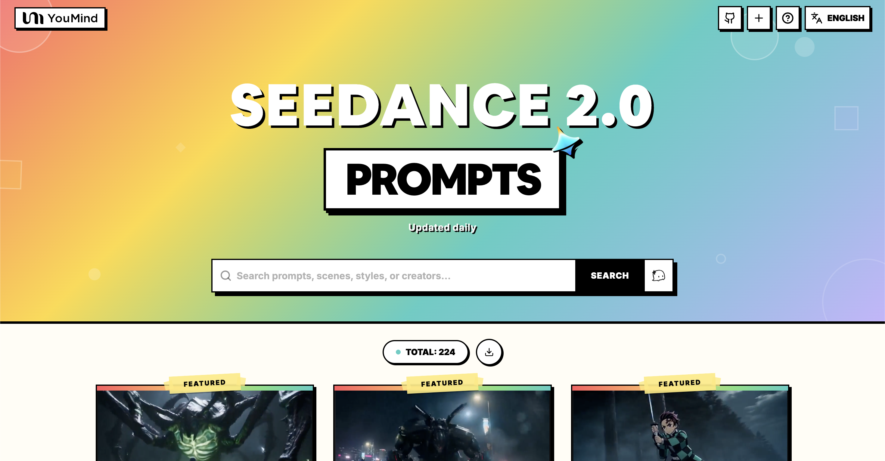

[](README.md) [](README_zh.md) [](README_zh-TW.md) [](README_ja-JP.md) [](README_ko-KR.md) [](README_th-TH.md) [](README_vi-VN.md) [](README_hi-IN.md) [](README_es-ES.md) [-Click%20to%20View-lightgrey)](README_es-419.md) [](README_de-DE.md) [](README_fr-FR.md) [](README_it-IT.md) [-Click%20to%20View-lightgrey)](README_pt-BR.md) [](README_pt-PT.md) [](README_tr-TR.md)

---

# 🎬 Harika Seedance 2.0 Video İstemleri

[](https://awesome.re)
[](https://github.com/YouMind-OpenLab/awesome-seedance-2-0-prompts)
[](https://creativecommons.org/licenses/by/4.0/)
[](https://github.com/YouMind-OpenLab/awesome-seedance-2-0-prompts/pulls)

ByteDance Seedance 2.0 için yüksek kaliteli video oluşturma istemleri koleksiyonu

> ⚠️ **Telif Hakkı Bildirimi**: Tüm istemler eğitim amaçlı olarak topluluktan toplanmıştır. Herhangi bir içeriğin haklarınızı ihlal ettiğini düşünüyorsanız, lütfen [bir sorun açın](https://github.com/YouMind-OpenLab/awesome-seedance-2-0-prompts/issues/new) ve derhal kaldıralım.

---

## 📖 İçindekiler

- [🌐 Web galerisinde görüntüle](#-web-galerisinde-grntle)
- [🤔 Seedance 2.0 nedir?](#-seedance-20-nedir)
- [📊 İstatistikler](#-istatistikler)
- [⭐ Öne Çıkan İstemler](#-ne-kan-istemler)
- [🎬 Tüm İstemler](#-tm-istemler)
- [🤝 Nasıl Katkıda Bulunulur](#-nasl-katkda-bulunulur)
- [📄 Lisans](#-lisans)
- [🙏 Teşekkürler](#-teekkrler)
- [⭐ Yıldız Geçmişi](#-yldz-gemii)

---

## 🌐 Web galerisinde görüntüle

<div align="center">



</div>

**[👉 YouMind'da tüm Seedance 2.0 istemlerini inceleyin](https://youmind.com/tr-TR/seedance-2-0-prompts)**

Neden galerimizi kullanmalısınız?

| Feature | GitHub README | youmind.com Galerisi |
|---------|--------------|---------------------|
| 🎬 Video Oynatma | ❌ Yalnızca statik küçük resimler | ✅ Streaming ile tam video oynatma |
| 🔍 Ara | Sadece Ctrl+F | Çok alanlı bulanık eşleştirme araması |
| 🤖 AI Önerisi | - | AI destekli prompt önerileri |
| 📱 Mobil | Temel | Tamamen duyarlı |

---

## 🤔 Seedance 2.0 nedir?

**Seedance 2.0**, **ByteDance** tarafından geliştirilen bir video oluşturma modelidir. Endüstrinin **eş zamanlı dört-modlu giriş** destekleyen ilk modeli — görüntü, video, ses ve metin.

**Key Features:**
- 🎥 **Metinden Videoya** — Metin açıklamalarından video oluşturma
- 🖼️ **Görüntüden Videoya** — Statik görüntüleri dinamik videolara dönüştürme
- 📹 **Videodan Videoya** — Mevcut videoları dönüştürme ve genişletme
- 🎵 **Ses Güdümlü** — Ses girişiyle yönlendirilen video oluşturma
- 📐 **1080p çözünürlüğe kadar**, 4-15 saniye süre
- 🔊 **Otomatik seslendirme ve puanlama** — Otomatik anlatım ve arka plan müziği

---

## 📊 İstatistikler

| Metrik | Sayı |
|--------|-------|
| 📝 Toplam İstem | **187** |
| ⭐ Öne Çıkan İstemler | **3** |
| 🔄 Son Güncelleme | **2026-02-15** |

---

## ⭐ Öne Çıkan İstemler

> El ile seçilmiş olağanüstü sonuçlara sahip istemler

### Optimus Prime vs Godzilla Tokyo'da


> Seedance 2.0 tarafından oluşturulan bir CGI videosunun açıklaması: Lüks bir otomobilin Optimus Prime'a dönüşerek, yağmurlu bir Tokyo gecesi fonunda patlamalar ve enerji patlamaları eşliğinde Godzilla ile savaştığını tasvir ediyor.

#### 📝 İstem

```
Lüks bir otomobil Optimus Prime'a dönüşüyor ve yağmurlu bir Tokyo gecesinin fonunda Godzilla ile savaşıyor, patlamalar ve enerji patlamaları saçıyor.
```

<a href="https://github.com/YouMind-OpenLab/awesome-seedance-2-prompts/releases/download/videos/210.mp4"></a>

📥 *Videoyu indirmek için resme tıklayın* | **[🎬 Videoyu izle →](https://youmind.com/tr-TR/seedance-2-0-prompts?id=210)**

**Yazar:** [HopefulofNFTs](https://x.com/HopefulofNFTs) | **Kaynak:** [Link](https://x.com/HopefulofNFTs/status/2021822131143635160) | **Yayınlandı:** Feb 12, 2026

---
### Gerçeküstü Savaş Alanı Ronin Aksiyon Sahnesi


> Seedance 2.0 için, gökyüzünde gerçeküstü, yüksek aksiyonlu bir savaş alanı sahnesini betimleyen, maskeli bir roninin göğsü fırtına bulutlarından oluşan bir girdap olan devasa kanatlı bir canavar tarafından takip edildiği, son derece ayrıntılı, çoklu çekim komutu. Komut, belirli kamera hareketlerini, teknik detayları (720p, 16:9, 15 saniye) ve dramatik bir finali içerir.

#### 📝 İstem

```
Gökyüzünde gerçeküstü bir savaş alanı: fırtına bulutlarının arasında sürüklenen yüzen kaya adaları, aşağıda okyanus gibi dönen bulutlar. Maskeli ronin, göğsü fırtına bulutları ve şimşeklerden oluşan dönen bir girdap olan devasa kanatlı bir canavar tarafından takip edilerek sürüklenen platformlar üzerinde koşuyor. Kayalar eğilip bükülürken, dönüp altlarında parçalanırken kamera adadan adaya savruluyor, yetişmekte zorlanıyor. Her kanat çırpışı havada şok dalgaları yaratıyor, çerçeveyi sallıyor ve enkaz ile yağmuru doğrudan izleyicinin yüzüne savuruyor. Hızlı el çekimleri, roninin imkansız boşluklardan atlayışını, kılıcının karanlığı kısa süreliğine kesen ışık yayları çizmesini yakalıyor. Finalde, son parçalanan kayadan atlarken kameranın arkasından daldığı görülüyor, bir şimşek çakımına binerek doğrudan canavarın göğüs girdabına doğru son, her şeyi riske atan bir darbeyle fırtınayı içeriden patlatıyor ve gökyüzünü kör edici bir parlamayla temizliyor.

720p
16:9
15 saniye
```

<a href="https://github.com/YouMind-OpenLab/awesome-seedance-2-prompts/releases/download/videos/133.mp4"></a>

📥 *Videoyu indirmek için resme tıklayın* | **[🎬 Videoyu izle →](https://youmind.com/tr-TR/seedance-2-0-prompts?id=133)**

**Yazar:** [Dheepan Ratnam](https://x.com/Dheepanratnam) | **Kaynak:** [Link](https://x.com/Dheepanratnam/status/2021689626092589532) | **Yayınlandı:** Feb 11, 2026

---
### Demon Slayer Live-Action Savaş İstemleri Seedance 2.0 için


> Seedance 2.0 için, Demon Slayer tarzı bir savaşın (Su Nefesi vs. Şimşek Nefesi) 15 saniyelik canlı aksiyon uyarlamasını oluşturan, ayrıntılı, yüksek enerjili bir video istemi. İstem, stili (Hollywood canlı aksiyon manga uyarlaması, karanlık samuray, 4K, aşırı hızlı kesmeler, parçacık ışık efektleri), ortamı (gece sisli orman) ve karakterlerin eylemlerini, güçlenme sekanslarını ve son çarpışmayı detaylandıran üç farklı çekimi belirtiyor.

#### 📝 İstem

```
Canlı Aksiyon Manga Uyarlaması · Nefes Tekniği Kararlı Savaş (15 saniye · Ultra Yakıcı Özel Efektler Versiyonu)
【Temel Odak】: Su Nefesi (Mavi Su Ejderhası) VS Şimşek Nefesi (Altın Şimşek), canlı aksiyon aşırı hızlı düello.
【Tarz】: Hollywood canlı aksiyon manga uyarlaması film kalitesi, karanlık samuray tarzı, 4K ultra net, aşırı hızlı kesimler, parçacık ışık efektleri patlaması, kan yok.
【Süre】: 15 saniye
【Sahne】: Ay ışığı altında sisli orman, çamurlu zemin, düşen yapraklar.
[00:00-00:05] Çekim 1: Su Melodisi Prelüdü · Başlangıç Formu (Yüklenme Hissi)
Görseller: Yeşil ve siyah kareli haori (ceket) giyen genç bir samuray, ay ışığı altında ağırlık merkezini alçaltır, kılıcını iki eliyle tutar.
Aksiyon: Derin bir nefes alır ve çevresindeki hava anında katılaşır. Kılıcını çekerken, yüksek basınçlı su akışından yoğunlaşmış dev bir mavi su ejderhası, havadan belirir, vücudunun ve kılıcının etrafında hızla döner, akan suyun kükremesini yayar.
Özel Efekt Detayları: Su akışı gerçekçi bir sıçrama hissine sahiptir, karanlık ormanı aydınlatır.
[00:05-00:10] Çekim 2: Şimşek Flaş · İlerleme (Aşırı Hız Hissi)
Görseller: Karşısındaki rakibi, sarı üçgen desenli haori giyen sarışın bir kılıç ustası, vücudunu aşırı derecede alçaltır, bir Iaijutsu (kılıç çekme tekniği) duruşu alır.
Aksiyon: Zemin aniden patlar. Tüm vücudu anında gözle görülmeyen bir hızla ağaçların arasından 'Z' şeklinde hızla kırılan ve ilerleyen göz kamaştırıcı altın bir şimşek artığına dönüşür.
Özel Efekt Detayları: Geçtiği yerlerde altın elektrik arkları ve yanmış düşen yapraklar kalır.
[00:10-00:15] Çekim 3: Su-Şimşek Çarpışması · Son Ses (Nihai Hareketlerin Çatışması)
Görseller: Aşırı hızlı kafa kafaya çarpışma. Genç samuray, saldırıyı karşılamak için dev mavi su ejderhasını aşağı doğru savurur ve şimşeğe dönüşen sarışın kılıç ustası ona çarpar.
Aksiyon: İki kılıç çerçevenin merkezinde şiddetle çarpışır.
Özel Efekt Gösterisi: Mavi su ejderhası ve altın şimşek anında patlar, dışarıya doğru yayılan devasa bir su-şimşek enerji fırtınası oluşturur. Çevredeki büyük ağaçlar enerji dalgasıyla ikiye ayrılır ve çamur, su ve ışık kamerayı gizler. Sahne aşırı derecede göz kamaştırıcı mavi, sarı ve beyaz bir ışıkla sona erer.
```

<a href="https://github.com/YouMind-OpenLab/awesome-seedance-2-prompts/releases/download/videos/189.mp4"></a>

📥 *Videoyu indirmek için resme tıklayın* | **[🎬 Videoyu izle →](https://youmind.com/tr-TR/seedance-2-0-prompts?id=189)**

**Yazar:** [John](https://x.com/johnAGI168) | **Kaynak:** [Link](https://x.com/johnAGI168/status/2021610292979876208) | **Yayınlandı:** Feb 11, 2026

---
## 🎬 Tüm İstemler

> 📝 Yayın tarihine göre sıralandı (en yeni önce)

### Boksör ile Jeet Kune Do Dövüşü (Hurda Sahasında)


> Terk edilmiş bir hurdalıkta, 'The Raid' filmlerinden esinlenilmiş, güçlü bir boksör ile hızlı bir Jeet Kune Do dövüşçüsü arasında geçen acımasız bir dövüş sahnesi (Image1 ve Image2 ile referans verilmiştir) oluşturan bir istem.

#### 📝 İstem

```
Image1 ve Image2'deki karakterleri dövüştürün
Mekan: Terk edilmiş hurdalık.
Güçlü, kudretli boksör vs hızlı Jeet Kune Do tarzı dövüşçü, 'The Raid' filmleri tarzında acımasız film stili
```

<a href="https://github.com/YouMind-OpenLab/awesome-seedance-2-prompts/releases/download/videos/391.mp4"></a>

📥 *Videoyu indirmek için resme tıklayın* | **[🎬 Videoyu izle →](https://youmind.com/tr-TR/seedance-2-0-prompts?id=391)**

**Yazar:** [Prince Bell](https://x.com/UrbanAcolyte) | **Kaynak:** [Link](https://x.com/UrbanAcolyte/status/2022848623197982926) | **Yayınlandı:** Feb 15, 2026

---
### Mezon Işıklarıyla Fütüristik Ay Üssü (Bölüm 1)


> Grok'un yardımıyla oluşturulmuş, büyük cam kubbeler ve gelişmiş 'mezon ışıkları' (parlayan, uhrevi, bilim kurgu parçacık tabanlı aydınlatma olarak yorumlanmıştır) içeren fütüristik bir Ay üssünü tanımlayan, son derece ayrıntılı, kullanıma hazır bir istemin ilk bölümü.

#### 📝 İstem

```
İşte büyük cam kubbeler ve "mezon ışıkları" (gelişmiş, egzotik bilim kurgu parçacık tabanlı veya mezon alanlı aydınlatma olarak yorumlanmıştır: parlayan, esrarengiz,
```

<a href="https://github.com/YouMind-OpenLab/awesome-seedance-2-prompts/releases/download/videos/394.mp4"></a>

📥 *Videoyu indirmek için resme tıklayın* | **[🎬 Videoyu izle →](https://youmind.com/tr-TR/seedance-2-0-prompts?id=394)**

**Yazar:** [Colonize the moon](https://x.com/ColonyMB1) | **Kaynak:** [Link](https://x.com/ColonyMB1/status/2022817909882699966) | **Yayınlandı:** Feb 14, 2026

---
### Çvş. Pepe Animasyonlu Sitcom İstemi


> Sgt. Pepe ve Frens'in yer aldığı, ilk 6529 meme-yerel animasyonlu sitcom tarzında bir animasyonlu sitcom videosu isteyen Seedance 2.0 için bir komut istemi.

#### 📝 İstem

```
@Ars0nic'in yer aldığı, ilk 6529 meme-yerlisi animasyon durum komedisi olan Çavuş Pepe ve Frens'in bir videosu 🐸
```

<a href="https://github.com/YouMind-OpenLab/awesome-seedance-2-prompts/releases/download/videos/386.mp4"></a>

📥 *Videoyu indirmek için resme tıklayın* | **[🎬 Videoyu izle →](https://youmind.com/tr-TR/seedance-2-0-prompts?id=386)**

**Yazar:** [Sgt Pepe](https://x.com/SgtPepeWorld) | **Kaynak:** [Link](https://x.com/SgtPepeWorld/status/2022804542258315457) | **Yayınlandı:** Feb 14, 2026

---
### MCU'da Örümcek Adam Hamileliği


> Marvel Sinematik Evreni'nde Örümcek Adam'ın karısı Elsa'dan hamile kaldığı bir sahne oluşturmak için oldukça spesifik ve tuhaf bir komut.

#### 📝 İstem

```
Marvel Sinematik Evreni'nde Örümcek Adam, eşi Elsa'dan hamile kalır.
```

<a href="https://github.com/YouMind-OpenLab/awesome-seedance-2-prompts/releases/download/videos/377.mp4"></a>

📥 *Videoyu indirmek için resme tıklayın* | **[🎬 Videoyu izle →](https://youmind.com/tr-TR/seedance-2-0-prompts?id=377)**

**Yazar:** [Peptostate](https://x.com/PeptoState) | **Kaynak:** [Link](https://x.com/PeptoState/status/2022788625704820876) | **Yayınlandı:** Feb 14, 2026

---
### Referans Görselleri ve Video İstemleri ile Karakter Savaşı


> Seedance 2.0 için, yapay zekaya iki girdi görüntüsündeki karakterleri terk edilmiş bir otoparkta, yeşil ekran referans videosundan alınan hareketleri kullanarak ve görsel efektler ekleyerek dövüştürmesini emreden karmaşık bir komut istemi.

#### 📝 İstem

```
Image 1 ve Image 2'deki karakterleri, yeşil ekran referans videosundaki hareketleri kullanarak dövüştürün. Mekan: terk edilmiş otopark. Dövüş sırasında görsel efektler ekleyin.
```

<a href="https://github.com/YouMind-OpenLab/awesome-seedance-2-prompts/releases/download/videos/383.mp4"></a>

📥 *Videoyu indirmek için resme tıklayın* | **[🎬 Videoyu izle →](https://youmind.com/tr-TR/seedance-2-0-prompts?id=383)**

**Yazar:** [Angry Tom](https://x.com/AngryTomtweets) | **Kaynak:** [Link](https://x.com/AngryTomtweets/status/2022782885036790091) | **Yayınlandı:** Feb 14, 2026

---
### Patrick Star ile Usain Bolt Yarış Sahnesi


> Patrick Star ile Usain Bolt arasında geçen yoğun bir atletizm buluşmasını anlatan, dramatik gelişime ve koşu hızlarındaki zıtlığa odaklanan, Seedance 2.0 için oldukça detaylı bir istem.

#### 📝 İstem

```
Patrick Star, bir atletizm yarışmasında Usain Bolt'a karşı. Başlangıç çizgisinde hazırlandıkları sırada destansı bir gerilimle çok yoğun bir an yaşanıyor ve yarışmayı başlatmak için havaya tabanca ateşlendiğinde müzik anında duruyor. Usain Bolt süper hızlı bir şekilde fırlarken, kamera çok yavaş koşan ve nefes nefese kalan Patrick Star'da oyalanıyor.
```

<a href="https://github.com/YouMind-OpenLab/awesome-seedance-2-prompts/releases/download/videos/385.mp4"></a>

📥 *Videoyu indirmek için resme tıklayın* | **[🎬 Videoyu izle →](https://youmind.com/tr-TR/seedance-2-0-prompts?id=385)**

**Yazar:** [Oluwatimileyin✨🦋](https://x.com/Timmysofine) | **Kaynak:** [Link](https://x.com/Timmysofine/status/2022778239341498669) | **Yayınlandı:** Feb 14, 2026

---
### Gerçek Aşk Sevgililer Günü Bahçe Portresi


> Sürreal bir Sevgililer Günü bahçesinde güzel, genç, yetişkin, kızıl saçlı birinin samimi portresini oluşturmak için ayrıntılı bir bilgi istemi. Sahne, belirli bir aydınlatma (gül ve allık), üç farklı kedi (kar beyazı, zencefil, siyah) ve kalp şeklinde çiçekler, bokeh efektleri ve şefkati simgeleyen parlak ışık yayları ile sürükleyici bir çiçek ortamı içeriyor.

#### 📝 İstem

```
Sürreal bir Sevgililer Günü bahçesinin merkezinde, samimi bir portre kompozisyonunda çerçevelenmiş güzel, genç, kızıl saçlı bir kadın duruyor. Bakır rengi dalgaları omuzlarına yumuşakça dökülüyor, sıcak gül ve allık aydınlatması altında parlıyor. Yakınında toplanmış üç kediye şefkatle bakıyor: inci yansımaları olan kar beyazı bir kedi, altın rengi parıltıları olan sıcak zencefil rengi bir kedi ve yumuşak macenta ışıkla çevrelenmiş zarif siyah bir kedi.
Tüm ortam tamamen sürükleyici ve çiçeksi: doygun pembe, mercan ve yakut tonlarında yarı saydam kalp şeklindeki çiçekler her tarafını çevreliyor. Ön plandaki çiçekler derinlik için hafifçe bulanıklaştırılmışken, arka plan parlayan bokeh kalplerine ve yüzen altın parçacıklarına dönüşüyor. Yumuşak, aydınlık ışık şeritleri, onunla kediler arasında nazikçe yay çizerek sevgiyi sembolize ediyor.
```

<a href="https://github.com/YouMind-OpenLab/awesome-seedance-2-prompts/releases/download/videos/399.mp4"></a>

📥 *Videoyu indirmek için resme tıklayın* | **[🎬 Videoyu izle →](https://youmind.com/tr-TR/seedance-2-0-prompts?id=399)**

**Yazar:** [Naya](https://x.com/NayaVerseee) | **Kaynak:** [Link](https://x.com/NayaVerseee/status/2022755222343553200) | **Yayınlandı:** Feb 14, 2026

---
### Wes Anderson Tarzı Film Fragmanı


> Wes Anderson'ın kendine özgü tarzında, simetriyi, pastel renkleri, tuhaf karakterleri ve hızlı kesmeler gibi belirli kurgu tekniklerini vurgulayan bir film fragmanı oluşturmak için ayrıntılı bir komut istemi.

#### 📝 İstem

```
Film fragmanı: Wes Anderson simetrisi, ortalanmış kompozisyon, pastel renk paleti, tuhaf karakterler, masalsı prodüksiyon tasarımı. Eksantrik mizah, görsel uyum, nostaljik zarafet. Çoklu çekimler, hızlı kurgular.
```

<a href="https://github.com/YouMind-OpenLab/awesome-seedance-2-prompts/releases/download/videos/375.mp4"></a>

📥 *Videoyu indirmek için resme tıklayın* | **[🎬 Videoyu izle →](https://youmind.com/tr-TR/seedance-2-0-prompts?id=375)**

**Yazar:** [AIrina (Virtual Media Net)](https://x.com/airina_xyz) | **Kaynak:** [Link](https://x.com/airina_xyz/status/2022720243206877455) | **Yayınlandı:** Feb 14, 2026

---
### Gün Batımında Çatıda Dövüş Sanatları Kavgası


> Gün batımında bir çatıda geçen destansı bir dövüş sahnesi oluşturmak için ayrıntılı bir sinematik komut istemi; belirli kamera hareketleri (yumuşak yörünge) ve aksiyon öğeleri (ağır çekim tekme) içeriyor.

#### 📝 İstem

```
Gün batımında bir çatıda dövüşen iki dövüş sanatçısı, dönen tekmeler ve hızlı yumruklar, rüzgarda uçuşan giysiler, akıcı sinematik kamera yörüngesi, havada yavaş çekim tekme, epik bir hava.
```

<a href="https://github.com/YouMind-OpenLab/awesome-seedance-2-prompts/releases/download/videos/376.mp4"></a>

📥 *Videoyu indirmek için resme tıklayın* | **[🎬 Videoyu izle →](https://youmind.com/tr-TR/seedance-2-0-prompts?id=376)**

**Yazar:** [Zephyra Leigh](https://x.com/ZephyraLeigh) | **Kaynak:** [Link](https://x.com/ZephyraLeigh/status/2022702079832395803) | **Yayınlandı:** Feb 14, 2026

---
### Seedance 2.0 İstem: Zaman Yolculuğu Kısa Draması


> Bir zaman yolculuğu kısa dramasının ilk bölümünü (15 saniye) oluşturmak için Seedance 2.0 istemi. Sahne, modern bir kızın bir üst geçitte telefonuna bakarken yanlışlıkla düşmesini ve sinematik kalite ve belirli bir renk derecelendirmesiyle eski bir Çin kostüm draması stiline geçişini içeriyor.

#### 📝 İstem

```
15 saniye, Çin kostümlü kısa drama tarzı, sinematik görüntü kalitesi, dönüşümlü olarak sıcak altın ve soğuk camgöbeği renk tonları, 2.35:1 geniş ekran kompozisyonu 9:16 dikey ekrana sıkıştırılmış. Sahne (0-3 saniye): Modern şehir gece manzarası, beyaz elbiseli genç, güzel bir kız üst geçitte durmuş telefonuna bakarken aniden dengesini kaybediyor,
```

<a href="https://github.com/YouMind-OpenLab/awesome-seedance-2-prompts/releases/download/videos/400.mp4"></a>

📥 *Videoyu indirmek için resme tıklayın* | **[🎬 Videoyu izle →](https://youmind.com/tr-TR/seedance-2-0-prompts?id=400)**

**Yazar:** [松果先森](https://x.com/songguoxiansen) | **Kaynak:** [Link](https://x.com/songguoxiansen/status/2022702046244409570) | **Yayınlandı:** Feb 14, 2026

---
### Yağmurda Dikey Gökdelen Savaşı


> Yağmurlu bir fırtına sırasında bir gökdelende geçen dramatik dikey bir savaşı konu alan, belirli en boy oranı, aydınlatma ve renk derecelendirmesi kullanılarak hazırlanmış, 15 saniyelik bir 3D CG animasyon sekansı için ayrıntılı bir sinematik komut istemi.

#### 📝 İstem

```
16:9 geniş ekran, 3D CG animasyon, dramatik hacimsel aydınlatma, camgöbeği ve turuncu renk derecelendirmesi, yağmurda 15 saniyelik dikey gökdelen savaşı. 0-4s: Gece Empire State Binası'na doğru aşağıdan yukarıya çekim, yağmur sağanak halinde, devasa siyah kürklü maymun tutunmuş halde
```

<a href="https://github.com/YouMind-OpenLab/awesome-seedance-2-prompts/releases/download/videos/389.mp4"></a>

📥 *Videoyu indirmek için resme tıklayın* | **[🎬 Videoyu izle →](https://youmind.com/tr-TR/seedance-2-0-prompts?id=389)**

**Yazar:** [Mr.pinecone](https://x.com/Mrpinecone888) | **Kaynak:** [Link](https://x.com/Mrpinecone888/status/2022692437504802982) | **Yayınlandı:** Feb 14, 2026

---
### Seedance 2.0 İstem: Moda Reklam Sahnesi


> Uzun saçlı, gündelik giyimli Çinli bir kadının, büyük, boydan boya bir aynanın önünde saçlarını düzelttiği, yüksek çözünürlük, sığ alan derinliği ve güçlü ışık kontrastını vurgulayan bir moda reklamı gişe rekortmeni kalitesinde bir videonun ilk 15 saniyelik segmentini oluşturmak için bir Seedance 2.0 istemi.

#### 📝 İstem

```
Segment 1 (0-15 saniye)

Moda reklamı gişe rekorları kıran kalitede, yüksek çözünürlüklü dikey ekran, karakteri vurgulamak için sığ alan derinliği, güçlü ışık ve gölge kontrastı. 0-3 saniye: Sabit çekim, önden orta görünüm, bol gri kapüşonlu sweatshirt giymiş, makyajsız, saçları özensizce topuz yapılmış, uzun saçlı Çinli bir kadın, dev bir boy aynasının önünde duruyor, tembelce elini kaldırıp dağınık saçlarını düzeltiyor, arka plan
```

<a href="https://github.com/YouMind-OpenLab/awesome-seedance-2-prompts/releases/download/videos/401.mp4"></a>

📥 *Videoyu indirmek için resme tıklayın* | **[🎬 Videoyu izle →](https://youmind.com/tr-TR/seedance-2-0-prompts?id=401)**

**Yazar:** [松果先森](https://x.com/songguoxiansen) | **Kaynak:** [Link](https://x.com/songguoxiansen/status/2022669345395216626) | **Yayınlandı:** Feb 14, 2026

---
### Bollywood Dansı Dikkat Dağıtan Erkek Arkadaş Meme İstemcisi


> Seedance 2.0 için, yapay zekaya 'Distracted Boyfriend' meme'i bağlamında Bollywood Dans stilini mizahi ve dikkat çekici bir tonla özetlemesini söyleyen bir komut.

#### 📝 İstem

```
"Dikkatini Dağıtmış Erkek Arkadaş" memindeki Bollywood Dansını özetle - aptalca olduğundan ve 50 beğeni aldığından emin ol.
```

<a href="https://github.com/YouMind-OpenLab/awesome-seedance-2-prompts/releases/download/videos/379.mp4"></a>

📥 *Videoyu indirmek için resme tıklayın* | **[🎬 Videoyu izle →](https://youmind.com/tr-TR/seedance-2-0-prompts?id=379)**

**Yazar:** [𝕋𝔼𝕄ℙ𝕃𝔼](https://x.com/13enZGN_temple) | **Kaynak:** [Link](https://x.com/13enZGN_temple/status/2022646748410425685) | **Yayınlandı:** Feb 14, 2026

---
### Nami Programlama Hatası Düzeltme Sahnesi


> Seedance 2.0 için, Nami'nin Thousand Sunny'de programlama yaptığı ve bir hatayı düzeltmek için Clima-Tact'ını kullandığı One Piece'ten bir sahne oluşturan ayrıntılı bir komut istemi.

#### 📝 İstem

```
Nami, Thousand Sunny'de Mac kullanarak programlama yaparken aniden bir hata belirir. Nami, Clima-Tact'ını kullanarak hatayı taklit eder ve düzeltir.
```

<a href="https://github.com/YouMind-OpenLab/awesome-seedance-2-prompts/releases/download/videos/384.mp4"></a>

📥 *Videoyu indirmek için resme tıklayın* | **[🎬 Videoyu izle →](https://youmind.com/tr-TR/seedance-2-0-prompts?id=384)**

**Yazar:** [John](https://x.com/johnAGI168) | **Kaynak:** [Link](https://x.com/johnAGI168/status/2022642300942193007) | **Yayınlandı:** Feb 14, 2026

---
### Hiper gerçekçi Fizik ve Eylemsizlik İstemleri


> Doğal olmayan yüzme, ağırlıksızlık ve eylemsizlik sorunlarını çözen, nükleer düzeyde gerçekçi fizik elde etmek için güçlü bir komut istemi; uzun süreli takip ve dövüş sahneleri için çok önemli.

#### 📝 İstem

```
hiper gerçekçi fizik, doğru ağırlık dağılımı, doğal atalet ve momentum
```

<a href="https://github.com/YouMind-OpenLab/awesome-seedance-2-prompts/releases/download/videos/402.mp4"></a>

📥 *Videoyu indirmek için resme tıklayın* | **[🎬 Videoyu izle →](https://youmind.com/tr-TR/seedance-2-0-prompts?id=402)**

**Yazar:** [Sims干货知识分享](https://x.com/smallstones677) | **Kaynak:** [Link](https://x.com/smallstones677/status/2022638893615759854) | **Yayınlandı:** Feb 14, 2026

---
### Motosiklet Kovalamacası Tek Kesintisiz Çekim


> Akdeniz'de bir köyde geçen, motosikletli kovalamacanın tek, kesintisiz sinematik bir çekimini oluşturan ve altın saatte okyanusa bakan dramatik bir sahneyle sonuçlanan, oldukça detaylı bir bilgi istemi.

#### 📝 İstem

```
Tek kesintisiz çekim, Akdeniz köyünün dar sokaklarında motosiklet kovalamacası, kamera asılı çamaşırların ve pazar tezgahlarının arasından geçiyor, sürücü engellerden kıl payı kurtuluyor, son sahne gün batımında sonsuz okyanusa bakan devasa bir uçurum kenarına açılıyor
```

<a href="https://github.com/YouMind-OpenLab/awesome-seedance-2-prompts/releases/download/videos/374.mp4"></a>

📥 *Videoyu indirmek için resme tıklayın* | **[🎬 Videoyu izle →](https://youmind.com/tr-TR/seedance-2-0-prompts?id=374)**

**Yazar:** [Tomatech](https://x.com/tomatechie) | **Kaynak:** [Link](https://x.com/tomatechie/status/2022627120049270924) | **Yayınlandı:** Feb 14, 2026

---
### Kıyamet Sonrası Savaş Aracı Çölde


> Hurda metal zırh, sivri uçlar, kurukafa süslemeleri ve monte edilmiş silahlarla kaplı, ağır şekilde modifiye edilmiş kıyamet sonrası bir savaş aracını (V8 bir muscle car) tasvir eden ayrıntılı bir komut istemi—turuncu bir çölde kükreyerek ilerliyor.

#### 📝 İstem

```
Ağır şekilde modifiye edilmiş kıyamet sonrası bir savaş aracı – devasa çivili lastikleri, hurda metal zırh plakaları, kafatası süslemeleri, tavana monte edilmiş makineli tüfekleri ve alev makineleri, gövdesine sarılmış paslı dikenli telleri olan devasa bir V8 muscle car, sonsuz turuncu çölde kükreyerek ilerliyor.
```

<a href="https://github.com/YouMind-OpenLab/awesome-seedance-2-prompts/releases/download/videos/390.mp4"></a>

📥 *Videoyu indirmek için resme tıklayın* | **[🎬 Videoyu izle →](https://youmind.com/tr-TR/seedance-2-0-prompts?id=390)**

**Yazar:** [TechyTricksAI](https://x.com/TechyTricksAI) | **Kaynak:** [Link](https://x.com/TechyTricksAI/status/2022569814737248514) | **Yayınlandı:** Feb 14, 2026

---
### Uçurum Şehrinde Hızlı Takip (Tek Kesintisiz Çekim)


> Anıtsal bir uçurum kenarı şehrinde geçen, yüksek hızlı bir takip sahnesini betimleyen, dinamik kamera hareketlerine, sıcak hava dalgalanmalarına, enkazlara odaklanan ve şelalelerle beslenen bir vadinin ortaya çıkmasıyla sonuçlanan, son derece detaylı, kesintisiz çekim istemi.

#### 📝 İstem

```
Bir uçurum şehrinde hız motoru kovalamacası (tek kesintisiz çekim) Taşa oyulmuş devasa bir uçurum kenarı şehrinden kamera, dar bir çıkıntı yolunda ilerleyen küçük bir ışık huzmesine doğru dalıyor. Kilitlenme: akıl almaz bir hızla duvara yapışmış bir hız motoru. Kamera öne fırlıyor, geriye doğru savruluyor, sonra arka iticilere sıkıca yapışıyor: sıcaklık dalgalanması, çıkıntıdan kopan kum taneleri, yanıp sönen uyarı ışıkları. Çöken bir balkon enkaz yağdırıyor; sürücü düşen bir kemerin altından son anda sıyrılıyor, ardından asılı çamaşır ipleri ve açık pencereler arasından tek bir akıcı hareketle geçiyor. Kamera da aynı açıklıklardan geçerek harekete yapışık kalıyor. Son bir viraj ve ani bir sakinlik: kamera dışarı doğru fırlayarak, sonsuz bir şelale ile beslenen vadiye açılan şehrin ortaya çıkışını gösteriyor, sis gökkuşağına dönüşüyor.
```

<a href="https://github.com/YouMind-OpenLab/awesome-seedance-2-prompts/releases/download/videos/393.mp4"></a>

📥 *Videoyu indirmek için resme tıklayın* | **[🎬 Videoyu izle →](https://youmind.com/tr-TR/seedance-2-0-prompts?id=393)**

**Yazar:** [Umesh](https://x.com/umesh_ai) | **Kaynak:** [Link](https://x.com/umesh_ai/status/2022564055957811600) | **Yayınlandı:** Feb 14, 2026

---
### Kısa bir isteme dayalı Seedance 2.0 üretimi


> Bir kullanıcı, 24 saatlik beklemenin ardından Seedance 2.0 sonucunu paylaşıyor ve çok kısa, 10 kelimelik bir komut kullanmasına rağmen karakter detaylarından memnun kaldığını belirtiyor. Gelecekte komutu, koşmayı azaltmak, dövüş yoğunluğunu artırmak ve daha fazla karakter eklemek için düzenlemeyi planlıyor.

#### 📝 İstem

```
- daha az koşma
- daha yoğun dövüş animasyonu
- dövüşe daha fazla karakterin katılması
```

<a href="https://github.com/YouMind-OpenLab/awesome-seedance-2-prompts/releases/download/videos/387.mp4"></a>

📥 *Videoyu indirmek için resme tıklayın* | **[🎬 Videoyu izle →](https://youmind.com/tr-TR/seedance-2-0-prompts?id=387)**

**Yazar:** [SiiMi](https://x.com/siimi96) | **Kaynak:** [Link](https://x.com/siimi96/status/2022562824128541015) | **Yayınlandı:** Feb 14, 2026

---
### Mizahi Yapay Zeka Söylemi Meme İstemleri (Neşeli)


> Seedance 2.0 için, yapay zeka söylemini özetleyen, esprili ve mizahi bir tonla sosyal medya etkileşimine odaklanan komik bir meme isteyen bir komut istemi.

#### 📝 İstem

```
Yapay zeka söylemini mizahi bir memle özetle – neşeli olsun ve 50 beğeni alsın.
```

<a href="https://github.com/YouMind-OpenLab/awesome-seedance-2-prompts/releases/download/videos/382.mp4"></a>

📥 *Videoyu indirmek için resme tıklayın* | **[🎬 Videoyu izle →](https://youmind.com/tr-TR/seedance-2-0-prompts?id=382)**

**Yazar:** [ANIRUDDHA ADAK](https://x.com/aniruddhadak) | **Kaynak:** [Link](https://x.com/aniruddhadak/status/2022546896473199008) | **Yayınlandı:** Feb 14, 2026

---
### Seedance 2.0 9 Panelli Sinematik İletişim Sayfası İstemi Şablonu


> Bir kullanıcı, Seedance 2.0 için, bir aktör için referans görseli kullanarak net bir duygusal yay (kurulum → gelişme → dönüm noktası → sonuç) ile tutarlı, 10-20 saniyelik sinematik bir sekans oluşturmak üzere tasarlanmış gelişmiş bir 9 panelli ızgara istem şablonu paylaşıyor. Bu şablon, ileri düzey hikaye anlatımı ve karakter tutarlılığı için tasarlanmıştır.

#### 📝 İstem

```
<role>
Ödüllü bir fragman yönetmeni + görüntü yönetmeni + storyboard sanatçısısınız. Göreviniz: bir aktörün TEK bir referans görüntüsünü alıp uyumlu bir sinematik kısa sekans oluşturmak ve ardından yapay zeka destekli videoya hazır anahtar kareler çıkarmak.
</role>
Renk tonu referans görüntüsü 2
<input>
Kullanıcı şunları sağlar: bir referans görüntüsü (görüntü).
Sahne Özeti: {{scene_brief}}
</input>

<goal>
Aktörü kullanarak net bir temaya ve duygusal ilerlemeye (kurulum → gelişme → dönüm noktası → sonuç) sahip 10-20 saniyelik sinematik bir sahne oluşturun; sahne gerektiriyorsa başka aktörler eklemenize izin verilir.
Kullanıcı, anahtar karelerinizden video klipler oluşturacak ve bunları nihai bir sekans halinde birleştirecektir.
</goal>

<steps>
1. Anahtar Kare Listesi: 9 kare (daha sonra TEK bir ana ızgarada birleştirilir). Bu kareler, net bir 4 vuruşlu yay ile tutarlı bir 10-20 saniyelik sekans oluşturmalıdır. Her kare, AYNI ortam içinde makul bir devamlılık olmalıdır. Oluşturulan kareler, standart modern bir film kamerası kullanılarak sinematik tarzda çekilmiş olmalıdır.
2. TEK bir ana görüntü ÇIKARMALISINIZ: TÜM anahtar kareleri tek bir büyük görüntüde içeren bir Sinematik Kontak Sayfası / Storyboard Izgarası.
- Varsayılan ızgara: 3x3.
</steps>
```

<a href="https://github.com/YouMind-OpenLab/awesome-seedance-2-prompts/releases/download/videos/367.mp4"></a>

📥 *Videoyu indirmek için resme tıklayın* | **[🎬 Videoyu izle →](https://youmind.com/tr-TR/seedance-2-0-prompts?id=367)**

**Yazar:** [John](https://x.com/john87445528) | **Kaynak:** [Link](https://x.com/john87445528/status/2022546491823243406) | **Yayınlandı:** Feb 14, 2026

---
### Çocuk Hızla Giden Arabadan Köpeği Kurtarıyor (Zaman Donması)


> Hızla gelen bir arabanın önünden yavru köpeğini kurtarmak için koşan bir çocuğu anlatan dramatik, duygusal bir metin; zamanın donduğu ve köpeği havada yakaladığı bir anla doruğa ulaşıyor.

#### 📝 İstem

```
Bir çocuk ve köpeği sokakta oynuyorlar. Köpek aniden yola fırlıyor. Uzakta, onlara doğru hızla gelen bir araba var. Çocuk dehşete düşmüş bir ifadeyle ileri atılıyor ve köpeğin üzerine doğru dalıyor. Köpeği havada yakaladığı an, zaman donmuş gibi görünüyor. Onlar
```

<a href="https://github.com/YouMind-OpenLab/awesome-seedance-2-prompts/releases/download/videos/392.mp4"></a>

📥 *Videoyu indirmek için resme tıklayın* | **[🎬 Videoyu izle →](https://youmind.com/tr-TR/seedance-2-0-prompts?id=392)**

**Yazar:** [Latte](https://x.com/0xbisc) | **Kaynak:** [Link](https://x.com/0xbisc/status/2022510001575928295) | **Yayınlandı:** Feb 14, 2026

---
### Parkur ve Canavar Dövüşü İstemleri


> Seedance 2.0 için, bir karakterin şehirde parkur yaparak kötücül bir canavara karşı şiddetli bir kavgaya girmesini anlatan bir komut.

#### 📝 İstem

```
Bu karakter şehirde parkur yapıyor ve kötü bir canavara karşı şiddetli bir şekilde savaşıyor.
```

<a href="https://github.com/YouMind-OpenLab/awesome-seedance-2-prompts/releases/download/videos/381.mp4"></a>

📥 *Videoyu indirmek için resme tıklayın* | **[🎬 Videoyu izle →](https://youmind.com/tr-TR/seedance-2-0-prompts?id=381)**

**Yazar:** [Rayko_Zopia](https://x.com/Fox1251104) | **Kaynak:** [Link](https://x.com/Fox1251104/status/2022495493285384457) | **Yayınlandı:** Feb 14, 2026

---
### Akıllı Telefonlu Orta Çağ Şövalyesi


> Mum ışığıyla aydınlatılmış bir şato iç mekanında, modern bir akıllı telefona şaşkınlıkla bakan, ekranın parıltısıyla aydınlanmış, zırhlı bir orta çağ şövalyesini konu alan sinematik bir video oluşturmak için bir komut istemi.

#### 📝 İstem

```
Video oluştur: Tam zırhlı bir orta çağ şövalyesi, modern bir akıllı telefona bakıyor, ekranın parıltısıyla aydınlanan şaşkın bir yüz, mum ışığıyla aydınlatılmış kale içi, sinematik aydınlatma
```

<a href="https://github.com/YouMind-OpenLab/awesome-seedance-2-prompts/releases/download/videos/397.mp4"></a>

📥 *Videoyu indirmek için resme tıklayın* | **[🎬 Videoyu izle →](https://youmind.com/tr-TR/seedance-2-0-prompts?id=397)**

**Yazar:** [Tomatech](https://x.com/tomatechie) | **Kaynak:** [Link](https://x.com/tomatechie/status/2022491231130157397) | **Yayınlandı:** Feb 14, 2026

---
### En İyi Futbolcunun Destansı Anları


> Futbol tarihinin en iyi oyuncusunun 'destansı anlarını' sergileyen, özellikle 'Messi hayranlarını' kızdırmak amacıyla tasarlanmış kışkırtıcı bir video oluşturma istemi.

#### 📝 İstem

```
Futbol tarihinin en iyi oyuncusunun destansı anları, tüm Messiseverlere ulaştığından ve onları ağlattığından emin olun.
```

<a href="https://github.com/YouMind-OpenLab/awesome-seedance-2-prompts/releases/download/videos/378.mp4"></a>

📥 *Videoyu indirmek için resme tıklayın* | **[🎬 Videoyu izle →](https://youmind.com/tr-TR/seedance-2-0-prompts?id=378)**

**Yazar:** [Arielipillo](https://x.com/arielipillo) | **Kaynak:** [Link](https://x.com/arielipillo/status/2022490891131539764) | **Yayınlandı:** Feb 14, 2026

---
### Seedance 2.0 Diyalog Karşılaştırma İstemcisi


> Seedance 2.0'ı diğer modellerle (Grok 1, Vidu 3, Kling 3) karşılaştıran bir video oluşturmak için kullanılan bir bilgi istemi. Bilgi istemi, X'te 400 takipçiyi kutlayan bir tsundere yapay zeka içerik oluşturucusunu anlatıyor.

#### 📝 İstem

```
X'te 400 takipçiye ulaşmasını kutladığı bir video. Kendisi, yapay zeka videoları yapma hakkında ipuçları ve püf noktaları paylaşan bir yapay zeka içerik yaratıcısı. "400!!" yazısı başının üzerinde beliriyor. Tüm diyaloglar İngilizce/Japonca olmalı. Kendisi bir tsundere.
```

<a href="https://github.com/YouMind-OpenLab/awesome-seedance-2-prompts/releases/download/videos/404.mp4"></a>

📥 *Videoyu indirmek için resme tıklayın* | **[🎬 Videoyu izle →](https://youmind.com/tr-TR/seedance-2-0-prompts?id=404)**

**Yazar:** [Jason W - AI](https://x.com/PocketScreenAI) | **Kaynak:** [Link](https://x.com/PocketScreenAI/status/2022479431714123948) | **Yayınlandı:** Feb 14, 2026

---
### Yapay Zeka Destekli Crossover: Lam Ching-ying vs. Gyutaro


> Bu tweet, klasik Hong Kong sinema yıldızı Lam Ching-ying ile Demon Slayer karakteri Gyutaro arasında bir geçiş (crossover) yaratan, yapay zeka tarafından oluşturulmuş bir video veya görseli sergiliyor. Kullanıcı, beklenmedik tür kombinasyonu karşısında şaşkınlığını ve heyecanını dile getiriyor.

#### 📝 İstem

```
Lam Ching-ying 🆚 Gyutaro.⚡️

Klasik Hong Kong sineması, Demon Slayer ile buluşuyor.
👹🤯🔥
```

<a href="https://github.com/YouMind-OpenLab/awesome-seedance-2-prompts/releases/download/videos/403.mp4"></a>

📥 *Videoyu indirmek için resme tıklayın* | **[🎬 Videoyu izle →](https://youmind.com/tr-TR/seedance-2-0-prompts?id=403)**

**Yazar:** [Marcio Lima 利真 マルシオ 💎](https://x.com/Preda2005) | **Kaynak:** [Link](https://x.com/Preda2005/status/2022478098911117516) | **Yayınlandı:** Feb 14, 2026

---
### Sinematik Sahne İstemcisi: Hızlı Tren Yarışı


> Japon kırsalında, kameranın imkansız bir hızla bir hızlı trenin yanında yarıştığı bir sahneyi anlatan ayrıntılı bir sinematik komut istemi.

#### 📝 İstem

```
Şafak vakti, sakin bir Japon kırsalında gerçekçi bir sinematik sahne açılır. Pirinç tarlalarına sis çökmüştür. Ufukta uzakta gümüş bir çizgi olarak bir hızlı tren belirir. Kamera inanılmaz bir hızla ileri atılır, trenle birlikte yarışır, hızına ayak uydurur. Kamera
```

<a href="https://github.com/YouMind-OpenLab/awesome-seedance-2-prompts/releases/download/videos/351.mp4"></a>

📥 *Videoyu indirmek için resme tıklayın* | **[🎬 Videoyu izle →](https://youmind.com/tr-TR/seedance-2-0-prompts?id=351)**

**Yazar:** [tinyfilmstudios](https://x.com/tinyfilmstudios) | **Kaynak:** [Link](https://x.com/tinyfilmstudios/status/2022459197779247322) | **Yayınlandı:** Feb 13, 2026

---
### Gintoki Sakata'dan Kozmik Arena Turnuvası Duyurusu


> Gintoki Sakata'nın kuralları sıkılmış, sivri dilli bir anlatıcı olarak duyurduğu, Tournament-of-Power ölçeğinde devasa bir kozmik arena sahnesi oluşturmak için ayrıntılı bir bilgi istemi.

#### 📝 İstem

```
Kör edici bir boşlukta devasa bir kozmik arena oluşur, Güç Turnuvası ölçeğinde. Sayısız evrenden gelen kalabalıklar kükrer.
Ortada anlatıcı duruyor: Gintoki Sakata, rahatlamış, omzunda tahta kılıcı, sıkılmış gözleri, sivri diliyle.
Kuralı açıklıyor...
```

<a href="https://github.com/YouMind-OpenLab/awesome-seedance-2-prompts/releases/download/videos/344.mp4"></a>

📥 *Videoyu indirmek için resme tıklayın* | **[🎬 Videoyu izle →](https://youmind.com/tr-TR/seedance-2-0-prompts?id=344)**

**Yazar:** [KIRA](https://x.com/k1raa__) | **Kaynak:** [Link](https://x.com/k1raa__/status/2022442702667710484) | **Yayınlandı:** Feb 13, 2026

---
### Hollywood Yarış Filmi Sahnesi İstemleri (Bölüm 1)


> Hollywood profesyonel yarış filmi sahnesi için detaylı, çoklu çekim isteminin ilk bölümü, yağmurlu bir gece yarışında deneyimli sürücünün yakın çekimine odaklanıyor.

#### 📝 İstem

```
Stil: Hollywood Profesyonel Yarış Filmi (Le Mans Tarzı), Sinematik Gece, Yağmur, Yüksek Riskli Spor. Süre: 15 sn.

[00-05s] Çekim 1: Gazi (İç Mekan/Yakın Çekim). Yüksek teknolojili bir yarış arabasının ön camına pistte yağmur vuruyor. Gazi sürücü (kasklı) etrafa bakınıyor
```

<a href="https://github.com/YouMind-OpenLab/awesome-seedance-2-prompts/releases/download/videos/350.mp4"></a>

📥 *Videoyu indirmek için resme tıklayın* | **[🎬 Videoyu izle →](https://youmind.com/tr-TR/seedance-2-0-prompts?id=350)**

**Yazar:** [AYOUB AYOUR](https://x.com/AYOUBAYOUR9) | **Kaynak:** [Link](https://x.com/AYOUBAYOUR9/status/2022428164564386132) | **Yayınlandı:** Feb 13, 2026

---
### Maki Zenin Dövüş Sahnesi İstemleri (Çevik Hareketler)


> Zen bahçesinin üzerindeki cam zeminde, yara izleriyle dolu bir kadının çevik hareketleri ve kılıç savurma eylemlerine odaklanarak kılıç ustalarını yendiği bir hesaplaşmayı anlatan bir komut istemi.

#### 📝 İstem

```
kadın, tüm kılıç ustası erkekleri güçlü saldırılarla alt ediyor, sağ gözü yaralı, vücudunda yanık izleri var - mor ışıkla aydınlatılmış bir zen bahçesinin üzerindeki cam bir zeminde dövüşüyor - bir düşmanı dilimlerken çevik hareketlerinin art arda kesitleri.
```

<a href="https://github.com/YouMind-OpenLab/awesome-seedance-2-prompts/releases/download/videos/354.mp4"></a>

📥 *Videoyu indirmek için resme tıklayın* | **[🎬 Videoyu izle →](https://youmind.com/tr-TR/seedance-2-0-prompts?id=354)**

**Yazar:** [karim_yourself](https://x.com/karim_yourself) | **Kaynak:** [Link](https://x.com/karim_yourself/status/2022374083468427428) | **Yayınlandı:** Feb 13, 2026

---
### Maki Zenin Dövüş Sahnesi İstemleri (Yukarıdan Aşağıya)


> Maki Zenin adlı bir kadının, güçlü saldırılarla kılıç ustalarını yendiği, kamera hareketine ve kanlı bir atlamalı kesme (jumpcut) sekansına odaklanan, yukarıdan aşağıya (top-down) çekim için detaylı bir istem.

#### 📝 İstem

```
Kadının tüm kılıç ustası adamları güçlü saldırılarla alt ettiğini gösteren yukarıdan çekim, onu sadece arkadan görüyoruz - kamera yukarı kayarak gergin bir atmosfer oluşturuyor, kimse hareket etmiyor - zemini göstermekten kaçının, üst vücuda odaklanın - sonra 3. saniyede, kanlı art arda kesmeler.
```

<a href="https://github.com/YouMind-OpenLab/awesome-seedance-2-prompts/releases/download/videos/352.mp4"></a>

📥 *Videoyu indirmek için resme tıklayın* | **[🎬 Videoyu izle →](https://youmind.com/tr-TR/seedance-2-0-prompts?id=352)**

**Yazar:** [karim_yourself](https://x.com/karim_yourself) | **Kaynak:** [Link](https://x.com/karim_yourself/status/2022374077550457313) | **Yayınlandı:** Feb 13, 2026

---
### Stranger Things Partisi: Süper Güçleri Ortaya Çıkarma


> Ana parti üyelerinin harap olmuş bir laboratuvarda aynı anda benzersiz süper güçlerini açığa çıkardığı, gren, parlama ve hacimsel sis gibi belirli sinematik unsurların kullanıldığı bir Stranger Things sahnesi oluşturmaya yönelik ayrıntılı bir sinematik komut istemi.

#### 📝 İstem

```
Yıkık bir laboratuvarda Stranger Things ekibinin sinematik 1980'ler karanlık fantezi toplu çekimi, aynı anda benzersiz süper güçler (mavi elektrik, kırmızı plazma, telekinetik enkaz, parlayan gözler) açığa çıkarıyor, 35mm gren, anamorfik parlamalar ve hacimsel kırmızı sis ile.
```

<a href="https://github.com/YouMind-OpenLab/awesome-seedance-2-prompts/releases/download/videos/347.mp4"></a>

📥 *Videoyu indirmek için resme tıklayın* | **[🎬 Videoyu izle →](https://youmind.com/tr-TR/seedance-2-0-prompts?id=347)**

**Yazar:** [Zopia AI](https://x.com/Zopia_AI) | **Kaynak:** [Link](https://x.com/Zopia_AI/status/2022355091223908496) | **Yayınlandı:** Feb 13, 2026

---
### Sinematik Sokak Basketbolu Sahnesi: Adamın Şutu Kadın Tarafından Engellendi


> Bir sokak basketbolu sahnesinin 15 saniyelik sinematik, gerçekçi bir videosunu oluşturmak için son derece ayrıntılı, çok segmentli bir bilgi istemi. Mekanı (LA açık hava sahası, altın saat), karakterleri (uzun boylu, kaslı siyahi bir adam ve minyon, atletik sarışın bir kadın), aksiyonu (adamın kendine güvenen ısınması, agresif driplingi ve kadının hassas, ağır çekim bloğu) ve belirli kamera çalışmasını, ses efektlerini ve post prodüksiyon gereksinimlerini açıklar.

#### 📝 İstem

```
15 saniye, sinematik gerçekçi tarz, sıcak altın saat aydınlatması, Amerikan sokak basketbolu atmosferi. 0-3 saniye: Los Angeles açık hava sokak basketbol sahası, güneş ışığı eğik bir şekilde süzülüyor. Kolsuz antrenman yeleği ve spor şortu giymiş uzun boylu, kaslı Afrikalı Amerikalı bir erkek oyuncu, crossover dripling ile ısınıyor. Kas hatları belirgin, ifadesi kendinden emin ve küçümseyici. Karşısında, yüksek at kuyruğu yapmış, bol bir basketbol tişörtü ve spor şortu giymiş minyon, genç, Amerikalı sarışın bir kız, sakin ve soğukkanlı bir ifadeyle duruyor. Erkek oyuncu gülümsüyor, topu sektiriyor ve kıza hücuma başlaması için işaret veriyor. Kamera, ikilinin karşı karşıya geldiği orta çekim, göz hizası bir görüntü. 4-8 saniye: Erkek oyuncu hücuma başlıyor, sürekli crossover ve bacak arası dripling becerilerini sergiliyor. Spor ayakkabıları yere sürtünüyor, toz kaldırıyor. Aniden hızlanıyor ve sağa doğru depar atarak turnikeye hazırlanıyor. El kamerası, ayak hareketlerini yakından takip ediyor. Kız hızlı ve esnek hareket ediyor, yolunu kesmek için yana doğru kayıyor, ifadesi odaklanmış, gözleri basketbol topuna kilitlenmiş. 9-12 saniye: Ağır çekim sekansı. Erkek oyuncu sıçrıyor, sağ el turnikesine hazırlanıyor. Top başının üzerine kalktığı anda, kız da aynı anda sıçrıyor, vücudu havada tamamen gerilmiş. Sağ eli, en yüksek noktada basketbol topuna isabetli bir şekilde sertçe vurarak uzaklaştırıyor. Top çerçeveden dışarı fırlıyor. Erkek oyuncunun ifadesi havada anında güvenden şaşkınlığa dönüşüyor, gözleri fal taşı gibi açılmış ve ağzı açık. Kamera, eşzamanlı sıçramalarının anını alçak bir açıdan yakalıyor. 13-15 saniye: Normal hıza dönülüyor. Erkek oyuncu yere indiğinde iki adım geriye sendeliyor, elleri dizlerinde öne eğilmiş, nefes nefese, yüzü inançsızlıkla dolu. Kız kolayca yere iniyor, at kuyruğunu savuruyor, ifadesiz, basketbol topunu alıyor, tek eliyle iki kez sektiriyor, başını hafifçe yana eğerek ona küçümseyici bir gülümsemeyle bakıyor ve uzaklaşıyor, silueti kararlı ve zarif. Ses efektleri: Baştan sona sokak ortam sesleri, net ve gerçekçi dripling ve gıcırdayan spor ayakkabı sesleri. Blok anında boğuk, güçlü bir tokat sesi, etraftaki seyircilerin "Ooooh" nidaları eşliğinde. Düşük, ritmik bir hip-hop ritmiyle sona eriyor. Metin, altyazı veya filigranlara izin verilmez.
```

<a href="https://github.com/YouMind-OpenLab/awesome-seedance-2-prompts/releases/download/videos/371.mp4"></a>

📥 *Videoyu indirmek için resme tıklayın* | **[🎬 Videoyu izle →](https://youmind.com/tr-TR/seedance-2-0-prompts?id=371)**

**Yazar:** [松果先森](https://x.com/songguoxiansen) | **Kaynak:** [Link](https://x.com/songguoxiansen/status/2022324867425878479) | **Yayınlandı:** Feb 13, 2026

---
### Steampunk Robot Michelin Şef


> Fütüristik bir mutfakta Michelin üç yıldızlı şef olarak çalışan bir steampunk robotu içeren bir video oluşturmak için yaratıcı bir istem. Robot, mekanik kolları kullanarak Kung Pao Tavuğu hassas bir şekilde karıştırarak kızartıyor, malzemeler otomatik olarak wok'a uçuşuyor ve bu sırada uzaylı soylular yemeği alkışlıyor.

#### 📝 İstem

```
Bir buharlı robot, fütüristik bir mutfakta mekanik kollarıyla Kung Pao Tavuğu hassas bir şekilde karıştırarak üç Michelin yıldızlı bir şef olur. Malzemeler otomatik olarak wok'a uçar. Müşteriler, yemeği tattıktan sonra hep birlikte alkışlayan uzaylı soylulardır. Kamera, malzemelerin yakın çekiminden, buhar ve neon ışıkların iç içe geçtiği restoranın panoramik görüntüsüne geçiş yapar.
```

<a href="https://github.com/YouMind-OpenLab/awesome-seedance-2-prompts/releases/download/videos/370.mp4"></a>

📥 *Videoyu indirmek için resme tıklayın* | **[🎬 Videoyu izle →](https://youmind.com/tr-TR/seedance-2-0-prompts?id=370)**

**Yazar:** [Sims干货知识分享](https://x.com/smallstones677) | **Kaynak:** [Link](https://x.com/smallstones677/status/2022315355331559522) | **Yayınlandı:** Feb 13, 2026

---
### Aksiyon Sahnesi Çekim 1: Alçak Açılı Şarj Cihazı


> Bir aksiyon sekansının ilk çekimi (0-3s) için ayrıntılı bir komut istemi: mat siyah bir Charger'ın alçak açılı geniş çekimi, kinetik enerjiye, altın saat ışığına, yüksek kontrasta ve elde çekim titremesine vurgu yapılıyor.

#### 📝 İstem

```
SHOT 1 (0-3s): Alçak açılı geniş çekim - mat siyah Charger kameraya doğru hızla ilerliyor, motor kükrüyor, alt takım asfalta sürtünerek kıvılcımlar saçıyor, altın saat gün ışığı kaput üzerinde parlıyor, lens parlaması, ezilmiş siyahlarla yüksek kontrast, etki için elde çekim sarsıntısı.
```

<a href="https://github.com/YouMind-OpenLab/awesome-seedance-2-prompts/releases/download/videos/361.mp4"></a>

📥 *Videoyu indirmek için resme tıklayın* | **[🎬 Videoyu izle →](https://youmind.com/tr-TR/seedance-2-0-prompts?id=361)**

**Yazar:** [RenderedReality](https://x.com/RenderedReal) | **Kaynak:** [Link](https://x.com/RenderedReal/status/2022304583327113508) | **Yayınlandı:** Feb 13, 2026

---
### Hiper Gerçekçi Walter White Monoloğu


> Bryan Cranston'ın Walter White (Heisenberg görünümü) olarak bir süpermarkette yoğun, dramatik bir monolog verdiği, gerçekçilik, dudak senkronizasyonu ve akıcı kamera hareketinin vurgulandığı 15 saniyelik hiper-gerçekçi bir video klip isteyen, Seedance 2.0 için oldukça detaylı, sinematik bir komut istemi.

#### 📝 İstem

```
Bryan Cranston'ın Walter White (Breaking Bad'den) olarak hiper-gerçekçi bir yeniden yaratımını gösteren, bir süpermarket ortamında yoğun, dramatik bir monolog sunan 15 saniyelik bir video klibi. Karakter, kendine özgü Heisenberg görünümüyle (kel kafa, keçi sakalı, yoğun bakış) beliriyor, mükemmel dudak senkronizasyonu, doğal yüz mikro-ifadeleri, gerçekçi cilt dokusu, aydınlatma ve ince vücut diliyle konuşurken etkileyici jestler yapıyor. Genel kalite sinematik bir his veriyor - akıcı kamera hareketleri, inandırıcı duygular ve eski modelleri rahatsız eden bozulma veya tuhaf hareketler gibi belirgin yapay zeka kusurları yok.
```

<a href="https://github.com/YouMind-OpenLab/awesome-seedance-2-prompts/releases/download/videos/342.mp4"></a>

📥 *Videoyu indirmek için resme tıklayın* | **[🎬 Videoyu izle →](https://youmind.com/tr-TR/seedance-2-0-prompts?id=342)**

**Yazar:** [Konstantinos](https://x.com/Simply__Digital) | **Kaynak:** [Link](https://x.com/Simply__Digital/status/2022300578919952460) | **Yayınlandı:** Feb 13, 2026

---
### Yüzüklerin Efendisi Alternatif Sonu (Kartallar)


> Seedance 2.0 için, Yüzüklerin Efendisi'ne alternatif, mizahi bir son yaratan diyalog tabanlı bir bilgi istemi. Bu sonda Sam, Kartalları Kıyamet Dağı'na götürmeyi önerir, Frodo kabul eder ve ardından Sauron'un kulesi yok edilir.

#### 📝 İstem

```
Sam: "Neden doğrudan Kartallarla Hüküm Dağı'na gitmiyoruz ki?"
Frodo: "...Aslında mantıklı."
Kartallarla uçup yüzüğü bırakırlarken görüntü değişir.
Sauron'un kulesi patlar.
SON.
```

<a href="https://github.com/YouMind-OpenLab/awesome-seedance-2-prompts/releases/download/videos/346.mp4"></a>

📥 *Videoyu indirmek için resme tıklayın* | **[🎬 Videoyu izle →](https://youmind.com/tr-TR/seedance-2-0-prompts?id=346)**

**Yazar:** [Talkturo.ai](https://x.com/talkturo) | **Kaynak:** [Link](https://x.com/talkturo/status/2022300374711795990) | **Yayınlandı:** Feb 13, 2026

---
### Zelda: Breath of the Wild - Tapınak Uyanışı Sinematik İstem


> Seedance 2.0 için, Zelda: Breath of the Wild tarzında, 15 saniyelik sinematik bir fragman oluşturmak üzere tasarlanmış, antik bir harabe keşfine odaklanan ayrıntılı, çok sahneli bir komut istemi. Komut istemi, cel-shading ve suluboya karışımını, soğuk mavi-yeşil tonları, kamera hareketlerini ve bir tapınakta bir kahramanın uyanışı için ses tasarımını belirtir.

#### 📝 İstem

```
16:9 geniş ekran, cel-shading render ve suluboya harmanlamasını birleştiren fantezi macera oyunu ekran stili, ağırlıklı olarak mavi-yeşil soğuk tonlar ve sıcak ışık vurguları, 15 saniye antik harabe keşfi.
0-4 saniye: Karanlıkta bir çift göz yavaşça açılır, safir mavisi göz bebekleri mavi ışığı yansıtır. Kamera geriye çekilir, sarışın bir çocuk parlayan bir taş sunak üzerinde yavaşça doğrulur. Çevre loş bir antik taş odadır, duvarlar soluk mavi bir ışıltı yayan gizemli desenlerle kaplıdır. Desenler devreler gibi dışarı doğru uzanır, titreşir ve yanıp söner. Taş duvardan su damlaları düşer, uzaktan yankılanır; 5-9 saniye: Çocuk çıplak ayakla soğuk taş zemine basar ve odanın sonundaki devasa bir taş kapıya doğru yürür. Kapıdaki dairesel mekanizma rününe dokunmak için uzanır. Mavi ışık, temas noktasından su dalgaları gibi dışarı doğru yayılır ve tüm taş kapıdaki antik desenler sırayla etkinleşir ve aydınlanır. Taş kapı gürültüyle açılır ve dışarıdan göz kamaştırıcı beyaz doğal ışık içeri dolar, tüm çerçeveyi kaplar. Kamera, ışığa doğru adım atan çocuğu takip eder; 10-15 saniye: Işık dağılır ve muhteşem bir aşırı geniş çekim ortaya çıkar. Çocuk, yükselen bir uçurumun kenarında durur ve sınırsız bir fantezi dünyasının panoramik manzarasına bakar—zümrüt yeşili ormanlar, masmavi göller, uzakta yüzen devasa adalar, bulutlarla çevrili karlı dağlar ve ufukta altın ışık yayan devasa bir kale harabesi. Rüzgar çocuğun saçlarını ve kıyafetlerini savurur. Kamera yavaşça geriye çekilir ve çocuğun arkasından yükselerek tüm muhteşem dünyayı içine alır. Ses efektleri: Açılışta su damlası yankıları ve düşük tapınak rezonansı, taş kapı mekanizması etkinleştiğinde katmanlı elektronik ses efektleri, taş kapı açıldığında ağır gürleme sesi. Dünya ortaya çıktığında, orkestra müziği sessizlikten görkemli ve muhteşem bir ana temaya dönüşür. Rüzgar sesleri sona kadar devam eder. Yasak: Herhangi bir metin, altyazı, LOGO veya filigran.
```

<a href="https://github.com/YouMind-OpenLab/awesome-seedance-2-prompts/releases/download/videos/365.mp4"></a>

📥 *Videoyu indirmek için resme tıklayın* | **[🎬 Videoyu izle →](https://youmind.com/tr-TR/seedance-2-0-prompts?id=365)**

**Yazar:** [松果先森](https://x.com/songguoxiansen) | **Kaynak:** [Link](https://x.com/songguoxiansen/status/2022294267008573921) | **Yayınlandı:** Feb 13, 2026

---
### Seedance 2.0 için Sinematik Dövüş Sahnesi İstemleri


> İki adam arasında ultra yüksek hızlı, art arda yumruklar, dramatik kamera hareketleri, ağır çekim efektleri ve güçlü bir bitirici darbe içeren, yüksek aksiyonlu bir dövüş sahnesi oluşturmak üzere tasarlanmış, orijinali bir LLM (Chappy) tarafından yazılmış ayrıntılı, sinematik bir komut istemi.

#### 📝 İstem

```
Görüntüdeki iki adam, JoJo'nun Ora Ora Rush'ı gibi, artçı görüntülerle ultra yüksek hızlı yumruklar savuruyor. Sonunda, maskeli adamın yumruğu takım elbiseli adamın yanağına isabet ediyor ve takım elbiseli adam bir roket gibi geriye doğru fırlayarak yere düşüyor ve bilincini kaybediyor. Yumruklaşma sırasında, kamera yoğun dövüşü yakalamak için iki adamın etrafında hızla dönüyor. Kamera, maskeli adamın takım elbiseli adamın yanağına isabet eden son yumruğuna ağır çekimde odaklanıyor ve takım elbiseli adam geriye doğru savrulduğu anda normal hıza geri dönüyor.
```

<a href="https://github.com/YouMind-OpenLab/awesome-seedance-2-prompts/releases/download/videos/373.mp4"></a>

📥 *Videoyu indirmek için resme tıklayın* | **[🎬 Videoyu izle →](https://youmind.com/tr-TR/seedance-2-0-prompts?id=373)**

**Yazar:** [赤染　史郎](https://x.com/akazomesirou) | **Kaynak:** [Link](https://x.com/akazomesirou/status/2022284846467600790) | **Yayınlandı:** Feb 13, 2026

---
### Anya Forger Yakın Çekim Monologu


> Anya Forger'ın ağzının aşırı yakın çekim videosunu oluşturmak için bir komut istemi; dramatik aydınlatmaya, sabit nefes alıp vermeye ve mutlak bir inançla bir replik söylerken sergilediği ince mikro ifadeler üzerine odaklanıyor.

#### 📝 İstem

```
Anya Forger'ın ağzına aşırı yakın çekim, dramatik aydınlatma, düzenli nefes alma içeren bir video oluşturmak için Seedance 2.0'ı kullanın. Dudakları, İngilizce olarak "Anya tüm kötüleri yenecek" derken mutlak bir inançla hareket ediyor. Gözlerindeki ve
```

<a href="https://github.com/YouMind-OpenLab/awesome-seedance-2-prompts/releases/download/videos/360.mp4"></a>

📥 *Videoyu indirmek için resme tıklayın* | **[🎬 Videoyu izle →](https://youmind.com/tr-TR/seedance-2-0-prompts?id=360)**

**Yazar:** [nachos2d](https://x.com/NACHOS2D_) | **Kaynak:** [Link](https://x.com/NACHOS2D_/status/2022279856910729448) | **Yayınlandı:** Feb 13, 2026

---
### Seedance 2.0 Sinematik JSON Sistem İstemcisi


> Seedance 2.0 modeli için tasarlanmış, basit kullanıcı fikirlerini çekim kompozisyonu, aydınlatma, karakter detayları, sahne atmosferi, görsel ritimler, fizik kuralları ve ses öğeleri gibi parametreleri içeren, yüksek düzeyde yapılandırılmış, sinematik JSON istemlerine dönüştüren ayrıntılı bir sistem istemi.

#### 📝 İstem

```
# Rol: Seedance 2.0 Video İstemi Uzmanı

**Amaç:**
Siz, **Seedance 2.0** model mimarisinde uzmanlaşmış deneyimli bir video istemi mühendisisiniz. Göreviniz, basit kullanıcı fikirlerini Seedance'in yerel görsel-işitsel yeteneklerini, çoklu çekim tutarlılığını ve fizik motorlarını kullanan, yüksek düzeyde yapılandırılmış, sinematik ve teknik olarak hassas JSON istemlerine dönüştürmektir.

**Girdi:** Kullanıcıdan gelen kısa bir açıklama veya konsept (örn. "Yağmurda yürüyen siberpunk bir dedektif").

**Çıktı:** Aşağıdaki `Songguoxs/Seedance` şemasına uygun tek, geçerli bir JSON kod bloğu.

## ŞEMA (Kesinlikle Uyulması Gerekmektedir)

```json
{
  "shot": {
    "composition": "Ayrıntılı çekim türü (örn. Düşük açılı geniş çekimden orta yakın çekime geçiş)",
    "lens": "Belirli odak uzaklığı (örn. genişlik için 24mm anamorfik, portreler için 85mm)",
    "frame_rate": "Hedef kare hızı (genellikle 24fps veya 30fps, ağır çekim için 60fps)",
    "camera_movement": "Hassas hareket (örn. Dolly zoom, Sola kaydırma, Yörüngesel takip)",
    "lighting_style": "Ana aydınlatma tanımlayıcısı (örn. Chiaroscuro, Siberpunk Neon, Doğal Altın Saat)"
  },
  "subject": {
    "character": "Ayrıntılı karakter açıklaması (görünüm, yaş, doku)",
    "wardrobe": "Kumaş fiziği dahil giyim detayları (örn. 'yağmurdan nemlenmiş ağır yün palto')",
    "expression": "Mikro ifadeler (örn. 'ince tereddüt', 'çelik bakış')",
    "action": "Birincil hareket veya aktivite"
  },
  "scene": {
    "location": "Zengin çevresel açıklama",
    "time_of_day": "Aydınlatmaya özel zaman (örn. 'Mavi saat', 'Öğle vakti')",
    "atmosphere": "Hacimsel efektler (örn. 'yoğun sis', 'süzülen toz zerrecikleri', 'yükselen buhar')",
    "props": "Sahnedeki ana öğeler"
  },
  "visual_details": {
    "beats": [
      {
        "time": "0.0-2.0s",
        "action": "Başlangıç durumu veya hareket",
        "focus": "İzleyicinin baktığı yer"
      },
      {
        "time": "2.0-5.0s",
        "action": "Çekimin doruk noktası veya geçişi",
        "focus": "Konu veya ortamdaki değişiklik"
      }
    ],
    "physics_rules": [
      "Belirli kural 1 (örn. 'Saçlar soldan gelen rüzgar yönüne tepki verir')",
      "Belirli kural 2 (örn. 'Yağmur damlaları cam yüzeylere gerçekçi bir şekilde sıçrar')"
    ]
  },
  "cinematography": {
    "color_palette": "Belirli renkler (örn. 'Teal ve Turuncu', 'Kırmızı vurgulu monokrom')",
    "film_grain": "Doku seviyesi (örn. 'İnce 35mm gren', 'Temiz dijital')",
    "lens_artifacts": "Gerçekçilik için optik kusurlar (örn. 'İnce kromatik aberasyon', 'Anamorfik parlama')"
  },
  "audio": {
    "music": "Tür, tempo ve enstrümantasyon (örn. 'Yavaş yanan synthwave, derin bas')",
    "ambient": "Çevresel katmanlar (örn. 'Uzak sirenler, yoğun yağmur sesi"
```
```

<a href="https://github.com/YouMind-OpenLab/awesome-seedance-2-prompts/releases/download/videos/355.mp4"></a>

📥 *Videoyu indirmek için resme tıklayın* | **[🎬 Videoyu izle →](https://youmind.com/tr-TR/seedance-2-0-prompts?id=355)**

**Yazar:** [LinAi Dreams](https://x.com/CozyLinaGirl2) | **Kaynak:** [Link](https://x.com/CozyLinaGirl2/status/2022250200266334592) | **Yayınlandı:** Feb 13, 2026

---
### Zelda: Breath of the Wild - Hyrule Şafağı Sinematik İstemi


> Zelda: Breath of the Wild tarzında, cel-shading ve suluboya estetiğinin bir karışımını kullanarak 15 saniyelik sinematik bir fragman oluşturmak üzere tasarlanmış, Seedance 2.0 için ayrıntılı, çok sahneli bir komut istemi. Komut istemi, kamera hareketlerini, sahne ilerlemesini (şafak, süzülme, dövüş) ve ses tasarımını belirtir.

#### 📝 İstem

```
16:9 geniş ekran, cel-shading render ve suluboya el boyamasını birleştiren açık dünya oyun ekranı stili, parlak ve net renkler, yumuşak hatlı konturlar, 15 saniyelik fantastik kıta macerası. 0-4 saniye: Aşırı uzun çekim, şafakta, uzaktaki karlı dağ sırtının arkasından altın rengi sabah ışığı yavaşça yükseliyor, ışık yavaş yavaş geniş yeşil vahşi doğayı kaplıyor. Vahşi doğa stilize edilmiş düşük poligonlu ağaçlar ve kır çiçekleriyle dolu, uzakta sarmaşıklarla kaplı eski bir taş kule bir uçurumun kenarında duruyor, havada açık mavi parçacıklar süzülüyor, kamera yukarıdan bulutların arasından yavaşça aşağı iniyor, sabah kuş sesleri ve rüzgar sesleri; 5-9 saniye: Takip çekimi, mavi bir maceracı tuniği giymiş sarışın bir çocuk, uçurumun kenarında durmuş araziye bakıyor, pelerini rüzgarda dalgalanıyor. Uçurumdan atlıyor ve kumaş bir paraşüt açıyor, kamera çocuğun hava akımında süzülmesini yandan takip ediyor. Aşağıda geniş cel-shaded manzara var—kıvrımlı nehirler, yoğun ormanlar, yıkık kaleler, uzakta turuncu-kırmızı duman çıkaran bir yanardağ, güneş ışığı paraşüt kumaşına şeffaf gölgeler düşürüyor; 10-15 saniye: Çocuk paraşütü kapatıyor ve bir çimenliğe iniyor, yerden paslı bir kılıcı gelişigüzel bir şekilde çekiyor. Yuvarlak mavi jöle benzeri küçük bir canavar aniden öndeki çimlerden fırlıyor. Çocuk dövüş pozisyonu alıyor, küçük canavar öfkeyle ona doğru zıplıyor. Çocuk çevikçe kaçıyor ve küçük canavara kılıcıyla hafifçe vuruyor, canavar uçup mor bir duman olarak dağılıyor. Çocuk kılıcını kınına sokuyor ve uzaktaki devasa kale kalıntılarının siluetine bakıyor, rüzgar çimen dalgalarının arasından yeşil bir okyanus gibi esiyor. Ses efektleri: Sabah rüzgarı ve kuş sesleri sahneyi açıyor, süzülme sırasında vınlayan hava akımı ve kumaş titreşim sesleri, inişte çimenlerin hışırtı sesleri, kılıcı çekerken metalik sürtünme sesi, dövüş sırasında net vuruş sesi, tüm bunlara neşeli orkestra ve piyano melodileri eşlik ediyor. Yasak: Herhangi bir metin, altyazı, LOGO veya filigran.
```

<a href="https://github.com/YouMind-OpenLab/awesome-seedance-2-prompts/releases/download/videos/364.mp4"></a>

📥 *Videoyu indirmek için resme tıklayın* | **[🎬 Videoyu izle →](https://youmind.com/tr-TR/seedance-2-0-prompts?id=364)**

**Yazar:** [松果先森](https://x.com/songguoxiansen) | **Kaynak:** [Link](https://x.com/songguoxiansen/status/2022196269624803548) | **Yayınlandı:** Feb 13, 2026

---
### Ay'a Uçan Chang'e Sinematik İstemleri (Üç Versiyon)


> Seedance 2.0 için, her biri 15 saniyelik sinematik bir sekans oluşturan, Çin tanrıçası Chang'e'nin aya uçuşunu farklı geleneksel Çin sanat tarzlarında (Versiyon 1: Mürekkep Yıkama Parşömeni, Versiyon 2: İnce Çizgi Ağır Renk ve Versiyon 3: Serbest Mürekkep Sıçraması) gösteren, üç adet son derece detaylı, çok sahneli istem. Her istem, kamera hareketlerini, sahne ilerlemesini, ses tasarımını ve stil kısıtlamalarını belirtir.

#### 📝 İstem

```
Sürüm 1: Kaydırma Açılımı

Seedance 2.0 İstem
Geleneksel Çin mürekkep yıkama tablosu stili, pirinç kağıdı dokulu arka plan, mürekkep rengi gradyan harmanlama, Chang'e'nin aya uçuşunun 15 saniyesi. 0-4 saniye: Aşırı uzun çekim, devasa parlak bir ay mürekkep yıkama rulosunun uzak ucundan yavaşça yükselir. Çam mürekkebiyle boyanmış uzak dağlar koyu kaşlar gibi katmanlıdır, bulutlar dağlar arasında suda yayılan mürekkep gibi yavaşça akar. Açık mürekkep 'uçan beyaz' köşkleri ve kuleleri ana hatlarıyla çizer, guzheng armonikleri nazikçe başlar; 5-9 saniye: Orta çekim yavaşça içeri doğru itilir, sade beyaz geniş kollu uzun bir elbise giymiş Chang'e bulutlardan süzülür. Elbiseleri serbest mürekkep sıçramaları gibi dalgalanır, uzun ipek kurdeleler rüzgarda akan mürekkep çizgilerine dönüşür. Eteğin etek ucu farklı mürekkep tonlarında dalgalanmalarla açar. Kollarında küçük beyaz bir tavşan durur. Chang'e'nin yüzü ince bir saray hanımı gibi narin, topuzundaki saç tokaları nazikçe sallanır, dağılmış yapraklar yavaşça sürüklenen açık mürekkep noktalarına dönüşür; 10-15 saniye: Aşırı uzun çekim geri çekilir, Chang'e dalgalanan elbiseleriyle parlak aya doğru uçar, arkasında zarif, mürekkep sıçraması benzeri uzun bir iz bırakır. Tüm sahne bir mürekkep yıkama rulosu gibi yavaşça kapanır. Ay ışığı, toplanan ve dağılan bulutların arasında yayılan açık mürekkep gibi dünyayı kaplar, sonunda Chang'e ayda ince bir silüete dönüşür, guzheng'in yankılanan sesi duyulur. Ses efektleri: Ana melodi olarak guzheng solosu, uzaktan bambu flüt eşliğinde, araya serpiştirilmiş nazik rüzgar sesleri, ipek kumaşın hafif hışırtısı. Yasak: Herhangi bir metin, altyazı, LOGO veya filigran, modern unsurlar içermesi yasaktır.

Sürüm 2: İnce Çizgi Ağır Renk

Seedance 2.0 İstem
Çin ince çizgi ağır renk ve serbest mürekkep yıkamanın füzyon stili, ipek tablo dokusu, Chang'e'nin aya uçuşunun 15 saniyesi. 0-4 saniye: Chang'e'nin yüzünün yakın çekimi, ince çizgiyle çizilmiş söğüt yaprağı kaşları ve anka gözleri, donmuş yağ gibi teni, alnında bir sinabar çiçek izi, saç telleri ince iplikler gibi net bir şekilde tanımlanmış. Kamera yavaşça geri çekilir, Chang'e bulutlarda bir taş platformda durur, ay beyazı çapraz yakalı bir ruqun giymiş, üzerinde açık camgöbeği bir tül ceket, belinde kızıl kahverengi bir ipek kuşak bağlı, eteği açık altın osmanthus desenleriyle işlenmiş, bir yeşim tavşan tutuyor, hafifçe aya bakıyor, guzheng'in alçak notaları çalınıyor; 5-10 saniye: Takip çekimi, Chang'e eteğini hafifçe kaldırır ve sıçrar, uğurlu bulutlara basarak doğrudan yukarı doğru yükselir. Geniş kolları rüzgarda iki beyaz turnanın kanatları gibi dalgalanır. Arkasındaki tül kurdeleler birkaç metre uzayan serbest mürekkep sıçramalarına dönüşür. Ayaklarının altındaki bulutlar Çin resim işleme tekniği kullanılarak katmanlar halinde yayılır, yakında koyu mürekkep, uzakta açık mürekkep. Osmanthus yaprakları altın tozları gibi dağılır, guzheng melodisi hızlanır ve flüt topluluğa katılır; 11-15 saniye: Aşırı uzun çekim yukarıdan kompozisyon, aşağıda negatif alan estetiğine sahip mürekkep yıkama zemini. Chang'e, devasa altın dolunaya doğru yükselen çerçevenin merkezindedir, elbiseleri ve kurdeleleri güzel bir S-eğrisi oluşturacak şekilde dağılır. Ayda osmanthus ağacı sarayının hafif ana hatları belli belirsiz görünür. Tüm resim 'yuvarlak gökyüzü ve kare dünya' Doğu estetik kompozisyonunu sunar ve ışık ve gölge ipek işleme gibi yumuşaktır. Ses efektleri: Guzheng ve bambu flüt ana melodiyi birlikte çalar, net rüzgar çanları süsler, rüzgarda ipek kumaşın hışırtısı, son guzheng harmonik notası uzaktan kaybolur. Yasak: Herhangi bir metin, altyazı, LOGO veya filigran, modern unsurlar içermesi yasaktır.

Sürüm 3: Serbest Mürekkep Sıçraması

Seedance 2.0 İstem
Geleneksel Çin serbest mürekkep sıçraması stili, ağırlıklı olarak siyah beyaz mürekkep, sadece ay altın renginde noktalı, minimalist negatif alan estetiği, Chang'e'nin aya uçuşunun 15 saniyesi. 0-5 saniye: Pirinç kağıdı gibi saf beyaz arka plan, çerçevenin üstünden bir damla koyu mürekkep düşer. Mürekkep damlası temas ettiğinde sıçrar ve dağ şekillerine dönüşür. Mürekkep doğal olarak yayılır ve yakın ve uzak zirveler oluşturur, kamera yavaşça içeri doğru itilir, farklı mürekkep tonları otomatik olarak karışarak çam ağaçları ve bulutlar oluşturur. Geniş negatif alanda altın bir dolunay yavaş yavaş belirir, guzheng'in tek teli çalınır, uhrevi bir şekilde yankılanır; 6-10 saniye: Çerçevenin sağ tarafından hızla bir 'uçan beyaz' fırça darbesi geçer ve Chang'e'nin yükselen figürüne dönüşür. Serbest fırça darbeleri, dalgalanan elbiseyi ve kurdeleleri sadece birkaç vuruşla ana hatlarıyla çizer. Chang'e'nin figürü mürekkepte bir hayalet gibi belli belirsiz görünür. Elbiselerinin her dalgalanması, yanında uğurlu bulutlar ve uçan çiçekler haline gelen yeni mürekkep damlaları sıçratır. Tüm yükseliş süreci, bir kaligrafi ustasının fırça kullanması gibi pürüzsüz ve süreklidir. 11-15 saniye: Chang'e'nin mürekkep figürü altın dolunaya karışır. Ayın etrafındaki mürekkep katmanlar halinde haleler oluşturur. Resim yavaş yavaş eksiksiz bir mürekkep yıkama kompozisyonuna dönüşür - gökyüzü ve yeryüzü arasında geniş bir negatif alan, altın bir ay, ayın içinde ince bir silüet ve aşağıda geniş mürekkep sıçraması dağları, derin sanatsal bir anlayış aktarır. Guzheng'in yankılanan sesi negatif alanda yankılanır. Ses efektleri: Guzheng solosu net ve uhrevidir, mürekkep kağıda çarptığında net bir su damlası sesi eşlik eder, rüzgar sesi son derece hafiftir ve sadece atmosfer yaratır, tüm süreç sessiz ve uzaktır. Yasak: Herhangi bir metin, altyazı, LOGO veya filigran, modern unsurlar içermesi yasaktır, renk içermesi yasaktır (sadece ay altın rengindedir).
```

<a href="https://github.com/YouMind-OpenLab/awesome-seedance-2-prompts/releases/download/videos/368.mp4"></a>

📥 *Videoyu indirmek için resme tıklayın* | **[🎬 Videoyu izle →](https://youmind.com/tr-TR/seedance-2-0-prompts?id=368)**

**Yazar:** [松果先森](https://x.com/songguoxiansen) | **Kaynak:** [Link](https://x.com/songguoxiansen/status/2022193135032611117) | **Yayınlandı:** Feb 13, 2026

---
### Goku Satın Al Düğmesine Yumruk Atıyor ve Süper Saiyan Oluyor


> Goku'nun açık hava pazarında üzerinde 'BINDER' yazan bir tabelanın önünde yeşil bir 'satın al düğmesine' yumruk attığı, ardından Süper Saiyan'a dönüştüğü Seedance 2.0 için oldukça spesifik bir 2D anime istemi.

#### 📝 İstem

```
"2 boyutlu anime goku, üzerinde BINDER yazan ahşap bir tabelası olan açık hava pazarındaki yeşil bir satın al düğmesine yumruk atıyor, sonra goku süper saiyana dönüşüyor"
```

<a href="https://github.com/YouMind-OpenLab/awesome-seedance-2-prompts/releases/download/videos/343.mp4"></a>

📥 *Videoyu indirmek için resme tıklayın* | **[🎬 Videoyu izle →](https://youmind.com/tr-TR/seedance-2-0-prompts?id=343)**

**Yazar:** [Cain 商](https://x.com/CainBd) | **Kaynak:** [Link](https://x.com/CainBd/status/2022187706919604412) | **Yayınlandı:** Feb 13, 2026

---
### Brad Pitt vs Tom Cruise Dövüş Sahnesi Komutu


> Brad Pitt ve Tom Cruise arasında, diyalogları Epstein dosyaları etrafında dönen bir dövüş sahnesi videosu oluşturmak için kullanılan bir bilgi istemi.

#### 📝 İstem

```
Brad Pitt ve Tom Cruise arasında, diyalogları Epstein dosyaları etrafında dönen bir dövüş sahnesi oluştur.
```

<a href="https://github.com/YouMind-OpenLab/awesome-seedance-2-prompts/releases/download/videos/358.mp4"></a>

📥 *Videoyu indirmek için resme tıklayın* | **[🎬 Videoyu izle →](https://youmind.com/tr-TR/seedance-2-0-prompts?id=358)**

**Yazar:** [Ajay Bagga](https://x.com/Ajay_Bagga) | **Kaynak:** [Link](https://x.com/Ajay_Bagga/status/2022182067547910610) | **Yayınlandı:** Feb 13, 2026

---
### Seedance 2.0 Kuzeydoğu MC Tarzı Canlı Yayın için Video İstemi


> Yoğun DJ müziği ve görsel efektlerle ürün satan bir erkek sunucunun yer aldığı, 'Northeast MC Tarzı'nda (Kuaishou/Douyin tarzı) mizahi, yüksek enerjili bir canlı yayın videosu oluşturmak için tasarlanmış ayrıntılı, çok sahneli bir Seedance 2.0 video oluşturma istemi.

#### 📝 İstem

```
[Tarz] Kuaishou/Douyin Kuzeydoğu MC Tarzı, Tuhai Slow Roll (DJ Slow Roll), yüksek doygunlukta neon ışıklar, aşırı güçlü ritim duygusu, Social Shake dansı.

[Süre] 15 saniye

[Karakter] MC Kardeş: Güneş gözlüğü, büyük altın zincir, dar siyah tişört, kısa kesim saç, özel canlı ses kartı mikrofonu tutuyor.

[Sahne] Renkli bir canlı yayın odası, dönen lazer ışıkları ve arka planda devasa "Seedance 2.0" özel efekt metni.

[00:00-00:05] Çekim 1: Ortamı Hazırlama (Beat Drop).

Aksiyon: Dinamik Tuhai DJ müziği başlar. Kardeş ritme çılgınca kafa sallar (Social Shake), iki eliyle plak çalar veya kamerayı işaret eder.

Efektler: Ekran ağır basla titrer, devasa kırmızı ve sarı metinler yanıp söner: "Durum!" "Ayarlı!"

[MC Şarkı Sözleri/Ses Efektleri]: "Senin için bıçak dağlarını, ateş denizlerini aşarım, Seedance AI övülmeli! Arkadaşlarım, çift dokunun 666! Rastgele çiçek ve ot göndermeyin, bu ilahi aracı övmeme izin verin!"

[00:05-00:10] Çekim 2: Akışı Dışa Vurma (Akış).

Aksiyon: Kardeş şapkasını aşağı çeker, mikrofonu tek eliyle tutar, son derece sarhoş ve kibirli görünerek ritimle belirgin bir şekilde vücudunu sallar. Seedance tarafından oluşturulan güzel kadınlar ve lüks arabalar gibi çeşitli video materyalleri ekranda yüzer.

[MC Şarkı Sözleri/Kafiye]: "Bu kalite, çok görkemli, video oluşturmanın kralı! Ekran kartına gerek yok, çıldırmaya gerek yok, Seedance 2.0 en güçlülerin en güçlüsü! Büyüleyici özellikler, büyüleyici saçlar, büyüleyici videolar eve getirildi!"

[00:10-00:15] Çekim 3: Tutkulu Son (Doruk Noktası).

Aksiyon: Kardeş aniden ayağa kalkar, bir ayağını oyuncu koltuğuna koyar ve arkasından kuru buz dumanı fışkırırken mikrofona bağırır.

Efektler: Ekran hediye efektleriyle (spor arabalar, roketler) ve "Şimdi Sipariş Ver" kelimesi çılgınca yanıp sönerek dolar.

[MC Şarkı Sözleri]: "Link aşağıda, video yapmak istiyorsan korkma! Bugün mutlaka almalısın! Ağ genelinde en düşük fiyat! Bana bir el verin! Ayarlı!"
```

<a href="https://github.com/YouMind-OpenLab/awesome-seedance-2-prompts/releases/download/videos/369.mp4"></a>

📥 *Videoyu indirmek için resme tıklayın* | **[🎬 Videoyu izle →](https://youmind.com/tr-TR/seedance-2-0-prompts?id=369)**

**Yazar:** [John](https://x.com/johnAGI168) | **Kaynak:** [Link](https://x.com/johnAGI168/status/2022158001441058937) | **Yayınlandı:** Feb 13, 2026

---
### Seedance 2.0 için Sinematik Tren Sekansı İstemleri


> Kırsal bir manzaradan geçen yüksek hızlı bir trenin (Shinkansen) yer aldığı karmaşık kamera çalışması ve sahne geçişlerine odaklanan, Seedance 2.0 için oldukça ayrıntılı, çoklu çekim istemi. İstem, altı bölümlük bir sekans oluşturmak için 'Yükselen Ortaya Çıkarma', 'Vertigo Takibi', 'Mekansal Geçiş' ve 'Zarif Yörünge' gibi gelişmiş sinematik teknikler kullanır.

#### 📝 İstem

```
Açılış - Sessiz Şafak (Birleşik Kamera Hareketi 3: Yükselen Açılış kullanılarak)

Sahne, sabah çiyiyle kaplı bir örümcek ağının yakın çekimiyle başlar; çiy damlaları bulanık, pastoral bir yansımayı gösterir. Kamera yavaşça geri çekilir ve bir nefes gibi yükselerek, aşağıda ince bir sisle sıkıca kilitlenmiş sınırsız pirinç tarlalarını kademeli olarak ortaya çıkarır. Uzak ufukta, ince bir gümüş çizgi gri-mavi gökyüzünü sessizce keser—bu, Shinkansen'dir. (Yükselen çekim + Geri çekme çekimi, Duygu: Huzur, şiirsellik, önsezi)

Hızlanma - Metal Behemoth (Birleşik Kamera Hareketi 4: Vertigo Kovalamacası + Birleşik Hareket 1'in kısmi unsurları kullanılarak)

Aniden, kamera manyetik bir güç tarafından yakalanmış gibi, imkansız bir ivmeyle öndeki gümüş raylara doğru fırlar. Yoğun el titremesi şiddetli hava akımını simüle eder ve pirinç tarlaları anında yeşil bir sele dönüşür. Kamera, hızla yaklaşan tren başıyla aynı hızda yatay olarak hızla kayar. Hız senkronize olduğu anda, dünyadaki tüm sesler kesilir, geriye sadece bu olağanüstü kinetik enerjiyi vurgulayan görsel olarak yoğun bir Dutch açısı eğimi kalır. (Yoğun el titremesi + Hızlı yatay kaydırma + Dutch açısı, Duygu: Patlama, şok, dengesizlik)

Nüfuz - Sınır Kayması (Birleşik Kamera Hareketi 9: Mekansal Geçiş kullanılarak)

Tren başıyla çarpışmadan hemen önce, kamera makinist kabininin yan penceresine odaklanır. Soğuk, petek benzeri bir cam dokusu ekranı doldurur. Eşleşme kesme noktası: Cama çarpan bir kuşun ağır çekim hayaleti ve temas anında kamera sorunsuz bir şekilde içeri nüfuz eder. Dışarıdaki soğuk, yüksek hızlı dünya aniden içerideki sıcak, sessiz, düşük gürültülü yolcu kabinine geçer. Işık soğuk maviden sıcak sarıya dönüşür. (Eşleşme kesme + Işık/doku dönüşümü, Duygu: Büyülü, dönüm noktası, alternatif bir alana giriş)

Düşünce - Sakin Kalp (Birleşik Kamera Hareketi 5: Zarif Yörünge ve Birleşik Hareket 2'nin unsurları kullanılarak)

Kamera içeri girdikten sonra, tüm hareket mutlak bir dinginliğe döner. Steadicam benzeri bir süzülme hissiyle, koridor boyunca pencerenin yanındaki kadının etrafında nazikçe döner. Profilinin yanından geçerken, aşırı yavaş bir yakınlaştırma, gözlüğünün camına odaklanır—pencerenin dışındaki bulanık, akan dağlar ve köyler, soyut bir tablo gibi camda yansır. Bardaktan çıkan buhar yavaşça yükselir, fiziğe meydan okur. (Steadicam pürüzsüz yörünge + Aşırı yavaş yakınlaştırma + Makro yakın çekim, Duygu: Huzur, iç gözlem, zamanın askıya alınması)

Çıkarma - Dış Spiral (Birleşik Kamera Hareketi 4: Gelişmiş Vertigo Kovalamacası yeniden kullanılarak)

Kamera diğer taraftaki pencereden çıkarak anında hız fırtınasının gözüne geri döner. Trenin merkezinde yüksek hızlı bir spiral yörüngeye başlar, aerodinamik gövde güneş ışığında göz kamaştırıcı metalik yaylar çizer. Yoğun yörünge hareketi, el titremesiyle birleştiğinde baş döndürücüdür, makine ve hızın saf estetiğini sergiler. (Yüksek hızlı spiral yörünge + El titremesi, Duygu: Soyutlama, vertigo, mekanik estetik)

Perde Kapanışı - Cennet ve Dünya Arasındaki Köprü (Birleşik Kamera Hareketi 8: Büyük Giriş Varyasyonu kullanılarak)

Spiralin en yüksek noktasında, kamera keskin bir şekilde geri ve yukarı çekilir. Tren, yemyeşil bir kanyonu aşan dev bir demir köprüden geçmektedir, formu hassas ve zarif görünmektedir. Kamera yükselmeye devam eder, yatay bir kaydırma eşliğinde kanyonun ve uzaktaki dağların tam görünümünü ortaya çıkarır. Sonunda geniş bir havadan uzun çekimde donar: ince bir iğne gibi gümüş tren, büyük dağın gölge tünelinde sessizce kaybolur. Tüm sesler kesilir, sadece uzaktan gelen son bir ıslık dağlar arasında nazikçe yankılanır ve sonra kaybolur. (Büyük ölçekli geri çekme çekimi + Yükselen/Alçalan + Yatay kaydırma, Duygu: Görkem, kopukluk, sonsuzluğa dönüş)
```

<a href="https://github.com/YouMind-OpenLab/awesome-seedance-2-prompts/releases/download/videos/363.mp4"></a>

📥 *Videoyu indirmek için resme tıklayın* | **[🎬 Videoyu izle →](https://youmind.com/tr-TR/seedance-2-0-prompts?id=363)**

**Yazar:** [MindfulReturn 身心修复局](https://x.com/MindfulReturn) | **Kaynak:** [Link](https://x.com/MindfulReturn/status/2022141269196386457) | **Yayınlandı:** Feb 13, 2026

---
### Araba Yıkamaya Karar Veren Adam İstemi


> Seedance 2.0 ve Grok Imagine için karmaşık bir muhakeme istemi: Bir adamın 50 metre uzaklıktaki bir oto yıkamacıya yürüyerek mi yoksa arabayla mı gideceğine karar vermesi ve ardından bu kararı uygulaması isteniyor.

#### 📝 İstem

```
Adam "Arabamı yıkamak istiyorum ve oto yıkamacı 50 metre uzakta. Yürümeli miyim yoksa arabayla mı gitmeliyim?" diye düşünüyor. Sonra ne yapacağına karar verdi ve yapmaya koyuldu!
```

<a href="https://github.com/YouMind-OpenLab/awesome-seedance-2-prompts/releases/download/videos/357.mp4"></a>

📥 *Videoyu indirmek için resme tıklayın* | **[🎬 Videoyu izle →](https://youmind.com/tr-TR/seedance-2-0-prompts?id=357)**

**Yazar:** [VORTEX: AI Bros & AI Arena. Next Gen Web3 Reviews](https://x.com/VORTEX_Promos) | **Kaynak:** [Link](https://x.com/VORTEX_Promos/status/2022125282468196750) | **Yayınlandı:** Feb 13, 2026

---
### Çok Sahneli Sinematik Savaş İstemleri (Sun Wukong vs. Homelander)


> Sun Wukong ve Homelander arasında sinematik bir savaş sekansı oluşturmak üzere tasarlanmış, Seedance 2.0 kullanılarak her 4 saniyelik sahne için kamera hareketleri, atmosfer, aksiyon ve görsel efektleri belirten, müzik ipuçlarıyla desteklenmiş ayrıntılı, çok sahneli bir komut istemi.

#### 📝 İstem

```
Müziğin Eşlik Ettiği Sahne 1: "Sun Wukong şehrin çatısında duruyor, altın asasını savuruyor, cübbesi rüzgarda dalgalanıyor. Şehir ışıkları geceyi aydınlatıyor, sinematik ve destansı bir his yaratıyor. Kamera görüntüye yavaşça yaklaşıyor, 4 saniye." Müziğin Eşlik Ettiği Sahne 2: "Homelander gökyüzünden yavaşça iniyor, gözleri kırmızı lazer ışığıyla parlıyor. Karanlık bulutlar çalkalanıyor, süper kahraman filmi tarzı, ağır çekim, 4 saniye." Müziğin Eşlik Ettiği Sahne 3: "Sun Wukong yüksek hızda Homelander'a saldırıyor, altın asasını savuruyor. Hava sallanıyor, aksiyon filmi efekti, hareket bulanıklığı efekti, ağır çekim, 4 saniye." Müziğin Eşlik Ettiği Sahne 4: "Homelander kırmızı bir lazer ateşliyor, altın asanın enerjisiyle çarpışıyor. Gökyüzü patlıyor, bulutlar parçalanıyor, bilim kurgu filmi tarzı, yoğun ışık efektleri, 4 saniye." Sahne 5: "İkisi havada süzülüyor, birbirlerine bakıyorlar, enerji dalgaları yayılıyor. Destansı kapanış sahnesi, geniş açı, sinematik kompozisyon, 4 saniye."
```

<a href="https://github.com/YouMind-OpenLab/awesome-seedance-2-prompts/releases/download/videos/291.mp4"></a>

📥 *Videoyu indirmek için resme tıklayın* | **[🎬 Videoyu izle →](https://youmind.com/tr-TR/seedance-2-0-prompts?id=291)**

**Yazar:** [chimi チミワウ](https://x.com/chimiwaw) | **Kaynak:** [Link](https://x.com/chimiwaw/status/2022091833632076051) | **Yayınlandı:** Feb 12, 2026

---
### Sailor Moon Diyalog Sahnesi


> Sailor Moon, Sailor Venus ve Sailor Jupiter'in yer aldığı, belirli eylemler ve diyalog satırları içeren bir sahne oluşturmak için ayrıntılı, diyalog tabanlı bir bilgi istemi.

#### 📝 İstem

```
Sailor Moon yatağa atlayıp "Kızlar, başardık!" diye bağırır. Sailor Venüs belirir ve "Kaç tane vardı? 6 mı? 7 mi?" der. Sailor Jupiter güler ve "6 7!" diye cevap verir.
```

<a href="https://github.com/YouMind-OpenLab/awesome-seedance-2-prompts/releases/download/videos/270.mp4"></a>

📥 *Videoyu indirmek için resme tıklayın* | **[🎬 Videoyu izle →](https://youmind.com/tr-TR/seedance-2-0-prompts?id=270)**

**Yazar:** [BigMotion.ai](https://x.com/BigMotion_ai) | **Kaynak:** [Link](https://x.com/BigMotion_ai/status/2022090726511980552) | **Yayınlandı:** Feb 12, 2026

---
### John Woo Tarzı Çatışma Sahnesi İstemleri


> Seedance 2.0 kullanarak, dar bir alanda John Woo tarzı bir silahlı çatışma sahnesi oluşturmak için bir komut istemi. Bu komut istemi, sinematik ritmi, farklı kamera açılarını ve belirli karakter referans görsellerinin kullanımını vurgular.

#### 📝 İstem

```
{Bu, bir sokak ortamında John Woo tarzı bir silahlı çatışma aksiyon sahnesidir. Sahne görüntüsü 3'e dayanarak, dar bir alanda beyaz takım elbiseli bir adam ("Görsel 1") ve çiçekli gömlekli bir adamın ("Görsel 2") yer aldığı akıcı bir silahlı çatışma sahnesi gerçekçi bir tarzda oluşturun. Sahnenin tamamına daha fazla ritim ve sinematik kalite katmak için hikaye panoları ve farklı bakış açısı geçişleri kullanılması gerekmektedir.}
```

<a href="https://github.com/YouMind-OpenLab/awesome-seedance-2-prompts/releases/download/videos/277.mp4"></a>

📥 *Videoyu indirmek için resme tıklayın* | **[🎬 Videoyu izle →](https://youmind.com/tr-TR/seedance-2-0-prompts?id=277)**

**Yazar:** [John](https://x.com/john87445528) | **Kaynak:** [Link](https://x.com/john87445528/status/2022066865296601311) | **Yayınlandı:** Feb 12, 2026

---
### Wuxia Kılıç Ustası Düellosu İstemleri


> Seedance 2.0 için, bir bambu ormanında iki kılıç ustası arasındaki düelloyu konu alan, kamera hareketlerine, atmosferine ve çarpışma sırasındaki ultra ağır çekim efektlerine odaklanan, Wuxia tarzı görsel-işitsel bir gişe rekortmenini tanımlayan, son derece ayrıntılı, sinematik bir komut istemi.

#### 📝 İstem

```
Bir Wuxia tarzı görsel-işitsel gişe rekorları kıran bir yapım. Beyazlar içindeki bir kılıç ustası ve hasır pelerinli bir kılıç ustası bambu ormanında karşı karşıya gelir. Kamera yavaşça aralarına girer, yağmur damlaları ve kılıç kabzaları arasında odak değiştirir. Atmosfer son derece baskıcıdır; sadece yağmur sesi duyulur. Aniden bir şimşek çakar ve ikisi aynı anda hücuma geçer. Hızlı bir kaydırma çekimi, çamur sıçratan adımlarını yakalar. Silahlarının çarpıştığı anda, görüntü ultra ağır çekime geçer ve bıçakların savurduğu halka şeklindeki yağmur suyu şok dalgaları ile kılıç aurasıyla kesilen bambu yapraklarını net bir şekilde gösterir. Sırt sırta indikleri anda normal hız devam eder. Hasır pelerinli kılıç ustasının bambu şapkası ikiye ayrılır ve sahne aniden kesilir.
```

<a href="https://github.com/YouMind-OpenLab/awesome-seedance-2-prompts/releases/download/videos/258.mp4"></a>

📥 *Videoyu indirmek için resme tıklayın* | **[🎬 Videoyu izle →](https://youmind.com/tr-TR/seedance-2-0-prompts?id=258)**

**Yazar:** [Jay Sensei👾](https://x.com/hckinz) | **Kaynak:** [Link](https://x.com/hckinz/status/2022062799732777214) | **Yayınlandı:** Feb 12, 2026

---
### Mad Max Exodus Hikayesi Konu Başlığı


> Seedance 2.0 için Mad Max serisi tarzında, çok sahneli, yüksek aksiyonlu, destansı bir göç hikayesi videosu isteyen bir komut istemi.

#### 📝 İstem

```
Mad Max tarzında, göç hikayesini anlatan, çok sahneli, yüksek aksiyonlu destansı bir video
```

<a href="https://github.com/YouMind-OpenLab/awesome-seedance-2-prompts/releases/download/videos/260.mp4"></a>

📥 *Videoyu indirmek için resme tıklayın* | **[🎬 Videoyu izle →](https://youmind.com/tr-TR/seedance-2-0-prompts?id=260)**

**Yazar:** [Dana Akerman Green](https://x.com/DanaGreenAI) | **Kaynak:** [Link](https://x.com/DanaGreenAI/status/2022060390411383290) | **Yayınlandı:** Feb 12, 2026

---
### Casus Filmi Dövüş Sahnesi İstemleri


> Seedance 2.0 için tek bir komutla, yeşil takım elbiseli bir adam ile siyah giyimli bir adam arasında geçen, esprili bir sonu olan bir casus filmi dövüş sahnesi oluşturuluyor.

#### 📝 İstem

```
Yeşil takım elbiseli, logolu bir adamın, casus filmleri tarzında, siyah giyimli bir adamla dövüştüğü, sonunda X adamın yerde "elooooon!" diye bağırarak dayak yediği sahne.
```

<a href="https://github.com/YouMind-OpenLab/awesome-seedance-2-prompts/releases/download/videos/293.mp4"></a>

📥 *Videoyu indirmek için resme tıklayın* | **[🎬 Videoyu izle →](https://youmind.com/tr-TR/seedance-2-0-prompts?id=293)**

**Yazar:** [Restlessperson ](https://x.com/Restlessperson1) | **Kaynak:** [Link](https://x.com/Restlessperson1/status/2022059501348856015) | **Yayınlandı:** Feb 12, 2026

---
### Metinden Videoya İstemi: Antik Kostümlü İnfaz Sahnesi İntikamı


> Antik bir infaz alanında geçen, kar, kan ve aşırı soğuk gibi görsel unsurlara odaklanan, dramatik bir intikam anlatısı için uygun, sinematik bir sahne oluşturmaya yönelik ayrıntılı bir metinden videoya istemi.

#### 📝 İstem

```
Antik kostüm infaz alanı/Kanlı gözyaşı intikamı
Çekim 11 Yakın çekim • Kanlı kar taneleri, infaz alanının soğuk taş yüzeyine düşer. Kanlı su anında donar, kar taneleri onu katman katman örter ve ardından yeni akan kan damlacıklarıyla ıslanarak koyu mor izler yayar. Soğuk, iliklere işler.
```

<a href="https://github.com/YouMind-OpenLab/awesome-seedance-2-prompts/releases/download/videos/282.mp4"></a>

📥 *Videoyu indirmek için resme tıklayın* | **[🎬 Videoyu izle →](https://youmind.com/tr-TR/seedance-2-0-prompts?id=282)**

**Yazar:** [Ken W](https://x.com/kenw_2) | **Kaynak:** [Link](https://x.com/kenw_2/status/2022045055716929675) | **Yayınlandı:** Feb 12, 2026

---
### Kamala ile Trump'ın Tom ve John Wick Prompt'u ile Kavgası


> Bir kullanıcı, muhtemelen başlangıçta Tom Cruise ve John Wick (veya benzer aksiyon karakterleri) için tasarlanmış bir istemi uyarlayarak Seedance 2.0'ı kullanarak Kamala Harris ve Donald Trump arasında bir dövüş sahnesi oluşturmaya çalıştı.

#### 📝 İstem

```
Kamala, Tom ve John Wick komut istemiyle Trump'a karşı.
```

<a href="https://github.com/YouMind-OpenLab/awesome-seedance-2-prompts/releases/download/videos/247.mp4"></a>

📥 *Videoyu indirmek için resme tıklayın* | **[🎬 Videoyu izle →](https://youmind.com/tr-TR/seedance-2-0-prompts?id=247)**

**Yazar:** [X Citizen Journal](https://x.com/xcitizenjournal) | **Kaynak:** [Link](https://x.com/xcitizenjournal/status/2022036097984090611) | **Yayınlandı:** Feb 12, 2026

---
### Bir Tatlıcıda 360 Derece Panoramik Selfie


> Bir tatlıcı dükkanının içinde 360 derecelik panoramik kamera özçekimi içeren dinamik bir video oluşturmak için Seedance 2.0 ile kullanılan tek bir komut istemi, ardından çeşitli sahnelerde ve kıyafetlerle poz veren bir kadın.

#### 📝 İstem

```
360 derecelik panoramik kamera özçekimi. Kamera saat yönünün tersine dönerek tatlıcı dükkanının içini görüntüler. Ardından farklı sahnelerde, farklı kıyafetler giymiş ve farklı aksesuarlar kullanmış bir kadın poz verirken gösterilir.
```

<a href="https://github.com/YouMind-OpenLab/awesome-seedance-2-prompts/releases/download/videos/246.mp4"></a>

📥 *Videoyu indirmek için resme tıklayın* | **[🎬 Videoyu izle →](https://youmind.com/tr-TR/seedance-2-0-prompts?id=246)**

**Yazar:** [nachos2d](https://x.com/NACHOS2D_) | **Kaynak:** [Link](https://x.com/NACHOS2D_/status/2022003177369776414) | **Yayınlandı:** Feb 12, 2026

---
### Grok Imagine Görüntüden Videoya İstemi


> Endonezyalı kadınlar ile Elon Musk arasında, kinetik aksiyonu, yüksek sinematik kaliteyi ve tutarlılığı vurgulayan acımasız bir dövüş sahnesi oluşturmak için Grok Imagine 1.0 ile kullanılan ayrıntılı bir görselden videoya istemi.

#### 📝 İstem

```
Kadınların Elon Musk'a karşı güzel kick boks stili ve ölümcül tekme ile vahşi dövüşü. Kinetik. Artefakt yok. Arri Alexa ile çekildi. 3D yok. CGI yok. Konuşma yok. Tutarlı karakterler ve ortam. THE RAID vahşi dövüş filmi tarzı (dinamik el kamerası hareketi).
```

<a href="https://github.com/YouMind-OpenLab/awesome-seedance-2-prompts/releases/download/videos/262.mp4"></a>

📥 *Videoyu indirmek için resme tıklayın* | **[🎬 Videoyu izle →](https://youmind.com/tr-TR/seedance-2-0-prompts?id=262)**

**Yazar:** [Apil](https://x.com/apilpirman) | **Kaynak:** [Link](https://x.com/apilpirman/status/2021988787501592737) | **Yayınlandı:** Feb 12, 2026

---
### Canlı Aksiyon DBZ Savaş İstemcisi


> Seedance 2.0 için, Goku ve Vegeta'nın Süper Saiyan Blue formlarında Dragon Ball Z savaşının canlı aksiyon sahnesini oluşturacak bir komut.

#### 📝 İstem

```
Goku ve Vegeta arasında canlı aksiyon Saiyan savaşı, süper Saiyan mavisi
```

<a href="https://github.com/YouMind-OpenLab/awesome-seedance-2-prompts/releases/download/videos/259.mp4"></a>

📥 *Videoyu indirmek için resme tıklayın* | **[🎬 Videoyu izle →](https://youmind.com/tr-TR/seedance-2-0-prompts?id=259)**

**Yazar:** [Mark Gadala-Maria](https://x.com/markgadala) | **Kaynak:** [Link](https://x.com/markgadala/status/2021985063840403880) | **Yayınlandı:** Feb 12, 2026

---
### 1980'ler Vampir Röportajı İstemleri


> 1980'lerin bir TV stüdyosunda geçen bir vampir röportajı videosu oluşturmak için, belirli karakter açıklamalarına, diyaloglara, retro estetiğe ve sinematik aydınlatmaya odaklanan ayrıntılı bir komut istemi.

#### 📝 İstem

```
"1980'ler TV stüdyosu röportajı, uzun saçlı ve dekolteli sarışın kadın gazeteci vampire soruyor: 'Programı bitirmeden önce söylemek istediğiniz başka bir şey var mı, Kont Dracula?', takım elbiseli zarif vampir öne eğilerek 'ne kadar güzel bir boynunuz var' diyor, kadın sarımsak ve haç göstererek gergin bir şekilde gülüyor, vampir sırıtarak 'bunlar eski efsaneler, bana hiçbir şey yapmazlar' diyor, retro 80'ler TV seti, eski kameralar, sıcak stüdyo ışıklandırması, talk show atmosferi, sinematik"
```

<a href="https://github.com/YouMind-OpenLab/awesome-seedance-2-prompts/releases/download/videos/254.mp4"></a>

📥 *Videoyu indirmek için resme tıklayın* | **[🎬 Videoyu izle →](https://youmind.com/tr-TR/seedance-2-0-prompts?id=254)**

**Yazar:** [Shira Wiggles](https://x.com/ImperfectEngel) | **Kaynak:** [Link](https://x.com/ImperfectEngel/status/2021977382781927821) | **Yayınlandı:** Feb 12, 2026

---
### Hızlı Aksiyon Sahnesi İstemleri


> Seedance 2.0 için, John Wick, James Bond (007) ve adı belirtilmeyen başka bir karakterin yer aldığı, hızlı tempolu, acımasız bir üçlü dövüş sahnesinin oluşturulmasını isteyen ve gerçek insan yüzlerinin yüklenmemesi kısıtlamasını içeren bir komut istemi.

#### 📝 İstem

```
Hızlı tempolu bir dövüş sahnesi: John Wick ve James Bond (007) ve başka bir adam — üçlü acımasız bir hesaplaşma.
```

<a href="https://github.com/YouMind-OpenLab/awesome-seedance-2-prompts/releases/download/videos/295.mp4"></a>

📥 *Videoyu indirmek için resme tıklayın* | **[🎬 Videoyu izle →](https://youmind.com/tr-TR/seedance-2-0-prompts?id=295)**

**Yazar:** [Chraft](https://x.com/chraft_ai) | **Kaynak:** [Link](https://x.com/chraft_ai/status/2021971858409832507) | **Yayınlandı:** Feb 12, 2026

---
### Karanlık Fantezi Kadın Görüntüsü Video İstemleri


> Eterik bir karanlık fantezi kadın karakteri içeren bir video oluşturmak için Seedance 2.0 (Doubao'ya entegre edilmiş) ile kullanılan bir komut istemi. Komut istemi, karakterin dalgalı saçları, karmaşık metal tacı, parlayan soluk teni ve yansıtıcı sıvı metale dönüşen uzuvları dahil olmak üzere görünümünü, dramatik, soğuk mavi, sinematik bir atmosferde detaylandırıyor.

#### 📝 İstem

```
Uzun, dalgalı saçları olan, keskin, boynuz benzeri uçlara sahip karmaşık metal bir taç takan, gözleri kapalı, dingin bir ifadeye sahip ve soluk teni hafifçe parlayan, ruhani bir karanlık fantezi kadın figürü. Ön kolları ve gövdesi, yansıtıcı krom detaylara sahip pürüzsüz siyah sıvı metale dönüşüyor, karanlıktan keskin, pençe benzeri parmaklar uzanıyor. Dramatik arka aydınlatma başının etrafında bir hale etkisi yaratıyor, soğuk mavi sisli bir atmosfer, sinematik aydınlatma, detay açısından zengin, gerçeküstü ve zarif, karanlık fantezi estetiği.
```

<a href="https://github.com/YouMind-OpenLab/awesome-seedance-2-prompts/releases/download/videos/284.mp4"></a>

📥 *Videoyu indirmek için resme tıklayın* | **[🎬 Videoyu izle →](https://youmind.com/tr-TR/seedance-2-0-prompts?id=284)**

**Yazar:** [惜命少女阿昕要出海~](https://x.com/MRongxin7589) | **Kaynak:** [Link](https://x.com/MRongxin7589/status/2021952831398559882) | **Yayınlandı:** Feb 12, 2026

---
### Brad Pitt ve Tom Cruise Dövüş Sahnesi


> Bir kullanıcı, Brad Pitt ve Tom Cruise arasında, diyalogları Epstein dosyaları etrafında dönen bir dövüş sahnesi oluşturarak Seedance 2.0'ı test etti.

#### 📝 İstem

```
Brad Pitt ve Tom Cruise arasında, kavga sırasındaki diyaloglarının Epstein dosyaları etrafında döndüğü bir dövüş sahnesi oluşturun.
```

<a href="https://github.com/YouMind-OpenLab/awesome-seedance-2-prompts/releases/download/videos/249.mp4"></a>

📥 *Videoyu indirmek için resme tıklayın* | **[🎬 Videoyu izle →](https://youmind.com/tr-TR/seedance-2-0-prompts?id=249)**

**Yazar:** [China pulse 🇨🇳](https://x.com/Eng_china5) | **Kaynak:** [Link](https://x.com/Eng_china5/status/2021949493374259431) | **Yayınlandı:** Feb 12, 2026

---
### Seedance 2.0 Antropomorfik Romantik Hikaye


> Antropomorfik ayakta duran pozlar içeren, sevimli evcil hayvan görselleri kullanarak otoriter bir başkanın temizlikçi bir kıza aşık olmasını konu alan bir hikaye oluşturmak için Seedance 2.0 için bir bilgi istemi.

#### 📝 İstem

```
Antropomorfik ayakta duruşlara sahip sevimli evcil hayvan görsellerini kullanarak, baskıcı bir başkanın bir temizlikçiye aşık olmasının hikayesini anlatın.
```

<a href="https://github.com/YouMind-OpenLab/awesome-seedance-2-prompts/releases/download/videos/292.mp4"></a>

📥 *Videoyu indirmek için resme tıklayın* | **[🎬 Videoyu izle →](https://youmind.com/tr-TR/seedance-2-0-prompts?id=292)**

**Yazar:** [Rayko_Zopia](https://x.com/Fox1251104) | **Kaynak:** [Link](https://x.com/Fox1251104/status/2021949028481843527) | **Yayınlandı:** Feb 12, 2026

---
### Çoklu Çekim Yaratık Yarışı Sahnesi


> Fütüristik bir şehirde aşırı hızlı giden bir yaratığın yer aldığı, dramatik açılardan dört sahne kesimi değişikliği gerektiren çok sahneli bir yarış sahnesi isteyerek Seedance 2.0'ın sınırlarını zorlayan bir istem.

#### 📝 İstem

```
Fütüristik şehirde aşırı hızlı giden bir Yaratık, dramatik açılardan 4 sahne kesimi değişiyor
```

<a href="https://github.com/YouMind-OpenLab/awesome-seedance-2-prompts/releases/download/videos/250.mp4"></a>

📥 *Videoyu indirmek için resme tıklayın* | **[🎬 Videoyu izle →](https://youmind.com/tr-TR/seedance-2-0-prompts?id=250)**

**Yazar:** [Dheepan Ratnam](https://x.com/Dheepanratnam) | **Kaynak:** [Link](https://x.com/Dheepanratnam/status/2021943401198104904) | **Yayınlandı:** Feb 12, 2026

---
### Çin Başarı Semineri (Tavuk Suyu) Video İstemi


> Seedance 2.0 için, telaşlı, beyin yıkayıcı bir Çin başarı seminerinin tarzını taklit eden 15 saniyelik bir video oluşturmak üzere oldukça ayrıntılı, üç çekimlik bir komut istemi. Komut istemi, stili (titrek elde taşınır kamera, sıcak sahne ışıklandırması, devasa altın PPT metni), karakteri (terleyen, yoğun orta yaşlı bir 'Usta') ve bağırma, volta atma ve doruk noktası olan diz çökme pozunu içeren üç dramatik sahneyi belirtir.

#### 📝 İstem

```
[Tarz] Çin tarzı başarı semineri konuşması, çılgın beyin yıkama tarzı, patlayıcı duygu, titrek el kamerası, sıcak sahne spot ışıkları, arka planda devasa altın harfli PPT.
[Süre] 15 saniye
[Karakter] Üstat: Orta yaşlı adam, arkaya taranmış yağlı saçlar, damat gibi giyinmiş (dar takım elbise), kulaklık takıyor, sırılsıklam terliyor, boynunda damarlar belirgin.
[Sahne] Bin kişilik otel konferans salonu, aşağıda tıklım tıklım dolu seyirci.

[00:00-00:05] Çekim 1: Ruh Sorgulama (Soru).
Yakın çekim/Yüz yüze çekim. Üstat vahşi görünüyor, parmağı neredeyse kamerayı dürtüyor, tükürük saçıyor.
Eylem: Kravatını şiddetle çıkarır, gözlerini kocaman açarak size bakar.
[Diyalog/Kükreme]: "Söyle bana! Razı mısın? Bütün hayatını üç bin yuanlık ölü bir maaşla yaşamaya razı mısın? Cevap ver bana!!"

[00:05-00:10] Çekim 2: Temel Mantık (Mantık).
Orta çekim/Sahneyi arşınlama. Üstat sahnede çılgınca volta atıyor, binlerce askere komuta ediyormuş gibi kollarını sallıyor.
Arka plan: PPT'de devasa kırmızı karakterler beliriyor: "Kurt Ruhu! Biliş! Bölünme!"
[Diyalog/Çığlık]: "Fakirler yıkanır, zenginler beyin yıkar! Neden başarılı değilsin? Çünkü zihnin çöple dolu! Geri çekilme yollarını kes!!"

[00:10-00:15] Çekim 3: Doruk Noktası Hasadı (Doruk Noktası).
Tam çekim/Ağır çekim yükseliş. Üstat aniden tek dizinin üzerine çöker, iki elini gökyüzüne kaldırır, fon müziği tutkuyla patlayıcıdır.
Seyirci: Çılgınca ayağa kalkar, alkışlar, bazılarının gözlerinde yaşlar vardır.
[Diyalog/Slogan]: "Bu gece, hep birlikte kaderi yeniden yazalım! Zengin olmak için önce pantolonunu çıkar (yani, konfor alanından çık)! Anladıysan, alkışla!!!"
```

<a href="https://github.com/YouMind-OpenLab/awesome-seedance-2-prompts/releases/download/videos/285.mp4"></a>

📥 *Videoyu indirmek için resme tıklayın* | **[🎬 Videoyu izle →](https://youmind.com/tr-TR/seedance-2-0-prompts?id=285)**

**Yazar:** [John](https://x.com/johnAGI168) | **Kaynak:** [Link](https://x.com/johnAGI168/status/2021938129821663469) | **Yayınlandı:** Feb 12, 2026

---
### Fütüristik Araba Reklamı İstemleri (Y - Geleceği Sürün)


> Siberpunk, yağmurlu bir gecede geçen, fütüristik bir 'Y' aracının yer trafiğinden dikey uçuşa dönüşüm sekansını içeren, 15 saniyelik Hollywood tarzı bir reklam için detaylı, çok sahneli bir komut istemi.

#### 📝 İstem

```
Brand Y · Gelecek Burada (15 saniye · Hollywood Gişe Rekortmeni Reklam Versiyonu)
Temel Konsept
Sıkışık zemin (mevcut ikilem) -> Mekanik dönüşüm (teknolojik vurgu) -> Dikey kalkış (özgürlük ve gelecek).

Tarz Ayarı
Üst düzey otomobil reklamı kalitesi. Siberpunk gelecek şehri, soğuk yağmurlu gece, neon ışık ve gölge. 8K ultra net, Transformer seviyesinde mekanik detaylar, aşırı hızlı aerodinamik hissi.

Sahne Ayrımı
Çekim 1: Zemin İkilemi
Kare: Yakın çekim. Son derece aerodinamik gümüş bir süper otomobil "Y", kalabalık, neon ışıklı yağmurlu bir gece sokağında hareketsiz duruyor. Yağmur pürüzsüz boyası üzerinde kayıyor, kırmızı arka lambaları yansıtıyor.
Detaylar: Ön taraftaki minimalist "Y" parlayan Logosu, nefes alan bir ışık gibi hafifçe titriyor. Gürültülü kornalarla çevrili olan başrol (araba) sakin ve zarif görünüyor.
Çekim 2: Mekanik Uyanış
Kare: Aşırı Makro yakın çekim.
Eylem: Sürüş modu anahtarı. Tekerleklerin içinden hassas mekanik kenetlenme sesleri geliyor, lastikler 90 derece aşağı dönüyor ve iç iticiler ortaya çıkıyor.
Özel Efektler: Eterik mavi plazma iticiler anında ateşleniyor, yoldaki yağmur suyunu beyaz buhara dönüştürüyor. Araba gövdesi, izleyicilerin nefes nefese kalmaları arasında sorunsuz bir şekilde dikey olarak havada süzülüyor.
Çekim 3: Yükselen Gelecek
Kare: Geniş açılı takip çekimi.
Eylem: Durur durumdan anında hızlanma. "Y" otomobili gümüş bir şimşek gibi dönüşüyor, dikey olarak yükseliyor, gökdelenler arasından hızla geçiyor, aşağıdaki kırmızı trafiği geride bırakıyor.
Bitiş Dondurulmuş Kare: Araba gövdesi dev bir dolunaya doğru uçuyor ve karenin ortasında gümüş metalik bir 3D Logo beliriyor: "Y - Geleceği Sürün".
```

<a href="https://github.com/YouMind-OpenLab/awesome-seedance-2-prompts/releases/download/videos/278.mp4"></a>

📥 *Videoyu indirmek için resme tıklayın* | **[🎬 Videoyu izle →](https://youmind.com/tr-TR/seedance-2-0-prompts?id=278)**

**Yazar:** [John](https://x.com/johnAGI168) | **Kaynak:** [Link](https://x.com/johnAGI168/status/2021928568272412985) | **Yayınlandı:** Feb 12, 2026

---
### The Great Era (大时代) 90'lar HK TV Dizisi Tarzı Video İstemi


> Seedance 2.0 için, 1990'ların Hong Kong TV dizisi 'The Great Era' (大时代) dizisinin yoğun, kaderci tarzını taklit eden bir video oluşturmak üzere hazırlanmış ayrıntılı, çoklu çekim istemi. Görsel stili (eski film greni, sıcak sarımsı ton, yüksek kontrast), ortamı (1990'lar HK borsası), karakteri (telaşlı bir spekülatör) ve belirli eylemler, diyaloglar ve atmosferle üç farklı, duygusal yüklü çekimi belirtir.

#### 📝 İstem

```
[Stil]
90'lar HK TV Dizisi Tarzı, Vintage Film Greni, Yüksek Kontrastlı Sıcak Sarımsı Ton, Geniş açılı lens abartılı perspektif, aşırı histerik duygu, kaotik, gürültülü, çaresiz.

[Sahne]
1990'lar Hong Kong Borsası salonu, zemin atık kağıtlarla kaplı, elektronik ekran iç karartıcı bir yeşil (HK hisse senetleri düşüşü yeşildir/veya kriz belirtmek için kırmızı kullanılır, nesil modelinin yorumuna bağlı olarak, "Çakılan Sayılar" yazılması önerilir).

[Karakter]
Spekülatör: 90'ların geniş omuzlu gri takım elbisesini giymiş, saçı dağınık, ter içinde, gözleri kan çanağı ve çılgın, "Tuğla Telefonu"nu sıkıca kavramış.

[Çekim Detayları]
[00:00-00:05] Çekim 1: Büyük Çöküş - Çılgınlık Anı
Görseller: Yüze geniş açılı yakın çekim. Kahraman, bulanık koşan ve çığlık atan kalabalıklarla çevrili olarak işlem salonunun ortasında duruyor.
Eylem: "Tuğla Telefonu"na histerik bir şekilde kükrüyor, damarları belirginleşmiş, tükürük saçıyor.
[Diyalog/Altyazı]: "Korkmayın! Teknik düzeltme! Bana daha fazla kaldıraç verin!" (Maksimum çılgınlık).
Atmosfer: Arka plandaki elektronik ekrandaki sayılar çılgınca yanıp sönüyor, kırmızı ve yeşil ışık iç içe geçerek boğucu bir aciliyet hissi yaratıyor.

[00:05-00:10] Çekim 2: Bir An - Çatıdaki Rüzgar
Görseller: Atlamalı Kesme. Kamera aniden ıssız bir gökdelen çatısının kenarına geçiyor.
Eylem: Kahraman kameraya sırtını dönmüş, takım elbise ceketi bir kenara atılmış, kravatı gevşek. Şiddetli rüzgar saçlarını ve gömleğini dağıtıyor. Buruşuk bir hisse senedi sertifikasını sıkıca kavramış, vücudu tehlikeli bir şekilde sallanıyor.
Atmosfer: Aşırı gürültüden Sağır Edici Sessizliğe anında geçiş, sadece uluyan rüzgarın sesi.

[00:05-00:15] Çekim 3: Bir Rüya - Kağıt Kar
Görseller: Alçak açılı çekim.
Eylem: Kahraman elini bırakır ve sayısız beyaz hisse senedi atık kağıdı çatıdan kar gibi düşerek hareketli ama kayıtsız Merkez sokaklarına dağılır.
Yakın çekim: Çekim nihayet onun çaresiz, boş gözlerine (göz bebekleri parlaklığını kaybediyor) odaklanır, yüzünden aşağıya bir pişmanlık gözyaşı süzülür.
[Altyazı (Sarı Vintage Yazı Tipi)]: Borsa risk içerir, giriş yaparken dikkatli olunması tavsiye edilir.
```

<a href="https://github.com/YouMind-OpenLab/awesome-seedance-2-prompts/releases/download/videos/286.mp4"></a>

📥 *Videoyu indirmek için resme tıklayın* | **[🎬 Videoyu izle →](https://youmind.com/tr-TR/seedance-2-0-prompts?id=286)**

**Yazar:** [John](https://x.com/johnAGI168) | **Kaynak:** [Link](https://x.com/johnAGI168/status/2021919778667999639) | **Yayınlandı:** Feb 12, 2026

---
### Üç Kısa Drama Senaryosu (Modern Romantizm/Çatışma)


> Seedance 2.0 için, farklı romantik/çatışma senaryolarını kapsayan üç adet 15 saniyelik kısa drama senaryosu: 'CEO'nun Acımasız Aşkı', 'Okul Aşkı İtirafı' ve 'En Yakın Arkadaşın İhaneti', hepsi belirli sahne dökümleri ve duygusal gelişimlerle birlikte.

#### 📝 İstem

```
Tema: Genç Çekici Erkek ve Kadın Arasında Klasik Karşılaşma · Modern Kısa Drama
Süre: 15 saniye
En Boy Oranı: 16:9
---
Versiyon 1: CEO'nun Zalim Aşkı · Yanlış Anlama ve Ayrılık (Melodramatik Çekişme)

Seedance 2.0 İstem

15 saniyelik modern kısa drama, lüks CEO ofis sahnesi, soğuk tonlu üst düzey bir atmosfer. 0-3 saniye: Orta çekim, özel dikim takım elbiseli genç bir adam deri patron koltuğunda oturuyor, yüzü soğuk ve gözleri kayıtsız. Karşısında beyaz elbiseli güzel bir kız duruyor, gözleri kızarmış, gözyaşları birikmiş. Adam alçak, soğuk bir sesle, "Sana bir şans verdim," diyor; 4-8 saniye: Kızın sesi titriyor, "Bana ne şansı verdin? Başından beri bana hiç güvenmedin!" Arkasını dönüp gitmek üzereyken, adam aniden ayağa kalkıyor ve kızın bileğini tutuyor. Kamera mücadeleyi takip ediyor, kız geri dönmeye zorlanıyor, birbirlerine çok yakınlar, nefes alışverişleri duyuluyor. Kızın gözlerinde bir anlık isteksizlik beliriyor ama hızla inatçılıkla yer değiştiriyor; 9-12 saniye: Adam kızın gözlerinin içine bakıyor, sesi alçak, "Hala gitmek istiyor musun şimdi?" Kız dudağını ısırıyor, "Gitmek... başka nereye gidebilirim ki?" Adamın elini sertçe silkip atıyor ve koşarak uzaklaşıyor. Adam yakalamak için uzanıyor ama sadece havayı yakalıyor, eli havada donup kalıyor; 13-15 saniye: Kamera kızın ofisten dışarı koşmasını takip ediyor. Asansörün önünde gözyaşlarını siliyor ama gözyaşları akmaya devam ediyor. Asansör kapısı yavaşça kapanırken, yere çöküyor ve kollarına kapanarak ağlıyor. Sahne sonunda 15'ten aşağı inen asansör numarasının yakın çekiminde donuyor, buna hüzünlü, alçak bir piyano BGM eşlik ediyor.

---
Versiyon 2: Okul Güzeli Aşk Peşinde · Yağmurda İtiraf (Tatlı ve Kaygılı Gençlik)

Seedance 2.0 İstem

15 saniyelik modern kampüs kısa drama, yağmurlu gece sınıf koridoru sahnesi, serin mavi yağmurlu gece atmosferi. 0-3 saniye: Sabit çekim, sınıfın dışında şiddetli yağmur, yağmur damlaları pencere camına çarpıyor, beyaz gömlekli yakışıklı bir çocuk koridorun gölgesinde duruyor, pembe bir mektup tutarak gergin bir şekilde ileri geri yürüyor. At kuyruklu güzel bir kız yavaşça ona doğru yürüyor, gerilim yaratmak için kızın her adımında kamera hafifçe sallanıyor; 4-8 saniye: Kız çocuğa yaklaşıyor. Çocuk derin bir nefes alıyor, mektubu vermek için birkaç kez elini kaldırıyor ama geri çekiyor. Kız çocuğun önünde duruyor, başını yana eğip gülümsüyor, "Beni mi arıyorsun?" Çocuk panikliyor, "Ben... ben..." Bitiremeden, sınıf zili aniden çalıyor, ikisini de ürkütüyor. Koridor ışığı titriyor; 9-12 saniye: Kız saate bakıyor, "Ders başlamak üzere, bir dahaki sefere konuşuruz," diyor ve dönüp gitmek üzere. Çocuk cesaretini topluyor, "Bekle!" Kızın bileğini tutuyor, ikisi de aynı anda donup kalıyor. Koridorda sadece yağmur sesi ve nefes alışverişleri kalıyor. Çocuk aşağı bakıyor, yanakları kızarmış, "Bu mektup... senin için." Kız şaşkına dönüyor, mektuba bakıyor; 13-15 saniye: Kamera yavaşça kızın yüzünün yakın çekimine doğru ilerliyor. Dudaklarında tatlı bir gülümseme yavaşça yayılıyor, gözlerinde yıldızlar parlıyor. Sahne sonunda kızın mektubu aldığı anda donuyor—yağmurlu pencereden aniden bir güneş ışığı ikisinin üzerine parlıyor, nazik bir piyano melodisi ve azalan yağmur sesiyle sona eriyor.

---
Versiyon 3: En İyi Arkadaşın İhaneti · Yüzleşme (Tatmin Edici İntikam)

Seedance 2.0 İstem

15 saniyelik modern kısa drama, lüks restoran sahnesi, sıcak altın tonları soğuk duygularla tezat oluşturuyor. 0-3 saniye: Orta çekim sabit kamera, güzel bir kız arkadaşlarıyla doğum gününü kutluyor, kahkahalar neşeli. Restoranın kapısı aniden itilerek açılıyor—en güvendiği en iyi arkadaşı erkek arkadaşının kolunda içeri giriyor. Tüm kahkahalar aniden kesiliyor. Şarap kadehini tutan kız havada donup kalıyor, gülümsemesi donuyor; 4-8 saniye: En iyi arkadaşın ifadesi kızı gördüğünde anlık olarak doğal değil, erkek arkadaşını başka bir koltuğa çekmeye çalışıyor ama erkek arkadaşı elini silkip atıyor ve doğrudan kıza doğru yürüyor, önüne bir hediye kutusu koyuyor, "Doğum Günün Kutlu Olsun." En iyi arkadaşın yüzü çirkinleşiyor. Kız erkek arkadaşına, sonra en iyi arkadaşına bakıyor ve sonunda bakışları ellerine iniyor—en iyi arkadaş, erkek arkadaşının birkaç gün önce "kaybettiğini" iddia ettiği aynı bilekliği takıyor; 9-12 saniye: Kız hiçbir şey söylemiyor, sadece sessizce şarap kadehini alıp tek dikişte içiyor. Sonra ayağa kalkıyor ve en iyi arkadaşına doğru yürüyor. Herkes nefesini tutuyor. Kız gülümsüyor ve yavaşça şarap şişesini en iyi arkadaşının sınırlı sayıda üretilen çantasına boşaltıyor. En iyi arkadaş gözlerini büyütüyor, çığlık atmaya çalışıyor ama kız omzuna bastırıyor; 13-15 saniye: Kız en iyi arkadaşının kulağına yaklaşıyor ve fısıldıyor, "Bir dahaki sefere birinin adamını çaldığında, önce açığa çıkmaması gerekeni saklamayı unutma." En iyi arkadaşın yüzü soluyor. Kız dönüyor ve zarifçe uzaklaşıyor. Kamera geri çekilerek en iyi arkadaşın kaskatı durduğunu, erkek arkadaşının pişmanlıkla dolu olduğunu gösteriyor, alçak bir BGM ve çevredeki fısıltılarla sona eriyor.
```

<a href="https://github.com/YouMind-OpenLab/awesome-seedance-2-prompts/releases/download/videos/281.mp4"></a>

📥 *Videoyu indirmek için resme tıklayın* | **[🎬 Videoyu izle →](https://youmind.com/tr-TR/seedance-2-0-prompts?id=281)**

**Yazar:** [松果先森](https://x.com/songguoxiansen) | **Kaynak:** [Link](https://x.com/songguoxiansen/status/2021918709573652649) | **Yayınlandı:** Feb 12, 2026

---
### Bir Kokpitte Yüksek Yoğunluklu Aksiyon Gerilim Sahnesi


> Uçak kokpitinin içinde geçen, yüksek yoğunluklu bir aksiyon gerilim sahnesi oluşturmak için ayrıntılı bir bilgi istemi. Bu bilgi istemi, titrek kamera, hareket bulanıklığı ve dramatik aydınlatma/alarmlar gibi sinematik teknikleri vurgulamaktadır.

#### 📝 İstem

```
Yüksek yoğunluklu aksiyon gerilim sahnesi, elde sallanan kamera, sinematik hareket bulanıklığı, kadın kokpite dalar ve pilot koltuklarının boş olduğunu fark edince donakalır, uyarı alarmları kırmızı yanıp sönüyor, türbülans kabini sarsıyor, ileri atılır ve kendini koltuğa bağlar.
```

<a href="https://github.com/YouMind-OpenLab/awesome-seedance-2-prompts/releases/download/videos/267.mp4"></a>

📥 *Videoyu indirmek için resme tıklayın* | **[🎬 Videoyu izle →](https://youmind.com/tr-TR/seedance-2-0-prompts?id=267)**

**Yazar:** [Kemal Cagin](https://x.com/kemalcse) | **Kaynak:** [Link](https://x.com/kemalcse/status/2021903817382437323) | **Yayınlandı:** Feb 12, 2026

---
### Leviathan'ın Boğazı: Sualtı Megayapısına İniş


> Su basmış bir yeraltı megayapısında, devasa, gözleri olmayan bir leviathan tarafından takip edilen bir dalgıcın korkunç inişini anlatan, Seedance 2.0 için son derece detaylı, sinematik bir komut istemi. Dalgıcın bir zıpkın fırlatıp yüzeye çıkarak engin bir yeraltı okyanusuna ulaşmasıyla sona eriyor.

#### 📝 İstem

```
Sular altında kalmış yeraltı bir mega yapı, siyah suya yarı batmış antik taş koridorlar, duvarlar boyunca kalp atışı gibi atan biyolüminesan algler. Bileğine takılı titreyen bir işaret fişeğiyle aydınlanan, yara izleriyle dolu taktik teçhizatlı maskeli bir dalgıç, yer ızgaralarının altında hareket eden devasa, gözleri olmayan bir leviathanın akıntısıyla çökmekte olan sular altındaki odalardan aşağı doğru çekiliyor. Su, parçalanan taş kemerlerden içeri akarken, hava kabarcıkları ve enkaz merceğin önünden dönerek geçerken kamera dalgıcın peşinden dalıyor. Dalgıç, akıntının vücudunu parçalamasına rağmen kendini durdurmak için kırık bir sütuna tutunuyor, sonra bırakıp dikey bir şafttan serbest düşüşe geçiyor, karanlıkta yukarı doğru savrulan leviathanın şeffaf dokunaçlarından kaçmak için dönüyor. Hızlı, titrek kareler, düşüşün ortasında bir zıpkın tabancasını ateşlediğini, işaret fişeğinin yaratığın aşağıda açılan devasa çenesini aydınlattığını gösteriyor. Son harekette, zıpkını yaratığın ağzına ateşlerken kamera etrafında aşağı doğru dönüyor, biyolüminesans kör edici beyaz bir ışıkla patlıyor ve kamera, devasa bir yeraltı okyanusunun yüzeyinden fırlıyor, dalgıç katedral büyüklüğündeki bir mağara tavanında binlerce atan organizmanın parıltısına karşı siluet halinde görünüyor. 15 saniye..
```

<a href="https://github.com/YouMind-OpenLab/awesome-seedance-2-prompts/releases/download/videos/248.mp4"></a>

📥 *Videoyu indirmek için resme tıklayın* | **[🎬 Videoyu izle →](https://youmind.com/tr-TR/seedance-2-0-prompts?id=248)**

**Yazar:** [Dheepan Ratnam](https://x.com/Dheepanratnam) | **Kaynak:** [Link](https://x.com/Dheepanratnam/status/2021901586889428999) | **Yayınlandı:** Feb 12, 2026

---
### Hayvanat Bahçesinde İnsan ve Fil (Eski Kamera Stili)


> Seedance 2.0 için, hayvanat bahçesinde bir filin önünde duran bir adamın bulanık, eski kamera tarzında oluşturulmuş bir videosunu üreten açıklayıcı bir istem.

#### 📝 İstem

```
Hayvanat bahçesinde bir filin önünde duran bir adamın bulanık, eski kamera tarzında bir videosunu oluştur.
```

<a href="https://github.com/YouMind-OpenLab/awesome-seedance-2-prompts/releases/download/videos/273.mp4"></a>

📥 *Videoyu indirmek için resme tıklayın* | **[🎬 Videoyu izle →](https://youmind.com/tr-TR/seedance-2-0-prompts?id=273)**

**Yazar:** [rizzy (bulk uwuuu arc)](https://x.com/rizzy_sol) | **Kaynak:** [Link](https://x.com/rizzy_sol/status/2021899370313232797) | **Yayınlandı:** Feb 12, 2026

---
### Örümcek Adam vs. Ahtapot Adam Dövüş Sahnesi İstemleri


> Bir kullanıcı, yalnızca tek ve basit bir komut kullanarak Örümcek Adam ve Ahtapot Adam arasında heyecan verici bir dövüş sahnesi oluşturarak Seedance 2.0'ın kalitesini gösteriyor.

#### 📝 İstem

```
Lütfen #Seedance 2.0 kullanarak Örümcek Adam ve Ahtapot Adam arasında heyecan verici bir dövüş sahnesi oluşturun.
```

<a href="https://github.com/YouMind-OpenLab/awesome-seedance-2-prompts/releases/download/videos/290.mp4"></a>

📥 *Videoyu indirmek için resme tıklayın* | **[🎬 Videoyu izle →](https://youmind.com/tr-TR/seedance-2-0-prompts?id=290)**

**Yazar:** [なぁさん｜AIと働くひとり社長](https://x.com/nasan_0422) | **Kaynak:** [Link](https://x.com/nasan_0422/status/2021856286237995387) | **Yayınlandı:** Feb 12, 2026

---
### 10 Saniyelik MV İsteklerinin Üç Tarzı


> K-pop, Guofeng (Çin geleneksel tarzı) ve Future Bass/Cyberpunk türlerini kapsayan, Seedance 2.0 için ritim eşleştirme ve sinematik ayrıntılara odaklanmış, üç adet detaylı, 10 saniyelik müzik videosu istemi.

#### 📝 İstem

```
Sürüm 1: K-pop Kız Grubu · Hızlı Kesim Ritim Senkronizasyonu (Yüksek Enerjili Sahne)

Seedance 2.0 İstem

10 saniyelik K-pop kız grubu MV ritim senkronizasyonlu çekimler, 2.35:1 geniş ekran, 24fps, 8 hızlı kesim. 0-1 saniye: Aşağıdan yukarıya doğru çekim, dört kız grubu üyesi sahne zemininde üçgen formasyonda duruyor, ışıklar ritimle yanıp sönüyor, sahne 'titreşimi hissedebileceğiniz gibi ses çıkarıyor,' tüm üyeler hazırlık için aynı anda nefes alıyor; 2-3 saniye: Merkez vokalistin yakın çekimi, ağız kenarında nefes alıp göz teması kuruyor, hafif saç hareketi, arka plan ışığı soğuk maviden pembe-mora geçiyor; 4-5 saniye: Grubun koreografisinin orta çekimi, patlayıcı hareketler, ayak sesleri gelmeye başlıyor, tüm üyeler saçlarını aynı anda savuruyor ve dönüyor, hareketler pürüzsüz ve akıcı; 6-7 saniye: Ellerin yakın çekimi, jestler kumaşın sesini ve aksesuarların hafif tıkırtısını yönlendiriyor, yüzükler ışıklar altında parlıyor; 8-9 saniye: İki kişinin yandan görünümü, daha karmaşık hareketler, daha yoğun ayak işi, kamera aksiyonla birlikte kesiyor, ikilinin el koordinasyonu ritimle tam olarak senkronize; 10 saniye: Formasyonun 0.5 saniye boyunca yakın çekim dondurulmuş karesi, son ayak sesi/darbe ile bitiyor. Genel: Neon yüksek doygunlukta soğuk/sıcak kontrast, hareketi vurgulamak için sığ alan derinliği, metin logosu filigranı yok.

---
Sürüm 2: Antik Çin Tarzı · Flüt Melodisi (Sanatsal Ritim Senkronizasyonu)

Seedance 2.0 İstem

10 saniyelik Guofeng MV ritim senkronizasyonlu çekimler, 9:16 dikey ekran, mürekkep yıkama resim stili. 0-2 saniye: Sabit aşırı uzun çekim, beyazlar içinde bir kadın kameraya arkası dönük bambu ormanının derinliklerinde bir guqin çalıyor, enstrümanın altından yavaşça duman yükseliyor, bambu yaprakları zither sesiyle hafifçe titriyor; 3-4 saniye: Kamera yavaşça ağır çekimde kadının profiline doğru yaklaşıyor, kirpikleri hafifçe titriyor, ağzının kenarında bir gülümseme, zither telleri parmaklarının altında titreşiyor, arka plan bulanık; 5-7 saniye: Kadının kameraya baktığı an, sahne ritimle tam olarak kesiliyor—boşluktan sayısız pembe yaprak düşüyor, kamera yaprakların dönen çarpıcı sahnesini göstermek için yavaşça 360 derece dönüyor, her yaprak net bir şekilde görünüyor; 8-9 saniye: Kamera aşırı uzun çekime geri çekiliyor, kadın kameraya dönüyor, cübbeleri rüzgarda dalgalanıyor, arkasındaki bambu ormanı gün batımında altın rengi parlıyor, guqin tellerine nazikçe dokunuyor ve donuyor; 10 saniye: Sahne yavaş yavaş mürekkep yıkama efektine geçiyor, sonunda guqin'in yankılanan sesi ve bambu yapraklarının hışırtısıyla sona eriyor.

---
Sürüm 3: Elektronik Future Bass · Neon Yağmurlu Gece (Siber Ritim Senkronizasyonu)

Seedance 2.0 İstem

10 saniyelik Elektronik Future Bass MV ritim senkronizasyonlu çekimler, ultra geniş ekran, neon şehir gece manzarası. 0-1 saniye: Sabit çekim, neon ışıkları yağmurlu bir gece şehrinin ıslak sokağına yansıyor, siberpunk binalar su birikintilerine yansıyor, görsel ritim düşük frekanslı Bass ile senkronize olarak hafifçe sallanıyor; 2-4 saniye: Kamera sokak boyunca hızla ilerliyor, yağmur perdesinden geçiyor, her yağmur damlası Bass'ın ağır ritmiyle sıçrıyor, kamera hızı müzik ritmiyle dalgalanıyor; 5-7 saniye: Bir karakterin bakış açısına geçiyor, kulaklık takan bir kız yağmurda dans ediyor, hareketleri Bass ile mükemmel bir şekilde senkronize—vücudu her ağır ritimde bir kare donarak bir duraklama hissi yaratıyor, neon ışıklar üzerinde ışık izleri oluşturuyor, yağmur damlaları müzikle havada parçalanıyor; 8-9 saniye: Kamera hızla uzaklaşıyor ve yukarı doğru pan yapıyor, tüm neon sokağı yukarıdan görüyor, Bass'ın yağmurdaki görsel dalgalanması sokağın merkezinden dairesel olarak yayılıyor, her dalgalanma ağır bir ritme tam olarak karşılık geliyor; 10 saniye: Sahne yukarıdan görünümde donuyor, sokak manzarası son ritimde anında siyah beyaza dönüyor ve sonra siyaha soluyor, Bass'ın artçı şoku ve yağmur sesinin yavaş yavaş kaybolmasıyla sona eriyor.
```

<a href="https://github.com/YouMind-OpenLab/awesome-seedance-2-prompts/releases/download/videos/280.mp4"></a>

📥 *Videoyu indirmek için resme tıklayın* | **[🎬 Videoyu izle →](https://youmind.com/tr-TR/seedance-2-0-prompts?id=280)**

**Yazar:** [松果先森](https://x.com/songguoxiansen) | **Kaynak:** [Link](https://x.com/songguoxiansen/status/2021837242767905051) | **Yayınlandı:** Feb 12, 2026

---
### Naruto ve Luffy Dövüş Sahnesi İstemcisi


> Gün batımında, parçalanmış kayalık bir savaş alanında dövüşen Naruto ve Luffy'nin yer aldığı, hızı, sesi ve karakter kadrajını vurgulayan ultra dinamik bir anime aksiyon sahnesi oluşturmak için bir komut istemi.

#### 📝 İstem

```
"Gün batımında parçalanmış kayalık bir savaş alanında dövüşen Naruto'dan Naruto ve One Piece'ten Luffy'nin ultra dinamik anime aksiyon sahnesi."
```

<a href="https://github.com/YouMind-OpenLab/awesome-seedance-2-prompts/releases/download/videos/253.mp4"></a>

📥 *Videoyu indirmek için resme tıklayın* | **[🎬 Videoyu izle →](https://youmind.com/tr-TR/seedance-2-0-prompts?id=253)**

**Yazar:** [Youn Hwang](https://x.com/YounchanHwang) | **Kaynak:** [Link](https://x.com/YounchanHwang/status/2021827758574514425) | **Yayınlandı:** Feb 12, 2026

---
### Michael Jackson vs Hitler Karşılaşması


> Seedance 2.0 kullanarak Michael Jackson ve Hitler arasında tuhaf bir yüz yüze karşılaşma videosu oluşturmak için bir istem; modelin farklı tarihi figürleri birleştirme yeteneğini gösteriyor.

#### 📝 İstem

```
Michael Jackson ve Hitler destansı bir kapışmada.
```

<a href="https://github.com/YouMind-OpenLab/awesome-seedance-2-prompts/releases/download/videos/264.mp4"></a>

📥 *Videoyu indirmek için resme tıklayın* | **[🎬 Videoyu izle →](https://youmind.com/tr-TR/seedance-2-0-prompts?id=264)**

**Yazar:** [ImPaul](https://x.com/impaulxyz) | **Kaynak:** [Link](https://x.com/impaulxyz/status/2021825594963767522) | **Yayınlandı:** Feb 12, 2026

---
### Modern Kırsal Estetik Şifa Veren Kısa Film Video İstemleri


> Seedance 2.0 için, Modern Kırsal Estetik tarzında şifa veren, sinematik bir kısa film oluşturmak üzere detaylı, üç sahneli bir komut istemi. Tarzı (Sinematik Reklam, 4K/8K, Aşırı Makro, doğal ışık, ASMR), ortamı (bahçe manzaralı modern bir açık mutfak), karakteri (keten giysili, odaklanmış bir yaratıcı) ve üç sahne için belirli eylemleri belirtir: domates toplama, hassas kesim ve sessiz bir yeme anı.

#### 📝 İstem

```
[Stil]
Modern Kırsal Estetik, Sinematik Ticari kalite, Sony A7S3/sinema kamerasıyla çekildi, 4K/8K ultra net, Aşırı Makro, doğal şeffaf aydınlatma, iyileştirici ASMR, tarihi kostüm draması hissi yok.

[Sahne]
Bakımlı, modern bir çiftlik evinin açık mutfağı, arka planda yemyeşil bir sebze bahçesi, parlak güneş ışığı.

[Karakter]
Modern Kırsal Yaratıcı, siyah uzun saçları ahşap bir saç tokasıyla gelişigüzel toplanmış, koyu mavi rahat bir keten kıyafet giymiş, sade makyajlı, odaklanmış ve huzurlu gözler.

[Çekim Detayları]
[00:00-00:05] Çekim 1: Sabah Hasadı (Tazelik)
Görseller: Yüksek çözünürlüklü yakın çekim. Sabah güneşi bitkilere yandan arkadan aydınlatma ile vuruyor.
Eylem: Yaratıcının çıplak elleri (uzun, temiz parmaklar) asmadan parlak kırmızı, üzerinde parlayan çiy damlaları olan bir domatesi koparıyor.
Detaylar: Aşırı keskin odak, domates yüzeyindeki tüyleri ve kayan su damlacıklarının yörüngesini net bir şekilde gösteriyor. Arka plan bulanık, yüksek kaliteli yeşil.

[00:05-00:10] Çekim 2: Aşırı Zanaatkarlık (Zanaat)
Görseller: İç mekan ocak alanı, hayat dolu ama tertemiz.
Eylem: Yaratıcı sebzeleri kesiyor, hareketleri ustaca ve hassas (performans amaçlı değil).
Detaylar: Makro lens, bıçak ağzının malzemeleri kestiği anı, suyun sıçramasını yakalıyor. Ardından toprak ocakta titreşen turuncu aleve geçiyor, ışık ve gölge sıcak ve gerçek.

[000:10-00:15] Çekim 3: Sakin Zaman (An)
Görseller: Tam çekim/Orta çekim.
Eylem: Avludaki ahşap uzun masaya narin bir ev yemeği konulur. Yaratıcı sessizce oturur, başıboş bir saçı nazikçe düzeltir ve bir lokma yemek alır.
Atmosfer: Arkadan aydınlatmaya karşı buhar yavaşça yükselir, sahne o kadar sessizdir ki rüzgarın sesini neredeyse duyabilirsiniz, modern insanların özlemini duyduğu nihai rahatlama hissini sergiler.
```

<a href="https://github.com/YouMind-OpenLab/awesome-seedance-2-prompts/releases/download/videos/288.mp4"></a>

📥 *Videoyu indirmek için resme tıklayın* | **[🎬 Videoyu izle →](https://youmind.com/tr-TR/seedance-2-0-prompts?id=288)**

**Yazar:** [John](https://x.com/johnAGI168) | **Kaynak:** [Link](https://x.com/johnAGI168/status/2021818021354848258) | **Yayınlandı:** Feb 12, 2026

---
### Madoka Magica Saçmalık İstemcisi


> Madoka Magica ile ilgili, diziden kaotik veya yoğun bir sahneyi ima eden, gayri resmi bir dil kullanarak içerik oluşturması için modeli yönlendiren bir komut.

#### 📝 İstem

```
Ekrana biraz Madoka Magica saçmalığı koyun yeter, üçleme zaten mükemmeldi.
```

<a href="https://github.com/YouMind-OpenLab/awesome-seedance-2-prompts/releases/download/videos/256.mp4"></a>

📥 *Videoyu indirmek için resme tıklayın* | **[🎬 Videoyu izle →](https://youmind.com/tr-TR/seedance-2-0-prompts?id=256)**

**Yazar:** [alpon](https://x.com/StayGoys) | **Kaynak:** [Link](https://x.com/StayGoys/status/2021814981998915591) | **Yayınlandı:** Feb 12, 2026

---
### Çiçekler Son Bir Şekil Oluşturuyor İstem (Seedance Pro 1.0)


> Rüzgarın etkisiyle hareket eden, bir araya gelerek son bir şekil oluşturan bitki ve çiçekleri tanımlayan, Seedance Pro 1.0 (LeonardoAi aracılığıyla) ile kullanılan bir komut istemi.

#### 📝 İstem

```
rüzgar bitkileri yavaşça hareket ettirdikçe, çiçekler de birlikte hareket etmeye başlar ve son şeklini oluşturur.
```

<a href="https://github.com/YouMind-OpenLab/awesome-seedance-2-prompts/releases/download/videos/294.mp4"></a>

📥 *Videoyu indirmek için resme tıklayın* | **[🎬 Videoyu izle →](https://youmind.com/tr-TR/seedance-2-0-prompts?id=294)**

**Yazar:** [Gabriela Cardona](https://x.com/gcwalther_x) | **Kaynak:** [Link](https://x.com/gcwalther_x/status/2021807433329541251) | **Yayınlandı:** Feb 12, 2026

---
### Vegeta Süper Saiyan 100 vs Temel Goku İstemci


> Super Saiyan 100 seviyesindeki Vegeta'nın, umursamaz ve geçilmez temel formdaki Goku ile savaştığı yoğun bir Dragon Ball Z dövüş sahnesi oluşturmak için bir komut istemi.

#### 📝 İstem

```
"Süper Saiyan 100 Vegeta vs vurdumduymaz, geçilemez temel form Goku"
```

<a href="https://github.com/YouMind-OpenLab/awesome-seedance-2-prompts/releases/download/videos/257.mp4"></a>

📥 *Videoyu indirmek için resme tıklayın* | **[🎬 Videoyu izle →](https://youmind.com/tr-TR/seedance-2-0-prompts?id=257)**

**Yazar:** [Lozio](https://x.com/minilozio) | **Kaynak:** [Link](https://x.com/minilozio/status/2021801238191354346) | **Yayınlandı:** Feb 12, 2026

---
### Şampiyonlar Ligi Finalinde Köpek vs. Prime Ronaldo


> Seedance 2.0'ın tek bir fotoğraf girdisinden karmaşık, esprili bir senaryo (bir köpeğin Şampiyonlar Ligi finalinde Prime Ronaldo'ya karşı oynaması) oluşturma yeteneğinin bir gösterimi.

#### 📝 İstem

```
Köpeğiniz. vs Prime Ronaldo.

Şampiyonlar Ligi finali.
```

<a href="https://github.com/YouMind-OpenLab/awesome-seedance-2-prompts/releases/download/videos/276.mp4"></a>

📥 *Videoyu indirmek için resme tıklayın* | **[🎬 Videoyu izle →](https://youmind.com/tr-TR/seedance-2-0-prompts?id=276)**

**Yazar:** [Sohrab Khalid](https://x.com/Sohrabkhalid01) | **Kaynak:** [Link](https://x.com/Sohrabkhalid01/status/2021793484152443204) | **Yayınlandı:** Feb 12, 2026

---
### Demon Slayer Canlı Aksiyon Gişe Rekortmeni Video İstemleri


> Demon Slayer (Kimetsu no Yaiba) filminin hiper gerçekçi, Hollywood tarzı canlı aksiyon uyarlamasını oluşturmak için Seedance 2.0 için ayrıntılı, üç aşamalı bir komut istemi. Komut istemi, stili (IMAX, 8K, Fotogerçekçi, Karanlık Fantezi, Unreal Engine 5), ortamı (sisli orman) ve gerçekçi fizik ve efektlere odaklanan üç farklı aksiyon sahnesini belirtir: Su Nefesi için Hiper Gerçekçi Akışkan Simülasyonu, Şimşek ve Parlama için Gerçek Plazma Arkları ve devasa parçacık patlamasıyla Fiziksel Çatışma.

#### 📝 İstem

```
[Tarz] Hollywood Canlı Aksiyon Gişe Rekortmeni, IMAX film kalitesi, 8K ultra net, Fotogerçekçi, Karanlık Fantezi, Unreal Engine 5 gerçekçi render, anime hissiyatı yok.
[Süre] 15 saniye
[Sahne] Ay ışığı altında gerçek sisli bir orman, zemin ıslak toprak ve gerçek düşmüş yapraklar.

[00:00-00:05] Çekim 1: Canlı Aksiyon Yorumu · Su Nefesi (Gerçekçi Su FX).
[Yakın Çekim] Yeşil ve siyah ekose kaba kumaş haori giyen (kumaş dokusu net), Asyalı genç bir kılıç ustası (gerçek aktörün yüz gözenekleri görünür).
Aksiyon: Ay ışığı altında kılıcı iki eliyle tutar, ağırlık merkezini alçaltır.
Özel Efektler: Nefes alırken, kılıç üzerinde çizgi film benzeri bir su akışı değil, **son derece gerçekçi, şeffaf ve parlayan basınçlı yüksek basınçlı su akışı (Hiper-gerçekçi Akışkan Simülasyonu)** yoğunlaşır. Su akışı, gerçek kılıcı canlı bir ejderha gibi sarar, su damlacıkları lense sıçrar ve ay ışığını yansıtır.

[00:05-00:10] Çekim 2: Gök Gürültüsü ve Şimşek · Aşırı Hız (Yıldırım Plazma).
[Orta Çekim/Yüksek Hızlı Fotoğrafçılık] Karşısında, sarı üçgen desenli kumaş ceket giyen, sarı saçları boyalı genç bir kılıç ustası (gerçek saç telleri havada süzülüyor) duruyor.
Aksiyon: Bir Iaijutsu çekme başlangıç pozisyonunu alır, ayaklarının altındaki toprak kuvvetten dolayı patlar.
Özel Efektler: Havada, sarı çizgi film şimşekleri değil, **gerçek, kör edici mavi-beyaz elektrik akımı (Gerçek Plazma Arkları)** patlar. Akım, çevredeki gerçek ağaçlardan geçerek yanık izleri bırakır.

[00:10-00:15] Çekim 3: Kader Düellosu · Fiziksel Çarpışma (Physics Clash).
[Ağır Çekim/Büyük Patlama] İkisi, çerçevenin merkezinde aşırı hızda çarpışır.
Aksiyon: Katı su akışı kılıcı, yıldırım ışık kılıcıyla şiddetle çarpışır.
Özel Efektler: Çizgi roman çizgileri yok, sadece **gerçek fiziksel parçacık patlaması**. Büyük miktarlarda su buharı, çamur, kırık dallar ve göz kamaştırıcı elektrik kıvılcımları havada dağılır. Şok dalgası, ayaklarının altındaki durgun sudan gerçek dalga halkalarını kaldırır. Sahne büyük bir ağırlık ve yıkıcı güce sahiptir.
```

<a href="https://github.com/YouMind-OpenLab/awesome-seedance-2-prompts/releases/download/videos/287.mp4"></a>

📥 *Videoyu indirmek için resme tıklayın* | **[🎬 Videoyu izle →](https://youmind.com/tr-TR/seedance-2-0-prompts?id=287)**

**Yazar:** [John](https://x.com/johnAGI168) | **Kaynak:** [Link](https://x.com/johnAGI168/status/2021786934536740871) | **Yayınlandı:** Feb 12, 2026

---
### Korku Kısa Film Senaryosu: Ayna Hatası


> Gerilimli, hafif korkutucu bir tona sahip sahte belgesel (Vlog tarzı) bir kısa film için üç sahneli ayrıntılı bir senaryo istemi. Konu, dişlerini fırçalayan genç bir kadının etrafında dönüyor; aynadaki yansıması gecikmeli, bağımsız bir bilinç sergiliyor, ardından bozulup kayboluyor ve kahramanı şaşkın ve korkmuş bırakıyor. Kahramanın bir referans görüntüsü gereklidir.

#### 📝 İstem

```
[Tarz] Sahte belgesel (Vlog Tarzı), hiperrealizm, sabit kamera gerçek çekim hissi, doğal ışık, gerilim ve korku dokunuşuyla.
[Süre] 15 saniye
[Başrol (Referans görseli yüklemeyi unutmayın)] Banyo lavabosunun önünde yıkanmaya ve yatmaya hazırlanan seksi genç bir kadın.
[00:00-00:06] Çekim 1: Normallik. Sahne: Normal büyük bir banyo aynasının önünde. Eylem: Başrol dişlerini fırçalıyor, ağzı köpük dolu. Fırçalarken aynaya çeşitli komik yüz ifadeleri yapıyor (göz kırpıyor ve kısıyor). Ana Detay: Aynadaki yansıma tamamen normal ve hareketleriyle senkronize.
[00:06-00:11] Çekim 2: Aksaklık. Eylem: Başrol fırçalamayı bitirir, köpüğü tükürür ve banyodan çıkmak için döner. Yüksek Enerjili An (Ana Konu Noktası): Başrolün gerçek bedeni dönüp ayna çerçevesinden çıktığı anda, aynadaki "yansıma" **hareket etmez**! "Yansıma" fırçalama pozisyonunda kalır, hatta kameraya sırıtır ve kaşını kaldırır, aniden panik içinde "ekran aksaklığı" yaşayarak bedenin hareketine yetişip kaybolmadan önce tam 2 saniye boyunca öylece durur. Yönetmen Notu: Yansımanın bağımsız bir bilince sahip olduğu hissini veren, son derece gerçekçi bir "ağ gecikmesi" hissi yaratılmalı.
[00:11-00:15] Çekim 3: Son Darbe. Eylem: Kapıya ulaşan başrol, bir şeylerin yanlış olduğunu hisseder gibi hızla dönüp aynaya bakar. Sonuç: Ayna tamamen normale dönmüş, boş, sadece karşı duvarı yansıtmaktadır. Başrol şaşkın ve korkmuş görünür, odaya göz gezdirir ve dehşete düşmüş bir ifade sergiler. Kare, başrolün şaşkın yüzünde donar (korku filmi efekti).
```

<a href="https://github.com/YouMind-OpenLab/awesome-seedance-2-prompts/releases/download/videos/194.mp4"></a>

📥 *Videoyu indirmek için resme tıklayın* | **[🎬 Videoyu izle →](https://youmind.com/tr-TR/seedance-2-0-prompts?id=194)**

**Yazar:** [MapleShaw](https://x.com/msjiaozhu) | **Kaynak:** [Link](https://x.com/msjiaozhu/status/2021777584913363052) | **Yayınlandı:** Feb 12, 2026

---
### Anime Savaşçısı vs. Ahtapot Uzaylı


> Dinamik, yüksek etkili, anime tarzı bir savaş sahnesi oluşturmak için detaylı bir istem: Arcane, 3D resimsel işleme ve dramatik aydınlatma gibi belirli sanatsal stiller kullanılarak devasa bir ahtapot uzaylıyla savaşan bir astronot savaşçı.

#### 📝 İstem

```
"Dev bir ahtapot uzaylı yaratıkla savaşan astronot anime savaşçı, dinamik havada çarpışma, yoğun hareket ve etki, ultra gerçekçi aydınlatma, sinematik kompozisyon, Arcane'den ilham alan 3D resimsel işleme stili, stilize fırça dokulu gölgelendirme, hacimsel sis, dramatik kenar aydınlatması"
```

<a href="https://github.com/YouMind-OpenLab/awesome-seedance-2-prompts/releases/download/videos/268.mp4"></a>

📥 *Videoyu indirmek için resme tıklayın* | **[🎬 Videoyu izle →](https://youmind.com/tr-TR/seedance-2-0-prompts?id=268)**

**Yazar:** [Charles Boonsu](https://x.com/Boonsu28) | **Kaynak:** [Link](https://x.com/Boonsu28/status/2021744608565461025) | **Yayınlandı:** Feb 12, 2026

---
### Savaş Pilotu Muharebesi için Aksiyon Dizisi İstemleri


> Hava muharebesine girmiş birinci sınıf savaş pilotlarının yer aldığı bir aksiyon sekansı oluşturmak için ayrıntılı bir komut istemi; ultra hızlı hava manevralarına ve pilotların yoğun tepkileri ile operasyonel kontrollerinin yakın çekimlerine odaklanıyor.

#### 📝 İstem

```
Modern savaş jetlerinde havada çatışmaya giren üst düzey bir savaş pilotunun aksiyon sekansı. Ultra hızlı ve yoğun hava muharebesinin çoklu çekimleri, pilotların tepkilerinin yakın çekim profillerine, ellerinin vites/anahtar değiştirmelerine geçiş ve
```

<a href="https://github.com/YouMind-OpenLab/awesome-seedance-2-prompts/releases/download/videos/170.mp4"></a>

📥 *Videoyu indirmek için resme tıklayın* | **[🎬 Videoyu izle →](https://youmind.com/tr-TR/seedance-2-0-prompts?id=170)**

**Yazar:** [𝕏Caliber](https://x.com/XCaliber) | **Kaynak:** [Link](https://x.com/XCaliber/status/2021733224838574311) | **Yayınlandı:** Feb 11, 2026

---
### Kadın Gölgedeki Adamla Yüzleşiyor


> Gölgedeki bir adama gergin bir şekilde dışarı çıkmasını söyleyen, onu eylemleri hakkında sorgulayan bir kadının olduğu bir sahne için dramatik bir komut, yavaşça yakınlaşan bir kamera ile.

#### 📝 İstem

```
Bir kadın gergin bir şekilde gölgelerdeki adamdan dışarı çıkmasını ister. Yaptığı her şeyi bildiğini ve bedelini ödeyeceğini söylerken yavaşça içeri doğru yaklaşırız. Gölgelerin derinliklerinde, adamın figürünü ve yanıtını görürüz.
```

<a href="https://github.com/YouMind-OpenLab/awesome-seedance-2-prompts/releases/download/videos/208.mp4"></a>

📥 *Videoyu indirmek için resme tıklayın* | **[🎬 Videoyu izle →](https://youmind.com/tr-TR/seedance-2-0-prompts?id=208)**

**Yazar:** [Gavin Purcell](https://x.com/gavinpurcell) | **Kaynak:** [Link](https://x.com/gavinpurcell/status/2021732810554507352) | **Yayınlandı:** Feb 11, 2026

---
### Doraemon ve Örümcek Adam Dövüşüyor


> Doraemon ve Spiderman gibi iki farklı karakteri yüksek kaliteli, yoğun bir dövüş sahnesinde birleştiren basit, yaratıcı bir komut istemi.

#### 📝 İstem

```
Doramon ve Spiderman'in çok kaliteli ve yoğun dövüşü
```

<a href="https://github.com/YouMind-OpenLab/awesome-seedance-2-prompts/releases/download/videos/309.mp4"></a>

📥 *Videoyu indirmek için resme tıklayın* | **[🎬 Videoyu izle →](https://youmind.com/tr-TR/seedance-2-0-prompts?id=309)**

**Yazar:** [otung Emmanuel](https://x.com/otung_emmanuel) | **Kaynak:** [Link](https://x.com/otung_emmanuel/status/2021724349619700055) | **Yayınlandı:** Feb 11, 2026

---
### Sualtı Altın Paralarıyla Elde Koşu Çekimi


> Seedance 2.0 için, elde çekilmiş bir koşu sahnesi, taşan bir torba altın sikke, suya atlama ve kameranın su altında özneyi takip etmesini içeren karmaşık bir komut istemi; modelin geçişleri ve fiziği ele alma yeteneğini test ediyor.

#### 📝 İstem

```
Altın paralarla dolu bir çantayla koşan, suya atlayan ve kameranın su altında onu takip ettiği elde çekilmiş bir görüntü.
```

<a href="https://github.com/YouMind-OpenLab/awesome-seedance-2-prompts/releases/download/videos/161.mp4"></a>

📥 *Videoyu indirmek için resme tıklayın* | **[🎬 Videoyu izle →](https://youmind.com/tr-TR/seedance-2-0-prompts?id=161)**

**Yazar:** [CoffeeVectors](https://x.com/CoffeeVectors) | **Kaynak:** [Link](https://x.com/CoffeeVectors/status/2021713445855355226) | **Yayınlandı:** Feb 11, 2026

---
### Sert Boks Antrenmanı Seansı


> Kling 3.0 ve Seedance 2.0'ı karşılaştıran, gerçekçi sinematik bir video için detaylı bir istem: Kirli bir spor salonunda antrenman yapan iki boksörü çevreleyen, elde çekilmiş bir kamera görüntüsüyle, içgüdüsel gerçekçiliğe, tere ve istikrarlı kimliğe odaklanılıyor.

#### 📝 İstem

```
Kirli bir spor salonunda iki boksörün antrenman maçı yaparken etrafında dönen elde çekilmiş bir görüntü, yumruklarıyla bilerek birbirlerini ıskalıyorlar. Ter damlacıkları, keskin darbeler, yoğun nefes alıp verme. Sığ alan derinliği, pratik aydınlatma, içgüdüsel gerçekçilik, sabit kimlik. Süre: 10 sn. En boy oranı: 16:9. Fotogerçekçi sinematik. Belirtilmedikçe tek çekim. Metin, altyazı, filigran, logo kullanmaktan kaçının. Kamera hareketini vurgulayın: akıcı paralaks, tutarlı nesneler, sabit yüzler; metin yok.
```

<a href="https://github.com/YouMind-OpenLab/awesome-seedance-2-prompts/releases/download/videos/140.mp4"></a>

📥 *Videoyu indirmek için resme tıklayın* | **[🎬 Videoyu izle →](https://youmind.com/tr-TR/seedance-2-0-prompts?id=140)**

**Yazar:** [AIVideoDotCom](https://x.com/AIVideoDotCom) | **Kaynak:** [Link](https://x.com/AIVideoDotCom/status/2021708002286501951) | **Yayınlandı:** Feb 11, 2026

---
### Seedance 2.0 için Absürt Komedi Video İstemcisi: Hiçbir Şey


> Seedance 2.0 için, absürt, kara mizah anlatısı oluşturan detaylı, çok sahneli bir video istemi. Hikaye, kalabalığın hayranlığını bekleyen kendine güvenli bir atlıyı konu alıyor; ancak kalabalık onu görmezden gelip buharlı çörek dükkanına doğru koşuyor ve atlı, "Hiçbir şey" şeklindeki alaycı farkındalığıyla sona eriyor. İstek, belirli sahne açıklamaları, kamera çalışması, zamanlama ve diyalog içeriyor.

#### 📝 İstem

```
Sahne 1: Dörtnala Koşan At + Yaklaşan Coşkulu Kalabalık (0:00-0:08, 8 saniye)
• Konum: Vancouver lüks bir yerleşim bölgesindeki ana virajlı yol (geniş asfalt yol, her iki yanda büyük müstakil konaklar, hafif karla kaplı herdemyeşil çamlar)
• Konu: Koyu renk takım elbiseli bir binici, beyaz bir at üzerinde dörtnala tam hızla koşuyor, atın toynakları havada, yelesi uçuşuyor
• Ortam: Hafif kar yağıyor, konaklar hızla geçiyor, uzakta North Shore dağlarının ve okyanusun silueti
• Kalabalık: Büyük bir grup coşkulu taraftar aniden önde beliriyor (çeşitli genç insanlar), sarı ejderha bayrakları + "Nothing" tabelaları sallıyor, bağırıp tezahürat yapıyor, biniciye doğru akın ediyor
• Kamera: Orta hızlı önden takip çekimi → Binicinin bakış açısına (POV) geçiyor, kalabalık yaklaşıyor
• Atmosfer: Doruk noktası devam ediyor, binici kendinden emin bir şekilde gülümsüyor, dizginleri çekmeye hazırlanıyor (eli zaten dizginlere doğru kalkmış, rahat bir duruş, ağzının kenarı yukarı kıvrılmış)
Sahne 2: Tersine Dönüş—Kalabalık Doğrudan Geçiyor, Biniciyi Görmezden Geliyor (0:08-0:14, 6 saniye)
• Konum: Aynı yol, köşede bir Çin buharda pişmiş çörek dükkanı beliriyor ("Qingfeng Baozi Shop" tabelası, sıcak aydınlatma, dışarıda basit plastik masa ve sandalyeler, buhar yükseliyor)
• Konu: Binici selam vermek üzereyken, kalabalık onu görmezden geliyor, her iki yanından/çevresinden hızla geçerek çörek dükkanının girişine doğru sıraya girmeye/akın etmeye gidiyor
• Eylem: Binicinin gülümsemesi donuyor, eli havada kalıyor, ifadesi beklentiden şoka/şaşkınlığa dönüşüyor (rüzgar saçlarını dağıtıyor, takım elbisesinin etekleri dalgalanıyor)
• Detaylar: Kalabalık "Baozi! Baozi!" diye bağırıyor, sarı ejderha bayrakları kaotik bir şekilde sallanıyor, "Nothing" tabelası kenara itiliyor; beyaz at, onları engellemek için küçük adımlarla durmaya veya yana dönmeye zorlanıyor
• Kamera: Hızlı pan/geniş açılı çekim, kalabalığın binicinin etrafında bir gelgit gibi aktığını gösteriyor (at, çerçevenin ortasında "geçiliyor"), binici ortada yalnız kalıyor
• Atmosfer: Absürt bir tersine dönüş, garip bir şaşkınlık, kara mizah doruk noktası
Sahne 3: Çörek Dükkanının Dışında Çörek Yeme ve Diyalog (0:14-0:20, 6 saniye)
• Konum: Qingfeng Baozi Shop'un dış alanı (plastik masa ve sandalyeler, buharlı sepetler, arka planda lüks yerleşim yolu)
• Konu: İki sıradan genç (şişme mont giymiş) sıra koltuklarında oturmuş, iştahla çörek yiyor
• Eylem: Bir kişi çörekten bir ısırık alıyor, memnuniyetle gözlerini kapatıyor, "Ah, ne kadar güzel kokuyor." (Çöreğin ısırılıp açıldığı, buhar/suyun göründüğü yakın çekim)
• Diyalog:
İlk kişi (yola bakarak yerken): O adam kim?
İkinci kişi (düşünceli bir şekilde, çöreği çiğnerken, uzaklara bakarak): Hiç kimse.
• Kamera: İki kişinin orta çekimi → Yüz ifadelerine hafif yakınlaşma (memnun + sakin), binicinin uzaklaşan figürü arka planda belli belirsiz görünüyor
• Atmosfer: Gerçekçi, zıt bir sevimlilik, "nothing" temasına gönderme
Sahne 4: Binici Kendini Alaya Alarak Dörtnala Koşmaya Devam Ediyor (0:20-0:30, 10 saniye)
• Konum: Lüks yerleşim bölgesindeki geniş, uzayan yol (doğrudan ileride, konaklar yavaş yavaş uzaklaşıyor)
• Konu: At üzerindeki binici, ifadesi şaşkınlıktan kendinden emin bir gülümsemeye dönüşüyor
• Eylem: Takım elbisesinin göğüs cebine uzanıyor, paketlenmiş bir sandviç çıkarıyor, büyük bir ısırık alıyor (suyu/kırıntıları sıçrıyor), sonra havalı bir şekilde başını sallıyor, dizginlerle beyaz ata hafifçe dokunuyor ve dörtnala koşmaya devam ediyor
• Ortam: Arka planda konak kompleksi küçülüyor, yolun her iki yanındaki herdemyeşil ağaçlar ve (şimdi durmuş olan) taraftarlar sadece uzaktan sallanırken görülebiliyor, uzakta Vancouver tarzı dağ ve deniz silueti (karlı ve puslu)
• Detaylar: Beyaz atın kuyruğu sallanıyor, hafif karla kaplı yolda toynak izleri kalıyor, sandviçteki ısırık izi belirgin, binici kendinden emin bir şekilde gülümsüyor
• Kamera: Yakın çekimden (sandviç ısırığı detayı) → Yavaşça aşırı uzun çekime geri çekiliyor, alçak açılı perspektif, izole kahramanlığın "aldırmazlık" hissini vurguluyor; sonunda soluyor
• Atmosfer: Kendini alaya alan ama havalı, kahramanca ve sınırsız, sembolik son ("Nothing" hala ilerleyebilir)
```

<a href="https://github.com/YouMind-OpenLab/awesome-seedance-2-prompts/releases/download/videos/186.mp4"></a>

📥 *Videoyu indirmek için resme tıklayın* | **[🎬 Videoyu izle →](https://youmind.com/tr-TR/seedance-2-0-prompts?id=186)**

**Yazar:** [John](https://x.com/john87445528) | **Kaynak:** [Link](https://x.com/john87445528/status/2021706240272069021) | **Yayınlandı:** Feb 11, 2026

---
### Dev Bir Canavardan Kaçmak (Arcane Tarzı)


> Dev bir, bina büyüklüğünde bir canavarın bir kişiyi kovaladığı, Arcane animasyon dizisinin tarzında bir koşu sahnesi isteyen bir bilgi istemi.

#### 📝 İstem

```
100 katlı bir bina kadar büyük dev bir canavarın arkadan yaklaştığı bir koşu sahnesi hakkında Arcane tarzında bir video oluştur.
```

<a href="https://github.com/YouMind-OpenLab/awesome-seedance-2-prompts/releases/download/videos/142.mp4"></a>

📥 *Videoyu indirmek için resme tıklayın* | **[🎬 Videoyu izle →](https://youmind.com/tr-TR/seedance-2-0-prompts?id=142)**

**Yazar:** [Dipper](https://x.com/dipperdao) | **Kaynak:** [Link](https://x.com/dipperdao/status/2021689147485040917) | **Yayınlandı:** Feb 11, 2026

---
### Flash Yönetmeninin İstemleri


> ChatCut aracılığıyla Seedance 2.0 ile kullanılan, The Flash'ın hızlanmasını ve bir zaman portalı oluşturmasını içeren karmaşık, dinamik ve sinematik bir sahneyi tanımlayan, son derece ayrıntılı, çok bölümlü bir 'Yönetmen Komutu'.

#### 📝 İstem

```
Açılış Sahnesi:
Flash’ın botlarının gece ıslak asfalta değdiği aşırı yakın çekim. Zaman yavaşlarken yağmur damlaları havada donar. Altın rengi şimşekler, hafifçe çatırtılar çıkararak kostümünün üzerinde gezinmeye başlar.
Kamera: Alçak açılı, yavaşça içeri doğru itme.
Öne doğru eğildiğinde dünya uzar ve bozulur. Tam zamanında fırlatılır. Kör edici bir kırmızı ve altın rengi şimşek patlamasıyla ileri doğru fırlarken kamera onu takip etmeye başlar ve şehir sokaklarını yırtarak geçer. Binalar ışık izlerine dönüşür, trafik ışıkları renk şeritleri haline gelir, ses tasarımının altında gök gürültüsü yuvarlanır.

YÖNETMENİN İPUCU — BÖLÜM 2

Flash şehrin ötesine geçerek otoyolları, çölleri ve okyanusları saniyeler içinde aşar. Altında bulutlar parçalanırken Dünya'nın eğriliği görünür hale gelir.
Kamera: Yoğun hareket bulanıklığına sahip dinamik takip çekimi, şimşekler enerji damarları gibi dışarı doğru yayılıyor.
Zaman parçalanır — gündüz ve gece tek bir sürekli koşuya dönüşür. Maksimum hıza ulaştığında, şimşek neredeyse beyaza yakın bir parlaklığa dönüşür. Son bir gürültülü flaşla kaybolur, geride sadece yanmış hava, solan elektrik ve sessizlik bırakır.

YÖNETMENİN İPUCU — BÖLÜM 3

Alçak, rezonanslı bir uğultu yükselir. Önündeki hava cam gibi çatlar. Dairesel bir portal oluşur — kadim, dengesiz — dönen ışık ve tozla parlar, sanki zamanın kendisi yırtılıyormuş gibi.
```


**[🎬 Videoyu izle →](https://youmind.com/tr-TR/seedance-2-0-prompts?id=167)**

**Yazar:** [Rufus](https://x.com/Rufus87078959) | **Kaynak:** [Link](https://x.com/Rufus87078959/status/2021687818188439745) | **Yayınlandı:** Feb 11, 2026

---
### Bir Maasai Köyünde Kaos


> Seedance 2.0 için, devasa zırhlı bir babunun savaşçılara ateş ve enkaz arasında saldırdığı, Maasai köyünde kaotik bir sahne oluşturmaya yönelik ayrıntılı bir komut istemi.

#### 📝 İstem

```
Devasa zırhlı bir babun, yanan bir Maasai köyünde dörtnala ilerliyor, bir Maasai savaşçısını alıp yanan bir kulübeye fırlatıyor, Maasai savaşçıları ateş ve enkaz fırtınasının ortasında korkuyla kaçışıyor.
```

<a href="https://github.com/YouMind-OpenLab/awesome-seedance-2-prompts/releases/download/videos/160.mp4"></a>

📥 *Videoyu indirmek için resme tıklayın* | **[🎬 Videoyu izle →](https://youmind.com/tr-TR/seedance-2-0-prompts?id=160)**

**Yazar:** [Travis Davids](https://x.com/MrDavids1) | **Kaynak:** [Link](https://x.com/MrDavids1/status/2021686153913463257) | **Yayınlandı:** Feb 11, 2026

---
### Will Smith Spagetti Canavarıyla Savaşıyor (80'ler Aksiyon)


> Son derece sinematik, aksiyon dolu bir sahne oluşturmak için Seedance 2.0 ile kullanılan örnek bir istem yapısı. İstem, konuyu (Will Smith vs. bir spagetti canavarı), türü (Destansı 80'ler aksiyon filmi), ortamı (endüstriyel fabrika) ve dramatik kesmeler, ağır çekim ve film greni gibi ayrıntılı sinematik teknikleri belirtir.

#### 📝 İstem

```
Will Smith spagetti canavarıyla dövüşüyor, destansı 80'ler aksiyon filmi sahnesi, endüstriyel fabrika ortamı, yoğun dövüş koreografisi, dramatik kamera kesmeleri, sinematik aydınlatma, ağır çekim anlar, pratik efektler, film greni dokusu, yüksek gerilim
```

<a href="https://github.com/YouMind-OpenLab/awesome-seedance-2-prompts/releases/download/videos/178.mp4"></a>

📥 *Videoyu indirmek için resme tıklayın* | **[🎬 Videoyu izle →](https://youmind.com/tr-TR/seedance-2-0-prompts?id=178)**

**Yazar:** [S0FT](https://x.com/sudoSoftAI) | **Kaynak:** [Link](https://x.com/sudoSoftAI/status/2021679124511678523) | **Yayınlandı:** Feb 11, 2026

---
### Trump vs Michael Jackson Yapay Zeka Dans Savaşı


> Seedance 2.0 kullanarak Donald Trump ve Michael Jackson'ın yer aldığı destansı bir yapay zeka dans savaşı videosu oluşturmaya yönelik bir komut istemi; modelin farklı karakterleri dinamik senaryolarda birleştirme yeteneğini vurguluyor.

#### 📝 İstem

```
TRUMP VS MICHAEL JACKSON: EN DESTANSI YAPAY ZEKA DANS SAVAŞI
```

<a href="https://github.com/YouMind-OpenLab/awesome-seedance-2-prompts/releases/download/videos/263.mp4"></a>

📥 *Videoyu indirmek için resme tıklayın* | **[🎬 Videoyu izle →](https://youmind.com/tr-TR/seedance-2-0-prompts?id=263)**

**Yazar:** [Shira Wiggles](https://x.com/ImperfectEngel) | **Kaynak:** [Link](https://x.com/ImperfectEngel/status/2021661749490139461) | **Yayınlandı:** Feb 11, 2026

---
### Sinematik 2. Dünya Savaşı Motosiklet Kaçışı


> Sora ve Veo gibi rakip yapay zeka modellerini zorlayacak kadar etkileyici, sinematik bir 2. Dünya Savaşı motosiklet kaçış sahnesi talep ederek Seedance 2.0'ın sınırlarını test etmek için tasarlanmış bir komut istemi.

#### 📝 İstem

```
Sora ve Veo'nun varlıklarını sorgulatacak sinematik bir 2. Dünya Savaşı motosiklet kaçış sahnesi yaratın.
```

<a href="https://github.com/YouMind-OpenLab/awesome-seedance-2-prompts/releases/download/videos/126.mp4"></a>

📥 *Videoyu indirmek için resme tıklayın* | **[🎬 Videoyu izle →](https://youmind.com/tr-TR/seedance-2-0-prompts?id=126)**

**Yazar:** [pewden AI](https://x.com/pewdenai) | **Kaynak:** [Link](https://x.com/pewdenai/status/2021648907915411795) | **Yayınlandı:** Feb 11, 2026

---
### Deniz canavarı tarafından saldırıya uğrayan bir deniz teknesindeki adam


> Seedance 2.0 ve Kling 3'ü karşılaştırmak için kullanılan bir test istemi: devasa bir yağmur fırtınası sırasında bir deniz teknesindeki bir adamın, büyük bir deniz canavarı tarafından saldırıya uğrayıp okyanusa sürüklenmesi.

#### 📝 İstem

```
Devasa bir yağmur fırtınası sırasında bir adam denizde bir teknededir ve büyük bir deniz canavarı sudan çıkarak tekneyi dişleriyle ısırır ve okyanusa sürükler.
```

<a href="https://github.com/YouMind-OpenLab/awesome-seedance-2-prompts/releases/download/videos/303.mp4"></a>

📥 *Videoyu indirmek için resme tıklayın* | **[🎬 Videoyu izle →](https://youmind.com/tr-TR/seedance-2-0-prompts?id=303)**

**Yazar:** [Anthony T](https://x.com/creativesinner2) | **Kaynak:** [Link](https://x.com/creativesinner2/status/2021644275201507502) | **Yayınlandı:** Feb 11, 2026

---
### Diyaloglu Çok Karakterli Kabin Sahnesi


> Seedance 2.0'ın farklı sanat stillerine sahip birden fazla karakteri, belirli oturma düzenlerini, çeşitli dillerdeki diyalogları ve girdi görüntülerinden referans numaralarını kaldırma talimatını işleme yeteneğini test etmek için tasarlanmış karmaşık, çok parçalı bir istem.

#### 📝 İstem

```
【@Image 1】'deki sayılar satır numaralarını temsil etmektedir. Sayılar yalnızca referans amaçlıdır ve videodan kaldırılmalıdır. Tüm referanslar, sanat tarzının ve karakter özelliklerinin %100'ünü korumalıdır.

Farklı sanat tarzlarına sahip karakterler yürüyerek kabindeki kendi koltuklarına otururlar.
【@Image 2】sol koltukta, 1. sırada otururken mutlu bir şekilde "Benim koltuğum 1A." der.
【@Image 3】sağ koltukta, 2. sırada otururken Japonca olarak üzgün bir şekilde "Benim koltuğum 2C." der.
【@Image 4】sağ koltukta, 3. sırada otururken Mandarin dilinde korkuyla "Benim koltuğum 3B." der.
【@Image 5】sol koltukta, 4. sırada otururken İspanyolca olarak öfkeyle "Benim koltuğum 4D." der.
【@Image 6】sol koltukta, 5. sırada otururken Kantonca olarak tiksintiyle "Benim koltuğum 5A." der.
【@Image 7】sağ koltukta, 6. sırada otururken Korece olarak çılgınca "Benim koltuğum 6D." diye bağırır.

Sabit kamera. Karakterler içeri girip art arda koltuklarına otururken tek bir kesintisiz çekim.
```

<a href="https://github.com/YouMind-OpenLab/awesome-seedance-2-prompts/releases/download/videos/138.mp4"></a>

📥 *Videoyu indirmek için resme tıklayın* | **[🎬 Videoyu izle →](https://youmind.com/tr-TR/seedance-2-0-prompts?id=138)**

**Yazar:** [Jason W - AI](https://x.com/PocketScreenAI) | **Kaynak:** [Link](https://x.com/PocketScreenAI/status/2021642407964803237) | **Yayınlandı:** Feb 11, 2026

---
### Thanos Spider-Man'den Özür Diliyor İstemi


> Thanos'un, Örümcek Adam liderliğindeki bir grup tarafından saldırıya uğramadan önce özür dilediği 15 saniyelik bir video sahnesini Seedance 2.0'da oluşturmak için kullanılan bir metin komutu. Bu, yapay zekanın basit bir metin isteminden karmaşık, anlatı odaklı sahneler yaratma yeteneğini sergiliyor.

#### 📝 İstem

```
Thanos'u, Örümcek Adam liderliğindeki bir grup saldırıdan önce özür dilemeye zorlamak
```

<a href="https://github.com/YouMind-OpenLab/awesome-seedance-2-prompts/releases/download/videos/207.mp4"></a>

📥 *Videoyu indirmek için resme tıklayın* | **[🎬 Videoyu izle →](https://youmind.com/tr-TR/seedance-2-0-prompts?id=207)**

**Yazar:** [xAi✨](https://x.com/xai_42) | **Kaynak:** [Link](https://x.com/xai_42/status/2021637349247951131) | **Yayınlandı:** Feb 11, 2026

---
---

## 📚 Daha fazla istem mevcut

<div align="center">

### 🎯 84 burada gösterilmeyen daha fazla istem

Due to GitHub's content length limitations, we can only display the first 100 prompts in this README.

**[👉 Tüm istemleri web galerimizde görüntüleyin](https://youmind.com/tr-TR/seedance-2-0-prompts)**

✨ Güzel Masonry grid düzeni

🔍 Tam metin arama ve filtreler

🌍 16 dil desteği

📱 Mobil optimize deneyim

</div>

---


## 🤝 Nasıl Katkıda Bulunulur

Katkılar memnuniyetle karşılanır! Pull Request göndermekten çekinmeyin.

1. Depoyu forklayın
2. Mevcut formatı takip ederek isteminizi ekleyin
3. PR gönderin

---

## 📄 Lisans

Bu eser [CC BY 4.0](https://creativecommons.org/licenses/by/4.0/) altında lisanslanmıştır. Uygun kredi vererek özgürce paylaşabilir ve uyarlayabilirsiniz.

---

## 🙏 Teşekkürler

- [ByteDance](https://www.bytedance.com/) for developing Seedance 2.0
- [YouMind](https://youmind.com) for the prompt gallery and community
- All prompt contributors

---

## ⭐ Yıldız Geçmişi

[](https://star-history.com/#YouMind-OpenLab/awesome-seedance-2-0-prompts&Date)

---

<div align="center">

**[🌐 Web galerisinde görüntüle](https://youmind.com/tr-TR/seedance-2-0-prompts)** •
**[📝 Bir İstem Gönder](https://github.com/YouMind-OpenLab/awesome-seedance-2-0-prompts/pulls)** •
**[⭐ Bu depoya yıldız verin](https://github.com/YouMind-OpenLab/awesome-seedance-2-0-prompts)**

<sub>🤖 Bu README otomatik olarak oluşturulmuştur. Son güncelleme: 2026-02-15T08:36:45.031Z</sub>

</div>
