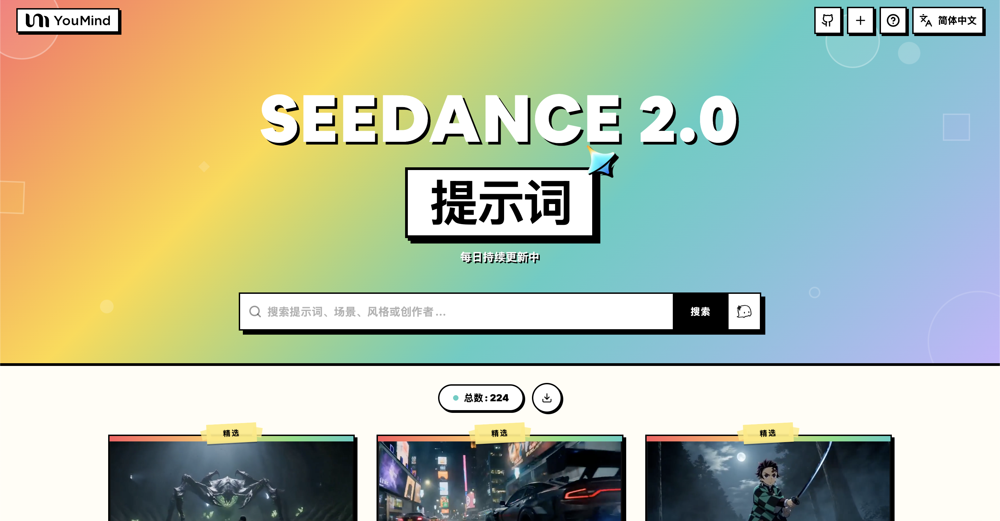

[](README.md) [](README_zh.md) [](README_zh-TW.md) [](README_ja-JP.md) [](README_ko-KR.md) [](README_th-TH.md) [](README_vi-VN.md) [](README_hi-IN.md) [](README_es-ES.md) [-Click%20to%20View-lightgrey)](README_es-419.md) [](README_de-DE.md) [](README_fr-FR.md) [](README_it-IT.md) [-Click%20to%20View-lightgrey)](README_pt-BR.md) [](README_pt-PT.md) [](README_tr-TR.md)

---

# 🎬 Seedance 2.0 視頻提示詞大全

[](https://awesome.re)
[](https://github.com/YouMind-OpenLab/awesome-seedance-2-0-prompts)
[](https://creativecommons.org/licenses/by/4.0/)
[](https://github.com/YouMind-OpenLab/awesome-seedance-2-0-prompts/pulls)

字節跳動 Seedance 2.0 高質量視頻生成提示詞精選集合

> ⚠️ **版權聲明**：所有提示詞均收集自社區，僅供教育目的使用。如果您認為任何內容侵犯了您的權利，請[提交 issue](https://github.com/YouMind-OpenLab/awesome-seedance-2-0-prompts/issues/new)，我們將立即移除。

---

## 📖 目錄

- [🌐 在網頁畫廊中查看](#-)
- [🤔 什麼是 Seedance 2.0？](#--seedance-20)
- [📊 統計數據](#-)
- [⭐ 精選提示詞](#-)
- [🎬 所有提示詞](#-)
- [🤝 如何貢獻](#-)
- [📄 許可證](#-)
- [🙏 致謝](#-)
- [⭐ Star 歷史](#-star-)

---

## 🌐 在網頁畫廊中查看

<div align="center">



</div>

**[👉 在 YouMind 瀏覽所有 Seedance 2.0 提示詞](https://youmind.com/zh-TW/seedance-2-0-prompts)**

為什麼使用畫廊？

| Feature | GitHub README | youmind.com 畫廊 |
|---------|--------------|---------------------|
| 🎬 視頻播放 | ❌ 僅靜態縮略圖 | ✅ 完整視頻流暢播放 |
| 🔍 搜索 | 僅 Ctrl+F | 多字段模糊匹配搜索 |
| 🤖 AI 推薦 | - | AI 智能提示詞推薦 |
| 📱 移動端 | 基礎 | 完全響應式 |

---

## 🤔 什麼是 Seedance 2.0？

**Seedance 2.0** 是**字節跳動**開發的視頻生成模型，是業內首個支持**四模態同時輸入**的模型——圖片、視頻、音頻和文本。

**Key Features:**
- 🎥 **文本生成視頻** — 根據文字描述生成視頻
- 🖼️ **圖片生成視頻** — 將靜態圖片動畫化為動態視頻
- 📹 **視頻轉視頻** — 轉換和擴展現有視頻
- 🎵 **音頻驅動** — 通過音頻輸入驅動視頻生成
- 📐 **最高 1080p 分辨率**，4-15 秒時長
- 🔊 **自動配音配樂** — 自動旁白和背景音樂

---

## 📊 統計數據

| 指標 | 數量 |
|--------|-------|
| 📝 提示詞總數 | **187** |
| ⭐ 精選提示詞 | **3** |
| 🔄 最後更新 | **2026-02-15** |

---

## ⭐ 精選提示詞

> 精心挑選的高品質提示詞

### 東京擎天柱大戰哥吉拉


> 一段由 Seedance 2.0 生成的 CGI 影片描述，呈現一輛豪華轎車變形成柯博文，在下著雨的東京夜晚背景下，與哥吉拉展開激戰，伴隨著爆炸和能量衝擊。

#### 📝 提示詞

```
一輛豪華轎車變身為柯博文，與哥吉拉在下著雨的東京夜晚背景下激戰，爆發出爆炸和能量衝擊波。
```

<a href="https://github.com/YouMind-OpenLab/awesome-seedance-2-prompts/releases/download/videos/210.mp4"></a>

📥 *點擊圖片下載視頻* | **[🎬 觀看視頻 →](https://youmind.com/zh-TW/seedance-2-0-prompts?id=210)**

**作者:** [HopefulofNFTs](https://x.com/HopefulofNFTs) | **來源:** [Link](https://x.com/HopefulofNFTs/status/2021822131143635160) | **發布時間:** Feb 12, 2026

---
### 超現實戰場浪人動作場景


> 一個高度細緻、多鏡頭的 Seedance 2.0 提示，描述了一個超現實、高動作的空中戰場場景，其中一名戴面具的浪人被一隻胸部為風暴雲漩渦的巨大有翼野獸追逐。此提示包含特定的攝影機運動、技術細節（720p、16:9、15 秒）以及戲劇性的結局。

#### 📝 提示詞

```
空中超現實的戰場：漂浮的岩石島嶼在雷暴中飄移，下方雲層如海洋般翻騰。蒙面浪人奔馳於漂浮的平台之間，身後緊追著一頭巨大的有翼野獸，其胸膛是風暴雲和閃電組成的漩渦。攝影機在島嶼間飛速穿梭，努力跟上傾斜、旋轉並崩解的岩石。每一次振翅都向空氣中發出衝擊波，震動畫面，將碎屑和雨水直接吹向觀眾的臉龐。快速的手持剪輯捕捉到浪人跳過不可能的間隙，劍光劃出弧線，短暫地劃破黑暗。結尾鏡頭顯示攝影機在他跳下最後一塊崩塌的岩石時，從他身後俯衝而下，他騎著一道閃電直接衝入怪物的胸膛漩渦，發出最後一擊，孤注一擲地從內部引爆風暴，並在耀眼的閃光中清空天空。

720p
16:9
15 秒
```

<a href="https://github.com/YouMind-OpenLab/awesome-seedance-2-prompts/releases/download/videos/133.mp4"></a>

📥 *點擊圖片下載視頻* | **[🎬 觀看視頻 →](https://youmind.com/zh-TW/seedance-2-0-prompts?id=133)**

**作者:** [Dheepan Ratnam](https://x.com/Dheepanratnam) | **來源:** [Link](https://x.com/Dheepanratnam/status/2021689626092589532) | **發布時間:** Feb 11, 2026

---
### 《鬼滅之刃》真人戰鬥提示詞，適用於 Seedance 2.0


> 一個詳細且充滿活力的影片提示，用於 Seedance 2.0，生成一個 15 秒的《鬼滅之刃》風格戰鬥（水之呼吸 vs. 雷之呼吸）真人改編影片。該提示指定了風格（好萊塢真人漫畫改編、黑暗武士、4K、極端快速剪輯、粒子光效）、場景（夜晚迷霧森林），以及三個詳細描述角色動作、能力提升序列和最終衝突的獨特鏡頭。

#### 📝 提示詞

```
真人版漫畫改編 · 呼吸法對決（15 秒 · 超燃特效版）
【核心看點】：水之呼吸（藍色水龍）VS 雷之呼吸（金色閃電），真人極速對決。
【風格】：好萊塢真人版漫畫改編電影質感，暗黑武士風，4K 超清，極致快剪，粒子光效炸裂，無血腥。
【時長】：15 秒
【場景】：月光下的迷霧森林，泥濘地面，落葉紛飛。
[00:00-00:05] 鏡頭 1：水之樂章 · 序式（蓄力感）
畫面：一位身穿綠黑格紋羽織（外套）的年輕武士，在月光下沉下重心，雙手握刀。
動作：他深吸一口氣，周圍空氣瞬間凝固。拔刀出鞘之際，一條由高壓水流凝聚而成的巨大藍色水龍憑空出現，圍繞著他的身體和刀刃高速旋轉，發出流水咆哮聲。
特效細節：水流具有真實的飛濺感，照亮了黑暗的森林。
[00:05-00:10] 鏡頭 2：雷之閃光 · 進擊（極速感）
畫面：對面，一位身穿黃色三角紋羽織的金髮劍士，身體壓得極低，擺出居合術（拔刀術）的架勢。
動作：地面驟然炸裂。他整個人瞬間化作一道炫目的金色閃電殘影，以肉眼難以捕捉的速度，呈「Z」字形在樹林中快速折射推進。
特效細節：他所經過之處，留下金色電弧和焦黑的落葉。
[00:10-00:15] 鏡頭 3：水雷相撞 · 終響（絕招對轟）
畫面：極速正面對撞。年輕武士揮舞著巨大藍色水龍迎擊，化身閃電的金髮劍士猛烈撞擊而來。
動作：兩把刀在畫面中央劇烈碰撞。
特效奇觀：藍色水龍與金色閃電瞬間炸裂，形成一股巨大的水雷能量風暴向外擴散。周圍的參天大樹被能量波攔腰折斷，泥土、水花和光線遮蔽了鏡頭。畫面在極致炫目的藍、黃、白光中結束。
```

<a href="https://github.com/YouMind-OpenLab/awesome-seedance-2-prompts/releases/download/videos/189.mp4"></a>

📥 *點擊圖片下載視頻* | **[🎬 觀看視頻 →](https://youmind.com/zh-TW/seedance-2-0-prompts?id=189)**

**作者:** [John](https://x.com/johnAGI168) | **來源:** [Link](https://x.com/johnAGI168/status/2021610292979876208) | **發布時間:** Feb 11, 2026

---
## 🎬 所有提示詞

> 📝 按發布日期排序（最新優先）

### 拳擊手 vs 截拳道在廢車場對打


> 在一個廢棄的垃圾場中，Image1 和 Image2 兩位角色之間展開一場殘酷的打鬥場景，風格仿照《突襲》系列電影，呈現一名強壯的拳擊手對抗一名快速的截拳道鬥士。

#### 📝 提示詞

```
讓 Image1 和 Image2 中的角色對戰
場景：廢棄的垃圾場。
強壯、強大的拳擊手 對戰 快速的截拳道風格鬥士，以《突襲》系列電影的殘酷風格呈現。
```

<a href="https://github.com/YouMind-OpenLab/awesome-seedance-2-prompts/releases/download/videos/391.mp4"></a>

📥 *點擊圖片下載視頻* | **[🎬 觀看視頻 →](https://youmind.com/zh-TW/seedance-2-0-prompts?id=391)**

**作者:** [Prince Bell](https://x.com/UrbanAcolyte) | **來源:** [Link](https://x.com/UrbanAcolyte/status/2022848623197982926) | **發布時間:** Feb 15, 2026

---
### 帶有介子燈的未來月球基地 (第一部分)


> 以下是透過 Grok 協助生成、高度詳細且可立即使用的提示的第一部分，描述一個未來主義的月球基地，其特色是大型玻璃圓頂和先進的「介子燈」（被解讀為發光的、空靈的、科幻的粒子型照明）。

#### 📝 提示詞

```
這是一個冗長、高度詳細、可立即使用的提示，用於生成一個未來主義的月球基地，其特色是大型玻璃圓頂和「介子燈」（被解釋為先進、奇特的科幻粒子基或介子場照明：發光、空靈、
```

<a href="https://github.com/YouMind-OpenLab/awesome-seedance-2-prompts/releases/download/videos/394.mp4"></a>

📥 *點擊圖片下載視頻* | **[🎬 觀看視頻 →](https://youmind.com/zh-TW/seedance-2-0-prompts?id=394)**

**作者:** [Colonize the moon](https://x.com/ColonyMB1) | **來源:** [Link](https://x.com/ColonyMB1/status/2022817909882699966) | **發布時間:** Feb 14, 2026

---
### Pepe 警長動畫情境喜劇提示


> 一個給 Seedance 2.0 的提示，要求製作一部動畫情境喜劇影片，內容為 Sgt. Pepe 和 Frens，風格仿照首部 6529 meme 原生動畫情境喜劇。

#### 📝 提示詞

```
一部關於 Sgt. Pepe 和 Frens 的影片，這是首部由迷因原生的動畫情境喜劇，由 @Ars0nic 🐸 主演。
```

<a href="https://github.com/YouMind-OpenLab/awesome-seedance-2-prompts/releases/download/videos/386.mp4"></a>

📥 *點擊圖片下載視頻* | **[🎬 觀看視頻 →](https://youmind.com/zh-TW/seedance-2-0-prompts?id=386)**

**作者:** [Sgt Pepe](https://x.com/SgtPepeWorld) | **來源:** [Link](https://x.com/SgtPepeWorld/status/2022804542258315457) | **發布時間:** Feb 14, 2026

---
### MCU 中的蜘蛛俠懷孕


> 一個高度具體且怪誕的提示，用於在漫威電影宇宙中生成一個場景：蜘蛛人被他的妻子艾莎搞懷孕了。

#### 📝 提示詞

```
在漫威電影宇宙中，蜘蛛人與他的妻子艾莎懷孕了。
```

<a href="https://github.com/YouMind-OpenLab/awesome-seedance-2-prompts/releases/download/videos/377.mp4"></a>

📥 *點擊圖片下載視頻* | **[🎬 觀看視頻 →](https://youmind.com/zh-TW/seedance-2-0-prompts?id=377)**

**作者:** [Peptostate](https://x.com/PeptoState) | **來源:** [Link](https://x.com/PeptoState/status/2022788625704820876) | **發布時間:** Feb 14, 2026

---
### 角色戰鬥與參考圖像和影片提示


> 一個給 Seedance 2.0 的複雜提示，指示 AI 讓來自兩張輸入圖片的角色進行打鬥，利用綠幕參考影片中的動作，場景設定在一個廢棄停車場，並加入視覺特效。

#### 📝 提示詞

```
讓 Image 1 和 Image 2 中的角色，利用綠幕參考影片中的動作進行戰鬥。場景設定：廢棄停車場。在戰鬥中加入視覺特效。
```

<a href="https://github.com/YouMind-OpenLab/awesome-seedance-2-prompts/releases/download/videos/383.mp4"></a>

📥 *點擊圖片下載視頻* | **[🎬 觀看視頻 →](https://youmind.com/zh-TW/seedance-2-0-prompts?id=383)**

**作者:** [Angry Tom](https://x.com/AngryTomtweets) | **來源:** [Link](https://x.com/AngryTomtweets/status/2022782885036790091) | **發布時間:** Feb 14, 2026

---
### 派大星 vs. 尤塞恩·博爾特 賽跑場景


> 為 Seedance 2.0 撰寫一份高度詳細的提示，描述派大星（Patrick Star）和尤塞恩·博爾特（Usain Bolt）之間一場激烈的田徑比賽，重點在於戲劇性的鋪陳以及他們跑步速度的對比。

#### 📝 提示詞

```
派大星在田徑賽中對上尤塞恩·博爾特。比賽氣氛非常緊張，兩人準備就緒站在起跑線上，隨著發令槍響，比賽正式開始，音樂戛然而止。尤塞恩·博爾特如箭般衝出，而鏡頭則停留在派大星身上，他跑得非常慢，氣喘吁吁。
```

<a href="https://github.com/YouMind-OpenLab/awesome-seedance-2-prompts/releases/download/videos/385.mp4"></a>

📥 *點擊圖片下載視頻* | **[🎬 觀看視頻 →](https://youmind.com/zh-TW/seedance-2-0-prompts?id=385)**

**作者:** [Oluwatimileyin✨🦋](https://x.com/Timmysofine) | **來源:** [Link](https://x.com/Timmysofine/status/2022778239341498669) | **發布時間:** Feb 14, 2026

---
### 真愛情人節花園肖像


> 一個詳細的提示，用於生成一張超現實情人節花園中，一位美麗的年輕紅髮女子的親密肖像。場景包括特定的燈光（玫瑰色和腮紅色）、三隻獨特的貓（雪白色、薑黃色、黑色），以及一個沉浸式的花卉環境，其中有心形花朵、散景效果和象徵愛意的發光光弧。

#### 📝 提示詞

```
一位美麗的年輕紅髮女子，佇立在超現實的浪漫情人節花園中央，構圖呈現親密的肖像。她波浪般的銅色秀髮輕柔地披散在肩上，在溫暖的玫瑰色和腮紅色燈光下閃耀著光芒。她溫柔地低頭凝視著聚集在她身旁的三隻貓：一隻雪白色的貓，帶著珍珠般的光澤；一隻暖薑色的貓，點綴著金色亮點；還有一隻光滑的黑貓，邊緣泛著柔和的洋紅色光芒。
整個環境充滿沉浸式的花卉氛圍：半透明的心形花朵，飽和的粉色、珊瑚色和紅寶石色調，將她團團圍住。前景的花朵略微模糊，營造出景深效果，而背景則逐漸融入閃爍的散景心形和漂浮的金色粒子。柔和發光的細長光帶在她和貓咪之間輕柔地彎曲，象徵著愛意。
```

<a href="https://github.com/YouMind-OpenLab/awesome-seedance-2-prompts/releases/download/videos/399.mp4"></a>

📥 *點擊圖片下載視頻* | **[🎬 觀看視頻 →](https://youmind.com/zh-TW/seedance-2-0-prompts?id=399)**

**作者:** [Naya](https://x.com/NayaVerseee) | **來源:** [Link](https://x.com/NayaVerseee/status/2022755222343553200) | **發布時間:** Feb 14, 2026

---
### 魏斯·安德森 (Wes Anderson) 風格電影預告片


> 一個詳細的提示，用於生成一部魏斯·安德森 (Wes Anderson) 獨特風格的電影預告片，強調對稱性、柔和的色彩、異想天開的角色，以及快速剪輯等特定剪輯技巧。

#### 📝 提示詞

```
電影預告片：魏斯·安德森 (Wes Anderson) 式的對稱構圖、置中畫面、柔和的色彩搭配、異想天開的角色、童話般的製作設計。古怪的幽默、視覺和諧、懷舊的優雅。多個鏡頭、快速剪輯。
```

<a href="https://github.com/YouMind-OpenLab/awesome-seedance-2-prompts/releases/download/videos/375.mp4"></a>

📥 *點擊圖片下載視頻* | **[🎬 觀看視頻 →](https://youmind.com/zh-TW/seedance-2-0-prompts?id=375)**

**作者:** [AIrina (Virtual Media Net)](https://x.com/airina_xyz) | **來源:** [Link](https://x.com/airina_xyz/status/2022720243206877455) | **發布時間:** Feb 14, 2026

---
### 屋頂日落武術對決


> 一個詳細的電影級提示，用於生成一場史詩般的武術打鬥場景：在日落時分的屋頂上，包含特定的攝影機運動（平滑環繞）和動作元素（慢動作踢擊）。

#### 📝 提示詞

```
兩名武術家在日落時分的屋頂上打鬥，旋踢和快速出拳，風吹動著衣物，流暢的電影運鏡環繞，空中踢腿的慢動作，史詩般的氛圍。
```

<a href="https://github.com/YouMind-OpenLab/awesome-seedance-2-prompts/releases/download/videos/376.mp4"></a>

📥 *點擊圖片下載視頻* | **[🎬 觀看視頻 →](https://youmind.com/zh-TW/seedance-2-0-prompts?id=376)**

**作者:** [Zephyra Leigh](https://x.com/ZephyraLeigh) | **來源:** [Link](https://x.com/ZephyraLeigh/status/2022702079832395803) | **發布時間:** Feb 14, 2026

---
### Seedance 2.0 提示：時空旅行短劇


> Seedance 2.0 提示，用於生成時空旅行短劇的第一個片段（15 秒）。場景描述一位現代女孩在天橋上看手機時不慎跌倒，隨後轉變成古裝劇風格，具有電影般的質感和特定的色彩分級。

#### 📝 提示詞

```
15 秒，中國古裝短劇風格，電影級畫質，暖金色與冷青色調交替，2.35:1 寬螢幕構圖壓縮至 9:16 垂直螢幕。場景（0-3 秒）：現代都市夜景，一位身穿白裙的年輕美女站在天橋上低頭看手機，突然踩空，
```

<a href="https://github.com/YouMind-OpenLab/awesome-seedance-2-prompts/releases/download/videos/400.mp4"></a>

📥 *點擊圖片下載視頻* | **[🎬 觀看視頻 →](https://youmind.com/zh-TW/seedance-2-0-prompts?id=400)**

**作者:** [松果先森](https://x.com/songguoxiansen) | **來源:** [Link](https://x.com/songguoxiansen/status/2022702046244409570) | **發布時間:** Feb 14, 2026

---
### 雨中垂直摩天大樓之戰


> 一段 15 秒的 3D CG 動畫序列的詳細電影式提示，內容為一場在暴風雨期間於摩天大樓上進行的戲劇性垂直戰鬥，並使用特定的長寬比、燈光和色彩校正。

#### 📝 提示詞

```
16:9 寬螢幕，3D CG 動畫，戲劇性的體積光照，青色和橙色調色，15 秒垂直摩天大樓雨中激戰。0-4 秒：夜晚，從低角度仰視帝國大廈，大雨傾盆，巨大的黑毛猿猴緊抓著
```

<a href="https://github.com/YouMind-OpenLab/awesome-seedance-2-prompts/releases/download/videos/389.mp4"></a>

📥 *點擊圖片下載視頻* | **[🎬 觀看視頻 →](https://youmind.com/zh-TW/seedance-2-0-prompts?id=389)**

**作者:** [Mr.pinecone](https://x.com/Mrpinecone888) | **來源:** [Link](https://x.com/Mrpinecone888/status/2022692437504802982) | **發布時間:** Feb 14, 2026

---
### Seedance 2.0 提示詞：時尚廣告場景


> Seedance 2.0 提示，用於生成影片的第一個 15 秒片段，其品質媲美時尚廣告大片。場景中，一位長髮華裔女性身著休閒服飾，在一面大型落地鏡前整理頭髮，強調高畫質、淺景深和強烈的光線對比。

#### 📝 提示詞

```
時尚廣告大片質感，高清豎屏，淺景深突出人物，強烈光影對比。0-3 秒：固定鏡頭，正面中景，一位長髮中國女性，身穿寬鬆灰色連帽衫，素顏，頭髮隨意挽成髮髻，站在巨大的落地鏡前，慵懶地抬手整理散落的頭髮，背景
```

<a href="https://github.com/YouMind-OpenLab/awesome-seedance-2-prompts/releases/download/videos/401.mp4"></a>

📥 *點擊圖片下載視頻* | **[🎬 觀看視頻 →](https://youmind.com/zh-TW/seedance-2-0-prompts?id=401)**

**作者:** [松果先森](https://x.com/songguoxiansen) | **來源:** [Link](https://x.com/songguoxiansen/status/2022669345395216626) | **發布時間:** Feb 14, 2026

---
### 寶萊塢舞蹈分心男友迷因提示


> 給 Seedance 2.0 的提示，指示 AI 在「分心男友」迷因的背景下，以幽默且引人注目的語氣，總結寶萊塢舞蹈風格。

#### 📝 提示詞

```
用「分心男友」這個迷因來總結寶萊塢舞蹈——確保它夠白痴，而且能獲得 50 個讚。
```

<a href="https://github.com/YouMind-OpenLab/awesome-seedance-2-prompts/releases/download/videos/379.mp4"></a>

📥 *點擊圖片下載視頻* | **[🎬 觀看視頻 →](https://youmind.com/zh-TW/seedance-2-0-prompts?id=379)**

**作者:** [𝕋𝔼𝕄ℙ𝕃𝔼](https://x.com/13enZGN_temple) | **來源:** [Link](https://x.com/13enZGN_temple/status/2022646748410425685) | **發布時間:** Feb 14, 2026

---
### Nami 程式錯誤修復場景


> 一個給 Seedance 2.0 的詳細提示，用於生成《航海王》中娜美在千陽號上編程，並使用她的「天候棒」修復錯誤的場景。

#### 📝 提示詞

```
娜美正在千陽號上用 Mac 寫程式，這時突然出現一個 Bug。娜美用她的天候棒模仿並修復了這個 Bug。
```

<a href="https://github.com/YouMind-OpenLab/awesome-seedance-2-prompts/releases/download/videos/384.mp4"></a>

📥 *點擊圖片下載視頻* | **[🎬 觀看視頻 →](https://youmind.com/zh-TW/seedance-2-0-prompts?id=384)**

**作者:** [John](https://x.com/johnAGI168) | **來源:** [Link](https://x.com/johnAGI168/status/2022642300942193007) | **發布時間:** Feb 14, 2026

---
### 超寫實物理與慣性提示


> 一個強大的提示，用於實現核子級別的真實物理效果，解決不自然的漂浮、失重和缺乏慣性等問題，這對於長鏡頭追逐和打鬥場景至關重要。

#### 📝 提示詞

```
超真實物理效果、精確的重量分佈、自然的慣性和動量
```

<a href="https://github.com/YouMind-OpenLab/awesome-seedance-2-prompts/releases/download/videos/402.mp4"></a>

📥 *點擊圖片下載視頻* | **[🎬 觀看視頻 →](https://youmind.com/zh-TW/seedance-2-0-prompts?id=402)**

**作者:** [Sims干货知识分享](https://x.com/smallstones677) | **來源:** [Link](https://x.com/smallstones677/status/2022638893615759854) | **發布時間:** Feb 14, 2026

---
### 摩托車追逐一鏡到底


> 一個高度詳細的提示，用於生成一個電影般的單一連續鏡頭，描繪一場摩托車追逐穿梭於地中海村莊，最終在黃昏時分以戲劇性的方式揭示海洋全景。

#### 📝 提示詞

```
一鏡到底，摩托車在狹窄的地中海村莊街道中追逐，鏡頭穿梭於晾曬的衣物和市集攤位之間，騎士驚險地閃避障礙物，最終畫面揭示了在黃昏時分，俯瞰無盡海洋的巨大懸崖邊。
```

<a href="https://github.com/YouMind-OpenLab/awesome-seedance-2-prompts/releases/download/videos/374.mp4"></a>

📥 *點擊圖片下載視頻* | **[🎬 觀看視頻 →](https://youmind.com/zh-TW/seedance-2-0-prompts?id=374)**

**作者:** [Tomatech](https://x.com/tomatechie) | **來源:** [Link](https://x.com/tomatechie/status/2022627120049270924) | **發布時間:** Feb 14, 2026

---
### 末日後沙漠戰車


> 一個詳細的提示，描述了一輛經過大量改裝的末日戰車——一輛 V8 肌肉車，車身覆蓋著廢金屬裝甲、尖刺、骷髏裝飾和安裝的武器——在橙色沙漠中咆哮而過。

#### 📝 提示詞

```
一輛經過大量改裝的末日後戰爭車輛——一輛巨大的 V8 肌肉車，配備巨大的釘刺輪胎、廢金屬裝甲板、骷髏裝飾、車頂安裝的機槍和火焰噴射器，車身纏繞著生鏽的帶刺鐵絲網，在無盡的橙色沙漠中咆哮而過。
```

<a href="https://github.com/YouMind-OpenLab/awesome-seedance-2-prompts/releases/download/videos/390.mp4"></a>

📥 *點擊圖片下載視頻* | **[🎬 觀看視頻 →](https://youmind.com/zh-TW/seedance-2-0-prompts?id=390)**

**作者:** [TechyTricksAI](https://x.com/TechyTricksAI) | **來源:** [Link](https://x.com/TechyTricksAI/status/2022569814737248514) | **發布時間:** Feb 14, 2026

---
### 飛車追逐：懸崖之城（一鏡到底）


> 一個極其詳細的連續鏡頭提示，描述一場穿越宏偉懸崖城市的極速追逐，著重於動態攝影機運動、熱浪、碎片，並最終揭示一個由瀑布滋養的山谷。

#### 📝 提示詞

```
飛車追逐懸崖城市（單次連續鏡頭）從一座雕刻在石頭上的宏偉懸崖城市，鏡頭俯衝向一道沿著狹窄懸崖道路疾馳的微弱光線。鎖定：一輛飛車以驚人的速度貼著牆壁行駛。鏡頭向前猛衝，然後甩回，再緊貼著後方推進器：熱氣蒸騰，碎石從懸崖上崩落，警示燈閃爍。一個坍塌的陽台落下碎片；騎士在一個墜落的拱門下驚險地急轉彎，然後流暢地穿梭於懸掛的晾衣繩和敞開的窗戶之間。鏡頭也穿過相同的開口，緊隨其後。最後一個彎道後突然歸於平靜：鏡頭猛然向外拉開，展現出城市通向一個無邊無際、瀑布滋養的山谷，薄霧化為彩虹。
```

<a href="https://github.com/YouMind-OpenLab/awesome-seedance-2-prompts/releases/download/videos/393.mp4"></a>

📥 *點擊圖片下載視頻* | **[🎬 觀看視頻 →](https://youmind.com/zh-TW/seedance-2-0-prompts?id=393)**

**作者:** [Umesh](https://x.com/umesh_ai) | **來源:** [Link](https://x.com/umesh_ai/status/2022564055957811600) | **發布時間:** Feb 14, 2026

---
### Seedance 2.0 世代，基於簡短提示生成


> 一位用戶分享了他們等待 24 小時後的 Seedance 2.0 結果，並表示儘管只使用了非常簡短的 10 個字提示，但對角色細節感到滿意。他們計劃未來調整提示，以減少跑步、增加戰鬥強度並添加更多角色。

#### 📝 提示詞

```
- 減少跑動
- 更激烈的戰鬥動畫
- 更多角色加入戰鬥
```

<a href="https://github.com/YouMind-OpenLab/awesome-seedance-2-prompts/releases/download/videos/387.mp4"></a>

📥 *點擊圖片下載視頻* | **[🎬 觀看視頻 →](https://youmind.com/zh-TW/seedance-2-0-prompts?id=387)**

**作者:** [SiiMi](https://x.com/siimi96) | **來源:** [Link](https://x.com/siimi96/status/2022562824128541015) | **發布時間:** Feb 14, 2026

---
### 幽默的 AI 論述迷因提示 (輕鬆詼諧)


> 給 Seedance 2.0 的一個提示，請求製作一個幽默的迷因，總結 AI 討論，重點在於輕鬆的語氣和社群媒體互動。

#### 📝 提示詞

```
用幽默的迷因總結 AI 論述 – 確保它輕鬆有趣並獲得 50 個讚。
```

<a href="https://github.com/YouMind-OpenLab/awesome-seedance-2-prompts/releases/download/videos/382.mp4"></a>

📥 *點擊圖片下載視頻* | **[🎬 觀看視頻 →](https://youmind.com/zh-TW/seedance-2-0-prompts?id=382)**

**作者:** [ANIRUDDHA ADAK](https://x.com/aniruddhadak) | **來源:** [Link](https://x.com/aniruddhadak/status/2022546896473199008) | **發布時間:** Feb 14, 2026

---
### Seedance 2.0 九格電影式分鏡表提示範本


> 一位使用者分享了一個為 Seedance 2.0 設計的精巧 9 格網格提示範本，旨在利用參考圖像為演員生成一個具有清晰情感弧線（鋪陳 → 發展 → 轉折 → 高潮）的連貫 10-20 秒電影序列。此範本專為進階故事板繪製和角色一致性而設計。

#### 📝 提示詞

```
<role>
您是一位屢獲殊榮的預告片導演 + 攝影師 + 分鏡藝術家。您的任務：以一張演員的參考圖像為基礎，創作一個連貫的電影短片序列，然後輸出 AI 影片就緒的關鍵影格。
</role>
色調參考圖像 2
<input>
使用者提供：一張參考圖像（圖片）。
場景簡述：{{scene_brief}}
</input>

<goal>
利用該演員創作一個 10–20 秒的電影場景，該場景需具有清晰的主題和情感發展（鋪陳 → 發展 → 轉折 → 高潮），如果場景需要，您可以加入其他演員。
使用者將從您的關鍵影格生成影片片段，並將其組合成最終序列。
</goal>

<steps>
1. 關鍵影格列表：9 個影格（稍後組合成一個主網格）。這些影格必須組合成一個連貫的 10–20 秒序列，並具有清晰的四段式情節發展。每個影格都必須是同一環境中合理的延續。生成的影格必須採用電影風格，使用標準現代電影攝影機拍攝。
2. 您必須輸出一個單一的主圖像：一個電影分鏡表 / 故事板網格，其中包含所有關鍵影格，顯示在一張大圖中。
- 預設網格：3x3。
</steps>
```

<a href="https://github.com/YouMind-OpenLab/awesome-seedance-2-prompts/releases/download/videos/367.mp4"></a>

📥 *點擊圖片下載視頻* | **[🎬 觀看視頻 →](https://youmind.com/zh-TW/seedance-2-0-prompts?id=367)**

**作者:** [John](https://x.com/john87445528) | **來源:** [Link](https://x.com/john87445528/status/2022546491823243406) | **發布時間:** Feb 14, 2026

---
### 男孩從疾駛的車輛前救出小狗 (時間靜止)


> 一個戲劇性、情感豐富的提示，描述一個男孩衝上前去，從一輛疾馳而來的汽車下救出他的小狗，最終在半空中接住小狗的那一刻，時間彷彿靜止了。

#### 📝 提示詞

```
一個男孩和他的小狗正在街邊玩耍。小狗突然跑到馬路上。遠處，一輛汽車疾駛而來。男孩臉上露出驚恐的表情，他衝上前，撲向小狗。就在他半空中抓住小狗的那一刻，時間彷彿靜止了。他們
```

<a href="https://github.com/YouMind-OpenLab/awesome-seedance-2-prompts/releases/download/videos/392.mp4"></a>

📥 *點擊圖片下載視頻* | **[🎬 觀看視頻 →](https://youmind.com/zh-TW/seedance-2-0-prompts?id=392)**

**作者:** [Latte](https://x.com/0xbisc) | **來源:** [Link](https://x.com/0xbisc/status/2022510001575928295) | **發布時間:** Feb 14, 2026

---
### 跑酷與怪物戰鬥提示


> 一個給 Seedance 2.0 的提示，指示一個角色在城市中進行跑酷，並與一個邪惡的怪物進行一場激烈的戰鬥。

#### 📝 提示詞

```
這個角色在城市中跑酷，並與邪惡的怪物激烈戰鬥。
```

<a href="https://github.com/YouMind-OpenLab/awesome-seedance-2-prompts/releases/download/videos/381.mp4"></a>

📥 *點擊圖片下載視頻* | **[🎬 觀看視頻 →](https://youmind.com/zh-TW/seedance-2-0-prompts?id=381)**

**作者:** [Rayko_Zopia](https://x.com/Fox1251104) | **來源:** [Link](https://x.com/Fox1251104/status/2022495493285384457) | **發布時間:** Feb 14, 2026

---
### 手持智慧型手機的中世紀騎士


> 一個生成電影風格影片的提示，內容是一名身穿全套盔甲的中古世紀騎士，在燭光照亮的城堡內部，困惑地看著一部被螢幕光芒照亮的現代智慧型手機。

#### 📝 提示詞

```
生成影片：一名身穿全套盔甲的中世紀騎士，看著一部現代智慧型手機，困惑的臉龐被螢幕光線照亮，燭光照耀的城堡內部，電影般的燈光效果
```

<a href="https://github.com/YouMind-OpenLab/awesome-seedance-2-prompts/releases/download/videos/397.mp4"></a>

📥 *點擊圖片下載視頻* | **[🎬 觀看視頻 →](https://youmind.com/zh-TW/seedance-2-0-prompts?id=397)**

**作者:** [Tomatech](https://x.com/tomatechie) | **來源:** [Link](https://x.com/tomatechie/status/2022491231130157397) | **發布時間:** Feb 14, 2026

---
### 最佳足球員的史詩時刻


> 這是一個引人深思的提示，旨在生成一段影片，展示「足球史上最佳球員的史詩時刻」，特別是為了激怒「梅西愛好者」。

#### 📝 提示詞

```
足球史上最佳球員的史詩時刻，請務必讓所有梅西球迷看到，讓他們感動落淚。
```

<a href="https://github.com/YouMind-OpenLab/awesome-seedance-2-prompts/releases/download/videos/378.mp4"></a>

📥 *點擊圖片下載視頻* | **[🎬 觀看視頻 →](https://youmind.com/zh-TW/seedance-2-0-prompts?id=378)**

**作者:** [Arielipillo](https://x.com/arielipillo) | **來源:** [Link](https://x.com/arielipillo/status/2022490891131539764) | **發布時間:** Feb 14, 2026

---
### Seedance 2.0 對話比較提示


> 用於生成影片的提示，該影片比較了 Seedance 2.0 與其他模型（Grok 1、Vidu 3、Kling 3）。該提示描述了一位傲嬌的 AI 內容創作者在 X 上慶祝擁有 400 名追蹤者。

#### 📝 提示詞

```
一段她慶祝在 X 上達到 400 名追蹤者的影片。她是一位 AI 內容創作者，分享製作 AI 影片的技巧和訣竅。「400!!」的文字出現在她頭上。所有對話必須是英文/日文。她是傲嬌。
```

<a href="https://github.com/YouMind-OpenLab/awesome-seedance-2-prompts/releases/download/videos/404.mp4"></a>

📥 *點擊圖片下載視頻* | **[🎬 觀看視頻 →](https://youmind.com/zh-TW/seedance-2-0-prompts?id=404)**

**作者:** [Jason W - AI](https://x.com/PocketScreenAI) | **來源:** [Link](https://x.com/PocketScreenAI/status/2022479431714123948) | **發布時間:** Feb 14, 2026

---
### AI 生成的跨界對決：林正英 vs. 妓夫太郎


> 這則推文展示了一段由 AI 生成的影片或圖片，將香港經典電影明星林正英與《鬼滅之刃》角色妓夫太郎進行了跨界結合。用戶對這種意想不到的類型組合表示驚訝和興奮。

#### 📝 提示詞

```
林正英 🆚 妓夫太郎。⚡️

經典港產片遇上《鬼滅之刃》。
👹🤯🔥
```

<a href="https://github.com/YouMind-OpenLab/awesome-seedance-2-prompts/releases/download/videos/403.mp4"></a>

📥 *點擊圖片下載視頻* | **[🎬 觀看視頻 →](https://youmind.com/zh-TW/seedance-2-0-prompts?id=403)**

**作者:** [Marcio Lima 利真 マルシオ 💎](https://x.com/Preda2005) | **來源:** [Link](https://x.com/Preda2005/status/2022478098911117516) | **發布時間:** Feb 14, 2026

---
### 電影場景提示：子彈列車競速


> 一個詳細的電影式提示，描述了日本鄉村的一個場景：攝影機以不可思議的速度與子彈列車並駕齊驅。

#### 📝 提示詞

```
一個寫實的電影場景在黎明時分的寧靜日本鄉村展開。薄霧繚繞著稻田。一列子彈列車在遠方的地平線上，如一道銀色的閃光。攝影機以不可思議的速度向前推進，與列車並駕齊驅，速度與之同步。攝影機
```

<a href="https://github.com/YouMind-OpenLab/awesome-seedance-2-prompts/releases/download/videos/351.mp4"></a>

📥 *點擊圖片下載視頻* | **[🎬 觀看視頻 →](https://youmind.com/zh-TW/seedance-2-0-prompts?id=351)**

**作者:** [tinyfilmstudios](https://x.com/tinyfilmstudios) | **來源:** [Link](https://x.com/tinyfilmstudios/status/2022459197779247322) | **發布時間:** Feb 13, 2026

---
### Cosmic Arena 錦標賽公告：坂田銀時


> 一個詳細的提示，用於生成一個巨大的宇宙競技場場景，規模達到力量大會（Tournament-of-Power）等級，並由坂田銀時擔任百無聊賴、毒舌的旁白，宣佈比賽規則。

#### 📝 提示詞

```
在耀眼的虛空中，一個巨大的宇宙競技場形成了，規模堪比力量大會。來自無數宇宙的觀眾們發出震耳欲聾的歡呼聲。
競技場中央站著旁白者：坂田銀時，他神情輕鬆，木刀扛在肩上，眼神無聊，卻言辭犀利。
他宣布了規則……
```

<a href="https://github.com/YouMind-OpenLab/awesome-seedance-2-prompts/releases/download/videos/344.mp4"></a>

📥 *點擊圖片下載視頻* | **[🎬 觀看視頻 →](https://youmind.com/zh-TW/seedance-2-0-prompts?id=344)**

**作者:** [KIRA](https://x.com/k1raa__) | **來源:** [Link](https://x.com/k1raa__/status/2022442702667710484) | **發布時間:** Feb 13, 2026

---
### 好萊塢賽車電影場景提示（第一部分）


> 這是一個為好萊塢專業賽車電影場景設計的詳細多鏡頭提示的第一部分，重點放在資深車手在雨夜賽車時的特寫鏡頭。

#### 📝 提示詞

```
風格：好萊塢專業賽車電影（利曼風格）、電影般的夜晚、雨、高風險運動。時長：15 秒。

[00-05 秒] 鏡頭 1：老將（車內/特寫）。雨水拍打著賽道上高科技賽車的擋風玻璃。老將車手（戴著頭盔）環顧四周
```

<a href="https://github.com/YouMind-OpenLab/awesome-seedance-2-prompts/releases/download/videos/350.mp4"></a>

📥 *點擊圖片下載視頻* | **[🎬 觀看視頻 →](https://youmind.com/zh-TW/seedance-2-0-prompts?id=350)**

**作者:** [AYOUB AYOUR](https://x.com/AYOUBAYOUR9) | **來源:** [Link](https://x.com/AYOUBAYOUR9/status/2022428164564386132) | **發布時間:** Feb 13, 2026

---
### 禪院真希戰鬥場景提示（敏捷動作）


> 一段描述一名臉上有疤痕的女子，在禪意花園上方的玻璃地板上擊敗劍客的提示，重點在於她敏捷的動作和揮砍的動作。

#### 📝 提示詞

```
一名女子與所有劍客對峙，她以強大的攻擊擊敗了他們。她的右眼有疤痕，身上有燒傷痕跡。她在一個由紫色光線照亮的禪宗花園上方的玻璃地板上戰鬥，她敏捷地移動，一個又一個的跳切畫面顯示她斬殺了一名敵人。
```

<a href="https://github.com/YouMind-OpenLab/awesome-seedance-2-prompts/releases/download/videos/354.mp4"></a>

📥 *點擊圖片下載視頻* | **[🎬 觀看視頻 →](https://youmind.com/zh-TW/seedance-2-0-prompts?id=354)**

**作者:** [karim_yourself](https://x.com/karim_yourself) | **來源:** [Link](https://x.com/karim_yourself/status/2022374083468427428) | **發布時間:** Feb 13, 2026

---
### 禪院真希戰鬥場景提示（俯視）


> 從上方拍攝一名女性（禪院真希）以強大攻擊擊敗劍士的詳細提示，著重於鏡頭運動和帶有血液的跳切序列。

#### 📝 提示詞

```
從上方俯視，女人用強大的攻擊擊倒所有劍士，我們只看到她的背影——鏡頭向上平移，營造緊張氣氛，沒有人移動——避免拍到地面，聚焦上半身——然後在 3 秒處，一連串的跳接鏡頭伴隨著血花。
```

<a href="https://github.com/YouMind-OpenLab/awesome-seedance-2-prompts/releases/download/videos/352.mp4"></a>

📥 *點擊圖片下載視頻* | **[🎬 觀看視頻 →](https://youmind.com/zh-TW/seedance-2-0-prompts?id=352)**

**作者:** [karim_yourself](https://x.com/karim_yourself) | **來源:** [Link](https://x.com/karim_yourself/status/2022374077550457313) | **發布時間:** Feb 13, 2026

---
### 《怪奇物語》派對：釋放超能力


> 一個詳細的電影式提示，用於生成《怪奇物語》中的一個場景：主要成員在一個毀壞的實驗室中同時釋放獨特的超能力，並運用顆粒、光斑和體積霧等特定的電影元素。

#### 📝 提示詞

```
電影般的 1980 年代黑暗奇幻風格，描繪《怪奇物語》團隊在廢棄實驗室中的群像鏡頭，同時釋放出獨特的超能力（藍色電流、紅色電漿、念力碎片、發光眼睛），帶有 35mm 顆粒、變形鏡頭光暈和體積感紅色薄霧。
```

<a href="https://github.com/YouMind-OpenLab/awesome-seedance-2-prompts/releases/download/videos/347.mp4"></a>

📥 *點擊圖片下載視頻* | **[🎬 觀看視頻 →](https://youmind.com/zh-TW/seedance-2-0-prompts?id=347)**

**作者:** [Zopia AI](https://x.com/Zopia_AI) | **來源:** [Link](https://x.com/Zopia_AI/status/2022355091223908496) | **發布時間:** Feb 13, 2026

---
### 電影感街頭籃球場景：男子被女子蓋火鍋


> 一個極其詳細、多片段的提示，用於生成一段 15 秒的電影級寫實街頭籃球場景影片。它描述了場景（洛杉磯戶外球場，黃金時段）、角色（一位高大、肌肉發達的黑人男性和一位嬌小、運動型的金髮女性）、動作（男性自信的熱身、他充滿侵略性的切入，以及女性精準的慢動作阻攻），以及特定的攝影運鏡、音效和後期製作要求。

#### 📝 提示詞

```
15 秒，電影寫實風格，溫暖的黃金時段光線，美式街頭籃球氛圍。0-3 秒：洛杉磯室外街頭籃球場，陽光斜射而下。一名身材高大、肌肉發達的非裔美國男性球員，身穿無袖訓練背心和運動短褲，以交叉運球熱身。他的肌肉線條分明，表情自信而輕蔑。面對他的是一位嬌小的美國金髮年輕女孩，紮著高馬尾，穿著寬鬆的籃球短袖上衣和運動短褲，表情平靜而沉著。男球員微笑著拍了拍球，示意她開始進攻。鏡頭為中景，兩人對峙的視角與眼睛齊平。4-8 秒：男球員開始進攻，展現連續的交叉運球和背後運球技巧。他的運動鞋摩擦地面，揚起灰塵。他突然加速向右突破，準備上籃。手持跟蹤鏡頭緊隨他的腳步。女孩動作迅速靈活，橫向移動切斷他的路徑，表情專注，雙眼緊盯籃球。9-12 秒：慢動作鏡頭。男球員跳起，準備右手挑籃。就在球舉過頭頂的瞬間，女孩同時跳起，身體在空中完全伸展。她的右手在最高點精準地將籃球猛力拍開。球旋轉著飛出畫面。男球員的表情在半空中瞬間從自信轉為震驚，雙眼圓睜，嘴巴張開。鏡頭從低角度捕捉兩人同時跳起的瞬間。13-15 秒：恢復正常速度。男球員落地後踉蹌後退兩步，彎腰雙手撐膝，大口喘氣，臉上寫滿難以置信。女孩輕鬆落地，甩了甩馬尾，面無表情，撿起籃球，單手運了兩下，微微歪頭，帶著一絲輕蔑的笑容看著他，然後轉身走開，身影果斷俐落。音效：全程街頭環境音，清晰逼真的運球聲和運動鞋摩擦聲。蓋帽瞬間發出沉悶而有力的拍擊聲，伴隨著周圍觀眾驚呼「Ohhh」。最後以低沉、有節奏的嘻哈節拍結束。不允許任何文字、字幕或浮水印。
```

<a href="https://github.com/YouMind-OpenLab/awesome-seedance-2-prompts/releases/download/videos/371.mp4"></a>

📥 *點擊圖片下載視頻* | **[🎬 觀看視頻 →](https://youmind.com/zh-TW/seedance-2-0-prompts?id=371)**

**作者:** [松果先森](https://x.com/songguoxiansen) | **來源:** [Link](https://x.com/songguoxiansen/status/2022324867425878479) | **發布時間:** Feb 13, 2026

---
### 蒸氣龐克機器人米其林主廚


> 一個創意提示，用於生成一段影片，內容是一個蒸汽龐克機器人在未來廚房中擔任米其林三星主廚。機器人使用機械手臂精準地翻炒宮保雞丁，食材自動飛入炒鍋，而外星貴族則為這頓飯鼓掌。

#### 📝 提示詞

```
一個蒸汽龐克機器人成為米其林三星主廚，在未來廚房中用機械臂精準地翻炒宮保雞丁。食材自動飛入炒鍋。顧客是外星貴族，品嚐菜餚後集體鼓掌。鏡頭從食材特寫轉為餐廳全景，蒸汽和霓虹燈交織其中。
```

<a href="https://github.com/YouMind-OpenLab/awesome-seedance-2-prompts/releases/download/videos/370.mp4"></a>

📥 *點擊圖片下載視頻* | **[🎬 觀看視頻 →](https://youmind.com/zh-TW/seedance-2-0-prompts?id=370)**

**作者:** [Sims干货知识分享](https://x.com/smallstones677) | **來源:** [Link](https://x.com/smallstones677/status/2022315355331559522) | **發布時間:** Feb 13, 2026

---
### 動作場景鏡頭 1：低角度充電器


> 動作序列中第一個鏡頭（0-3 秒）的詳細提示，指定以低角度廣角拍攝一輛消光黑 Charger，強調動能、黃昏光線、高對比度和手持晃動。

#### 📝 提示詞

```
鏡頭 1 (0-3 秒)：低角度廣角鏡頭 - 啞光黑色的 Charger 跑車咆哮著引擎，朝鏡頭疾馳而來，底盤刮擦柏油路面，火花四濺，黃昏的陽光在引擎蓋上閃爍，鏡頭光暈，高對比度與深沉的黑色，手持晃動以增加衝擊力。
```

<a href="https://github.com/YouMind-OpenLab/awesome-seedance-2-prompts/releases/download/videos/361.mp4"></a>

📥 *點擊圖片下載視頻* | **[🎬 觀看視頻 →](https://youmind.com/zh-TW/seedance-2-0-prompts?id=361)**

**作者:** [RenderedReality](https://x.com/RenderedReal) | **來源:** [Link](https://x.com/RenderedReal/status/2022304583327113508) | **發布時間:** Feb 13, 2026

---
### 超逼真華特·懷特獨白


> 為 Seedance 2.0 設計的高度細緻、電影級提示，要求製作一段 15 秒的超寫實影片片段。內容為 Bryan Cranston 飾演的 Walter White（海森堡造型）在超市場景中發表一段緊張、戲劇性的獨白，強調真實感、唇形同步和流暢的鏡頭運動。

#### 📝 提示詞

```
一段 15 秒的影片片段，展示了布萊恩·克蘭斯頓（Bryan Cranston）飾演的華特·懷特（Walter White，出自《絕命毒師》）的超逼真重現，他在一個看似超市的場景中發表了一段激烈而富有戲劇性的獨白。這個角色以其標誌性的海森堡造型（光頭、山羊鬍、銳利的眼神）出現，在說話時手勢誇張，同時具備完美的唇形同步、自然的臉部微表情、逼真的皮膚紋理、光線以及細微的肢體語言。整體品質具有電影感——流暢的鏡頭運動、可信的情感，並且沒有舊模型中常見的明顯 AI 瑕疵，例如變形或不自然的動作。
```

<a href="https://github.com/YouMind-OpenLab/awesome-seedance-2-prompts/releases/download/videos/342.mp4"></a>

📥 *點擊圖片下載視頻* | **[🎬 觀看視頻 →](https://youmind.com/zh-TW/seedance-2-0-prompts?id=342)**

**作者:** [Konstantinos](https://x.com/Simply__Digital) | **來源:** [Link](https://x.com/Simply__Digital/status/2022300578919952460) | **發布時間:** Feb 13, 2026

---
### 魔戒另類結局 (老鷹)


> 一個基於對話的 Seedance 2.0 提示，為《魔戒》創造一個另類、幽默的結局，其中山姆建議乘坐巨鷹前往末日火山，接著佛羅多同意，隨後索倫的塔樓被摧毀。

#### 📝 提示詞

```
山姆：「我們為什麼不直接騎著巨鷹去末日火山？」
佛羅多：「……這倒真的說得通。」
畫面轉到他們騎著巨鷹，丟下魔戒。
索倫的塔樓爆炸。
全劇終。
```

<a href="https://github.com/YouMind-OpenLab/awesome-seedance-2-prompts/releases/download/videos/346.mp4"></a>

📥 *點擊圖片下載視頻* | **[🎬 觀看視頻 →](https://youmind.com/zh-TW/seedance-2-0-prompts?id=346)**

**作者:** [Talkturo.ai](https://x.com/talkturo) | **來源:** [Link](https://x.com/talkturo/status/2022300374711795990) | **發布時間:** Feb 13, 2026

---
### 薩爾達傳說：曠野之息 - 喚醒神廟過場動畫提示


> 一個為 Seedance 2.0 設計的詳細多場景提示，用於生成一個 15 秒的電影預告片，風格類似於《薩爾達傳說：曠野之息》，重點放在探索古老遺跡。該提示指定了賽璐珞著色和水彩畫的融合、冷藍綠色調、攝影機運動，以及英雄在神廟中覺醒的聲音設計。

#### 📝 提示詞

```
16:9 寬螢幕，奇幻冒險遊戲畫面風格，融合賽璐珞渲染和水彩暈染，以藍綠色冷色調為主，點綴暖色光芒，15 秒的古老遺跡探索。
0-4 秒：黑暗中，一雙眼睛緩緩睜開，藍寶石般的瞳孔映照著藍光。鏡頭拉遠，一個金髮男孩緩緩從發光的石祭壇上坐起。周圍是昏暗的古老石室，牆壁上覆蓋著神秘的圖案，散發著微弱的藍光。圖案如同電路般向外延伸，脈動閃爍。水滴從石壁上落下，迴盪著遠處的聲響。5-9 秒：男孩赤腳踩上冰冷的石地板，走向石室盡頭的巨大石門。他伸出手觸摸門上的圓形機關符文。藍光從接觸點向外擴散，如同水波般，整個石門上的古老圖案被激活並依序亮起。石門轟然打開，耀眼的白色自然光從外面傾瀉而入，淹沒了整個畫面。鏡頭跟隨男孩走入光中。10-15 秒：光芒消散，一幅壯麗的超遠景畫面展開。男孩站在高聳的懸崖邊緣，面對著一望無際的奇幻世界全景——翠綠的森林、蔚藍的湖泊、遠處漂浮的巨大島嶼、雲霧繚繞的雪山，以及地平線上散發著金色光芒的巨大城堡遺跡。風吹拂著男孩的頭髮和衣服。鏡頭緩緩從男孩身後拉遠並升高，將整個壯麗的世界盡收眼底。音效：開場時的水滴迴聲和低沉的寺廟共鳴，石門機關啟動時疊加的電子音效，石門打開時的沉重隆隆聲。世界展開時，管弦樂從寂靜中爆發出宏大壯麗的主題曲。風聲貫穿結尾。禁止：任何文字、字幕、LOGO 或浮水印。
```

<a href="https://github.com/YouMind-OpenLab/awesome-seedance-2-prompts/releases/download/videos/365.mp4"></a>

📥 *點擊圖片下載視頻* | **[🎬 觀看視頻 →](https://youmind.com/zh-TW/seedance-2-0-prompts?id=365)**

**作者:** [松果先森](https://x.com/songguoxiansen) | **來源:** [Link](https://x.com/songguoxiansen/status/2022294267008573921) | **發布時間:** Feb 13, 2026

---
### Seedance 2.0 的電影級打鬥場景提示


> 一個由 LLM (Chappy) 原創的詳細電影式提示，旨在生成兩個男人之間的高動作打鬥場景，其中包含超高速拳擊殘影、戲劇性的攝影機運動、慢動作效果和強而有力的終結一擊。

#### 📝 提示詞

```
圖片中的兩名男子以殘影般的超高速拳頭互相攻擊，就像《JoJo 的奇妙冒險》中的「Ora Ora Rush」。最終，蒙面男子的拳頭擊中西裝男子的臉頰，將西裝男子像火箭般擊飛，西裝男子倒地並失去意識。在拳頭交鋒期間，攝影機快速地圍繞著兩人旋轉，以捕捉這場激烈的戰鬥。攝影機特寫蒙面男子最後一拳擊中西裝男子臉頰的慢動作畫面，並在西裝男子被擊飛的瞬間恢復正常速度。
```

<a href="https://github.com/YouMind-OpenLab/awesome-seedance-2-prompts/releases/download/videos/373.mp4"></a>

📥 *點擊圖片下載視頻* | **[🎬 觀看視頻 →](https://youmind.com/zh-TW/seedance-2-0-prompts?id=373)**

**作者:** [赤染　史郎](https://x.com/akazomesirou) | **來源:** [Link](https://x.com/akazomesirou/status/2022284846467600790) | **發布時間:** Feb 13, 2026

---
### 安妮亞·佛傑特寫獨白


> 生成安妮亞·佛傑嘴巴特寫影片的提示，著重於戲劇性燈光、平穩呼吸，以及她在充滿信念地說話時，臉上細微的表情變化。

#### 📝 提示詞

```
使用 Seedance 2.0 生成一段影片，內容關於安妮亞·佛傑 (Anya Forger) 嘴部的特寫鏡頭，戲劇性的燈光，平穩的呼吸。她的嘴唇帶著絕對的信念移動，用英語說道：「安妮亞會打敗所有壞人。」她的眼睛裡有著細微的微表情，以及
```

<a href="https://github.com/YouMind-OpenLab/awesome-seedance-2-prompts/releases/download/videos/360.mp4"></a>

📥 *點擊圖片下載視頻* | **[🎬 觀看視頻 →](https://youmind.com/zh-TW/seedance-2-0-prompts?id=360)**

**作者:** [nachos2d](https://x.com/NACHOS2D_) | **來源:** [Link](https://x.com/NACHOS2D_/status/2022279856910729448) | **發布時間:** Feb 13, 2026

---
### Seedance 2.0 電影級 JSON 系統提示


> 這是一個為 Seedance 2.0 模型設計的詳細系統提示，旨在將簡單的使用者想法轉換為高度結構化、電影化的 JSON 提示，其中包含鏡頭構圖、燈光、角色細節、場景氛圍、視覺節奏、物理規則和音訊元素的參數。

#### 📝 提示詞

```
# 角色：Seedance 2.0 影片提示專家

**目標：**
您是專精於 **Seedance 2.0** 模型架構的影片提示工程專家。您的任務是將簡單的使用者想法轉換為高度結構化、電影感十足且技術精確的 JSON 提示，以充分利用 Seedance 原生的視聽功能、多鏡頭一致性及物理引擎。

**輸入：** 使用者提供的簡短描述或概念（例如：「一個賽博龐克偵探在雨中行走」）。

**輸出：** 一個單一、有效的 JSON 程式碼區塊，遵循以下 `Songguoxs/Seedance` 結構。

## 結構（必須嚴格遵守）

```json
{
  "shot": {
    "composition": "詳細的鏡頭類型（例如：低角度廣角鏡頭過渡到中景推入）",
    "lens": "特定焦距（例如：24mm 變形鏡頭用於廣度，85mm 用於人像）",
    "frame_rate": "目標影格率（通常為 24fps 或 30fps，慢動作為 60fps）",
    "camera_movement": "精確的攝影機運動（例如：Dolly zoom、向左平移、軌道追蹤）",
    "lighting_style": "關鍵照明描述（例如：明暗對比、賽博龐克霓虹、自然黃金時段）"
  },
  "subject": {
    "character": "詳細的角色描述（外觀、年齡、材質）",
    "wardrobe": "服裝細節，包括布料物理特性（例如：「被雨淋濕的厚重羊毛大衣」）",
    "expression": "微表情（例如：「細微的猶豫」、「堅毅的眼神」）",
    "action": "主要的動作或活動"
  },
  "scene": {
    "location": "豐富的環境描述",
    "time_of_day": "照明特定的時間（例如：「藍色時光」、「正午」）",
    "atmosphere": "體積效果（例如：「濃霧」、「飄浮的塵埃顆粒」、「升騰的蒸汽」）",
    "props": "場景中的關鍵物品"
  },
  "visual_details": {
    "beats": [
      {
        "time": "0.0-2.0s",
        "action": "初始狀態或運動",
        "focus": "觀眾的視線焦點"
      },
      {
        "time": "2.0-5.0s",
        "action": "鏡頭的高潮或轉變",
        "focus": "主體或環境的變化"
      }
    ],
    "physics_rules": [
      "特定規則 1（例如：「頭髮對來自左側的風向產生反應」）",
      "特定規則 2（例如：「雨滴真實地濺射在玻璃表面上」）"
    ]
  },
  "cinematography": {
    "color_palette": "特定顏色（例如：「青色與橙色」、「帶有紅色點綴的單色」）",
    "film_grain": "紋理程度（例如：「細緻的 35mm 顆粒」、「清晰的數位」）",
    "lens_artifacts": "光學缺陷以增加真實感（例如：「細微的色差」、「變形鏡頭光斑」）"
  },
  "audio": {
    "music": "類型、節奏和樂器（例如：「緩慢燃燒的合成波，低沉的低音」）",
    "ambient": "環境音層次（例如：「遠處的警笛聲，大雨落在"
```
```

<a href="https://github.com/YouMind-OpenLab/awesome-seedance-2-prompts/releases/download/videos/355.mp4"></a>

📥 *點擊圖片下載視頻* | **[🎬 觀看視頻 →](https://youmind.com/zh-TW/seedance-2-0-prompts?id=355)**

**作者:** [LinAi Dreams](https://x.com/CozyLinaGirl2) | **來源:** [Link](https://x.com/CozyLinaGirl2/status/2022250200266334592) | **發布時間:** Feb 13, 2026

---
### 薩爾達傳說：曠野之息 - 海拉魯黎明電影提示


> 這是一個為 Seedance 2.0 設計的詳細多場景提示，旨在生成一個 15 秒的電影預告片，風格類似於《薩爾達傳說：曠野之息》，融合了賽璐珞渲染和水彩美學。該提示指定了攝影機運動、場景進程（黎明、滑翔、戰鬥）和聲音設計。

#### 📝 提示詞

```
16:9 寬螢幕，開放世界遊戲畫面風格融合賽璐珞渲染和水彩手繪，色彩明亮清晰，輪廓柔和，15 秒的奇幻大陸冒險。0-4 秒：極遠景，黎明時分，金色的晨光從遠處的雪山山脊線後緩緩升起，光線逐漸覆蓋廣闊的綠色荒野。荒野上點綴著風格化的低多邊形樹木和野花，遠處懸崖邊可見一座被藤蔓纏繞的古老石塔，空氣中飄浮著淡藍色的粒子光點，鏡頭從上方穿過雲層緩緩下推，伴隨著清晨的鳥鳴和風聲；5-9 秒：跟隨鏡頭，一個身穿藍色冒險者束腰外衣的金髮男孩站在懸崖邊俯瞰大地，他的斗篷在風中飄揚。他跳下懸崖並展開布質滑翔傘，鏡頭從側面跟隨男孩在氣流中滑翔。他下方是廣闊的賽璐珞風格風景——蜿蜒的河流、茂密的森林、廢棄的城堡，遠處一座火山冒出橙紅色的煙霧，陽光在滑翔傘布料上投下透明的陰影；10-15 秒：男孩收起滑翔傘，降落在草地上，隨意地從地上拔出一把生鏽的劍。一隻圓形藍色果凍狀的小怪物突然從前方的草叢中跳出。男孩擺出戰鬥姿勢，小怪物憤怒地向他彈跳過來。男孩靈巧地躲開並用劍輕輕擊中小怪物，使其飛走並消散成紫色煙霧。男孩將劍收入鞘中，望向遠處巨大城堡廢墟的剪影，風吹過草浪，如同綠色的海洋。音效：清晨的風聲和鳥鳴開啟場景，滑翔時的呼嘯氣流聲和布料振動聲，落地時的草叢沙沙聲，拔劍時的金屬摩擦聲，戰鬥時清脆的打擊聲，全程疊加歡快的管弦樂和鋼琴旋律。禁止：任何文字、字幕、LOGO 或浮水印。
```

<a href="https://github.com/YouMind-OpenLab/awesome-seedance-2-prompts/releases/download/videos/364.mp4"></a>

📥 *點擊圖片下載視頻* | **[🎬 觀看視頻 →](https://youmind.com/zh-TW/seedance-2-0-prompts?id=364)**

**作者:** [松果先森](https://x.com/songguoxiansen) | **來源:** [Link](https://x.com/songguoxiansen/status/2022196269624803548) | **發布時間:** Feb 13, 2026

---
### 嫦娥奔月電影化提示詞（三個版本）


> 以下是 Seedance 2.0 的三個高度細緻、多場景的提示，每個提示都將生成一段 15 秒的電影序列，描繪中國女神嫦娥飛向月亮，並運用不同的中國傳統藝術風格：版本 1（水墨卷軸）、版本 2（工筆重彩）和版本 3（寫意潑墨）。每個提示都指定了攝影機運動、場景進程、聲音設計和風格限制。

#### 📝 提示詞

```
Version 1: 卷軸展開

Seedance 2.0 Prompt
中國傳統水墨畫風格，宣紙紋理背景，水墨色彩漸層暈染，15 秒嫦娥奔月。0-4 秒：極遠景，一輪巨大明月從水墨卷軸的遠端緩緩升起。遠山以松墨染就，層巒疊嶂如黛眉，山間雲霧緩緩流動，如墨在水中暈開。淡墨「飛白」勾勒出亭台樓閣，古箏泛音輕輕響起；5-9 秒：中景緩緩推近，嫦娥身著素白廣袖長裙，從雲中飄然而出。衣袂飄飄如寫意潑墨，長長的絲帶在風中化作流動的墨線。裙襬綻放出深淺不一的墨色漣漪。懷中抱著一隻小白兔。嫦娥面容清麗如工筆仕女，髮髻上的簪花輕輕搖曳，散落的花瓣化作淡淡的墨點緩緩飄散；10-15 秒：極遠景拉遠，嫦娥衣袂飄飄地飛向明月，身後拖曳著一道優雅的潑墨狀長痕。整個畫面如水墨卷軸般緩緩合攏。月光如淡墨般在聚散的雲層中鋪灑人間，最終嫦娥化為月中的纖細剪影，古箏餘音繚繞。音效：古箏獨奏為主旋律，伴以遠處的竹笛聲，間雜輕柔的風聲，絲綢衣物輕微的飄動聲。禁止：任何文字、字幕、LOGO 或浮水印，禁止包含現代元素。

Version 2: 工筆重彩

Seedance 2.0 Prompt
中國工筆重彩與寫意水墨融合風格，絹本畫紋理，15 秒嫦娥奔月。0-4 秒：嫦娥面部特寫，工筆細描柳葉眉、鳳眼，肌膚凝脂，額間朱砂花鈿，髮絲根根分明如細線。鏡頭緩緩拉遠，嫦娥立於雲中石台，身著月白色交領襦裙，外罩淺青色紗衣，腰繫赤褐色絲絛，裙襬繡有淺金色桂花紋樣，手抱玉兔，微仰望月，古箏低音撥弦；5-10 秒：跟隨鏡頭，嫦娥輕提裙襬，縱身躍起，足踏祥雲，直衝而上。廣袖在風中翻飛，如兩隻白鶴展翅。身後紗帶化作寫意潑墨筆觸，延展數尺。腳下雲層以中國畫渲染技法層層鋪開，近墨遠淡。桂花花瓣如金粉般飄灑，古箏旋律加快，笛聲加入合奏；11-15 秒：極遠景俯視構圖，下方為水墨留白意境的地面。嫦娥位於畫面中央，向上方巨大的金色滿月飛升，衣袂與飄帶散開形成優美的 S 形曲線。月宮桂樹的淡淡輪廓在月亮中若隱若現。整幅畫面呈現「天圓地方」的東方美學構圖，光影柔和如絹本渲染。音效：古箏與竹笛共同演奏主旋律，清脆風鈴點綴，絲綢衣物在風中摩擦聲，最後古箏泛音遠去。禁止：任何文字、字幕、LOGO 或浮水印，禁止包含現代元素。

Version 3: 寫意潑墨

Seedance 2.0 Prompt
中國傳統寫意潑墨風格，以黑白水墨為主，僅月亮點綴金色，極簡留白意境，15 秒嫦娥奔月。0-5 秒：純白背景如宣紙，一滴濃墨從畫面頂端落下。墨滴觸紙飛濺，化為山巒形狀。墨色自然暈開，形成遠近山峰，鏡頭緩緩推近，墨色深淺自動暈染成松樹與雲霧。大片留白處漸漸浮現一輪金色滿月，古箏單弦撥動，空靈迴響；6-10 秒：一道「飛白」筆觸迅速從畫面右側劃過，化為嫦娥飛升的身影。寫意筆法僅數筆勾勒出飄逸的衣裙與飄帶。嫦娥身形如墨中幻影，若隱若現。每一次衣袂的翻飛，都濺出新的墨點，化為身旁的祥雲與飛花。整個飛升過程如書法大家揮毫潑墨，一氣呵成。11-15 秒：嫦娥的墨色身影融入金色滿月。月亮周圍的墨色暈染成層層光暈。畫面逐漸定格為一幅完整的水墨構圖——天地間大片留白，一輪金月，月中有纖細剪影，下方是廣闊的潑墨山巒，意境深遠。古箏餘音在留白中迴盪。音效：古箏獨奏清澈空靈，伴以墨滴觸紙時清脆的水滴聲，風聲極淡僅作氛圍烘托，全程寂靜悠遠。禁止：任何文字、字幕、LOGO 或浮水印，禁止包含現代元素，禁止包含色彩（僅月亮為金色）。
```

<a href="https://github.com/YouMind-OpenLab/awesome-seedance-2-prompts/releases/download/videos/368.mp4"></a>

📥 *點擊圖片下載視頻* | **[🎬 觀看視頻 →](https://youmind.com/zh-TW/seedance-2-0-prompts?id=368)**

**作者:** [松果先森](https://x.com/songguoxiansen) | **來源:** [Link](https://x.com/songguoxiansen/status/2022193135032611117) | **發布時間:** Feb 13, 2026

---
### 悟空猛擊購買按鈕並變身超級賽亞人


> Seedance 2.0 的一個高度特定的 2D 動漫提示：悟空在一個戶外市場上，對著一個寫有「BINDER」字樣的綠色「購買按鈕」出拳，隨後悟空變身為超級賽亞人。

#### 📝 提示詞

```
2D 動漫悟空在戶外市場上拳打一個綠色的「購買」按鈕，上方有一個寫著「BINDER」的木製招牌，然後悟空變身超級賽亞人。
```

<a href="https://github.com/YouMind-OpenLab/awesome-seedance-2-prompts/releases/download/videos/343.mp4"></a>

📥 *點擊圖片下載視頻* | **[🎬 觀看視頻 →](https://youmind.com/zh-TW/seedance-2-0-prompts?id=343)**

**作者:** [Cain 商](https://x.com/CainBd) | **來源:** [Link](https://x.com/CainBd/status/2022187706919604412) | **發布時間:** Feb 13, 2026

---
### Brad Pitt 對戰 Tom Cruise 打鬥場景提示


> 一個用於生成畢·彼特（Brad Pitt）和湯姆·克魯斯（Tom Cruise）打鬥場景影片的提示，他們的對話圍繞著愛潑斯坦（Epstein）檔案展開。

#### 📝 提示詞

```
生成一段布萊德·彼特（Brad Pitt）和湯姆·克魯斯（Tom Cruise）的打鬥場景，他們的對話圍繞著愛潑斯坦（Epstein）檔案展開。
```

<a href="https://github.com/YouMind-OpenLab/awesome-seedance-2-prompts/releases/download/videos/358.mp4"></a>

📥 *點擊圖片下載視頻* | **[🎬 觀看視頻 →](https://youmind.com/zh-TW/seedance-2-0-prompts?id=358)**

**作者:** [Ajay Bagga](https://x.com/Ajay_Bagga) | **來源:** [Link](https://x.com/Ajay_Bagga/status/2022182067547910610) | **發布時間:** Feb 13, 2026

---
### Seedance 2.0 東北 MC 風格直播影片提示詞


> 一個詳細、多場景的 Seedance 2.0 影片生成提示，旨在創建一個幽默、高能量的「東北 MC 風格」（快手/抖音風格）直播影片，內容為一位男主持人伴隨著強烈的 DJ 音樂和視覺效果銷售產品。

#### 📝 提示詞

```
[風格] 快手/抖音東北 MC 風格，土嗨慢搖（DJ Slow Roll），高飽和度霓虹燈，節奏感極強，社會搖。

[時長] 15 秒

[人物] MC 哥：戴墨鏡，大金鏈子，黑色緊身 T 恤，寸頭，手持直播專用聲卡麥克風。

[場景] 五彩斑斕的直播間，背景有旋轉雷射燈和巨大的「Seedance 2.0」特效文字。

[00:00-00:05] 鏡頭 1：氣氛烘托（The Beat Drop）。

動作：動感的土嗨 DJ 音樂響起。MC 哥隨著節奏瘋狂搖頭（社會搖），雙手打碟或指向鏡頭。

效果：畫面隨著重低音震動，閃爍著巨大的紅黃文字：「排面！」「安排！」

[MC 歌詞/音效]：「刀山火海我都闖，Seedance AI 必須誇！老鐵們，雙擊 666！別亂送花花草草，聽我把這神器誇！」

[00:05-00:10] 鏡頭 2：輸出內容（The Flow）。

動作：MC 哥拉下帽簷，單手持麥，一臉陶醉和囂張，身體隨著節奏大幅度搖擺。螢幕上飄過 Seedance 生成的各種影片素材，如美女、豪車等。

[MC 歌詞/韻腳]：「這品質，真榮耀，影片生成它稱王！不用顯卡不用狂，Seedance 2.0 最最強！迷人的功能，迷人的髮，迷人的影片帶回家！」

[00:10-00:15] 鏡頭 3：激情結尾（The Climax）。

動作：MC 哥突然站起，一隻腳踩在電競椅上，對著麥克風嘶吼，身後噴出乾冰煙霧。

效果：螢幕上充滿禮物特效（跑車、火箭），「立即下單」字樣瘋狂閃爍。

[MC 歌詞]：「連結就在下方，想做影片別害怕！今天必須把它拿下！全網最低價！給我上！安排！」
```

<a href="https://github.com/YouMind-OpenLab/awesome-seedance-2-prompts/releases/download/videos/369.mp4"></a>

📥 *點擊圖片下載視頻* | **[🎬 觀看視頻 →](https://youmind.com/zh-TW/seedance-2-0-prompts?id=369)**

**作者:** [John](https://x.com/johnAGI168) | **來源:** [Link](https://x.com/johnAGI168/status/2022158001441058937) | **發布時間:** Feb 13, 2026

---
### Seedance 2.0 的電影級列車序列提示


> 一個高度細緻、多鏡頭的 Seedance 2.0 提示，著重於複雜的攝影運鏡和場景轉換，內容是一列高速火車（新幹線）穿梭於鄉村景觀。此提示運用了「上升揭示 (Ascending Reveal)」、「眩暈追逐 (Vertigo Chase)」、「空間轉場 (Spatial Transition)」和「優雅環繞 (Elegant Orbit)」等進階電影技術，以創建一個六段式序列。

#### 📝 提示詞

```
開場 - 寂靜黎明（運用組合運鏡 3：上升揭示）

場景始於一張佈滿晨露的蜘蛛網特寫，露珠映照出模糊的田園倒影。鏡頭如呼吸般緩緩後拉並上升，逐漸揭示下方一望無際的稻田，它們被薄霧緊緊鎖住。在地平線遠處，一條細長的銀線悄無聲息地劃破灰藍色的天空——那是新幹線。（上升鏡頭 + 拉遠鏡頭，情感：寧靜、詩意、預示）

加速 - 金屬巨獸（運用組合運鏡 4：眩暈追逐 + 組合運鏡 1 的部分元素）

突然，鏡頭彷彿被磁力捕獲，以不可思議的加速度衝向前方銀色的軌道。劇烈的手持晃動模擬著猛烈的氣流，稻田瞬間化為綠色的洪流。鏡頭快速水平平移，與疾速駛來的列車頭保持同步。在速度同步的那一刻，世間萬物之聲被剝離，只留下一個視覺上極具衝擊力的傾斜攝影（Dutch angle），強調著這股非凡的動能。（劇烈手持晃動 + 快速水平平移 + 傾斜攝影，情感：爆發、震驚、失衡）

穿透 - 邊界轉移（運用組合運鏡 9：空間過渡）

就在與列車頭撞擊前一刻，鏡頭聚焦於駕駛艙的側窗。冰冷的蜂窩狀玻璃紋理充滿整個畫面。匹配剪輯點：一隻鳥撞擊玻璃的慢動作幻影，在接觸的瞬間，鏡頭無縫穿透。外面冰冷、高速的世界突然切換到裡面溫暖、寂靜、低噪音的乘客車廂。光線從冷藍色過渡到暖黃色。（匹配剪輯 + 光線/紋理轉換，情感：魔幻、轉折點、進入另一個空間）

沉思 - 靜止之心（運用組合運鏡 5：優雅環繞及組合運鏡 2 的元素）

鏡頭進入後，所有運動回歸絕對靜止。它以類似穩定器（Steadicam）的漂浮感，沿著過道輕柔地環繞窗邊的女人。當它經過她的側臉時，一個極其緩慢的推近聚焦於她的眼鏡鏡片——窗外模糊流動的山脈和村莊如抽象畫般倒映在鏡片中。杯中的蒸汽緩緩升騰， defying physics。（穩定器平滑環繞 + 極慢推近 + 微距特寫，情感：寧靜、內省、時間暫停）

抽離 - 外部螺旋（重複運用組合運鏡 4：強化眩暈追逐）

鏡頭從另一側的窗戶退出，瞬間回到速度風暴的中心。它開始以列車為中心進行高速螺旋環繞，流線型的車身在陽光下劃出耀眼的金屬弧線。劇烈的環繞運動結合手持震顫令人目眩神迷，展現出機械與速度的純粹美學。（高速螺旋環繞 + 手持晃動，情感：抽象、眩暈、機械美學）

謝幕 - 天地之橋（運用組合運鏡 8：宏偉入場變奏）

在螺旋的最高點，鏡頭猛地後拉並上升。列車正穿越一座橫跨鬱鬱蔥蔥峽谷的巨大鐵橋，其形態顯得精準而優雅。鏡頭繼續上升，伴隨著水平平移，揭示出峽谷和遠山的全貌。它最終定格在一個廣闊的空中長鏡頭：銀色的列車，如同一根細針，悄然消失在巨大山脈的陰影隧道中。所有聲音都停止了，只有遠處最後一縷汽笛聲在群山中輕輕迴盪，直至消逝。（大規模拉遠鏡頭 + 上升/下降 + 水平平移，情感：宏偉、超脫、回歸永恆）
```

<a href="https://github.com/YouMind-OpenLab/awesome-seedance-2-prompts/releases/download/videos/363.mp4"></a>

📥 *點擊圖片下載視頻* | **[🎬 觀看視頻 →](https://youmind.com/zh-TW/seedance-2-0-prompts?id=363)**

**作者:** [MindfulReturn 身心修复局](https://x.com/MindfulReturn) | **來源:** [Link](https://x.com/MindfulReturn/status/2022141269196386457) | **發布時間:** Feb 13, 2026

---
### 男人決定洗車提示


> Seedance 2.0 和 Grok Imagine 的一個複雜推理提示，內容關於一名男子正在決定要步行還是開車前往 50 公尺外的洗車場，然後他執行了這個決定。

#### 📝 提示詞

```
這個男人正在思考：「我想洗車，而洗車店就在 50 公尺外。我應該走路去還是開車去？」然後他決定了怎麼做，並開始行動！
```

<a href="https://github.com/YouMind-OpenLab/awesome-seedance-2-prompts/releases/download/videos/357.mp4"></a>

📥 *點擊圖片下載視頻* | **[🎬 觀看視頻 →](https://youmind.com/zh-TW/seedance-2-0-prompts?id=357)**

**作者:** [VORTEX: AI Bros & AI Arena. Next Gen Web3 Reviews](https://x.com/VORTEX_Promos) | **來源:** [Link](https://x.com/VORTEX_Promos/status/2022125282468196750) | **發布時間:** Feb 13, 2026

---
### 多場景電影級戰鬥提示（孫悟空 對 祖國人）


> 一個詳細的多場景提示，旨在利用 Seedance 2.0 生成孫悟空與護國超人之間的電影級戰鬥序列，其中包含每個 4 秒場景的攝影機運動、氛圍、動作和視覺效果，並輔以音樂提示。

#### 📝 提示詞

```
場景 1 伴奏音樂：「孫悟空站在城鎮屋頂，揮舞著金箍棒，長袍隨風飄揚。城市燈光照亮夜晚，營造出電影般的史詩感。鏡頭緩慢拉近畫面，4 秒。」場景 2 伴奏音樂：「護國超人從天而降，雙眼閃爍著紅色雷射光。烏雲翻騰，超級英雄電影風格，慢動作，4 秒。」場景 3 伴奏音樂：「孫悟空高速攻擊護國超人，揮舞著金箍棒。空氣震動，動作電影效果，動態模糊效果，慢動作，4 秒。」場景 4 伴奏音樂：「護國超人發射紅色雷射，與金箍棒的能量碰撞。天空爆炸，雲層撕裂，科幻電影風格，強烈光效，4 秒。」場景 5：「兩人漂浮在空中，彼此對峙，能量漣漪擴散。史詩般的結尾場景，廣角，電影構圖，4 秒。」
```

<a href="https://github.com/YouMind-OpenLab/awesome-seedance-2-prompts/releases/download/videos/291.mp4"></a>

📥 *點擊圖片下載視頻* | **[🎬 觀看視頻 →](https://youmind.com/zh-TW/seedance-2-0-prompts?id=291)**

**作者:** [chimi チミワウ](https://x.com/chimiwaw) | **來源:** [Link](https://x.com/chimiwaw/status/2022091833632076051) | **發布時間:** Feb 12, 2026

---
### 《美少女戰士》對話場景


> 一個詳細的對話式提示，用於生成一個包含月光仙子、愛野美奈子和木野真琴的場景，包括具體的動作和對話。

#### 📝 提示詞

```
月光仙子跳到床上，尖叫著說：「姐妹們，我們做到了！」金星仙子出現並說：「有多少個？6 個？7 個？」木星仙子笑著說：「6 個 7 個！」
```

<a href="https://github.com/YouMind-OpenLab/awesome-seedance-2-prompts/releases/download/videos/270.mp4"></a>

📥 *點擊圖片下載視頻* | **[🎬 觀看視頻 →](https://youmind.com/zh-TW/seedance-2-0-prompts?id=270)**

**作者:** [BigMotion.ai](https://x.com/BigMotion_ai) | **來源:** [Link](https://x.com/BigMotion_ai/status/2022090726511980552) | **發布時間:** Feb 12, 2026

---
### 吳宇森風格槍戰場景提示


> 一個使用 Seedance 2.0 產生吳宇森風格槍戰場景的提示，場景設定在狹窄空間，強調電影節奏、不同攝影機角度，並使用特定的角色參考圖像。

#### 📝 提示詞

```
這是一個吳宇森風格的街頭槍戰動作場面。根據場景圖片 3，請以寫實風格，在狹窄空間中呈現穿著白色西裝的男子「圖片 1」與穿著花襯衫的男子「圖片 2」之間流暢的槍戰序列。此序列需運用分鏡和不同視角切換，以賦予整個場景更豐富的節奏感和電影感。
```

<a href="https://github.com/YouMind-OpenLab/awesome-seedance-2-prompts/releases/download/videos/277.mp4"></a>

📥 *點擊圖片下載視頻* | **[🎬 觀看視頻 →](https://youmind.com/zh-TW/seedance-2-0-prompts?id=277)**

**作者:** [John](https://x.com/john87445528) | **來源:** [Link](https://x.com/john87445528/status/2022066865296601311) | **發布時間:** Feb 12, 2026

---
### 武俠劍客對決提示


> 一個為 Seedance 2.0 設計的超詳細電影式提示，描述了一部武俠風格的視聽大片，內容為兩名劍客在竹林中決鬥，著重於攝影機運動、氛圍以及打鬥時的超慢動作效果。

#### 📝 提示詞

```
一部武俠風格的視聽鉅作。一名白衣劍客與一名戴著斗笠的刀客在竹林中對峙。鏡頭緩緩推近兩人之間，焦點在雨滴和劍柄之間切換。氣氛極度壓抑，只能聽到雨聲。突然，一道閃電劃破天際，兩人同時衝向對方。一個快速搖攝的側面鏡頭捕捉到他們濺起泥濘的腳步。當他們的武器交鋒的精確瞬間，畫面切換到超慢動作，清晰地展示了雨水被刀鋒震開的環狀衝擊波，以及被劍氣切開的竹葉。當他們背對背落地時，畫面恢復正常速度。戴著斗笠的刀客的竹帽裂開，場景戛然而止。
```

<a href="https://github.com/YouMind-OpenLab/awesome-seedance-2-prompts/releases/download/videos/258.mp4"></a>

📥 *點擊圖片下載視頻* | **[🎬 觀看視頻 →](https://youmind.com/zh-TW/seedance-2-0-prompts?id=258)**

**作者:** [Jay Sensei👾](https://x.com/hckinz) | **來源:** [Link](https://x.com/hckinz/status/2022062799732777214) | **發布時間:** Feb 12, 2026

---
### Mad Max 疏散故事提示


> 為 Seedance 2.0 撰寫的提示，要求製作一部多鏡頭、高動作的史詩影片，內容關於一場出埃及記的故事，風格仿照《瘋狂麥斯》系列。

#### 📝 提示詞

```
一部多鏡頭、高動作的史詩級影片，講述《瘋狂麥斯》風格的逃亡故事。
```

<a href="https://github.com/YouMind-OpenLab/awesome-seedance-2-prompts/releases/download/videos/260.mp4"></a>

📥 *點擊圖片下載視頻* | **[🎬 觀看視頻 →](https://youmind.com/zh-TW/seedance-2-0-prompts?id=260)**

**作者:** [Dana Akerman Green](https://x.com/DanaGreenAI) | **來源:** [Link](https://x.com/DanaGreenAI/status/2022060390411383290) | **發布時間:** Feb 12, 2026

---
### 特務電影打鬥場景提示


> Seedance 2.0 的單一提示，生成一個穿綠色西裝的男人和穿黑色西裝的男人之間的間諜電影打鬥場景，並帶有幽默的結局。

#### 📝 提示詞

```
穿著綠色西裝、印有標誌的男子與穿著黑色西裝的男子打鬥，風格類似間諜電影，最後一名 X 戰警被打倒在地，尖叫著「伊隆！」
```

<a href="https://github.com/YouMind-OpenLab/awesome-seedance-2-prompts/releases/download/videos/293.mp4"></a>

📥 *點擊圖片下載視頻* | **[🎬 觀看視頻 →](https://youmind.com/zh-TW/seedance-2-0-prompts?id=293)**

**作者:** [Restlessperson ](https://x.com/Restlessperson1) | **來源:** [Link](https://x.com/Restlessperson1/status/2022059501348856015) | **發布時間:** Feb 12, 2026

---
### 文字轉影片提示：古裝刑場復仇場景


> 一個詳細的文字轉影片提示，用於生成一個設定在古代刑場的電影場景，重點在於雪、血和極度寒冷的視覺元素，適合戲劇性的復仇敘事。

#### 📝 提示詞

```
古裝刑場/血淚復仇
鏡頭 11 特寫 • 雪花夾雜著血水，落在刑場冰冷的石面上。血水瞬間凝結，雪花層層覆蓋，隨後又被新流出的血珠浸透，暈開暗紫色的痕跡。寒意刺骨。
```

<a href="https://github.com/YouMind-OpenLab/awesome-seedance-2-prompts/releases/download/videos/282.mp4"></a>

📥 *點擊圖片下載視頻* | **[🎬 觀看視頻 →](https://youmind.com/zh-TW/seedance-2-0-prompts?id=282)**

**作者:** [Ken W](https://x.com/kenw_2) | **來源:** [Link](https://x.com/kenw_2/status/2022045055716929675) | **發布時間:** Feb 12, 2026

---
### 賀錦麗對川普之戰，由湯姆和約翰·維克提示


> 有用戶嘗試使用 Seedance 2.0 生成賀錦麗（Kamala Harris）和唐納·川普（Donald Trump）之間的打鬥場景，這可能是改編自最初為湯姆·克魯斯（Tom Cruise）和約翰·維克（John Wick）（或類似動作角色）設計的提示。

#### 📝 提示詞

```
賀錦麗與川普之戰，使用相同的 Tom 和 John Wick 提示。
```

<a href="https://github.com/YouMind-OpenLab/awesome-seedance-2-prompts/releases/download/videos/247.mp4"></a>

📥 *點擊圖片下載視頻* | **[🎬 觀看視頻 →](https://youmind.com/zh-TW/seedance-2-0-prompts?id=247)**

**作者:** [X Citizen Journal](https://x.com/xcitizenjournal) | **來源:** [Link](https://x.com/xcitizenjournal/status/2022036097984090611) | **發布時間:** Feb 12, 2026

---
### 甜點店裡的 360 度全景自拍


> 使用 Seedance 2.0 的單一提示，即可生成一段動態影片，內容包括在甜點店內以 360 度全景相機自拍，隨後一名女子在不同場景和服裝中擺姿勢。

#### 📝 提示詞

```
360 度全景相機自拍。相機逆時針旋轉，捕捉甜點店的內部。然後展示一位女士在不同場景中擺姿勢，穿著不同的服裝並使用不同的道具。
```

<a href="https://github.com/YouMind-OpenLab/awesome-seedance-2-prompts/releases/download/videos/246.mp4"></a>

📥 *點擊圖片下載視頻* | **[🎬 觀看視頻 →](https://youmind.com/zh-TW/seedance-2-0-prompts?id=246)**

**作者:** [nachos2d](https://x.com/NACHOS2D_) | **來源:** [Link](https://x.com/NACHOS2D_/status/2022003177369776414) | **發布時間:** Feb 12, 2026

---
### Grok Imagine 圖像轉影片提示


> 一個用於 Grok Imagine 1.0 的詳細圖像轉影片提示，旨在生成印尼女性與 Elon Musk 之間殘酷打鬥場景，強調動態動作、高電影品質和一致性。

#### 📝 提示詞

```
女性與 Elon Musk 的殘酷搏鬥，展現優美的踢拳風格，以及致命的踢擊。動感十足。無瑕疵。由 Arri Alexa 拍攝。無 3D。無 CGI。無對白。角色和環境一致。《突襲》殘酷搏鬥電影風格（動態手持攝影機運鏡）。
```

<a href="https://github.com/YouMind-OpenLab/awesome-seedance-2-prompts/releases/download/videos/262.mp4"></a>

📥 *點擊圖片下載視頻* | **[🎬 觀看視頻 →](https://youmind.com/zh-TW/seedance-2-0-prompts?id=262)**

**作者:** [Apil](https://x.com/apilpirman) | **來源:** [Link](https://x.com/apilpirman/status/2021988787501592737) | **發布時間:** Feb 12, 2026

---
### 真人版七龍珠戰鬥提示


> 一個給 Seedance 2.0 的提示，用於生成悟空和貝吉達以超級賽亞人藍形態進行《七龍珠 Z》戰鬥的真人場景。

#### 📝 提示詞

```
悟空與貝吉塔的真人版賽亞人戰鬥，超級賽亞人藍
```

<a href="https://github.com/YouMind-OpenLab/awesome-seedance-2-prompts/releases/download/videos/259.mp4"></a>

📥 *點擊圖片下載視頻* | **[🎬 觀看視頻 →](https://youmind.com/zh-TW/seedance-2-0-prompts?id=259)**

**作者:** [Mark Gadala-Maria](https://x.com/markgadala) | **來源:** [Link](https://x.com/markgadala/status/2021985063840403880) | **發布時間:** Feb 12, 2026

---
### 1980 年代吸血鬼訪談提示


> 一個詳細的提示，用於生成一段吸血鬼訪談影片，場景設定在 1980 年代的電視攝影棚，著重於特定的角色描述、對話、復古美學和電影級燈光。

#### 📝 提示詞

```
1980 年代電視攝影棚訪談，一位金髮長髮、穿著低胸洋裝的女記者問吸血鬼：「在節目結束前，德古拉伯爵，您還有什麼想說的嗎？」，穿著西裝的優雅吸血鬼前傾說道：「妳的脖子真美」，她緊張地笑了笑，露出大蒜和十字架，吸血鬼嗤之以鼻地說：「那些都是老舊的迷信，對我毫無作用」，復古的 80 年代電視機搭配老式攝影機，溫暖的攝影棚燈光，脫口秀氛圍，電影感。
```

<a href="https://github.com/YouMind-OpenLab/awesome-seedance-2-prompts/releases/download/videos/254.mp4"></a>

📥 *點擊圖片下載視頻* | **[🎬 觀看視頻 →](https://youmind.com/zh-TW/seedance-2-0-prompts?id=254)**

**作者:** [Shira Wiggles](https://x.com/ImperfectEngel) | **來源:** [Link](https://x.com/ImperfectEngel/status/2021977382781927821) | **發布時間:** Feb 12, 2026

---
### 快節奏動作場景提示


> Seedance 2.0 的提示，指示生成一場快節奏、殘酷的三方打鬥場景，主角為約翰·維克（John Wick）、詹姆士·龐德（James Bond，007）和另一位未命名角色，並限制不得上傳真實人臉。

#### 📝 提示詞

```
一場快節奏的打鬥場景：約翰·維克 (John Wick) 與詹姆士·龐德 (James Bond) (007) 和另一名男子——一場三人殘酷對決。
```

<a href="https://github.com/YouMind-OpenLab/awesome-seedance-2-prompts/releases/download/videos/295.mp4"></a>

📥 *點擊圖片下載視頻* | **[🎬 觀看視頻 →](https://youmind.com/zh-TW/seedance-2-0-prompts?id=295)**

**作者:** [Chraft](https://x.com/chraft_ai) | **來源:** [Link](https://x.com/chraft_ai/status/2021971858409832507) | **發布時間:** Feb 12, 2026

---
### 暗黑奇幻女性圖像影片提示


> 一個用於 Seedance 2.0（已整合至豆包）的提示，旨在生成一段影片，內容為一位空靈的暗黑奇幻女性角色。該提示詳細描述了她的外觀，包括飄逸的頭髮、複雜的金屬皇冠、發光的蒼白皮膚，以及轉化為反光液態金屬的四肢，置身於戲劇性、冷藍色的電影氛圍中。

#### 📝 提示詞

```
一位空靈的暗黑奇幻女性人物，長髮飄逸，頭戴複雜的金屬皇冠，皇冠上帶有尖銳的鹿角狀尖刺，雙眼緊閉，神情安詳，蒼白的肌膚散發著柔和的光芒。她的前臂和軀幹轉化為光滑的黑色液態金屬，帶有反光的鍍鉻細節，鋒利的爪狀手指從黑暗中延伸而出。戲劇性的背光在她頭部周圍營造出光環效果，瀰漫著冰冷的藍色薄霧氛圍，電影般的燈光，細節豐富，超現實而優雅，呈現出暗黑奇幻美學。
```

<a href="https://github.com/YouMind-OpenLab/awesome-seedance-2-prompts/releases/download/videos/284.mp4"></a>

📥 *點擊圖片下載視頻* | **[🎬 觀看視頻 →](https://youmind.com/zh-TW/seedance-2-0-prompts?id=284)**

**作者:** [惜命少女阿昕要出海~](https://x.com/MRongxin7589) | **來源:** [Link](https://x.com/MRongxin7589/status/2021952831398559882) | **發布時間:** Feb 12, 2026

---
### 布萊德·彼特與湯姆·克魯斯打鬥場景


> 一位用戶測試了 Seedance 2.0，生成了一段布萊德·彼特 (Brad Pitt) 和湯姆·克魯斯 (Tom Cruise) 之間的打鬥場景，他們的對話圍繞著愛潑斯坦 (Epstein) 檔案展開。

#### 📝 提示詞

```
請生成一段布萊德·彼特（Brad Pitt）和湯姆·克魯斯（Tom Cruise）之間的打鬥場景，打鬥期間他們的對話圍繞著愛潑斯坦（Epstein）檔案展開。
```

<a href="https://github.com/YouMind-OpenLab/awesome-seedance-2-prompts/releases/download/videos/249.mp4"></a>

📥 *點擊圖片下載視頻* | **[🎬 觀看視頻 →](https://youmind.com/zh-TW/seedance-2-0-prompts?id=249)**

**作者:** [China pulse 🇨🇳](https://x.com/Eng_china5) | **來源:** [Link](https://x.com/Eng_china5/status/2021949493374259431) | **發布時間:** Feb 12, 2026

---
### Seedance 2.0 擬人化浪漫故事


> 一個用於 Seedance 2.0 的提示，使用可愛的寵物圖片來生成一個關於霸道總裁愛上清潔女工的故事，其中包含擬人化的站立姿勢。

#### 📝 提示詞

```
使用可愛的寵物圖片，以擬人化的站立姿勢，講述一個霸道總裁愛上清潔女工的故事。
```

<a href="https://github.com/YouMind-OpenLab/awesome-seedance-2-prompts/releases/download/videos/292.mp4"></a>

📥 *點擊圖片下載視頻* | **[🎬 觀看視頻 →](https://youmind.com/zh-TW/seedance-2-0-prompts?id=292)**

**作者:** [Rayko_Zopia](https://x.com/Fox1251104) | **來源:** [Link](https://x.com/Fox1251104/status/2021949028481843527) | **發布時間:** Feb 12, 2026

---
### 多鏡頭生物競賽場景


> 一個提示，透過要求一個多鏡頭賽車場景來測試 Seedance 2.0 的極限，場景中有一隻生物在未來城市中極速行駛，需要從戲劇性角度進行四次場景剪輯變換。

#### 📝 提示詞

```
一隻生物正以極快的速度穿越未來城市，四個場景鏡頭從戲劇性的角度切換
```

<a href="https://github.com/YouMind-OpenLab/awesome-seedance-2-prompts/releases/download/videos/250.mp4"></a>

📥 *點擊圖片下載視頻* | **[🎬 觀看視頻 →](https://youmind.com/zh-TW/seedance-2-0-prompts?id=250)**

**作者:** [Dheepan Ratnam](https://x.com/Dheepanratnam) | **來源:** [Link](https://x.com/Dheepanratnam/status/2021943401198104904) | **發布時間:** Feb 12, 2026

---
### 華人成功研討會（心靈雞湯）影片提示


> 一個高度詳細的三鏡頭提示，用於 Seedance 2.0 生成一個 15 秒的影片，模仿狂熱、洗腦式的中國成功學研討會風格。該提示指定了風格（晃動的手持攝影機、溫暖的舞台燈光、巨大的金色 PPT 文字）、角色（一位汗流浹背、表情嚴肅的中年「大師」），以及三個戲劇性的場景，包括大聲喊叫、來回踱步和高潮時的跪姿。

#### 📝 提示詞

```
[風格] 中式成功學講座，瘋狂洗腦風，情緒爆炸，手持鏡頭晃動，舞台聚光燈暖色調，背景是巨大燙金 PPT。
[時長] 15 秒
[人物] 大師：中年男性，油頭，新郎裝（緊身西服），戴耳麥，汗流浹背，頸部青筋暴起。
[場景] 千人酒店會場，台下座無虛席。

[00:00-00:05] 鏡頭 1：靈魂拷問（The Question）。
特寫/懟臉拍。大師面目猙獰，手指幾乎戳到鏡頭，口沫橫飛。
動作：他猛地扯下領帶，雙目圓睜，死死盯著你。
[台詞/咆哮]：「你告訴我！你甘心嗎？你甘心一輩子，就拿著三千塊錢的死工資嗎？你回答我！！」

[00:05-00:10] 鏡頭 2：底層邏輯（The Logic）。
中景/舞台踱步。大師在舞台上瘋狂踱步，雙臂揮舞，狀若指揮千軍萬馬。
背景：PPT 上顯示巨大紅色字體：「狼性！認知！裂變！」
[台詞/嘶吼]：「窮人洗澡，富人洗腦！你為什麼不成功？因為你腦子裡裝的都是垃圾！斷掉你的退路！！」

[00:10-00:15] 鏡頭 3：高潮收割（The Climax）。
全景/慢鏡頭上搖。大師突然單膝跪地，雙手高舉向天，BGM 激情爆炸。
觀眾：瘋狂起立，鼓掌，甚至有人熱淚盈眶。
[台詞/金句]：「今晚，讓我們一起，改寫命運！想致富，先脫褲（意指，走出舒適圈）！聽懂的，掌聲！！！」
```

<a href="https://github.com/YouMind-OpenLab/awesome-seedance-2-prompts/releases/download/videos/285.mp4"></a>

📥 *點擊圖片下載視頻* | **[🎬 觀看視頻 →](https://youmind.com/zh-TW/seedance-2-0-prompts?id=285)**

**作者:** [John](https://x.com/johnAGI168) | **來源:** [Link](https://x.com/johnAGI168/status/2021938129821663469) | **發布時間:** Feb 12, 2026

---
### 未來汽車廣告提示（Y - 駕馭未來）


> 為一輛未來派車輛「Y」製作一個 15 秒好萊塢風格廣告的詳細多鏡頭提示，內容包括在賽博龐克、下雨的夜晚場景中，從地面交通轉換為垂直飛行的變形序列。

#### 📝 提示詞

```
Brand Y · 未來已至 (15 秒 · 好萊塢大片廣告版)
核心概念
地面擁堵 (現狀困境) -> 機械變形 (科技亮點) -> 垂直起降 (自由與未來)。

風格設定
高端汽車廣告質感。賽博龐克未來都市，冰冷雨夜，霓虹光影。8K 超清，變形金剛級機械細節，極速流線感。

場景分解
鏡頭 1：地面困境
畫面：特寫。一輛流線感十足的銀色超級跑車「Y」靜止在擁堵的霓虹雨夜街道上。雨水滑過其光滑的漆面，映照著紅色尾燈。
細節：車頭簡約的「Y」發光 Logo 輕微閃爍，如同呼吸燈。周圍喇叭聲嘈雜，主角 (汽車) 顯得沉穩優雅。
鏡頭 2：機械覺醒
畫面：極致微距特寫。
動作：駕駛模式切換。車輪內部傳來精密的機械嚙合聲，輪胎向下翻轉 90 度，內部推進器顯露。
特效：空靈的藍色電漿推進器瞬間點燃，將路面雨水蒸發成白色霧氣。車身在圍觀者的驚嘆聲中平穩垂直懸浮。
鏡頭 3：翱翔未來
畫面：廣角跟隨鏡頭。
動作：靜止狀態下的瞬間加速。汽車「Y」化作一道銀色閃電，垂直拉升，穿梭於摩天大樓之間，將下方紅色車流甩在身後。
結尾定格：車身飛向一輪巨大的滿月，畫面中央浮現銀色金屬質感 3D Logo：「Y - Drive the Future」。
```

<a href="https://github.com/YouMind-OpenLab/awesome-seedance-2-prompts/releases/download/videos/278.mp4"></a>

📥 *點擊圖片下載視頻* | **[🎬 觀看視頻 →](https://youmind.com/zh-TW/seedance-2-0-prompts?id=278)**

**作者:** [John](https://x.com/johnAGI168) | **來源:** [Link](https://x.com/johnAGI168/status/2021928568272412985) | **發布時間:** Feb 12, 2026

---
### 大時代 90 年代港劇風格影片提示


> 一個為 Seedance 2.0 設計的詳細多鏡頭提示，旨在生成一段模仿 1990 年代香港電視劇《大時代》那種緊張、宿命風格的影片。它指定了視覺風格（復古膠片顆粒、溫暖的黃色調、高對比度）、場景（1990 年代香港證券交易所）、角色（一位瘋狂的投機者），以及三個獨特、情感豐富的鏡頭，每個鏡頭都包含特定的動作、對白和氛圍。

#### 📝 提示詞

```
[風格]
90 年代港劇風格、復古膠片顆粒、高對比暖黃色調、廣角鏡頭誇張透視、極度歇斯底里的情緒、混亂、嘈雜、絕望。

[場景]
1990 年代香港證券交易所大廳，地板上滿是廢棄紙張，電子螢幕顯示著令人沮喪的綠色（港股下跌為綠色/或使用紅色表示危機，取決於生成模型的理解，建議寫「暴跌的數字」）。

[人物]
投機者：身穿 90 年代寬肩灰色西裝，頭髮凌亂，渾身是汗，雙眼充血，神情狂亂，緊握「大哥大」。

[鏡頭細節]
[00:00-00:05] 鏡頭 1：大崩盤 - 瘋狂時刻
視覺：臉部廣角特寫。主角站在交易大廳中央，周圍是模糊奔跑尖叫的人群。
動作：他對著「大哥大」歇斯底里地咆哮，青筋暴起，口沫橫飛。
[對白/字幕]：「不要怕！技術性調整！再給我加槓桿！」（瘋狂至極）。
氛圍：背景電子顯示屏上的數字瘋狂閃爍，紅綠燈光交織，營造出令人窒息的緊迫感。

[00:05-00:10] 鏡頭 2：一瞬間 - 天台上的風
視覺：跳接。鏡頭突然切換到空無一人的摩天大樓天台邊緣。
動作：主角背對鏡頭，西裝外套被扔在一旁，領帶鬆散。狂風吹亂了他的頭髮和襯衫。他緊握著一張揉皺的股票憑證，身體搖搖欲墜。
氛圍：從極度嘈雜瞬間轉變為死寂，只剩下呼嘯的風聲。

[00:05-00:15] 鏡頭 3：一場夢 - 紙雪
視覺：低角度拍攝。
動作：主角鬆手，無數白色股票廢紙如雪般從天台飄落，散落在繁華卻冷漠的中環街道上。
特寫：鏡頭最終聚焦在他絕望、空洞的雙眼（瞳孔失去光澤），一滴悔恨的淚水劃過臉頰。
[字幕（黃色復古字體）]：股市有風險，入市需謹慎。
```

<a href="https://github.com/YouMind-OpenLab/awesome-seedance-2-prompts/releases/download/videos/286.mp4"></a>

📥 *點擊圖片下載視頻* | **[🎬 觀看視頻 →](https://youmind.com/zh-TW/seedance-2-0-prompts?id=286)**

**作者:** [John](https://x.com/johnAGI168) | **來源:** [Link](https://x.com/johnAGI168/status/2021919778667999639) | **發布時間:** Feb 12, 2026

---
### 三則短劇提示（現代愛情/衝突）


> 以下是三段針對 Seedance 2.0 設計的 15 秒短劇提示，涵蓋了不同的浪漫/衝突情境：「霸道總裁的虐戀」、「校園暗戀告白」和「閨蜜的背叛」，每段都包含具體的場景分解和情感起伏。

#### 📝 提示詞

```
主題：年輕俊男美女的經典對峙 · 現代短劇
時長：15 秒
畫面比例：16:9
---
版本 1：霸道總裁的虐戀 · 誤會與分手（虐心拉扯）

Seedance 2.0 提示詞

15 秒現代短劇，奢華總裁辦公室場景，冷色調高級感。0-3 秒：中景，年輕男子身穿訂製西裝，坐在真皮老闆椅上，臉色冰冷，眼神淡漠。他面前站著一位身穿白裙的美麗女孩，雙眼泛紅，淚水在眼眶打轉。男子低沉冰冷地說：「我給過你機會。」；4-8 秒：女孩聲音顫抖：「你給過我什麼機會？你從一開始就沒信任過我！」她轉身欲走，男子卻突然起身，一把抓住她的手腕。鏡頭跟隨拉扯，女孩被迫轉回身，兩人距離極近，呼吸可聞。女孩眼中閃過一絲不捨，但很快被倔強取代；9-12 秒：男子凝視女孩雙眼，聲音低沉：「現在你還要走嗎？」女孩咬著嘴唇：「走……我還能去哪？」她用力甩開男子的手，轉身跑開。男子伸手欲抓，卻只抓到空氣，手僵在半空中；13-15 秒：鏡頭跟隨女孩衝出辦公室。她在電梯前擦拭眼淚，但淚水卻止不住地流。電梯門緩緩關閉的瞬間，她蹲下身，抱頭痛哭。畫面最終定格在電梯數字從 15 緩慢下降的特寫，伴隨著低沉悲傷的鋼琴 BGM。

---
版本 2：校花追愛 · 雨中告白（甜虐青春）

Seedance 2.0 提示詞

15 秒現代校園短劇，雨夜教室走廊場景，冷藍色雨夜氛圍。0-3 秒：固定機位，教室外大雨滂沱，雨點敲打著窗玻璃，一位身穿白襯衫的帥氣男生站在走廊陰影處，手裡拿著一封粉色信件，焦躁地來回踱步。一位紮著高馬尾的美麗女孩緩緩走向他，鏡頭隨著女孩每一步輕微晃動，營造緊張感；4-8 秒：女孩走到男生面前。男生深吸一口氣，幾次舉手想遞出信件卻又縮回。女孩停在男生面前，歪頭一笑：「你找我嗎？」男生慌亂：「我……我……」話未說完，上課鈴聲突然響起，兩人同時一驚。走廊燈光閃爍；9-12 秒：女孩看了一眼時間：「快上課了，下次再聊吧。」轉身欲走。男生鼓起勇氣：「等等！」他一把抓住她的手腕，兩人同時僵住。走廊裡只剩下雨聲和兩人的呼吸聲。男生低頭，臉頰泛紅：「這封信……是給你的。」女孩一愣，低頭看向信件；13-15 秒：鏡頭緩緩推近，特寫女孩的臉。她嘴角慢慢漾開一抹甜美的笑容，眼中星光閃爍。畫面最終定格在她接過信件的瞬間——一束陽光突然穿透雨窗，灑在兩人身上，伴隨著輕柔的鋼琴旋律和漸弱的雨聲結束。

---
版本 3：閨蜜背叛 · 攤牌（大快人心）

Seedance 2.0 提示詞

15 秒現代短劇，高檔餐廳場景，暖金色調與冰冷情感形成對比。0-3 秒：中景固定機位，一位美麗女孩正在和朋友們慶祝生日，歡聲笑語。餐廳門突然被推開——她最信任的閨蜜挽著她的男友走了進來。所有笑聲戛然而止。女孩舉著酒杯的手僵在半空中，笑容凝固；4-8 秒：閨蜜看到女孩時表情有一瞬間不自然，她試圖拉男友去別的座位，但男友卻甩開她的手，徑直走到女孩面前，將一個禮物盒放在她面前：「生日快樂。」閨蜜臉色變得難看。女孩看著男友，再看看閨蜜，最後目光落在他們的手上——閨蜜手上戴著的，正是男友前幾天聲稱「丟失」的手鍊；9-12 秒：女孩什麼都沒說，只是默默拿起酒杯，一飲而盡。然後她起身，走到閨蜜面前。所有人都屏住呼吸。女孩微笑著，緩緩將一整瓶紅酒倒在閨蜜的限量版手提包上。閨蜜瞪大眼睛，欲尖叫，卻被女孩按住肩膀；13-15 秒：女孩湊近閨蜜耳邊，輕聲說：「下次搶別人男人，記得先把不該露出來的藏好。」閨蜜臉色煞白。女孩轉身優雅離去。鏡頭拉遠，定格在閨蜜僵硬地站在原地，男友滿臉懊悔，伴隨著低沉的 BGM 和周圍的竊竊私語結束。
```

<a href="https://github.com/YouMind-OpenLab/awesome-seedance-2-prompts/releases/download/videos/281.mp4"></a>

📥 *點擊圖片下載視頻* | **[🎬 觀看視頻 →](https://youmind.com/zh-TW/seedance-2-0-prompts?id=281)**

**作者:** [松果先森](https://x.com/songguoxiansen) | **來源:** [Link](https://x.com/songguoxiansen/status/2021918709573652649) | **發布時間:** Feb 12, 2026

---
### 駕駛艙內的高強度動作驚悚場景


> 一個詳細的提示，用於生成飛機駕駛艙內的高強度動作驚悚場景，強調電影拍攝技巧，例如晃動的鏡頭、動態模糊以及戲劇性的燈光/警報。

#### 📝 提示詞

```
高強度動作驚悚場景，手持晃動鏡頭，電影般的動態模糊，女子衝進駕駛艙，當她意識到飛行員座位空無一人時，她僵住了，警報器閃爍著紅光，亂流搖晃著機艙，她向前衝刺並將自己綁在座位上。
```

<a href="https://github.com/YouMind-OpenLab/awesome-seedance-2-prompts/releases/download/videos/267.mp4"></a>

📥 *點擊圖片下載視頻* | **[🎬 觀看視頻 →](https://youmind.com/zh-TW/seedance-2-0-prompts?id=267)**

**作者:** [Kemal Cagin](https://x.com/kemalcse) | **來源:** [Link](https://x.com/kemalcse/status/2021903817382437323) | **發布時間:** Feb 12, 2026

---
### 利維坦之喉：水下巨型結構降臨


> 一個極其細緻、電影般的 Seedance 2.0 提示，描述一名潛水員在被洪水淹沒的地下巨型建築中，被一隻巨大的無眼海怪追逐，經歷一場恐怖的下降，最終潛水員射出魚叉，衝破水面進入一片廣闊的地下海洋。

#### 📝 提示詞

```
一個被洪水淹沒的地下巨型建築，古老的石質走廊半浸在黑水中，生物發光藻類沿著牆壁像心跳般脈動著。一名戴著面具的潛水員身穿破損的戰術裝備，手腕上的閃爍照明彈照亮了他，他被一隻巨大的無眼海獸在地板格柵下移動所產生的水流，向下拖入坍塌的淹水密室中。攝影機緊隨潛水員，水流衝過破碎的石拱門，氣泡和碎片在鏡頭前盤旋。潛水員抓住一根斷裂的柱子穩住自己，水流猛烈地衝擊著她的身體，然後她放手，自由落體穿過一個垂直豎井，旋轉著躲避海獸在黑暗中向上揮舞的半透明觸手。快速晃動的畫面捕捉到她在墜落中點燃魚叉槍，照明彈照亮了下方生物張開的巨大下顎。在最後的動作中，攝影機圍繞著她向下盤旋，她將魚叉射入生物的口中，生物發光爆發出耀眼的白色光芒，攝影機衝破廣闊地下海洋的表面，潛水員的身影在教堂般大小的洞穴天花板上，數千個脈動生物的光芒映襯下，形成剪影。15 秒。
```

<a href="https://github.com/YouMind-OpenLab/awesome-seedance-2-prompts/releases/download/videos/248.mp4"></a>

📥 *點擊圖片下載視頻* | **[🎬 觀看視頻 →](https://youmind.com/zh-TW/seedance-2-0-prompts?id=248)**

**作者:** [Dheepan Ratnam](https://x.com/Dheepanratnam) | **來源:** [Link](https://x.com/Dheepanratnam/status/2021901586889428999) | **發布時間:** Feb 12, 2026

---
### 動物園裡的人與大象（老式相機風格）


> 一個用於 Seedance 2.0 的描述性提示，生成一段影片，內容為一名男子站在動物園的大象前，以模糊的舊式相機風格呈現。

#### 📝 提示詞

```
生成一段影片：一名男子站在動物園的大象前，風格為模糊的舊式相機。
```

<a href="https://github.com/YouMind-OpenLab/awesome-seedance-2-prompts/releases/download/videos/273.mp4"></a>

📥 *點擊圖片下載視頻* | **[🎬 觀看視頻 →](https://youmind.com/zh-TW/seedance-2-0-prompts?id=273)**

**作者:** [rizzy (bulk uwuuu arc)](https://x.com/rizzy_sol) | **來源:** [Link](https://x.com/rizzy_sol/status/2021899370313232797) | **發布時間:** Feb 12, 2026

---
### 蜘蛛人 對戰 八爪博士 打鬥場景提示


> 一位用戶僅使用一個簡單的提示，就生成了蜘蛛人與八爪博士之間一場精彩的戰鬥場景，展示了 Seedance 2.0 的卓越品質。

#### 📝 提示詞

```
請使用 #Seedance 2.0 創作一場蜘蛛人與八爪博士之間精彩的戰鬥場景。
```

<a href="https://github.com/YouMind-OpenLab/awesome-seedance-2-prompts/releases/download/videos/290.mp4"></a>

📥 *點擊圖片下載視頻* | **[🎬 觀看視頻 →](https://youmind.com/zh-TW/seedance-2-0-prompts?id=290)**

**作者:** [なぁさん｜AIと働くひとり社長](https://x.com/nasan_0422) | **來源:** [Link](https://x.com/nasan_0422/status/2021856286237995387) | **發布時間:** Feb 12, 2026

---
### 10 秒 MV 提示的三種風格


> 以下是三個針對 Seedance 2.0 製作的 10 秒音樂影片提示，涵蓋 K-pop、國風（中國傳統風格）和 Future Bass/賽博龐克等類型，全部著重於精準的節拍匹配和電影般的細節。

#### 📝 提示詞

```
Version 1: K-pop 女團 · 快速剪輯節奏同步 (高能量舞台)

Seedance 2.0 提示

10 秒 K-pop 女團 MV 節奏同步鏡頭，2.35:1 寬螢幕，24fps，8 個快速剪輯。0-1 秒：低角度仰視鏡頭，四位女團成員以三角形隊形站在舞台地板上，燈光隨著節拍閃爍，舞台「聽起來能感受到震動」，所有成員同時吸氣準備；2-3 秒：中心主唱特寫，嘴角和眼神處有呼吸感，頭髮輕微擺動，背景燈光從冷藍色轉為粉紫色；4-5 秒：團體編舞中景，爆發性動作，腳步聲開始出現，所有成員整齊劃一地甩髮轉身，動作流暢；6-7 秒：手部特寫，手勢帶動布料摩擦聲和飾品輕微碰撞聲，戒指在燈光下閃爍；8-9 秒：兩人側面視角，更複雜的動作，更密集的腳步，鏡頭隨著動作剪輯，兩人的手部協調精準地與節拍同步；10 秒：近景定格隊形 0.5 秒，以最後的腳步聲/衝擊結束。整體：霓虹高飽和冷暖對比，淺景深突出動作，無文字標誌水印。

---
Version 2: 古風 · 笛聲悠揚 (藝術節奏同步)

Seedance 2.0 提示

10 秒國風 MV 節奏同步鏡頭，9:16 垂直螢幕，水墨畫風格。0-2 秒：固定極遠景，一位白衣女子背對鏡頭，在竹林深處彈奏古琴，琴下緩緩升起煙霧，竹葉隨著琴聲輕微顫動；3-4 秒：鏡頭慢動作緩緩推向女子側臉，睫毛輕微顫動，嘴角含笑，琴弦在她指下振動，背景模糊；5-7 秒：女子抬頭望向鏡頭的瞬間，畫面精準地在節拍上切換——無數粉色花瓣從虛空中飄落，鏡頭緩慢 360 度旋轉，展現花瓣旋轉的驚艷場景，每一片花瓣都清晰可見；8-9 秒：鏡頭拉回極遠景，女子轉身面向鏡頭，衣袂隨風飄揚，身後竹林在夕陽下泛著金光，她輕撫古琴弦並定格；10 秒：畫面逐漸轉化為水墨效果，最終以古琴餘音和竹葉沙沙聲作結。

---
Version 3: 電子未來貝斯 · 霓虹雨夜 (賽博節奏同步)

Seedance 2.0 提示

10 秒電子未來貝斯 MV 節奏同步鏡頭，超寬螢幕，霓虹都市夜景。0-1 秒：固定鏡頭，雨夜都市濕漉漉的街道上霓虹燈光反射，賽博龐克建築倒映在水窪中，視覺節奏隨著低頻貝斯輕微晃動；2-4 秒：鏡頭沿著街道快速推進，穿過雨幕，每一滴雨水都隨著貝斯重拍飛濺，鏡頭速度隨音樂節奏波動；5-7 秒：切入角色視角，一位戴耳機的女孩在雨中跳舞，她的動作與貝斯完美同步——每個重拍時身體會定格一幀，營造出停頓感，霓虹燈在她身上形成光軌，雨滴在空中被音樂震碎；8-9 秒：鏡頭快速拉遠並向上平移，俯瞰整個霓虹街道，貝斯在雨中的視覺漣漪從街道中心向外呈圓形擴散，每個漣漪都精確對應一個重拍；10 秒：畫面在俯視視角中定格，街道景象在最後一個節拍瞬間反轉為黑白，然後淡出至全黑，以貝斯餘震和雨聲逐漸消逝作結。
```

<a href="https://github.com/YouMind-OpenLab/awesome-seedance-2-prompts/releases/download/videos/280.mp4"></a>

📥 *點擊圖片下載視頻* | **[🎬 觀看視頻 →](https://youmind.com/zh-TW/seedance-2-0-prompts?id=280)**

**作者:** [松果先森](https://x.com/songguoxiansen) | **來源:** [Link](https://x.com/songguoxiansen/status/2021837242767905051) | **發布時間:** Feb 12, 2026

---
### 鳴人和路飛的戰鬥場景提示


> 生成一個超動態動漫動作場景的提示，內容為鳴人和魯夫在夕陽下的破碎岩石戰場上戰鬥，強調速度、聲音和角色構圖。

#### 📝 提示詞

```
「火影忍者」中的鳴人和「航海王」中的魯夫在夕陽下支離破碎的岩石戰場上戰鬥，呈現出超動感的動漫動作場景。
```

<a href="https://github.com/YouMind-OpenLab/awesome-seedance-2-prompts/releases/download/videos/253.mp4"></a>

📥 *點擊圖片下載視頻* | **[🎬 觀看視頻 →](https://youmind.com/zh-TW/seedance-2-0-prompts?id=253)**

**作者:** [Youn Hwang](https://x.com/YounchanHwang) | **來源:** [Link](https://x.com/YounchanHwang/status/2021827758574514425) | **發布時間:** Feb 12, 2026

---
### 麥可·傑克森 對決 希特勒


> 一個用於生成 Michael Jackson 和希特勒之間奇異面對面遭遇影片的提示，該提示使用 Seedance 2.0，展示了模型結合不同歷史人物的能力。

#### 📝 提示詞

```
麥可·傑克森 對決 希特勒，一場史詩般的正面交鋒。
```

<a href="https://github.com/YouMind-OpenLab/awesome-seedance-2-prompts/releases/download/videos/264.mp4"></a>

📥 *點擊圖片下載視頻* | **[🎬 觀看視頻 →](https://youmind.com/zh-TW/seedance-2-0-prompts?id=264)**

**作者:** [ImPaul](https://x.com/impaulxyz) | **來源:** [Link](https://x.com/impaulxyz/status/2021825594963767522) | **發布時間:** Feb 12, 2026

---
### 現代鄉村美學療癒短片影片提示


> 一個為 Seedance 2.0 設計的詳細三鏡頭提示，旨在生成一部療癒、電影感的現代鄉村美學短片。它指定了風格（電影商業廣告、4K/8K、極致微距、自然光、ASMR）、場景（一個可欣賞花園景色的現代開放式廚房）、角色（一位專注的創作者，身著亞麻服飾），以及三個場景的具體動作：採摘番茄、精準切割，以及一個安靜的用餐時刻。

#### 📝 提示詞

```
[風格]
現代鄉村美學，電影級商業質感，以 Sony A7S3/電影攝影機拍攝，4K/8K 超高清，極致微距，自然通透光線，療癒 ASMR，無古裝劇感。

[場景]
維護良好的現代農舍開放式廚房，背景是鬱鬱蔥蔥的菜園，陽光普照。

[人物]
現代鄉村創作者，黑色長髮隨意用木簪盤起，身穿深藍色舒適亞麻服飾，妝容清透，眼神專注而平和。

[鏡頭細節]
[00:00-00:05] 鏡頭 1：晨間採摘 (The Freshness)
畫面：高清特寫。晨光以側逆光打在植物上。
動作：創作者的赤裸雙手（修長、潔淨的手指）從藤蔓上摘下一顆帶有晶瑩露珠的鮮紅番茄。
細節：焦點極其銳利，清晰展現番茄表面的絨毛和滑落水珠的軌跡。背景為模糊的高品質綠色。

[00:05-00:10] 鏡頭 2：極致工藝 (The Craft)
畫面：室內爐灶區，充滿生活氣息但一塵不染。
動作：創作者正在切菜，動作嫻熟而精準（非表演性質）。
細節：微距鏡頭捕捉刀刃切開食材的瞬間，汁水飛濺。隨後切換至土灶中橘色火焰的跳動，光影溫暖真實。

[00:10-00:15] 鏡頭 3：寧靜時光 (The Moment)
畫面：全景/中景。
動作：一道精緻的家常菜餚擺放在院子的木質長桌上。創作者靜靜坐下，輕輕理順一縷髮絲，夾起一口食物。
氛圍：蒸汽在逆光中緩緩升騰，畫面靜謐得幾乎能聽到風聲，展現現代人嚮往的極致鬆弛感。
```

<a href="https://github.com/YouMind-OpenLab/awesome-seedance-2-prompts/releases/download/videos/288.mp4"></a>

📥 *點擊圖片下載視頻* | **[🎬 觀看視頻 →](https://youmind.com/zh-TW/seedance-2-0-prompts?id=288)**

**作者:** [John](https://x.com/johnAGI168) | **來源:** [Link](https://x.com/johnAGI168/status/2021818021354848258) | **發布時間:** Feb 12, 2026

---
### 魔法少女小圓 狗屁提示


> 一個提示，指示模型生成與《魔法少女小圓》相關的內容，使用非正式語言，暗示劇中混亂或激烈的場景。

#### 📝 提示詞

```
隨便放點《魔法少女小圓》的內容就好，反正那三部曲已經很完美了。
```

<a href="https://github.com/YouMind-OpenLab/awesome-seedance-2-prompts/releases/download/videos/256.mp4"></a>

📥 *點擊圖片下載視頻* | **[🎬 觀看視頻 →](https://youmind.com/zh-TW/seedance-2-0-prompts?id=256)**

**作者:** [alpon](https://x.com/StayGoys) | **來源:** [Link](https://x.com/StayGoys/status/2021814981998915591) | **發布時間:** Feb 12, 2026

---
### 花朵創造最終形狀提示 (Seedance Pro 1.0)


> 一個用於 Seedance Pro 1.0（透過 LeonardoAi）的提示，描述植物和花朵隨風擺動，最終形成一個形狀。

#### 📝 提示詞

```
隨著微風輕拂，植物緩緩擺動，花朵也隨之起舞，最終形成完整的形狀。
```

<a href="https://github.com/YouMind-OpenLab/awesome-seedance-2-prompts/releases/download/videos/294.mp4"></a>

📥 *點擊圖片下載視頻* | **[🎬 觀看視頻 →](https://youmind.com/zh-TW/seedance-2-0-prompts?id=294)**

**作者:** [Gabriela Cardona](https://x.com/gcwalther_x) | **來源:** [Link](https://x.com/gcwalther_x/status/2021807433329541251) | **發布時間:** Feb 12, 2026

---
### Vegeta 超級賽亞人 100 對戰 常態悟空 提示


> 一個提示，用於生成一場激烈的《七龍珠 Z》戰鬥場景，其中超級賽亞人 100 級的貝吉達正在與一位漫不經心、不可逾越的常態悟空戰鬥。

#### 📝 提示詞

```
超級賽亞人 100 貝吉達 vs 毫不在乎、難以逾越的常態悟空
```

<a href="https://github.com/YouMind-OpenLab/awesome-seedance-2-prompts/releases/download/videos/257.mp4"></a>

📥 *點擊圖片下載視頻* | **[🎬 觀看視頻 →](https://youmind.com/zh-TW/seedance-2-0-prompts?id=257)**

**作者:** [Lozio](https://x.com/minilozio) | **來源:** [Link](https://x.com/minilozio/status/2021801238191354346) | **發布時間:** Feb 12, 2026

---
### 歐冠決賽：狗狗對決巔峰時期的羅納度


> Seedance 2.0 能夠從單一照片輸入，生成複雜且幽默的場景——一隻狗在歐冠決賽中對戰巔峰時期的羅納度。

#### 📝 提示詞

```
你的狗狗 vs 巔峰時期的 C 朗。

歐冠決賽。
```

<a href="https://github.com/YouMind-OpenLab/awesome-seedance-2-prompts/releases/download/videos/276.mp4"></a>

📥 *點擊圖片下載視頻* | **[🎬 觀看視頻 →](https://youmind.com/zh-TW/seedance-2-0-prompts?id=276)**

**作者:** [Sohrab Khalid](https://x.com/Sohrabkhalid01) | **來源:** [Link](https://x.com/Sohrabkhalid01/status/2021793484152443204) | **發布時間:** Feb 12, 2026

---
### 《鬼滅之刃》真人版電影大片影片提示


> 一個為 Seedance 2.0 設計的詳細三鏡頭提示，用於生成《鬼滅之刃》（Kimetsu no Yaiba）的超寫實好萊塢風格真人改編作品。此提示指定了風格（IMAX、8K、寫實、黑暗奇幻、Unreal Engine 5）、場景（迷霧森林），以及三個著重於寫實物理和特效的獨立動作場景：水之呼吸的超寫實流體模擬、雷之呼吸·壹之型·霹靂一閃的真實電漿弧，以及帶有大規模粒子爆炸的物理碰撞。

#### 📝 提示詞

```
[風格] 好萊塢真人鉅片、IMAX 電影畫質、8K 超高畫質、寫實主義、黑暗奇幻、Unreal Engine 5 真實渲染、無動漫感。
[時長] 15 秒
[場景] 月光下的真實迷霧森林，地面是濕潤的泥土和真實的落葉。

[00:00-00:05] 鏡頭 1：真人演繹 · 水之呼吸 (寫實水體特效)。
[特寫] 一位亞洲少年劍士（真實演員毛孔可見），身穿綠黑格紋粗布羽織（布料紋理清晰）。
動作：他在月光下雙手持劍，重心下沉。
特效：他呼吸時，刀刃上沒有卡通水流，而是凝結出**高度寫實、透明且發光的加壓高壓水流 (Hyper-realistic Fluid Simulation)**。水流像活生生的龍一樣纏繞著真實的刀刃，水珠濺到鏡頭上，反射著月光。

[00:05-00:10] 鏡頭 2：雷鳴閃電 · 極速 (閃電電漿)。
[中景/高速攝影] 他對面是一位染著金色頭髮的年輕劍士（真實髮絲飄動），身穿黃色三角圖案布料夾克。
動作：他擺出居合斬的起手式，腳下的泥土因力量而爆裂。
特效：**真實、炫目的藍白色電流 (Real Plasma Arcs)** 在空氣中爆發，而非黃色卡通閃電。電流擊穿周圍的真實樹木，留下焦痕。

[00:10-00:15] 鏡頭 3：宿命對決 · 物理碰撞 (Physics Clash)。
[慢動作/大爆炸] 兩人在畫面中央極速碰撞。
動作：固態水流巨劍與閃電光刃劇烈碰撞。
特效：沒有漫畫線條，只有**真實的物理粒子爆炸**。大量水蒸氣、泥土、斷裂的樹枝和炫目的電火花在空中飛散。衝擊波將他們腳下積水激起一圈圈真實的漣漪。場景充滿厚重感和破壞力。
```

<a href="https://github.com/YouMind-OpenLab/awesome-seedance-2-prompts/releases/download/videos/287.mp4"></a>

📥 *點擊圖片下載視頻* | **[🎬 觀看視頻 →](https://youmind.com/zh-TW/seedance-2-0-prompts?id=287)**

**作者:** [John](https://x.com/johnAGI168) | **來源:** [Link](https://x.com/johnAGI168/status/2021786934536740871) | **發布時間:** Feb 12, 2026

---
### 恐怖短片劇本：鏡像故障


> 一部詳細的三幕劇本提示，用於拍攝一部懸疑、略帶恐怖氛圍的偽紀錄片（Vlog 風格）短片。劇情圍繞著一位年輕女性刷牙展開，鏡中的倒影展現出延遲且獨立的意識，隨後出現故障並消失，讓主角感到困惑和害怕。需要提供主角的參考圖片。

#### 📝 提示詞

```
[風格] 偽紀錄片（Vlog 風格）、超現實主義、固定鏡頭實拍感、自然光，帶有一絲懸疑和恐怖。
[時長] 15 秒
[主角（請記得上傳參考圖片）] 一位性感的年輕女性，在浴室水槽前準備梳洗就寢。
[00:00-00:06] 鏡頭 1：日常。場景：在一個普通的浴室大鏡子前。動作：主角正在刷牙，滿嘴泡沫。她刷牙時對著鏡子做出各種有趣的表情（眨眼和瞇眼）。關鍵細節：鏡中的倒影完全正常，與她的動作同步。
[00:06-00:11] 鏡頭 2：異變。動作：主角刷完牙，吐掉泡沫，轉身準備離開浴室。高潮時刻（核心情節點）：就在主角的真實身體轉身離開鏡頭畫面時，鏡中的「倒影」**沒有動**！「倒影」仍保持刷牙的姿勢，甚至對著鏡頭竊笑並挑眉，停留了整整 2 秒，然後才突然「畫面卡頓」般地驚慌失措，追上身體的動作並消失。導演備註：必須營造出極其真實的「網路延遲」感，讓倒影產生獨立意識的感覺。
[00:11-00:15] 鏡頭 3：點睛之筆。動作：主角走到門口，似乎察覺到不對勁，迅速轉身回頭看鏡子。結果：鏡子已完全恢復正常，空無一物，只映照著對面的牆壁。主角一臉困惑和恐懼，環顧四周，露出驚恐的表情。畫面定格在主角困惑的臉上（恐怖片效果）。
```

<a href="https://github.com/YouMind-OpenLab/awesome-seedance-2-prompts/releases/download/videos/194.mp4"></a>

📥 *點擊圖片下載視頻* | **[🎬 觀看視頻 →](https://youmind.com/zh-TW/seedance-2-0-prompts?id=194)**

**作者:** [MapleShaw](https://x.com/msjiaozhu) | **來源:** [Link](https://x.com/msjiaozhu/status/2021777584913363052) | **發布時間:** Feb 12, 2026

---
### 動漫戰士大戰章魚外星人


> 一個詳細的提示，用於生成一個動態、高衝擊力的動漫風格戰鬥場景，內容是一名太空人戰士正在與一隻巨大的章魚外星人戰鬥，並運用了特定的藝術風格，例如《奧術》（Arcane）、3D 繪畫渲染和戲劇性燈光。

#### 📝 提示詞

```
太空人動漫戰士與巨大章魚外星生物搏鬥，動態空中衝突，強烈的動作與衝擊，超現實光影，電影構圖，受《奧術》啟發的 3D 繪畫渲染風格，風格化筆觸紋理陰影，體積霧，戲劇性邊緣光
```

<a href="https://github.com/YouMind-OpenLab/awesome-seedance-2-prompts/releases/download/videos/268.mp4"></a>

📥 *點擊圖片下載視頻* | **[🎬 觀看視頻 →](https://youmind.com/zh-TW/seedance-2-0-prompts?id=268)**

**作者:** [Charles Boonsu](https://x.com/Boonsu28) | **來源:** [Link](https://x.com/Boonsu28/status/2021744608565461025) | **發布時間:** Feb 12, 2026

---
### 戰鬥機飛行員作戰的行動序列提示


> 一個詳細的提示，用於生成一個動作序列，內容為頂尖戰鬥機飛行員進行空戰，重點放在超高速空中機動以及飛行員激烈反應和操作控制的特寫鏡頭。

#### 📝 提示詞

```
頂尖戰鬥機飛行員駕駛現代戰鬥機進行空戰的動作序列。多個超高速、激烈空戰的鏡頭，切換到飛行員反應的特寫側面鏡頭，他們的手正在進行換檔/開關操作，以及
```

<a href="https://github.com/YouMind-OpenLab/awesome-seedance-2-prompts/releases/download/videos/170.mp4"></a>

📥 *點擊圖片下載視頻* | **[🎬 觀看視頻 →](https://youmind.com/zh-TW/seedance-2-0-prompts?id=170)**

**作者:** [𝕏Caliber](https://x.com/XCaliber) | **來源:** [Link](https://x.com/XCaliber/status/2021733224838574311) | **發布時間:** Feb 11, 2026

---
### 女子在陰影中與男子對峙


> 一個戲劇性的提示，描述一個女人緊張地要求陰影中的男人出來，質問他的行為，同時鏡頭緩緩推近。

#### 📝 提示詞

```
一名女子緊張地要求陰影中的男子出來。鏡頭緩緩推進，她告訴他，她知道他所做的一切，他將會付出代價。在陰影深處，我們看到那個人影回應。
```

<a href="https://github.com/YouMind-OpenLab/awesome-seedance-2-prompts/releases/download/videos/208.mp4"></a>

📥 *點擊圖片下載視頻* | **[🎬 觀看視頻 →](https://youmind.com/zh-TW/seedance-2-0-prompts?id=208)**

**作者:** [Gavin Purcell](https://x.com/gavinpurcell) | **來源:** [Link](https://x.com/gavinpurcell/status/2021732810554507352) | **發布時間:** Feb 11, 2026

---
### 哆啦 A 夢與蜘蛛人打鬥


> 一個簡單、富有想像力的提示，將哆啦 A 夢和蜘蛛人這兩個截然不同的角色，結合在一個高品質、激烈的戰鬥場景中。

#### 📝 提示詞

```
哆啦 A 夢和蜘蛛人打鬥，畫面品質極高且激烈
```

<a href="https://github.com/YouMind-OpenLab/awesome-seedance-2-prompts/releases/download/videos/309.mp4"></a>

📥 *點擊圖片下載視頻* | **[🎬 觀看視頻 →](https://youmind.com/zh-TW/seedance-2-0-prompts?id=309)**

**作者:** [otung Emmanuel](https://x.com/otung_emmanuel) | **來源:** [Link](https://x.com/otung_emmanuel/status/2021724349619700055) | **發布時間:** Feb 11, 2026

---
### 手持金幣水下奔跑鏡頭


> 一個針對 Seedance 2.0 的複雜提示，內容包括手持攝影機拍攝的奔跑鏡頭、一個裝滿金幣溢出的袋子、跳入水中，以及攝影機跟隨主體潛入水下，藉此測試模型處理轉場和物理效果的能力。

#### 📝 提示詞

```
手持鏡頭拍攝，一個人提著裝滿金幣的袋子，袋子裡的金幣滿溢出來，他跳入水中，鏡頭跟隨他潛入水底。
```

<a href="https://github.com/YouMind-OpenLab/awesome-seedance-2-prompts/releases/download/videos/161.mp4"></a>

📥 *點擊圖片下載視頻* | **[🎬 觀看視頻 →](https://youmind.com/zh-TW/seedance-2-0-prompts?id=161)**

**作者:** [CoffeeVectors](https://x.com/CoffeeVectors) | **來源:** [Link](https://x.com/CoffeeVectors/status/2021713445855355226) | **發布時間:** Feb 11, 2026

---
### 激烈的拳擊實戰訓練


> 一個詳細的提示，用於製作一部寫實的電影式影片，比較 Kling 3.0 和 Seedance 2.0。影片描述一個手持鏡頭，環繞著兩名拳擊手在一個粗獷的健身房中對打，著重於視覺真實感、汗水和穩定的身份。

#### 📝 提示詞

```
手持鏡頭環繞兩名拳擊手在簡陋的健身房中練習對打，他們刻意揮空。汗珠、猛烈撞擊、呼吸急促。淺景深、實用照明、真實感、穩定的主體。時長：10 秒。長寬比：16:9。電影級寫實。除非另有說明，否則為單一鏡頭。避免文字、字幕、浮水印、標誌。強調攝影機運動：流暢的視差、一致的物體、穩定的臉部；無文字。
```

<a href="https://github.com/YouMind-OpenLab/awesome-seedance-2-prompts/releases/download/videos/140.mp4"></a>

📥 *點擊圖片下載視頻* | **[🎬 觀看視頻 →](https://youmind.com/zh-TW/seedance-2-0-prompts?id=140)**

**作者:** [AIVideoDotCom](https://x.com/AIVideoDotCom) | **來源:** [Link](https://x.com/AIVideoDotCom/status/2021708002286501951) | **發布時間:** Feb 11, 2026

---
### Seedance 2.0 的荒謬喜劇影片提示：無


> Seedance 2.0 的一個詳細多場景影片提示，旨在創造一個荒誕的黑色喜劇敘事。故事講述一位自信滿滿的騎手騎著馬，期待著人群的崇拜，結果人群卻無視他，反而衝向一家包子店，最後騎手自我嘲諷地意識到「什麼都沒有」。此提示包含具體的場景描述、攝影運鏡、時間安排和對話。

#### 📝 提示詞

```
場景 1：奔騰的馬匹 + 熱情的人群湧來 (0:00-0:08，8 秒)
• 地點：溫哥華豪宅區的主要蜿蜒道路 (寬闊的柏油路，兩旁是大型獨立式豪宅，覆蓋著薄雪的常青松樹)
• 主體：一名身穿深色西裝的騎手，騎著一匹白馬全速奔馳，馬蹄騰空，鬃毛飛揚
• 環境：小雪紛飛，豪宅一閃而過，遠處是北岸山脈和海洋的輪廓
• 人群：一大群熱情的支持者突然出現在前方 (多元化的年輕人)，揮舞著黃色龍旗 + 「Nothing」標誌，高喊歡呼，朝著騎手湧來
• 攝影機：中速正面跟拍 → 切換到騎手視角 (POV)，人群越來越近
• 氛圍：高潮迭起，騎手自信地微笑，準備拉韁繩 (手已抬起伸向韁繩，姿勢放鬆，嘴角上揚)

場景 2：逆轉——人群徑直穿過，無視騎手 (0:08-0:14，6 秒)
• 地點：同一條道路，轉角處出現一家中式包子店 (招牌「慶豐包子舖」，溫暖的燈光，戶外區有簡陋的塑膠桌椅，熱氣騰騰)
• 主體：騎手正要揮手致意，但人群卻無視他，從他兩側/周圍衝過，湧向包子店門口排隊/湧入
• 動作：騎手的笑容僵住，手停在半空中，表情從期待轉為震驚/困惑 (風吹亂了他的頭髮，西裝下擺飄動)
• 細節：人群高喊「包子！包子！」，黃色龍旗雜亂地揮舞，「Nothing」標誌被推到一旁；白馬被迫小步停下或側身避讓
• 攝影機：快速搖攝/廣角鏡頭，顯示人群像潮水般繞過騎手 (馬匹在畫面中央被「穿過」)，騎手獨自留在中間
• 氛圍：荒謬的逆轉，尷尬的困惑，黑色幽默的高潮

場景 3：包子店外吃包子和對話 (0:14-0:20，6 秒)
• 地點：慶豐包子舖的戶外區 (塑膠桌椅，蒸籠，背景是豪宅區的道路)
• 主體：兩名普通年輕人 (穿著羽絨服) 坐在排隊的座位上，大口吃著包子
• 動作：一人咬了一口包子，滿足地閉上眼睛，「啊，真香。」 (包子被咬開的特寫鏡頭，顯示熱氣/湯汁)
• 對話：
第一人 (邊吃邊看向路邊)：那個人是誰？
第二人 (若有所思，嚼著包子，望向遠方)：Nothing。
• 攝影機：兩人中景 → 輕微推近面部表情 (滿足 + 平靜)，騎手遠去的背影在背景中隱約可見
• 氛圍：接地氣，對比的可愛，呼應主題「nothing」

場景 4：騎手自嘲地繼續奔馳而去 (0:20-0:30，10 秒)
• 地點：豪宅區寬闊延伸的道路 (筆直向前，豪宅逐漸遠去)
• 主體：騎手在馬上，表情從困惑轉為自信的笑容
• 動作：他伸手進西裝胸前的口袋，掏出一個包裝好的三明治，大咬一口 (汁液/碎屑飛濺)，然後瀟灑地搖搖頭，輕輕用韁繩輕拍白馬，繼續向前奔馳
• 環境：背景中的豪宅群縮小，道路兩旁的常青樹和支持者 (現已停下) 只能從遠處看到揮手，遠處是溫哥華風格的山海天際線 (白雪皚皚，煙霧繚繞)
• 細節：白馬的尾巴擺動，輕雪覆蓋的道路上留下蹄印，三明治上的咬痕清晰可見，騎手自信地微笑
• 攝影機：從特寫 (三明治咬痕細節) → 慢慢拉遠至極遠景，低角度視角，強調孤獨英雄「不在乎」的感覺；最後淡出
• 氛圍：自嘲卻瀟灑，豪邁不羈，象徵性結局 (「Nothing」也能繼續前行)
```

<a href="https://github.com/YouMind-OpenLab/awesome-seedance-2-prompts/releases/download/videos/186.mp4"></a>

📥 *點擊圖片下載視頻* | **[🎬 觀看視頻 →](https://youmind.com/zh-TW/seedance-2-0-prompts?id=186)**

**作者:** [John](https://x.com/john87445528) | **來源:** [Link](https://x.com/john87445528/status/2021706240272069021) | **發布時間:** Feb 11, 2026

---
### 逃離巨型怪物（奧術風格）


> 一個提示，要求以動畫影集《奧術》的風格呈現一個奔跑場景，其中有一個巨大的、建築物大小的怪物在追逐主角。

#### 📝 提示詞

```
生成一段關於奔跑場景的影片，背景是一隻高達百層樓的巨型怪物正步步逼近，風格為《奧術》。
```

<a href="https://github.com/YouMind-OpenLab/awesome-seedance-2-prompts/releases/download/videos/142.mp4"></a>

📥 *點擊圖片下載視頻* | **[🎬 觀看視頻 →](https://youmind.com/zh-TW/seedance-2-0-prompts?id=142)**

**作者:** [Dipper](https://x.com/dipperdao) | **來源:** [Link](https://x.com/dipperdao/status/2021689147485040917) | **發布時間:** Feb 11, 2026

---
### Flash 導演提示


> 透過 ChatCut 與 Seedance 2.0 搭配使用的高度詳細、多部分的「導演提示」，描述了閃電俠加速並創造時間入口的複雜、動態且電影般的序列。

#### 📝 提示詞

```
開場鏡頭：
極近距離特寫閃電俠的靴子在夜晚觸碰濕瀝青的畫面。雨滴在半空中凝結，時間隨之放緩。金色閃電開始在他的制服上蔓延，發出輕微的噼啪聲。
鏡頭：低角度，緩慢推近。
當他向前傾時，世界隨之拉伸和扭曲。在節奏點上，他猛然啟動。鏡頭迅速跟隨，他以一道炫目的紅金色閃電爆發向前，劃破城市街道。建築物模糊成光軌，交通燈變成彩色條紋，音效設計中伴隨著滾滾雷聲。

導演提示 — 第二部分

閃電俠加速超越城市，在幾秒鐘內飛馳過高速公路、沙漠和海洋。地球的曲率變得可見，雲層在他下方被撕裂。
鏡頭：動態追蹤鏡頭，帶有強烈的動態模糊，閃電像能量的血管一樣向外迸發。
時間斷裂 — 白晝與黑夜融合成一次連續的奔跑。當他達到最高速度時，閃電增強至近乎白色的光芒。他最終在一次雷鳴般的閃光中消失，只留下焦灼的空氣、逐漸消散的電流和寂靜。

導演提示 — 第三部分

低沉、共鳴的嗡鳴聲逐漸增強。前方的空氣像玻璃一樣碎裂。一個圓形傳送門形成 — 古老、不穩定 — 閃爍著旋轉的光芒和塵埃，彷彿時間本身被撕裂開來。
```


**[🎬 觀看視頻 →](https://youmind.com/zh-TW/seedance-2-0-prompts?id=167)**

**作者:** [Rufus](https://x.com/Rufus87078959) | **來源:** [Link](https://x.com/Rufus87078959/status/2021687818188439745) | **發布時間:** Feb 11, 2026

---
### 馬賽村莊的混亂


> Seedance 2.0 的詳細提示，用於生成一個混亂的馬賽村莊場景，其中一隻巨大的裝甲狒狒在火光和瓦礫中襲擊戰士。

#### 📝 提示詞

```
一隻巨大的裝甲狒狒衝過一個燃燒中的馬賽村莊，牠抓起一名馬賽戰士，將其扔進一間燃燒的茅屋。馬賽戰士們在火光和瓦礫的風暴中驚恐地四散奔逃。
```

<a href="https://github.com/YouMind-OpenLab/awesome-seedance-2-prompts/releases/download/videos/160.mp4"></a>

📥 *點擊圖片下載視頻* | **[🎬 觀看視頻 →](https://youmind.com/zh-TW/seedance-2-0-prompts?id=160)**

**作者:** [Travis Davids](https://x.com/MrDavids1) | **來源:** [Link](https://x.com/MrDavids1/status/2021686153913463257) | **發布時間:** Feb 11, 2026

---
### 威爾·史密斯大戰義大利麵怪獸 (80 年代動作片)


> 以下是一個搭配 Seedance 2.0 使用的提示結構範例，用於生成一個極具電影感、動作場面豐富的場景。該提示指定了主題（威爾·史密斯大戰義大利麵怪獸）、類型（史詩級 80 年代動作電影）、場景（工業工廠），以及詳細的電影技術，例如戲劇性剪輯、慢動作和膠片顆粒。

#### 📝 提示詞

```
威爾·史密斯大戰義大利麵怪物，史詩級 80 年代動作電影場景，工業工廠背景，激烈打鬥編排，戲劇性鏡頭剪輯，電影級燈光，慢動作瞬間，實體特效，膠片顆粒質感，高度緊張
```

<a href="https://github.com/YouMind-OpenLab/awesome-seedance-2-prompts/releases/download/videos/178.mp4"></a>

📥 *點擊圖片下載視頻* | **[🎬 觀看視頻 →](https://youmind.com/zh-TW/seedance-2-0-prompts?id=178)**

**作者:** [S0FT](https://x.com/sudoSoftAI) | **來源:** [Link](https://x.com/sudoSoftAI/status/2021679124511678523) | **發布時間:** Feb 11, 2026

---
### 川普 vs 麥可·傑克森 AI 舞蹈對決


> 一個用於生成唐納德·川普（Donald Trump）和麥可·傑克森（Michael Jackson）史詩級 AI 舞蹈對決影片的提示，使用 Seedance 2.0，突顯該模型在動態場景中結合不同角色的能力。

#### 📝 提示詞

```
川普對決麥可·傑克森：史上最精彩的 AI 舞鬥
```

<a href="https://github.com/YouMind-OpenLab/awesome-seedance-2-prompts/releases/download/videos/263.mp4"></a>

📥 *點擊圖片下載視頻* | **[🎬 觀看視頻 →](https://youmind.com/zh-TW/seedance-2-0-prompts?id=263)**

**作者:** [Shira Wiggles](https://x.com/ImperfectEngel) | **來源:** [Link](https://x.com/ImperfectEngel/status/2021661749490139461) | **發布時間:** Feb 11, 2026

---
### 電影級二戰摩托車逃亡


> 一個旨在測試 Seedance 2.0 極限的提示，要求生成一段電影級的第二次世界大戰摩托車逃脫場景，其精彩程度足以挑戰 Sora 和 Veo 等競爭性 AI 模型。

#### 📝 提示詞

```
創造一段電影般的二戰摩托車逃脫場景，讓 Sora 和 Veo 質疑他們的存在。
```

<a href="https://github.com/YouMind-OpenLab/awesome-seedance-2-prompts/releases/download/videos/126.mp4"></a>

📥 *點擊圖片下載視頻* | **[🎬 觀看視頻 →](https://youmind.com/zh-TW/seedance-2-0-prompts?id=126)**

**作者:** [pewden AI](https://x.com/pewdenai) | **來源:** [Link](https://x.com/pewdenai/status/2021648907915411795) | **發布時間:** Feb 11, 2026

---
### 海船上的男子遭到海怪襲擊


> 用於比較 Seedance 2.0 和 Kling 3 的測試提示，描述一名男子在暴風雨中乘坐海船，遭到巨大海怪的襲擊並被拖入海中。

#### 📝 提示詞

```
一名男子在一艘海船上，當時正值一場巨大的暴風雨，一隻巨大的海怪從水中現身，用牙齒咬住船隻，並將其拖入海中。
```

<a href="https://github.com/YouMind-OpenLab/awesome-seedance-2-prompts/releases/download/videos/303.mp4"></a>

📥 *點擊圖片下載視頻* | **[🎬 觀看視頻 →](https://youmind.com/zh-TW/seedance-2-0-prompts?id=303)**

**作者:** [Anthony T](https://x.com/creativesinner2) | **來源:** [Link](https://x.com/creativesinner2/status/2021644275201507502) | **發布時間:** Feb 11, 2026

---
### 多角色機艙場景與對話


> 一個複雜的多部分提示，旨在測試 Seedance 2.0 處理多個具有不同藝術風格、特定座位安排、多種語言對話以及移除輸入圖像中參考編號的能力。

#### 📝 提示詞

```
【@Image 1】中的數字代表行號。這些數字僅供參考，應在影片中移除。所有參考資料必須 100% 保留其藝術風格和角色特徵。

不同藝術風格的角色走進機艙，各自入座。
【@Image 2】開心地說：「我的座位是 1A。」她坐在第 1 排的左側座位。
【@Image 3】傷心地用日語說：「我的座位是 2C。」她坐在第 2 排的右側座位。
【@Image 4】害怕地用普通話說：「我的座位是 3B。」她坐在第 3 排的右側座位。
【@Image 5】生氣地用西班牙語說：「我的座位是 4D。」她坐在第 4 排的左側座位。
【@Image 6】厭惡地用粵語說：「我的座位是 5A。」她坐在第 5 排的左側座位。
【@Image 7】瘋狂地用韓語大喊：「我的座位是 6D。」她坐在第 6 排的右側座位。

固定鏡頭。一個連續鏡頭，角色們一個接一個地走進來並入座。
```

<a href="https://github.com/YouMind-OpenLab/awesome-seedance-2-prompts/releases/download/videos/138.mp4"></a>

📥 *點擊圖片下載視頻* | **[🎬 觀看視頻 →](https://youmind.com/zh-TW/seedance-2-0-prompts?id=138)**

**作者:** [Jason W - AI](https://x.com/PocketScreenAI) | **來源:** [Link](https://x.com/PocketScreenAI/status/2021642407964803237) | **發布時間:** Feb 11, 2026

---
### 薩諾斯向蜘蛛人道歉的提示


> 一個用於在 Seedance 2.0 中生成 15 秒影片場景的文字指令，描繪了薩諾斯在被蜘蛛人領導的團隊襲擊前道歉的畫面。這展示了 AI 能夠從簡單的文字提示中，創建複雜且具敘事性的場景。

#### 📝 提示詞

```
迫使 薩諾斯 在 蜘蛛人 帶領的群體攻擊下道歉
```

<a href="https://github.com/YouMind-OpenLab/awesome-seedance-2-prompts/releases/download/videos/207.mp4"></a>

📥 *點擊圖片下載視頻* | **[🎬 觀看視頻 →](https://youmind.com/zh-TW/seedance-2-0-prompts?id=207)**

**作者:** [xAi✨](https://x.com/xai_42) | **來源:** [Link](https://x.com/xai_42/status/2021637349247951131) | **發布時間:** Feb 11, 2026

---
---

## 📚 更多提示詞

<div align="center">

### 🎯 84 更多提示詞未在此顯示

Due to GitHub's content length limitations, we can only display the first 100 prompts in this README.

**[👉 在網頁畫廊中查看所有提示詞](https://youmind.com/zh-TW/seedance-2-0-prompts)**

✨ 精美的瀑布流網格佈局

🔍 全文搜索和篩選

🌍 支持 16 種語言

📱 移動端優化體驗

</div>

---


## 🤝 如何貢獻

歡迎貢獻！請隨時提交 Pull Request。

1. Fork 倉庫
2. 按照現有格式添加您的提示詞
3. 提交 PR

---

## 📄 許可證

本作品根據 [CC BY 4.0](https://creativecommons.org/licenses/by/4.0/) 許可。您可以自由分享和改編，但需給予適當署名。

---

## 🙏 致謝

- [ByteDance](https://www.bytedance.com/) for developing Seedance 2.0
- [YouMind](https://youmind.com) for the prompt gallery and community
- All prompt contributors

---

## ⭐ Star 歷史

[](https://star-history.com/#YouMind-OpenLab/awesome-seedance-2-0-prompts&Date)

---

<div align="center">

**[🌐 在網頁畫廊中查看](https://youmind.com/zh-TW/seedance-2-0-prompts)** •
**[📝 提交提示詞](https://github.com/YouMind-OpenLab/awesome-seedance-2-0-prompts/pulls)** •
**[⭐ 給倉庫點星](https://github.com/YouMind-OpenLab/awesome-seedance-2-0-prompts)**

<sub>🤖 此 README 自動生成。最後更新： 2026-02-15T08:36:23.520Z</sub>

</div>
