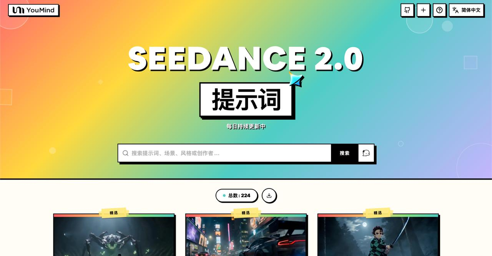

[](README.md) [](README_zh.md) [](README_zh-TW.md) [](README_ja-JP.md) [](README_ko-KR.md) [](README_th-TH.md) [](README_vi-VN.md) [](README_hi-IN.md) [](README_es-ES.md) [-Click%20to%20View-lightgrey)](README_es-419.md) [](README_de-DE.md) [](README_fr-FR.md) [](README_it-IT.md) [-Click%20to%20View-lightgrey)](README_pt-BR.md) [](README_pt-PT.md) [](README_tr-TR.md)

---

# 🎬 Seedance 2.0 視頻提示詞大全

[](https://awesome.re)
[](https://github.com/YouMind-OpenLab/awesome-seedance-2-0-prompts)
[](https://creativecommons.org/licenses/by/4.0/)
[](https://github.com/YouMind-OpenLab/awesome-seedance-2-0-prompts/pulls)

字節跳動 Seedance 2.0 高質量視頻生成提示詞精選集合

> ⚠️ **版權聲明**：所有提示詞均收集自社區，僅供教育目的使用。如果您認為任何內容侵犯了您的權利，請[提交 issue](https://github.com/YouMind-OpenLab/awesome-seedance-2-0-prompts/issues/new)，我們將立即移除。

---

## 📖 目錄

- [🌐 在網頁畫廊中查看](#-)
- [🤔 什麼是 Seedance 2.0？](#--seedance-20)
- [📊 統計數據](#-)
- [⭐ 精選提示詞](#-)
- [🎬 所有提示詞](#-)
- [🤝 如何貢獻](#-)
- [📄 許可證](#-)
- [🙏 致謝](#-)
- [⭐ Star 歷史](#-star-)

---

## 🌐 在網頁畫廊中查看

<div align="center">



</div>

**[👉 在 YouMind 瀏覽所有 Seedance 2.0 提示詞](https://youmind.com/zh-TW/seedance-2-0-prompts)**

為什麼使用畫廊？

| Feature | GitHub README | youmind.com 畫廊 |
|---------|--------------|---------------------|
| 🎬 視頻播放 | ❌ 僅靜態縮略圖 | ✅ 完整視頻流暢播放 |
| 🔍 搜索 | 僅 Ctrl+F | 多字段模糊匹配搜索 |
| 🤖 AI 推薦 | - | AI 智能提示詞推薦 |
| 📱 移動端 | 基礎 | 完全響應式 |

---

## 🤔 什麼是 Seedance 2.0？

**Seedance 2.0** 是**字節跳動**開發的視頻生成模型，是業內首個支持**四模態同時輸入**的模型——圖片、視頻、音頻和文本。

**Key Features:**
- 🎥 **文本生成視頻** — 根據文字描述生成視頻
- 🖼️ **圖片生成視頻** — 將靜態圖片動畫化為動態視頻
- 📹 **視頻轉視頻** — 轉換和擴展現有視頻
- 🎵 **音頻驅動** — 通過音頻輸入驅動視頻生成
- 📐 **最高 1080p 分辨率**，4-15 秒時長
- 🔊 **自動配音配樂** — 自動旁白和背景音樂

---

## 📊 統計數據

| 指標 | 數量 |
|--------|-------|
| 📝 提示詞總數 | **190** |
| ⭐ 精選提示詞 | **3** |
| 🔄 最後更新 | **2026-02-13** |

---

## ⭐ 精選提示詞

> 精心挑選的高品質提示詞

### 東京擎天柱大戰哥吉拉


> 一段由 Seedance 2.0 生成的 CGI 影片描述，呈現一輛豪華轎車變形成柯博文，在下著雨的東京夜晚背景下，與哥吉拉展開激戰，伴隨著爆炸和能量衝擊。

#### 📝 提示詞

```
一輛豪華轎車變身為柯博文，與哥吉拉在下著雨的東京夜晚背景下激戰，爆發出爆炸和能量衝擊波。
```

<a href="https://github.com/YouMind-OpenLab/awesome-seedance-2-prompts/releases/download/videos/210.mp4"></a>

📥 *點擊圖片下載視頻*

**作者:** [HopefulofNFTs](https://x.com/HopefulofNFTs) | **來源:** [Link](https://x.com/HopefulofNFTs/status/2021822131143635160) | **發布時間:** Feb 12, 2026

**[🎬 觀看視頻 →](https://youmind.com/zh-TW/seedance-2-0-prompts?id=210)**

---
### 超現實戰場浪人動作場景


> 一個高度細緻、多鏡頭的 Seedance 2.0 提示，描述了一個超現實、高動作的空中戰場場景，其中一名戴面具的浪人被一隻胸部為風暴雲漩渦的巨大有翼野獸追逐。此提示包含特定的攝影機運動、技術細節（720p、16:9、15 秒）以及戲劇性的結局。

#### 📝 提示詞

```
空中超現實的戰場：漂浮的岩石島嶼在雷暴中飄移，下方雲層如海洋般翻騰。蒙面浪人奔馳於漂浮的平台之間，身後緊追著一頭巨大的有翼野獸，其胸膛是風暴雲和閃電組成的漩渦。攝影機在島嶼間飛速穿梭，努力跟上傾斜、旋轉並崩解的岩石。每一次振翅都向空氣中發出衝擊波，震動畫面，將碎屑和雨水直接吹向觀眾的臉龐。快速的手持剪輯捕捉到浪人跳過不可能的間隙，劍光劃出弧線，短暫地劃破黑暗。結尾鏡頭顯示攝影機在他跳下最後一塊崩塌的岩石時，從他身後俯衝而下，他騎著一道閃電直接衝入怪物的胸膛漩渦，發出最後一擊，孤注一擲地從內部引爆風暴，並在耀眼的閃光中清空天空。

720p
16:9
15 秒
```

<a href="https://github.com/YouMind-OpenLab/awesome-seedance-2-prompts/releases/download/videos/133.mp4"></a>

📥 *點擊圖片下載視頻*

**作者:** [Dheepan Ratnam](https://x.com/Dheepanratnam) | **來源:** [Link](https://x.com/Dheepanratnam/status/2021689626092589532) | **發布時間:** Feb 11, 2026

**[🎬 觀看視頻 →](https://youmind.com/zh-TW/seedance-2-0-prompts?id=133)**

---
### 《鬼滅之刃》真人戰鬥提示詞，適用於 Seedance 2.0


> 一個詳細且充滿活力的影片提示，用於 Seedance 2.0，生成一個 15 秒的《鬼滅之刃》風格戰鬥（水之呼吸 vs. 雷之呼吸）真人改編影片。該提示指定了風格（好萊塢真人漫畫改編、黑暗武士、4K、極端快速剪輯、粒子光效）、場景（夜晚迷霧森林），以及三個詳細描述角色動作、能力提升序列和最終衝突的獨特鏡頭。

#### 📝 提示詞

```
真人版漫畫改編 · 呼吸法對決（15 秒 · 超燃特效版）
【核心看點】：水之呼吸（藍色水龍）VS 雷之呼吸（金色閃電），真人極速對決。
【風格】：好萊塢真人版漫畫改編電影質感，暗黑武士風，4K 超清，極致快剪，粒子光效炸裂，無血腥。
【時長】：15 秒
【場景】：月光下的迷霧森林，泥濘地面，落葉紛飛。
[00:00-00:05] 鏡頭 1：水之樂章 · 序式（蓄力感）
畫面：一位身穿綠黑格紋羽織（外套）的年輕武士，在月光下沉下重心，雙手握刀。
動作：他深吸一口氣，周圍空氣瞬間凝固。拔刀出鞘之際，一條由高壓水流凝聚而成的巨大藍色水龍憑空出現，圍繞著他的身體和刀刃高速旋轉，發出流水咆哮聲。
特效細節：水流具有真實的飛濺感，照亮了黑暗的森林。
[00:05-00:10] 鏡頭 2：雷之閃光 · 進擊（極速感）
畫面：對面，一位身穿黃色三角紋羽織的金髮劍士，身體壓得極低，擺出居合術（拔刀術）的架勢。
動作：地面驟然炸裂。他整個人瞬間化作一道炫目的金色閃電殘影，以肉眼難以捕捉的速度，呈「Z」字形在樹林中快速折射推進。
特效細節：他所經過之處，留下金色電弧和焦黑的落葉。
[00:10-00:15] 鏡頭 3：水雷相撞 · 終響（絕招對轟）
畫面：極速正面對撞。年輕武士揮舞著巨大藍色水龍迎擊，化身閃電的金髮劍士猛烈撞擊而來。
動作：兩把刀在畫面中央劇烈碰撞。
特效奇觀：藍色水龍與金色閃電瞬間炸裂，形成一股巨大的水雷能量風暴向外擴散。周圍的參天大樹被能量波攔腰折斷，泥土、水花和光線遮蔽了鏡頭。畫面在極致炫目的藍、黃、白光中結束。
```

<a href="https://github.com/YouMind-OpenLab/awesome-seedance-2-prompts/releases/download/videos/189.mp4"></a>

📥 *點擊圖片下載視頻*

**作者:** [John](https://x.com/johnAGI168) | **來源:** [Link](https://x.com/johnAGI168/status/2021610292979876208) | **發布時間:** Feb 11, 2026

**[🎬 觀看視頻 →](https://youmind.com/zh-TW/seedance-2-0-prompts?id=189)**

---
## 🎬 所有提示詞

> 📝 按發布日期排序（最新優先）

### 多場景電影級戰鬥提示（孫悟空 對 祖國人）


> 一個詳細的多場景提示，旨在利用 Seedance 2.0 生成孫悟空與護國超人之間的電影級戰鬥序列，其中包含每個 4 秒場景的攝影機運動、氛圍、動作和視覺效果，並輔以音樂提示。

#### 📝 提示詞

```
場景 1 伴奏音樂：「孫悟空站在城鎮屋頂，揮舞著金箍棒，長袍隨風飄揚。城市燈光照亮夜晚，營造出電影般的史詩感。鏡頭緩慢拉近畫面，4 秒。」場景 2 伴奏音樂：「護國超人從天而降，雙眼閃爍著紅色雷射光。烏雲翻騰，超級英雄電影風格，慢動作，4 秒。」場景 3 伴奏音樂：「孫悟空高速攻擊護國超人，揮舞著金箍棒。空氣震動，動作電影效果，動態模糊效果，慢動作，4 秒。」場景 4 伴奏音樂：「護國超人發射紅色雷射，與金箍棒的能量碰撞。天空爆炸，雲層撕裂，科幻電影風格，強烈光效，4 秒。」場景 5：「兩人漂浮在空中，彼此對峙，能量漣漪擴散。史詩般的結尾場景，廣角，電影構圖，4 秒。」
```

<a href="https://github.com/YouMind-OpenLab/awesome-seedance-2-prompts/releases/download/videos/291.mp4"></a>

📥 *點擊圖片下載視頻*

**作者:** [chimi チミワウ](https://x.com/chimiwaw) | **來源:** [Link](https://x.com/chimiwaw/status/2022091833632076051) | **發布時間:** Feb 12, 2026

**[🎬 觀看視頻 →](https://youmind.com/zh-TW/seedance-2-0-prompts?id=291)**

---
### 《美少女戰士》對話場景


> 一個詳細的對話式提示，用於生成一個包含月光仙子、愛野美奈子和木野真琴的場景，包括具體的動作和對話。

#### 📝 提示詞

```
月光仙子跳到床上，尖叫著說：「姐妹們，我們做到了！」金星仙子出現並說：「有多少個？6 個？7 個？」木星仙子笑著說：「6 個 7 個！」
```

<a href="https://github.com/YouMind-OpenLab/awesome-seedance-2-prompts/releases/download/videos/270.mp4"></a>

📥 *點擊圖片下載視頻*

**作者:** [BigMotion.ai](https://x.com/BigMotion_ai) | **來源:** [Link](https://x.com/BigMotion_ai/status/2022090726511980552) | **發布時間:** Feb 12, 2026

**[🎬 觀看視頻 →](https://youmind.com/zh-TW/seedance-2-0-prompts?id=270)**

---
### 吳宇森風格槍戰場景提示


> 一個使用 Seedance 2.0 產生吳宇森風格槍戰場景的提示，場景設定在狹窄空間，強調電影節奏、不同攝影機角度，並使用特定的角色參考圖像。

#### 📝 提示詞

```
這是一個吳宇森風格的街頭槍戰動作場面。根據場景圖片 3，請以寫實風格，在狹窄空間中呈現穿著白色西裝的男子「圖片 1」與穿著花襯衫的男子「圖片 2」之間流暢的槍戰序列。此序列需運用分鏡和不同視角切換，以賦予整個場景更豐富的節奏感和電影感。
```

<a href="https://github.com/YouMind-OpenLab/awesome-seedance-2-prompts/releases/download/videos/277.mp4"></a>

📥 *點擊圖片下載視頻*

**作者:** [John](https://x.com/john87445528) | **來源:** [Link](https://x.com/john87445528/status/2022066865296601311) | **發布時間:** Feb 12, 2026

**[🎬 觀看視頻 →](https://youmind.com/zh-TW/seedance-2-0-prompts?id=277)**

---
### 武俠劍客對決提示


> 一個為 Seedance 2.0 設計的超詳細電影式提示，描述了一部武俠風格的視聽大片，內容為兩名劍客在竹林中決鬥，著重於攝影機運動、氛圍以及打鬥時的超慢動作效果。

#### 📝 提示詞

```
一部武俠風格的視聽鉅作。一名白衣劍客與一名戴著斗笠的刀客在竹林中對峙。鏡頭緩緩推近兩人之間，焦點在雨滴和劍柄之間切換。氣氛極度壓抑，只能聽到雨聲。突然，一道閃電劃破天際，兩人同時衝向對方。一個快速搖攝的側面鏡頭捕捉到他們濺起泥濘的腳步。當他們的武器交鋒的精確瞬間，畫面切換到超慢動作，清晰地展示了雨水被刀鋒震開的環狀衝擊波，以及被劍氣切開的竹葉。當他們背對背落地時，畫面恢復正常速度。戴著斗笠的刀客的竹帽裂開，場景戛然而止。
```

<a href="https://github.com/YouMind-OpenLab/awesome-seedance-2-prompts/releases/download/videos/258.mp4"></a>

📥 *點擊圖片下載視頻*

**作者:** [Jay Sensei👾](https://x.com/hckinz) | **來源:** [Link](https://x.com/hckinz/status/2022062799732777214) | **發布時間:** Feb 12, 2026

**[🎬 觀看視頻 →](https://youmind.com/zh-TW/seedance-2-0-prompts?id=258)**

---
### Mad Max 疏散故事提示


> 為 Seedance 2.0 撰寫的提示，要求製作一部多鏡頭、高動作的史詩影片，內容關於一場出埃及記的故事，風格仿照《瘋狂麥斯》系列。

#### 📝 提示詞

```
一部多鏡頭、高動作的史詩級影片，講述《瘋狂麥斯》風格的逃亡故事。
```

<a href="https://github.com/YouMind-OpenLab/awesome-seedance-2-prompts/releases/download/videos/260.mp4"></a>

📥 *點擊圖片下載視頻*

**作者:** [Dana Akerman Green](https://x.com/DanaGreenAI) | **來源:** [Link](https://x.com/DanaGreenAI/status/2022060390411383290) | **發布時間:** Feb 12, 2026

**[🎬 觀看視頻 →](https://youmind.com/zh-TW/seedance-2-0-prompts?id=260)**

---
### 特務電影打鬥場景提示


> Seedance 2.0 的單一提示，生成一個穿綠色西裝的男人和穿黑色西裝的男人之間的間諜電影打鬥場景，並帶有幽默的結局。

#### 📝 提示詞

```
穿著綠色西裝、印有標誌的男子與穿著黑色西裝的男子打鬥，風格類似間諜電影，最後一名 X 戰警被打倒在地，尖叫著「伊隆！」
```

<a href="https://github.com/YouMind-OpenLab/awesome-seedance-2-prompts/releases/download/videos/293.mp4"></a>

📥 *點擊圖片下載視頻*

**作者:** [Restlessperson ](https://x.com/Restlessperson1) | **來源:** [Link](https://x.com/Restlessperson1/status/2022059501348856015) | **發布時間:** Feb 12, 2026

**[🎬 觀看視頻 →](https://youmind.com/zh-TW/seedance-2-0-prompts?id=293)**

---
### 文字轉影片提示：古裝刑場復仇場景


> 一個詳細的文字轉影片提示，用於生成一個設定在古代刑場的電影場景，重點在於雪、血和極度寒冷的視覺元素，適合戲劇性的復仇敘事。

#### 📝 提示詞

```
古裝刑場/血淚復仇
鏡頭 11 特寫 • 雪花夾雜著血水，落在刑場冰冷的石面上。血水瞬間凝結，雪花層層覆蓋，隨後又被新流出的血珠浸透，暈開暗紫色的痕跡。寒意刺骨。
```

<a href="https://github.com/YouMind-OpenLab/awesome-seedance-2-prompts/releases/download/videos/282.mp4"></a>

📥 *點擊圖片下載視頻*

**作者:** [Ken W](https://x.com/kenw_2) | **來源:** [Link](https://x.com/kenw_2/status/2022045055716929675) | **發布時間:** Feb 12, 2026

**[🎬 觀看視頻 →](https://youmind.com/zh-TW/seedance-2-0-prompts?id=282)**

---
### 賀錦麗對川普之戰，由湯姆和約翰·維克提示


> 有用戶嘗試使用 Seedance 2.0 生成賀錦麗（Kamala Harris）和唐納·川普（Donald Trump）之間的打鬥場景，這可能是改編自最初為湯姆·克魯斯（Tom Cruise）和約翰·維克（John Wick）（或類似動作角色）設計的提示。

#### 📝 提示詞

```
賀錦麗與川普之戰，使用相同的 Tom 和 John Wick 提示。
```

<a href="https://github.com/YouMind-OpenLab/awesome-seedance-2-prompts/releases/download/videos/247.mp4"></a>

📥 *點擊圖片下載視頻*

**作者:** [X Citizen Journal](https://x.com/xcitizenjournal) | **來源:** [Link](https://x.com/xcitizenjournal/status/2022036097984090611) | **發布時間:** Feb 12, 2026

**[🎬 觀看視頻 →](https://youmind.com/zh-TW/seedance-2-0-prompts?id=247)**

---
### 甜點店裡的 360 度全景自拍


> 使用 Seedance 2.0 的單一提示，即可生成一段動態影片，內容包括在甜點店內以 360 度全景相機自拍，隨後一名女子在不同場景和服裝中擺姿勢。

#### 📝 提示詞

```
360 度全景相機自拍。相機逆時針旋轉，捕捉甜點店的內部。然後展示一位女士在不同場景中擺姿勢，穿著不同的服裝並使用不同的道具。
```

<a href="https://github.com/YouMind-OpenLab/awesome-seedance-2-prompts/releases/download/videos/246.mp4"></a>

📥 *點擊圖片下載視頻*

**作者:** [nachos2d](https://x.com/NACHOS2D_) | **來源:** [Link](https://x.com/NACHOS2D_/status/2022003177369776414) | **發布時間:** Feb 12, 2026

**[🎬 觀看視頻 →](https://youmind.com/zh-TW/seedance-2-0-prompts?id=246)**

---
### Grok Imagine 圖像轉影片提示


> 一個用於 Grok Imagine 1.0 的詳細圖像轉影片提示，旨在生成印尼女性與 Elon Musk 之間殘酷打鬥場景，強調動態動作、高電影品質和一致性。

#### 📝 提示詞

```
女性與 Elon Musk 的殘酷搏鬥，展現優美的踢拳風格，以及致命的踢擊。動感十足。無瑕疵。由 Arri Alexa 拍攝。無 3D。無 CGI。無對白。角色和環境一致。《突襲》殘酷搏鬥電影風格（動態手持攝影機運鏡）。
```

<a href="https://github.com/YouMind-OpenLab/awesome-seedance-2-prompts/releases/download/videos/262.mp4"></a>

📥 *點擊圖片下載視頻*

**作者:** [Apil](https://x.com/apilpirman) | **來源:** [Link](https://x.com/apilpirman/status/2021988787501592737) | **發布時間:** Feb 12, 2026

**[🎬 觀看視頻 →](https://youmind.com/zh-TW/seedance-2-0-prompts?id=262)**

---
### 真人版七龍珠戰鬥提示


> 一個給 Seedance 2.0 的提示，用於生成悟空和貝吉達以超級賽亞人藍形態進行《七龍珠 Z》戰鬥的真人場景。

#### 📝 提示詞

```
悟空與貝吉塔的真人版賽亞人戰鬥，超級賽亞人藍
```

<a href="https://github.com/YouMind-OpenLab/awesome-seedance-2-prompts/releases/download/videos/259.mp4"></a>

📥 *點擊圖片下載視頻*

**作者:** [Mark Gadala-Maria](https://x.com/markgadala) | **來源:** [Link](https://x.com/markgadala/status/2021985063840403880) | **發布時間:** Feb 12, 2026

**[🎬 觀看視頻 →](https://youmind.com/zh-TW/seedance-2-0-prompts?id=259)**

---
### 1980 年代吸血鬼訪談提示


> 一個詳細的提示，用於生成一段吸血鬼訪談影片，場景設定在 1980 年代的電視攝影棚，著重於特定的角色描述、對話、復古美學和電影級燈光。

#### 📝 提示詞

```
1980 年代電視攝影棚訪談，一位金髮長髮、穿著低胸洋裝的女記者問吸血鬼：「在節目結束前，德古拉伯爵，您還有什麼想說的嗎？」，穿著西裝的優雅吸血鬼前傾說道：「妳的脖子真美」，她緊張地笑了笑，露出大蒜和十字架，吸血鬼嗤之以鼻地說：「那些都是老舊的迷信，對我毫無作用」，復古的 80 年代電視機搭配老式攝影機，溫暖的攝影棚燈光，脫口秀氛圍，電影感。
```

<a href="https://github.com/YouMind-OpenLab/awesome-seedance-2-prompts/releases/download/videos/254.mp4"></a>

📥 *點擊圖片下載視頻*

**作者:** [Shira Wiggles](https://x.com/ImperfectEngel) | **來源:** [Link](https://x.com/ImperfectEngel/status/2021977382781927821) | **發布時間:** Feb 12, 2026

**[🎬 觀看視頻 →](https://youmind.com/zh-TW/seedance-2-0-prompts?id=254)**

---
### 快節奏動作場景提示


> Seedance 2.0 的提示，指示生成一場快節奏、殘酷的三方打鬥場景，主角為約翰·維克（John Wick）、詹姆士·龐德（James Bond，007）和另一位未命名角色，並限制不得上傳真實人臉。

#### 📝 提示詞

```
一場快節奏的打鬥場景：約翰·維克 (John Wick) 與詹姆士·龐德 (James Bond) (007) 和另一名男子——一場三人殘酷對決。
```

<a href="https://github.com/YouMind-OpenLab/awesome-seedance-2-prompts/releases/download/videos/295.mp4"></a>

📥 *點擊圖片下載視頻*

**作者:** [Chraft](https://x.com/chraft_ai) | **來源:** [Link](https://x.com/chraft_ai/status/2021971858409832507) | **發布時間:** Feb 12, 2026

**[🎬 觀看視頻 →](https://youmind.com/zh-TW/seedance-2-0-prompts?id=295)**

---
### 暗黑奇幻女性圖像影片提示


> 一個用於 Seedance 2.0（已整合至豆包）的提示，旨在生成一段影片，內容為一位空靈的暗黑奇幻女性角色。該提示詳細描述了她的外觀，包括飄逸的頭髮、複雜的金屬皇冠、發光的蒼白皮膚，以及轉化為反光液態金屬的四肢，置身於戲劇性、冷藍色的電影氛圍中。

#### 📝 提示詞

```
一位空靈的暗黑奇幻女性人物，長髮飄逸，頭戴複雜的金屬皇冠，皇冠上帶有尖銳的鹿角狀尖刺，雙眼緊閉，神情安詳，蒼白的肌膚散發著柔和的光芒。她的前臂和軀幹轉化為光滑的黑色液態金屬，帶有反光的鍍鉻細節，鋒利的爪狀手指從黑暗中延伸而出。戲劇性的背光在她頭部周圍營造出光環效果，瀰漫著冰冷的藍色薄霧氛圍，電影般的燈光，細節豐富，超現實而優雅，呈現出暗黑奇幻美學。
```

<a href="https://github.com/YouMind-OpenLab/awesome-seedance-2-prompts/releases/download/videos/284.mp4"></a>

📥 *點擊圖片下載視頻*

**作者:** [惜命少女阿昕要出海~](https://x.com/MRongxin7589) | **來源:** [Link](https://x.com/MRongxin7589/status/2021952831398559882) | **發布時間:** Feb 12, 2026

**[🎬 觀看視頻 →](https://youmind.com/zh-TW/seedance-2-0-prompts?id=284)**

---
### 布萊德·彼特與湯姆·克魯斯打鬥場景


> 一位用戶測試了 Seedance 2.0，生成了一段布萊德·彼特 (Brad Pitt) 和湯姆·克魯斯 (Tom Cruise) 之間的打鬥場景，他們的對話圍繞著愛潑斯坦 (Epstein) 檔案展開。

#### 📝 提示詞

```
請生成一段布萊德·彼特（Brad Pitt）和湯姆·克魯斯（Tom Cruise）之間的打鬥場景，打鬥期間他們的對話圍繞著愛潑斯坦（Epstein）檔案展開。
```

<a href="https://github.com/YouMind-OpenLab/awesome-seedance-2-prompts/releases/download/videos/249.mp4"></a>

📥 *點擊圖片下載視頻*

**作者:** [China pulse 🇨🇳](https://x.com/Eng_china5) | **來源:** [Link](https://x.com/Eng_china5/status/2021949493374259431) | **發布時間:** Feb 12, 2026

**[🎬 觀看視頻 →](https://youmind.com/zh-TW/seedance-2-0-prompts?id=249)**

---
### Seedance 2.0 擬人化浪漫故事


> 一個用於 Seedance 2.0 的提示，使用可愛的寵物圖片來生成一個關於霸道總裁愛上清潔女工的故事，其中包含擬人化的站立姿勢。

#### 📝 提示詞

```
使用可愛的寵物圖片，以擬人化的站立姿勢，講述一個霸道總裁愛上清潔女工的故事。
```

<a href="https://github.com/YouMind-OpenLab/awesome-seedance-2-prompts/releases/download/videos/292.mp4"></a>

📥 *點擊圖片下載視頻*

**作者:** [Rayko_Zopia](https://x.com/Fox1251104) | **來源:** [Link](https://x.com/Fox1251104/status/2021949028481843527) | **發布時間:** Feb 12, 2026

**[🎬 觀看視頻 →](https://youmind.com/zh-TW/seedance-2-0-prompts?id=292)**

---
### 多鏡頭生物競賽場景


> 一個提示，透過要求一個多鏡頭賽車場景來測試 Seedance 2.0 的極限，場景中有一隻生物在未來城市中極速行駛，需要從戲劇性角度進行四次場景剪輯變換。

#### 📝 提示詞

```
一隻生物正以極快的速度穿越未來城市，四個場景鏡頭從戲劇性的角度切換
```

<a href="https://github.com/YouMind-OpenLab/awesome-seedance-2-prompts/releases/download/videos/250.mp4"></a>

📥 *點擊圖片下載視頻*

**作者:** [Dheepan Ratnam](https://x.com/Dheepanratnam) | **來源:** [Link](https://x.com/Dheepanratnam/status/2021943401198104904) | **發布時間:** Feb 12, 2026

**[🎬 觀看視頻 →](https://youmind.com/zh-TW/seedance-2-0-prompts?id=250)**

---
### 華人成功研討會（心靈雞湯）影片提示


> 一個高度詳細的三鏡頭提示，用於 Seedance 2.0 生成一個 15 秒的影片，模仿狂熱、洗腦式的中國成功學研討會風格。該提示指定了風格（晃動的手持攝影機、溫暖的舞台燈光、巨大的金色 PPT 文字）、角色（一位汗流浹背、表情嚴肅的中年「大師」），以及三個戲劇性的場景，包括大聲喊叫、來回踱步和高潮時的跪姿。

#### 📝 提示詞

```
[風格] 中式成功學講座，瘋狂洗腦風，情緒爆炸，手持鏡頭晃動，舞台聚光燈暖色調，背景是巨大燙金 PPT。
[時長] 15 秒
[人物] 大師：中年男性，油頭，新郎裝（緊身西服），戴耳麥，汗流浹背，頸部青筋暴起。
[場景] 千人酒店會場，台下座無虛席。

[00:00-00:05] 鏡頭 1：靈魂拷問（The Question）。
特寫/懟臉拍。大師面目猙獰，手指幾乎戳到鏡頭，口沫橫飛。
動作：他猛地扯下領帶，雙目圓睜，死死盯著你。
[台詞/咆哮]：「你告訴我！你甘心嗎？你甘心一輩子，就拿著三千塊錢的死工資嗎？你回答我！！」

[00:05-00:10] 鏡頭 2：底層邏輯（The Logic）。
中景/舞台踱步。大師在舞台上瘋狂踱步，雙臂揮舞，狀若指揮千軍萬馬。
背景：PPT 上顯示巨大紅色字體：「狼性！認知！裂變！」
[台詞/嘶吼]：「窮人洗澡，富人洗腦！你為什麼不成功？因為你腦子裡裝的都是垃圾！斷掉你的退路！！」

[00:10-00:15] 鏡頭 3：高潮收割（The Climax）。
全景/慢鏡頭上搖。大師突然單膝跪地，雙手高舉向天，BGM 激情爆炸。
觀眾：瘋狂起立，鼓掌，甚至有人熱淚盈眶。
[台詞/金句]：「今晚，讓我們一起，改寫命運！想致富，先脫褲（意指，走出舒適圈）！聽懂的，掌聲！！！」
```

<a href="https://github.com/YouMind-OpenLab/awesome-seedance-2-prompts/releases/download/videos/285.mp4"></a>

📥 *點擊圖片下載視頻*

**作者:** [John](https://x.com/johnAGI168) | **來源:** [Link](https://x.com/johnAGI168/status/2021938129821663469) | **發布時間:** Feb 12, 2026

**[🎬 觀看視頻 →](https://youmind.com/zh-TW/seedance-2-0-prompts?id=285)**

---
### 未來汽車廣告提示（Y - 駕馭未來）


> 為一輛未來派車輛「Y」製作一個 15 秒好萊塢風格廣告的詳細多鏡頭提示，內容包括在賽博龐克、下雨的夜晚場景中，從地面交通轉換為垂直飛行的變形序列。

#### 📝 提示詞

```
Brand Y · 未來已至 (15 秒 · 好萊塢大片廣告版)
核心概念
地面擁堵 (現狀困境) -> 機械變形 (科技亮點) -> 垂直起降 (自由與未來)。

風格設定
高端汽車廣告質感。賽博龐克未來都市，冰冷雨夜，霓虹光影。8K 超清，變形金剛級機械細節，極速流線感。

場景分解
鏡頭 1：地面困境
畫面：特寫。一輛流線感十足的銀色超級跑車「Y」靜止在擁堵的霓虹雨夜街道上。雨水滑過其光滑的漆面，映照著紅色尾燈。
細節：車頭簡約的「Y」發光 Logo 輕微閃爍，如同呼吸燈。周圍喇叭聲嘈雜，主角 (汽車) 顯得沉穩優雅。
鏡頭 2：機械覺醒
畫面：極致微距特寫。
動作：駕駛模式切換。車輪內部傳來精密的機械嚙合聲，輪胎向下翻轉 90 度，內部推進器顯露。
特效：空靈的藍色電漿推進器瞬間點燃，將路面雨水蒸發成白色霧氣。車身在圍觀者的驚嘆聲中平穩垂直懸浮。
鏡頭 3：翱翔未來
畫面：廣角跟隨鏡頭。
動作：靜止狀態下的瞬間加速。汽車「Y」化作一道銀色閃電，垂直拉升，穿梭於摩天大樓之間，將下方紅色車流甩在身後。
結尾定格：車身飛向一輪巨大的滿月，畫面中央浮現銀色金屬質感 3D Logo：「Y - Drive the Future」。
```

<a href="https://github.com/YouMind-OpenLab/awesome-seedance-2-prompts/releases/download/videos/278.mp4"></a>

📥 *點擊圖片下載視頻*

**作者:** [John](https://x.com/johnAGI168) | **來源:** [Link](https://x.com/johnAGI168/status/2021928568272412985) | **發布時間:** Feb 12, 2026

**[🎬 觀看視頻 →](https://youmind.com/zh-TW/seedance-2-0-prompts?id=278)**

---
### 大時代 90 年代港劇風格影片提示


> 一個為 Seedance 2.0 設計的詳細多鏡頭提示，旨在生成一段模仿 1990 年代香港電視劇《大時代》那種緊張、宿命風格的影片。它指定了視覺風格（復古膠片顆粒、溫暖的黃色調、高對比度）、場景（1990 年代香港證券交易所）、角色（一位瘋狂的投機者），以及三個獨特、情感豐富的鏡頭，每個鏡頭都包含特定的動作、對白和氛圍。

#### 📝 提示詞

```
[風格]
90 年代港劇風格、復古膠片顆粒、高對比暖黃色調、廣角鏡頭誇張透視、極度歇斯底里的情緒、混亂、嘈雜、絕望。

[場景]
1990 年代香港證券交易所大廳，地板上滿是廢棄紙張，電子螢幕顯示著令人沮喪的綠色（港股下跌為綠色/或使用紅色表示危機，取決於生成模型的理解，建議寫「暴跌的數字」）。

[人物]
投機者：身穿 90 年代寬肩灰色西裝，頭髮凌亂，渾身是汗，雙眼充血，神情狂亂，緊握「大哥大」。

[鏡頭細節]
[00:00-00:05] 鏡頭 1：大崩盤 - 瘋狂時刻
視覺：臉部廣角特寫。主角站在交易大廳中央，周圍是模糊奔跑尖叫的人群。
動作：他對著「大哥大」歇斯底里地咆哮，青筋暴起，口沫橫飛。
[對白/字幕]：「不要怕！技術性調整！再給我加槓桿！」（瘋狂至極）。
氛圍：背景電子顯示屏上的數字瘋狂閃爍，紅綠燈光交織，營造出令人窒息的緊迫感。

[00:05-00:10] 鏡頭 2：一瞬間 - 天台上的風
視覺：跳接。鏡頭突然切換到空無一人的摩天大樓天台邊緣。
動作：主角背對鏡頭，西裝外套被扔在一旁，領帶鬆散。狂風吹亂了他的頭髮和襯衫。他緊握著一張揉皺的股票憑證，身體搖搖欲墜。
氛圍：從極度嘈雜瞬間轉變為死寂，只剩下呼嘯的風聲。

[00:05-00:15] 鏡頭 3：一場夢 - 紙雪
視覺：低角度拍攝。
動作：主角鬆手，無數白色股票廢紙如雪般從天台飄落，散落在繁華卻冷漠的中環街道上。
特寫：鏡頭最終聚焦在他絕望、空洞的雙眼（瞳孔失去光澤），一滴悔恨的淚水劃過臉頰。
[字幕（黃色復古字體）]：股市有風險，入市需謹慎。
```

<a href="https://github.com/YouMind-OpenLab/awesome-seedance-2-prompts/releases/download/videos/286.mp4"></a>

📥 *點擊圖片下載視頻*

**作者:** [John](https://x.com/johnAGI168) | **來源:** [Link](https://x.com/johnAGI168/status/2021919778667999639) | **發布時間:** Feb 12, 2026

**[🎬 觀看視頻 →](https://youmind.com/zh-TW/seedance-2-0-prompts?id=286)**

---
### 三則短劇提示（現代愛情/衝突）


> 以下是三段針對 Seedance 2.0 設計的 15 秒短劇提示，涵蓋了不同的浪漫/衝突情境：「霸道總裁的虐戀」、「校園暗戀告白」和「閨蜜的背叛」，每段都包含具體的場景分解和情感起伏。

#### 📝 提示詞

```
主題：年輕俊男美女的經典對峙 · 現代短劇
時長：15 秒
畫面比例：16:9
---
版本 1：霸道總裁的虐戀 · 誤會與分手（虐心拉扯）

Seedance 2.0 提示詞

15 秒現代短劇，奢華總裁辦公室場景，冷色調高級感。0-3 秒：中景，年輕男子身穿訂製西裝，坐在真皮老闆椅上，臉色冰冷，眼神淡漠。他面前站著一位身穿白裙的美麗女孩，雙眼泛紅，淚水在眼眶打轉。男子低沉冰冷地說：「我給過你機會。」；4-8 秒：女孩聲音顫抖：「你給過我什麼機會？你從一開始就沒信任過我！」她轉身欲走，男子卻突然起身，一把抓住她的手腕。鏡頭跟隨拉扯，女孩被迫轉回身，兩人距離極近，呼吸可聞。女孩眼中閃過一絲不捨，但很快被倔強取代；9-12 秒：男子凝視女孩雙眼，聲音低沉：「現在你還要走嗎？」女孩咬著嘴唇：「走……我還能去哪？」她用力甩開男子的手，轉身跑開。男子伸手欲抓，卻只抓到空氣，手僵在半空中；13-15 秒：鏡頭跟隨女孩衝出辦公室。她在電梯前擦拭眼淚，但淚水卻止不住地流。電梯門緩緩關閉的瞬間，她蹲下身，抱頭痛哭。畫面最終定格在電梯數字從 15 緩慢下降的特寫，伴隨著低沉悲傷的鋼琴 BGM。

---
版本 2：校花追愛 · 雨中告白（甜虐青春）

Seedance 2.0 提示詞

15 秒現代校園短劇，雨夜教室走廊場景，冷藍色雨夜氛圍。0-3 秒：固定機位，教室外大雨滂沱，雨點敲打著窗玻璃，一位身穿白襯衫的帥氣男生站在走廊陰影處，手裡拿著一封粉色信件，焦躁地來回踱步。一位紮著高馬尾的美麗女孩緩緩走向他，鏡頭隨著女孩每一步輕微晃動，營造緊張感；4-8 秒：女孩走到男生面前。男生深吸一口氣，幾次舉手想遞出信件卻又縮回。女孩停在男生面前，歪頭一笑：「你找我嗎？」男生慌亂：「我……我……」話未說完，上課鈴聲突然響起，兩人同時一驚。走廊燈光閃爍；9-12 秒：女孩看了一眼時間：「快上課了，下次再聊吧。」轉身欲走。男生鼓起勇氣：「等等！」他一把抓住她的手腕，兩人同時僵住。走廊裡只剩下雨聲和兩人的呼吸聲。男生低頭，臉頰泛紅：「這封信……是給你的。」女孩一愣，低頭看向信件；13-15 秒：鏡頭緩緩推近，特寫女孩的臉。她嘴角慢慢漾開一抹甜美的笑容，眼中星光閃爍。畫面最終定格在她接過信件的瞬間——一束陽光突然穿透雨窗，灑在兩人身上，伴隨著輕柔的鋼琴旋律和漸弱的雨聲結束。

---
版本 3：閨蜜背叛 · 攤牌（大快人心）

Seedance 2.0 提示詞

15 秒現代短劇，高檔餐廳場景，暖金色調與冰冷情感形成對比。0-3 秒：中景固定機位，一位美麗女孩正在和朋友們慶祝生日，歡聲笑語。餐廳門突然被推開——她最信任的閨蜜挽著她的男友走了進來。所有笑聲戛然而止。女孩舉著酒杯的手僵在半空中，笑容凝固；4-8 秒：閨蜜看到女孩時表情有一瞬間不自然，她試圖拉男友去別的座位，但男友卻甩開她的手，徑直走到女孩面前，將一個禮物盒放在她面前：「生日快樂。」閨蜜臉色變得難看。女孩看著男友，再看看閨蜜，最後目光落在他們的手上——閨蜜手上戴著的，正是男友前幾天聲稱「丟失」的手鍊；9-12 秒：女孩什麼都沒說，只是默默拿起酒杯，一飲而盡。然後她起身，走到閨蜜面前。所有人都屏住呼吸。女孩微笑著，緩緩將一整瓶紅酒倒在閨蜜的限量版手提包上。閨蜜瞪大眼睛，欲尖叫，卻被女孩按住肩膀；13-15 秒：女孩湊近閨蜜耳邊，輕聲說：「下次搶別人男人，記得先把不該露出來的藏好。」閨蜜臉色煞白。女孩轉身優雅離去。鏡頭拉遠，定格在閨蜜僵硬地站在原地，男友滿臉懊悔，伴隨著低沉的 BGM 和周圍的竊竊私語結束。
```

<a href="https://github.com/YouMind-OpenLab/awesome-seedance-2-prompts/releases/download/videos/281.mp4"></a>

📥 *點擊圖片下載視頻*

**作者:** [松果先森](https://x.com/songguoxiansen) | **來源:** [Link](https://x.com/songguoxiansen/status/2021918709573652649) | **發布時間:** Feb 12, 2026

**[🎬 觀看視頻 →](https://youmind.com/zh-TW/seedance-2-0-prompts?id=281)**

---
### 駕駛艙內的高強度動作驚悚場景


> 一個詳細的提示，用於生成飛機駕駛艙內的高強度動作驚悚場景，強調電影拍攝技巧，例如晃動的鏡頭、動態模糊以及戲劇性的燈光/警報。

#### 📝 提示詞

```
高強度動作驚悚場景，手持晃動鏡頭，電影般的動態模糊，女子衝進駕駛艙，當她意識到飛行員座位空無一人時，她僵住了，警報器閃爍著紅光，亂流搖晃著機艙，她向前衝刺並將自己綁在座位上。
```

<a href="https://github.com/YouMind-OpenLab/awesome-seedance-2-prompts/releases/download/videos/267.mp4"></a>

📥 *點擊圖片下載視頻*

**作者:** [Kemal Cagin](https://x.com/kemalcse) | **來源:** [Link](https://x.com/kemalcse/status/2021903817382437323) | **發布時間:** Feb 12, 2026

**[🎬 觀看視頻 →](https://youmind.com/zh-TW/seedance-2-0-prompts?id=267)**

---
### 利維坦之喉：水下巨型結構降臨


> 一個極其細緻、電影般的 Seedance 2.0 提示，描述一名潛水員在被洪水淹沒的地下巨型建築中，被一隻巨大的無眼海怪追逐，經歷一場恐怖的下降，最終潛水員射出魚叉，衝破水面進入一片廣闊的地下海洋。

#### 📝 提示詞

```
一個被洪水淹沒的地下巨型建築，古老的石質走廊半浸在黑水中，生物發光藻類沿著牆壁像心跳般脈動著。一名戴著面具的潛水員身穿破損的戰術裝備，手腕上的閃爍照明彈照亮了他，他被一隻巨大的無眼海獸在地板格柵下移動所產生的水流，向下拖入坍塌的淹水密室中。攝影機緊隨潛水員，水流衝過破碎的石拱門，氣泡和碎片在鏡頭前盤旋。潛水員抓住一根斷裂的柱子穩住自己，水流猛烈地衝擊著她的身體，然後她放手，自由落體穿過一個垂直豎井，旋轉著躲避海獸在黑暗中向上揮舞的半透明觸手。快速晃動的畫面捕捉到她在墜落中點燃魚叉槍，照明彈照亮了下方生物張開的巨大下顎。在最後的動作中，攝影機圍繞著她向下盤旋，她將魚叉射入生物的口中，生物發光爆發出耀眼的白色光芒，攝影機衝破廣闊地下海洋的表面，潛水員的身影在教堂般大小的洞穴天花板上，數千個脈動生物的光芒映襯下，形成剪影。15 秒。
```

<a href="https://github.com/YouMind-OpenLab/awesome-seedance-2-prompts/releases/download/videos/248.mp4"></a>

📥 *點擊圖片下載視頻*

**作者:** [Dheepan Ratnam](https://x.com/Dheepanratnam) | **來源:** [Link](https://x.com/Dheepanratnam/status/2021901586889428999) | **發布時間:** Feb 12, 2026

**[🎬 觀看視頻 →](https://youmind.com/zh-TW/seedance-2-0-prompts?id=248)**

---
### 動物園裡的人與大象（老式相機風格）


> 一個用於 Seedance 2.0 的描述性提示，生成一段影片，內容為一名男子站在動物園的大象前，以模糊的舊式相機風格呈現。

#### 📝 提示詞

```
生成一段影片：一名男子站在動物園的大象前，風格為模糊的舊式相機。
```

<a href="https://github.com/YouMind-OpenLab/awesome-seedance-2-prompts/releases/download/videos/273.mp4"></a>

📥 *點擊圖片下載視頻*

**作者:** [rizzy (bulk uwuuu arc)](https://x.com/rizzy_sol) | **來源:** [Link](https://x.com/rizzy_sol/status/2021899370313232797) | **發布時間:** Feb 12, 2026

**[🎬 觀看視頻 →](https://youmind.com/zh-TW/seedance-2-0-prompts?id=273)**

---
### 蜘蛛人 對戰 八爪博士 打鬥場景提示


> 一位用戶僅使用一個簡單的提示，就生成了蜘蛛人與八爪博士之間一場精彩的戰鬥場景，展示了 Seedance 2.0 的卓越品質。

#### 📝 提示詞

```
請使用 #Seedance 2.0 創作一場蜘蛛人與八爪博士之間精彩的戰鬥場景。
```

<a href="https://github.com/YouMind-OpenLab/awesome-seedance-2-prompts/releases/download/videos/290.mp4"></a>

📥 *點擊圖片下載視頻*

**作者:** [なぁさん｜AIと働くひとり社長](https://x.com/nasan_0422) | **來源:** [Link](https://x.com/nasan_0422/status/2021856286237995387) | **發布時間:** Feb 12, 2026

**[🎬 觀看視頻 →](https://youmind.com/zh-TW/seedance-2-0-prompts?id=290)**

---
### 10 秒 MV 提示的三種風格


> 以下是三個針對 Seedance 2.0 製作的 10 秒音樂影片提示，涵蓋 K-pop、國風（中國傳統風格）和 Future Bass/賽博龐克等類型，全部著重於精準的節拍匹配和電影般的細節。

#### 📝 提示詞

```
Version 1: K-pop 女團 · 快速剪輯節奏同步 (高能量舞台)

Seedance 2.0 提示

10 秒 K-pop 女團 MV 節奏同步鏡頭，2.35:1 寬螢幕，24fps，8 個快速剪輯。0-1 秒：低角度仰視鏡頭，四位女團成員以三角形隊形站在舞台地板上，燈光隨著節拍閃爍，舞台「聽起來能感受到震動」，所有成員同時吸氣準備；2-3 秒：中心主唱特寫，嘴角和眼神處有呼吸感，頭髮輕微擺動，背景燈光從冷藍色轉為粉紫色；4-5 秒：團體編舞中景，爆發性動作，腳步聲開始出現，所有成員整齊劃一地甩髮轉身，動作流暢；6-7 秒：手部特寫，手勢帶動布料摩擦聲和飾品輕微碰撞聲，戒指在燈光下閃爍；8-9 秒：兩人側面視角，更複雜的動作，更密集的腳步，鏡頭隨著動作剪輯，兩人的手部協調精準地與節拍同步；10 秒：近景定格隊形 0.5 秒，以最後的腳步聲/衝擊結束。整體：霓虹高飽和冷暖對比，淺景深突出動作，無文字標誌水印。

---
Version 2: 古風 · 笛聲悠揚 (藝術節奏同步)

Seedance 2.0 提示

10 秒國風 MV 節奏同步鏡頭，9:16 垂直螢幕，水墨畫風格。0-2 秒：固定極遠景，一位白衣女子背對鏡頭，在竹林深處彈奏古琴，琴下緩緩升起煙霧，竹葉隨著琴聲輕微顫動；3-4 秒：鏡頭慢動作緩緩推向女子側臉，睫毛輕微顫動，嘴角含笑，琴弦在她指下振動，背景模糊；5-7 秒：女子抬頭望向鏡頭的瞬間，畫面精準地在節拍上切換——無數粉色花瓣從虛空中飄落，鏡頭緩慢 360 度旋轉，展現花瓣旋轉的驚艷場景，每一片花瓣都清晰可見；8-9 秒：鏡頭拉回極遠景，女子轉身面向鏡頭，衣袂隨風飄揚，身後竹林在夕陽下泛著金光，她輕撫古琴弦並定格；10 秒：畫面逐漸轉化為水墨效果，最終以古琴餘音和竹葉沙沙聲作結。

---
Version 3: 電子未來貝斯 · 霓虹雨夜 (賽博節奏同步)

Seedance 2.0 提示

10 秒電子未來貝斯 MV 節奏同步鏡頭，超寬螢幕，霓虹都市夜景。0-1 秒：固定鏡頭，雨夜都市濕漉漉的街道上霓虹燈光反射，賽博龐克建築倒映在水窪中，視覺節奏隨著低頻貝斯輕微晃動；2-4 秒：鏡頭沿著街道快速推進，穿過雨幕，每一滴雨水都隨著貝斯重拍飛濺，鏡頭速度隨音樂節奏波動；5-7 秒：切入角色視角，一位戴耳機的女孩在雨中跳舞，她的動作與貝斯完美同步——每個重拍時身體會定格一幀，營造出停頓感，霓虹燈在她身上形成光軌，雨滴在空中被音樂震碎；8-9 秒：鏡頭快速拉遠並向上平移，俯瞰整個霓虹街道，貝斯在雨中的視覺漣漪從街道中心向外呈圓形擴散，每個漣漪都精確對應一個重拍；10 秒：畫面在俯視視角中定格，街道景象在最後一個節拍瞬間反轉為黑白，然後淡出至全黑，以貝斯餘震和雨聲逐漸消逝作結。
```

<a href="https://github.com/YouMind-OpenLab/awesome-seedance-2-prompts/releases/download/videos/280.mp4"></a>

📥 *點擊圖片下載視頻*

**作者:** [松果先森](https://x.com/songguoxiansen) | **來源:** [Link](https://x.com/songguoxiansen/status/2021837242767905051) | **發布時間:** Feb 12, 2026

**[🎬 觀看視頻 →](https://youmind.com/zh-TW/seedance-2-0-prompts?id=280)**

---
### 鳴人和路飛的戰鬥場景提示


> 生成一個超動態動漫動作場景的提示，內容為鳴人和魯夫在夕陽下的破碎岩石戰場上戰鬥，強調速度、聲音和角色構圖。

#### 📝 提示詞

```
「火影忍者」中的鳴人和「航海王」中的魯夫在夕陽下支離破碎的岩石戰場上戰鬥，呈現出超動感的動漫動作場景。
```

<a href="https://github.com/YouMind-OpenLab/awesome-seedance-2-prompts/releases/download/videos/253.mp4"></a>

📥 *點擊圖片下載視頻*

**作者:** [Youn Hwang](https://x.com/YounchanHwang) | **來源:** [Link](https://x.com/YounchanHwang/status/2021827758574514425) | **發布時間:** Feb 12, 2026

**[🎬 觀看視頻 →](https://youmind.com/zh-TW/seedance-2-0-prompts?id=253)**

---
### 麥可·傑克森 對決 希特勒


> 一個用於生成 Michael Jackson 和希特勒之間奇異面對面遭遇影片的提示，該提示使用 Seedance 2.0，展示了模型結合不同歷史人物的能力。

#### 📝 提示詞

```
麥可·傑克森 對決 希特勒，一場史詩般的正面交鋒。
```

<a href="https://github.com/YouMind-OpenLab/awesome-seedance-2-prompts/releases/download/videos/264.mp4"></a>

📥 *點擊圖片下載視頻*

**作者:** [ImPaul](https://x.com/impaulxyz) | **來源:** [Link](https://x.com/impaulxyz/status/2021825594963767522) | **發布時間:** Feb 12, 2026

**[🎬 觀看視頻 →](https://youmind.com/zh-TW/seedance-2-0-prompts?id=264)**

---
### 現代鄉村美學療癒短片影片提示


> 一個為 Seedance 2.0 設計的詳細三鏡頭提示，旨在生成一部療癒、電影感的現代鄉村美學短片。它指定了風格（電影商業廣告、4K/8K、極致微距、自然光、ASMR）、場景（一個可欣賞花園景色的現代開放式廚房）、角色（一位專注的創作者，身著亞麻服飾），以及三個場景的具體動作：採摘番茄、精準切割，以及一個安靜的用餐時刻。

#### 📝 提示詞

```
[風格]
現代鄉村美學，電影級商業質感，以 Sony A7S3/電影攝影機拍攝，4K/8K 超高清，極致微距，自然通透光線，療癒 ASMR，無古裝劇感。

[場景]
維護良好的現代農舍開放式廚房，背景是鬱鬱蔥蔥的菜園，陽光普照。

[人物]
現代鄉村創作者，黑色長髮隨意用木簪盤起，身穿深藍色舒適亞麻服飾，妝容清透，眼神專注而平和。

[鏡頭細節]
[00:00-00:05] 鏡頭 1：晨間採摘 (The Freshness)
畫面：高清特寫。晨光以側逆光打在植物上。
動作：創作者的赤裸雙手（修長、潔淨的手指）從藤蔓上摘下一顆帶有晶瑩露珠的鮮紅番茄。
細節：焦點極其銳利，清晰展現番茄表面的絨毛和滑落水珠的軌跡。背景為模糊的高品質綠色。

[00:05-00:10] 鏡頭 2：極致工藝 (The Craft)
畫面：室內爐灶區，充滿生活氣息但一塵不染。
動作：創作者正在切菜，動作嫻熟而精準（非表演性質）。
細節：微距鏡頭捕捉刀刃切開食材的瞬間，汁水飛濺。隨後切換至土灶中橘色火焰的跳動，光影溫暖真實。

[00:10-00:15] 鏡頭 3：寧靜時光 (The Moment)
畫面：全景/中景。
動作：一道精緻的家常菜餚擺放在院子的木質長桌上。創作者靜靜坐下，輕輕理順一縷髮絲，夾起一口食物。
氛圍：蒸汽在逆光中緩緩升騰，畫面靜謐得幾乎能聽到風聲，展現現代人嚮往的極致鬆弛感。
```

<a href="https://github.com/YouMind-OpenLab/awesome-seedance-2-prompts/releases/download/videos/288.mp4"></a>

📥 *點擊圖片下載視頻*

**作者:** [John](https://x.com/johnAGI168) | **來源:** [Link](https://x.com/johnAGI168/status/2021818021354848258) | **發布時間:** Feb 12, 2026

**[🎬 觀看視頻 →](https://youmind.com/zh-TW/seedance-2-0-prompts?id=288)**

---
### 魔法少女小圓 狗屁提示


> 一個提示，指示模型生成與《魔法少女小圓》相關的內容，使用非正式語言，暗示劇中混亂或激烈的場景。

#### 📝 提示詞

```
隨便放點《魔法少女小圓》的內容就好，反正那三部曲已經很完美了。
```

<a href="https://github.com/YouMind-OpenLab/awesome-seedance-2-prompts/releases/download/videos/256.mp4"></a>

📥 *點擊圖片下載視頻*

**作者:** [alpon](https://x.com/StayGoys) | **來源:** [Link](https://x.com/StayGoys/status/2021814981998915591) | **發布時間:** Feb 12, 2026

**[🎬 觀看視頻 →](https://youmind.com/zh-TW/seedance-2-0-prompts?id=256)**

---
### 花朵創造最終形狀提示 (Seedance Pro 1.0)


> 一個用於 Seedance Pro 1.0（透過 LeonardoAi）的提示，描述植物和花朵隨風擺動，最終形成一個形狀。

#### 📝 提示詞

```
隨著微風輕拂，植物緩緩擺動，花朵也隨之起舞，最終形成完整的形狀。
```

<a href="https://github.com/YouMind-OpenLab/awesome-seedance-2-prompts/releases/download/videos/294.mp4"></a>

📥 *點擊圖片下載視頻*

**作者:** [Gabriela Cardona](https://x.com/gcwalther_x) | **來源:** [Link](https://x.com/gcwalther_x/status/2021807433329541251) | **發布時間:** Feb 12, 2026

**[🎬 觀看視頻 →](https://youmind.com/zh-TW/seedance-2-0-prompts?id=294)**

---
### Vegeta 超級賽亞人 100 對戰 常態悟空 提示


> 一個提示，用於生成一場激烈的《七龍珠 Z》戰鬥場景，其中超級賽亞人 100 級的貝吉達正在與一位漫不經心、不可逾越的常態悟空戰鬥。

#### 📝 提示詞

```
超級賽亞人 100 貝吉達 vs 毫不在乎、難以逾越的常態悟空
```

<a href="https://github.com/YouMind-OpenLab/awesome-seedance-2-prompts/releases/download/videos/257.mp4"></a>

📥 *點擊圖片下載視頻*

**作者:** [Lozio](https://x.com/minilozio) | **來源:** [Link](https://x.com/minilozio/status/2021801238191354346) | **發布時間:** Feb 12, 2026

**[🎬 觀看視頻 →](https://youmind.com/zh-TW/seedance-2-0-prompts?id=257)**

---
### 歐冠決賽：狗狗對決巔峰時期的羅納度


> Seedance 2.0 能夠從單一照片輸入，生成複雜且幽默的場景——一隻狗在歐冠決賽中對戰巔峰時期的羅納度。

#### 📝 提示詞

```
你的狗狗 vs 巔峰時期的 C 朗。

歐冠決賽。
```

<a href="https://github.com/YouMind-OpenLab/awesome-seedance-2-prompts/releases/download/videos/276.mp4"></a>

📥 *點擊圖片下載視頻*

**作者:** [Sohrab Khalid](https://x.com/Sohrabkhalid01) | **來源:** [Link](https://x.com/Sohrabkhalid01/status/2021793484152443204) | **發布時間:** Feb 12, 2026

**[🎬 觀看視頻 →](https://youmind.com/zh-TW/seedance-2-0-prompts?id=276)**

---
### 《鬼滅之刃》真人版電影大片影片提示


> 一個為 Seedance 2.0 設計的詳細三鏡頭提示，用於生成《鬼滅之刃》（Kimetsu no Yaiba）的超寫實好萊塢風格真人改編作品。此提示指定了風格（IMAX、8K、寫實、黑暗奇幻、Unreal Engine 5）、場景（迷霧森林），以及三個著重於寫實物理和特效的獨立動作場景：水之呼吸的超寫實流體模擬、雷之呼吸·壹之型·霹靂一閃的真實電漿弧，以及帶有大規模粒子爆炸的物理碰撞。

#### 📝 提示詞

```
[風格] 好萊塢真人鉅片、IMAX 電影畫質、8K 超高畫質、寫實主義、黑暗奇幻、Unreal Engine 5 真實渲染、無動漫感。
[時長] 15 秒
[場景] 月光下的真實迷霧森林，地面是濕潤的泥土和真實的落葉。

[00:00-00:05] 鏡頭 1：真人演繹 · 水之呼吸 (寫實水體特效)。
[特寫] 一位亞洲少年劍士（真實演員毛孔可見），身穿綠黑格紋粗布羽織（布料紋理清晰）。
動作：他在月光下雙手持劍，重心下沉。
特效：他呼吸時，刀刃上沒有卡通水流，而是凝結出**高度寫實、透明且發光的加壓高壓水流 (Hyper-realistic Fluid Simulation)**。水流像活生生的龍一樣纏繞著真實的刀刃，水珠濺到鏡頭上，反射著月光。

[00:05-00:10] 鏡頭 2：雷鳴閃電 · 極速 (閃電電漿)。
[中景/高速攝影] 他對面是一位染著金色頭髮的年輕劍士（真實髮絲飄動），身穿黃色三角圖案布料夾克。
動作：他擺出居合斬的起手式，腳下的泥土因力量而爆裂。
特效：**真實、炫目的藍白色電流 (Real Plasma Arcs)** 在空氣中爆發，而非黃色卡通閃電。電流擊穿周圍的真實樹木，留下焦痕。

[00:10-00:15] 鏡頭 3：宿命對決 · 物理碰撞 (Physics Clash)。
[慢動作/大爆炸] 兩人在畫面中央極速碰撞。
動作：固態水流巨劍與閃電光刃劇烈碰撞。
特效：沒有漫畫線條，只有**真實的物理粒子爆炸**。大量水蒸氣、泥土、斷裂的樹枝和炫目的電火花在空中飛散。衝擊波將他們腳下積水激起一圈圈真實的漣漪。場景充滿厚重感和破壞力。
```

<a href="https://github.com/YouMind-OpenLab/awesome-seedance-2-prompts/releases/download/videos/287.mp4"></a>

📥 *點擊圖片下載視頻*

**作者:** [John](https://x.com/johnAGI168) | **來源:** [Link](https://x.com/johnAGI168/status/2021786934536740871) | **發布時間:** Feb 12, 2026

**[🎬 觀看視頻 →](https://youmind.com/zh-TW/seedance-2-0-prompts?id=287)**

---
### 恐怖短片劇本：鏡像故障


> 一部詳細的三幕劇本提示，用於拍攝一部懸疑、略帶恐怖氛圍的偽紀錄片（Vlog 風格）短片。劇情圍繞著一位年輕女性刷牙展開，鏡中的倒影展現出延遲且獨立的意識，隨後出現故障並消失，讓主角感到困惑和害怕。需要提供主角的參考圖片。

#### 📝 提示詞

```
[風格] 偽紀錄片（Vlog 風格）、超現實主義、固定鏡頭實拍感、自然光，帶有一絲懸疑和恐怖。
[時長] 15 秒
[主角（請記得上傳參考圖片）] 一位性感的年輕女性，在浴室水槽前準備梳洗就寢。
[00:00-00:06] 鏡頭 1：日常。場景：在一個普通的浴室大鏡子前。動作：主角正在刷牙，滿嘴泡沫。她刷牙時對著鏡子做出各種有趣的表情（眨眼和瞇眼）。關鍵細節：鏡中的倒影完全正常，與她的動作同步。
[00:06-00:11] 鏡頭 2：異變。動作：主角刷完牙，吐掉泡沫，轉身準備離開浴室。高潮時刻（核心情節點）：就在主角的真實身體轉身離開鏡頭畫面時，鏡中的「倒影」**沒有動**！「倒影」仍保持刷牙的姿勢，甚至對著鏡頭竊笑並挑眉，停留了整整 2 秒，然後才突然「畫面卡頓」般地驚慌失措，追上身體的動作並消失。導演備註：必須營造出極其真實的「網路延遲」感，讓倒影產生獨立意識的感覺。
[00:11-00:15] 鏡頭 3：點睛之筆。動作：主角走到門口，似乎察覺到不對勁，迅速轉身回頭看鏡子。結果：鏡子已完全恢復正常，空無一物，只映照著對面的牆壁。主角一臉困惑和恐懼，環顧四周，露出驚恐的表情。畫面定格在主角困惑的臉上（恐怖片效果）。
```

<a href="https://github.com/YouMind-OpenLab/awesome-seedance-2-prompts/releases/download/videos/194.mp4"></a>

📥 *點擊圖片下載視頻*

**作者:** [MapleShaw](https://x.com/msjiaozhu) | **來源:** [Link](https://x.com/msjiaozhu/status/2021777584913363052) | **發布時間:** Feb 12, 2026

**[🎬 觀看視頻 →](https://youmind.com/zh-TW/seedance-2-0-prompts?id=194)**

---
### 動漫戰士大戰章魚外星人


> 一個詳細的提示，用於生成一個動態、高衝擊力的動漫風格戰鬥場景，內容是一名太空人戰士正在與一隻巨大的章魚外星人戰鬥，並運用了特定的藝術風格，例如《奧術》（Arcane）、3D 繪畫渲染和戲劇性燈光。

#### 📝 提示詞

```
太空人動漫戰士與巨大章魚外星生物搏鬥，動態空中衝突，強烈的動作與衝擊，超現實光影，電影構圖，受《奧術》啟發的 3D 繪畫渲染風格，風格化筆觸紋理陰影，體積霧，戲劇性邊緣光
```

<a href="https://github.com/YouMind-OpenLab/awesome-seedance-2-prompts/releases/download/videos/268.mp4"></a>

📥 *點擊圖片下載視頻*

**作者:** [Charles Boonsu](https://x.com/Boonsu28) | **來源:** [Link](https://x.com/Boonsu28/status/2021744608565461025) | **發布時間:** Feb 12, 2026

**[🎬 觀看視頻 →](https://youmind.com/zh-TW/seedance-2-0-prompts?id=268)**

---
### 戰鬥機飛行員作戰的行動序列提示


> 一個詳細的提示，用於生成一個動作序列，內容為頂尖戰鬥機飛行員進行空戰，重點放在超高速空中機動以及飛行員激烈反應和操作控制的特寫鏡頭。

#### 📝 提示詞

```
頂尖戰鬥機飛行員駕駛現代戰鬥機進行空戰的動作序列。多個超高速、激烈空戰的鏡頭，切換到飛行員反應的特寫側面鏡頭，他們的手正在進行換檔/開關操作，以及
```

<a href="https://github.com/YouMind-OpenLab/awesome-seedance-2-prompts/releases/download/videos/170.mp4"></a>

📥 *點擊圖片下載視頻*

**作者:** [𝕏Caliber](https://x.com/XCaliber) | **來源:** [Link](https://x.com/XCaliber/status/2021733224838574311) | **發布時間:** Feb 11, 2026

**[🎬 觀看視頻 →](https://youmind.com/zh-TW/seedance-2-0-prompts?id=170)**

---
### 女子在陰影中與男子對峙


> 一個戲劇性的提示，描述一個女人緊張地要求陰影中的男人出來，質問他的行為，同時鏡頭緩緩推近。

#### 📝 提示詞

```
一名女子緊張地要求陰影中的男子出來。鏡頭緩緩推進，她告訴他，她知道他所做的一切，他將會付出代價。在陰影深處，我們看到那個人影回應。
```

<a href="https://github.com/YouMind-OpenLab/awesome-seedance-2-prompts/releases/download/videos/208.mp4"></a>

📥 *點擊圖片下載視頻*

**作者:** [Gavin Purcell](https://x.com/gavinpurcell) | **來源:** [Link](https://x.com/gavinpurcell/status/2021732810554507352) | **發布時間:** Feb 11, 2026

**[🎬 觀看視頻 →](https://youmind.com/zh-TW/seedance-2-0-prompts?id=208)**

---
### 哆啦 A 夢與蜘蛛人打鬥


> 一個簡單、富有想像力的提示，將哆啦 A 夢和蜘蛛人這兩個截然不同的角色，結合在一個高品質、激烈的戰鬥場景中。

#### 📝 提示詞

```
哆啦 A 夢和蜘蛛人打鬥，畫面品質極高且激烈
```

<a href="https://github.com/YouMind-OpenLab/awesome-seedance-2-prompts/releases/download/videos/309.mp4"></a>

📥 *點擊圖片下載視頻*

**作者:** [otung Emmanuel](https://x.com/otung_emmanuel) | **來源:** [Link](https://x.com/otung_emmanuel/status/2021724349619700055) | **發布時間:** Feb 11, 2026

**[🎬 觀看視頻 →](https://youmind.com/zh-TW/seedance-2-0-prompts?id=309)**

---
### 手持金幣水下奔跑鏡頭


> 一個針對 Seedance 2.0 的複雜提示，內容包括手持攝影機拍攝的奔跑鏡頭、一個裝滿金幣溢出的袋子、跳入水中，以及攝影機跟隨主體潛入水下，藉此測試模型處理轉場和物理效果的能力。

#### 📝 提示詞

```
手持鏡頭拍攝，一個人提著裝滿金幣的袋子，袋子裡的金幣滿溢出來，他跳入水中，鏡頭跟隨他潛入水底。
```

<a href="https://github.com/YouMind-OpenLab/awesome-seedance-2-prompts/releases/download/videos/161.mp4"></a>

📥 *點擊圖片下載視頻*

**作者:** [CoffeeVectors](https://x.com/CoffeeVectors) | **來源:** [Link](https://x.com/CoffeeVectors/status/2021713445855355226) | **發布時間:** Feb 11, 2026

**[🎬 觀看視頻 →](https://youmind.com/zh-TW/seedance-2-0-prompts?id=161)**

---
### 激烈的拳擊實戰訓練


> 一個詳細的提示，用於製作一部寫實的電影式影片，比較 Kling 3.0 和 Seedance 2.0。影片描述一個手持鏡頭，環繞著兩名拳擊手在一個粗獷的健身房中對打，著重於視覺真實感、汗水和穩定的身份。

#### 📝 提示詞

```
手持鏡頭環繞兩名拳擊手在簡陋的健身房中練習對打，他們刻意揮空。汗珠、猛烈撞擊、呼吸急促。淺景深、實用照明、真實感、穩定的主體。時長：10 秒。長寬比：16:9。電影級寫實。除非另有說明，否則為單一鏡頭。避免文字、字幕、浮水印、標誌。強調攝影機運動：流暢的視差、一致的物體、穩定的臉部；無文字。
```

<a href="https://github.com/YouMind-OpenLab/awesome-seedance-2-prompts/releases/download/videos/140.mp4"></a>

📥 *點擊圖片下載視頻*

**作者:** [AIVideoDotCom](https://x.com/AIVideoDotCom) | **來源:** [Link](https://x.com/AIVideoDotCom/status/2021708002286501951) | **發布時間:** Feb 11, 2026

**[🎬 觀看視頻 →](https://youmind.com/zh-TW/seedance-2-0-prompts?id=140)**

---
### Seedance 2.0 的荒謬喜劇影片提示：無


> Seedance 2.0 的一個詳細多場景影片提示，旨在創造一個荒誕的黑色喜劇敘事。故事講述一位自信滿滿的騎手騎著馬，期待著人群的崇拜，結果人群卻無視他，反而衝向一家包子店，最後騎手自我嘲諷地意識到「什麼都沒有」。此提示包含具體的場景描述、攝影運鏡、時間安排和對話。

#### 📝 提示詞

```
場景 1：奔騰的馬匹 + 熱情的人群湧來 (0:00-0:08，8 秒)
• 地點：溫哥華豪宅區的主要蜿蜒道路 (寬闊的柏油路，兩旁是大型獨立式豪宅，覆蓋著薄雪的常青松樹)
• 主體：一名身穿深色西裝的騎手，騎著一匹白馬全速奔馳，馬蹄騰空，鬃毛飛揚
• 環境：小雪紛飛，豪宅一閃而過，遠處是北岸山脈和海洋的輪廓
• 人群：一大群熱情的支持者突然出現在前方 (多元化的年輕人)，揮舞著黃色龍旗 + 「Nothing」標誌，高喊歡呼，朝著騎手湧來
• 攝影機：中速正面跟拍 → 切換到騎手視角 (POV)，人群越來越近
• 氛圍：高潮迭起，騎手自信地微笑，準備拉韁繩 (手已抬起伸向韁繩，姿勢放鬆，嘴角上揚)

場景 2：逆轉——人群徑直穿過，無視騎手 (0:08-0:14，6 秒)
• 地點：同一條道路，轉角處出現一家中式包子店 (招牌「慶豐包子舖」，溫暖的燈光，戶外區有簡陋的塑膠桌椅，熱氣騰騰)
• 主體：騎手正要揮手致意，但人群卻無視他，從他兩側/周圍衝過，湧向包子店門口排隊/湧入
• 動作：騎手的笑容僵住，手停在半空中，表情從期待轉為震驚/困惑 (風吹亂了他的頭髮，西裝下擺飄動)
• 細節：人群高喊「包子！包子！」，黃色龍旗雜亂地揮舞，「Nothing」標誌被推到一旁；白馬被迫小步停下或側身避讓
• 攝影機：快速搖攝/廣角鏡頭，顯示人群像潮水般繞過騎手 (馬匹在畫面中央被「穿過」)，騎手獨自留在中間
• 氛圍：荒謬的逆轉，尷尬的困惑，黑色幽默的高潮

場景 3：包子店外吃包子和對話 (0:14-0:20，6 秒)
• 地點：慶豐包子舖的戶外區 (塑膠桌椅，蒸籠，背景是豪宅區的道路)
• 主體：兩名普通年輕人 (穿著羽絨服) 坐在排隊的座位上，大口吃著包子
• 動作：一人咬了一口包子，滿足地閉上眼睛，「啊，真香。」 (包子被咬開的特寫鏡頭，顯示熱氣/湯汁)
• 對話：
第一人 (邊吃邊看向路邊)：那個人是誰？
第二人 (若有所思，嚼著包子，望向遠方)：Nothing。
• 攝影機：兩人中景 → 輕微推近面部表情 (滿足 + 平靜)，騎手遠去的背影在背景中隱約可見
• 氛圍：接地氣，對比的可愛，呼應主題「nothing」

場景 4：騎手自嘲地繼續奔馳而去 (0:20-0:30，10 秒)
• 地點：豪宅區寬闊延伸的道路 (筆直向前，豪宅逐漸遠去)
• 主體：騎手在馬上，表情從困惑轉為自信的笑容
• 動作：他伸手進西裝胸前的口袋，掏出一個包裝好的三明治，大咬一口 (汁液/碎屑飛濺)，然後瀟灑地搖搖頭，輕輕用韁繩輕拍白馬，繼續向前奔馳
• 環境：背景中的豪宅群縮小，道路兩旁的常青樹和支持者 (現已停下) 只能從遠處看到揮手，遠處是溫哥華風格的山海天際線 (白雪皚皚，煙霧繚繞)
• 細節：白馬的尾巴擺動，輕雪覆蓋的道路上留下蹄印，三明治上的咬痕清晰可見，騎手自信地微笑
• 攝影機：從特寫 (三明治咬痕細節) → 慢慢拉遠至極遠景，低角度視角，強調孤獨英雄「不在乎」的感覺；最後淡出
• 氛圍：自嘲卻瀟灑，豪邁不羈，象徵性結局 (「Nothing」也能繼續前行)
```

<a href="https://github.com/YouMind-OpenLab/awesome-seedance-2-prompts/releases/download/videos/186.mp4"></a>

📥 *點擊圖片下載視頻*

**作者:** [John](https://x.com/john87445528) | **來源:** [Link](https://x.com/john87445528/status/2021706240272069021) | **發布時間:** Feb 11, 2026

**[🎬 觀看視頻 →](https://youmind.com/zh-TW/seedance-2-0-prompts?id=186)**

---
### 逃離巨型怪物（奧術風格）


> 一個提示，要求以動畫影集《奧術》的風格呈現一個奔跑場景，其中有一個巨大的、建築物大小的怪物在追逐主角。

#### 📝 提示詞

```
生成一段關於奔跑場景的影片，背景是一隻高達百層樓的巨型怪物正步步逼近，風格為《奧術》。
```

<a href="https://github.com/YouMind-OpenLab/awesome-seedance-2-prompts/releases/download/videos/142.mp4"></a>

📥 *點擊圖片下載視頻*

**作者:** [Dipper](https://x.com/dipperdao) | **來源:** [Link](https://x.com/dipperdao/status/2021689147485040917) | **發布時間:** Feb 11, 2026

**[🎬 觀看視頻 →](https://youmind.com/zh-TW/seedance-2-0-prompts?id=142)**

---
### Flash 導演提示


> 透過 ChatCut 與 Seedance 2.0 搭配使用的高度詳細、多部分的「導演提示」，描述了閃電俠加速並創造時間入口的複雜、動態且電影般的序列。

#### 📝 提示詞

```
開場鏡頭：
極近距離特寫閃電俠的靴子在夜晚觸碰濕瀝青的畫面。雨滴在半空中凝結，時間隨之放緩。金色閃電開始在他的制服上蔓延，發出輕微的噼啪聲。
鏡頭：低角度，緩慢推近。
當他向前傾時，世界隨之拉伸和扭曲。在節奏點上，他猛然啟動。鏡頭迅速跟隨，他以一道炫目的紅金色閃電爆發向前，劃破城市街道。建築物模糊成光軌，交通燈變成彩色條紋，音效設計中伴隨著滾滾雷聲。

導演提示 — 第二部分

閃電俠加速超越城市，在幾秒鐘內飛馳過高速公路、沙漠和海洋。地球的曲率變得可見，雲層在他下方被撕裂。
鏡頭：動態追蹤鏡頭，帶有強烈的動態模糊，閃電像能量的血管一樣向外迸發。
時間斷裂 — 白晝與黑夜融合成一次連續的奔跑。當他達到最高速度時，閃電增強至近乎白色的光芒。他最終在一次雷鳴般的閃光中消失，只留下焦灼的空氣、逐漸消散的電流和寂靜。

導演提示 — 第三部分

低沉、共鳴的嗡鳴聲逐漸增強。前方的空氣像玻璃一樣碎裂。一個圓形傳送門形成 — 古老、不穩定 — 閃爍著旋轉的光芒和塵埃，彷彿時間本身被撕裂開來。
```


**作者:** [Rufus](https://x.com/Rufus87078959) | **來源:** [Link](https://x.com/Rufus87078959/status/2021687818188439745) | **發布時間:** Feb 11, 2026

**[🎬 觀看視頻 →](https://youmind.com/zh-TW/seedance-2-0-prompts?id=167)**

---
### 馬賽村莊的混亂


> Seedance 2.0 的詳細提示，用於生成一個混亂的馬賽村莊場景，其中一隻巨大的裝甲狒狒在火光和瓦礫中襲擊戰士。

#### 📝 提示詞

```
一隻巨大的裝甲狒狒衝過一個燃燒中的馬賽村莊，牠抓起一名馬賽戰士，將其扔進一間燃燒的茅屋。馬賽戰士們在火光和瓦礫的風暴中驚恐地四散奔逃。
```

<a href="https://github.com/YouMind-OpenLab/awesome-seedance-2-prompts/releases/download/videos/160.mp4"></a>

📥 *點擊圖片下載視頻*

**作者:** [Travis Davids](https://x.com/MrDavids1) | **來源:** [Link](https://x.com/MrDavids1/status/2021686153913463257) | **發布時間:** Feb 11, 2026

**[🎬 觀看視頻 →](https://youmind.com/zh-TW/seedance-2-0-prompts?id=160)**

---
### 威爾·史密斯大戰義大利麵怪獸 (80 年代動作片)


> 以下是一個搭配 Seedance 2.0 使用的提示結構範例，用於生成一個極具電影感、動作場面豐富的場景。該提示指定了主題（威爾·史密斯大戰義大利麵怪獸）、類型（史詩級 80 年代動作電影）、場景（工業工廠），以及詳細的電影技術，例如戲劇性剪輯、慢動作和膠片顆粒。

#### 📝 提示詞

```
威爾·史密斯大戰義大利麵怪物，史詩級 80 年代動作電影場景，工業工廠背景，激烈打鬥編排，戲劇性鏡頭剪輯，電影級燈光，慢動作瞬間，實體特效，膠片顆粒質感，高度緊張
```

<a href="https://github.com/YouMind-OpenLab/awesome-seedance-2-prompts/releases/download/videos/178.mp4"></a>

📥 *點擊圖片下載視頻*

**作者:** [S0FT](https://x.com/sudoSoftAI) | **來源:** [Link](https://x.com/sudoSoftAI/status/2021679124511678523) | **發布時間:** Feb 11, 2026

**[🎬 觀看視頻 →](https://youmind.com/zh-TW/seedance-2-0-prompts?id=178)**

---
### 川普 vs 麥可·傑克森 AI 舞蹈對決


> 一個用於生成唐納德·川普（Donald Trump）和麥可·傑克森（Michael Jackson）史詩級 AI 舞蹈對決影片的提示，使用 Seedance 2.0，突顯該模型在動態場景中結合不同角色的能力。

#### 📝 提示詞

```
川普對決麥可·傑克森：史上最精彩的 AI 舞鬥
```

<a href="https://github.com/YouMind-OpenLab/awesome-seedance-2-prompts/releases/download/videos/263.mp4"></a>

📥 *點擊圖片下載視頻*

**作者:** [Shira Wiggles](https://x.com/ImperfectEngel) | **來源:** [Link](https://x.com/ImperfectEngel/status/2021661749490139461) | **發布時間:** Feb 11, 2026

**[🎬 觀看視頻 →](https://youmind.com/zh-TW/seedance-2-0-prompts?id=263)**

---
### 電影級二戰摩托車逃亡


> 一個旨在測試 Seedance 2.0 極限的提示，要求生成一段電影級的第二次世界大戰摩托車逃脫場景，其精彩程度足以挑戰 Sora 和 Veo 等競爭性 AI 模型。

#### 📝 提示詞

```
創造一段電影般的二戰摩托車逃脫場景，讓 Sora 和 Veo 質疑他們的存在。
```

<a href="https://github.com/YouMind-OpenLab/awesome-seedance-2-prompts/releases/download/videos/126.mp4"></a>

📥 *點擊圖片下載視頻*

**作者:** [pewden AI](https://x.com/pewdenai) | **來源:** [Link](https://x.com/pewdenai/status/2021648907915411795) | **發布時間:** Feb 11, 2026

**[🎬 觀看視頻 →](https://youmind.com/zh-TW/seedance-2-0-prompts?id=126)**

---
### 海船上的男子遭到海怪襲擊


> 用於比較 Seedance 2.0 和 Kling 3 的測試提示，描述一名男子在暴風雨中乘坐海船，遭到巨大海怪的襲擊並被拖入海中。

#### 📝 提示詞

```
一名男子在一艘海船上，當時正值一場巨大的暴風雨，一隻巨大的海怪從水中現身，用牙齒咬住船隻，並將其拖入海中。
```

<a href="https://github.com/YouMind-OpenLab/awesome-seedance-2-prompts/releases/download/videos/303.mp4"></a>

📥 *點擊圖片下載視頻*

**作者:** [Anthony T](https://x.com/creativesinner2) | **來源:** [Link](https://x.com/creativesinner2/status/2021644275201507502) | **發布時間:** Feb 11, 2026

**[🎬 觀看視頻 →](https://youmind.com/zh-TW/seedance-2-0-prompts?id=303)**

---
### 多角色機艙場景與對話


> 一個複雜的多部分提示，旨在測試 Seedance 2.0 處理多個具有不同藝術風格、特定座位安排、多種語言對話以及移除輸入圖像中參考編號的能力。

#### 📝 提示詞

```
【@Image 1】中的數字代表行號。這些數字僅供參考，應在影片中移除。所有參考資料必須 100% 保留其藝術風格和角色特徵。

不同藝術風格的角色走進機艙，各自入座。
【@Image 2】開心地說：「我的座位是 1A。」她坐在第 1 排的左側座位。
【@Image 3】傷心地用日語說：「我的座位是 2C。」她坐在第 2 排的右側座位。
【@Image 4】害怕地用普通話說：「我的座位是 3B。」她坐在第 3 排的右側座位。
【@Image 5】生氣地用西班牙語說：「我的座位是 4D。」她坐在第 4 排的左側座位。
【@Image 6】厭惡地用粵語說：「我的座位是 5A。」她坐在第 5 排的左側座位。
【@Image 7】瘋狂地用韓語大喊：「我的座位是 6D。」她坐在第 6 排的右側座位。

固定鏡頭。一個連續鏡頭，角色們一個接一個地走進來並入座。
```

<a href="https://github.com/YouMind-OpenLab/awesome-seedance-2-prompts/releases/download/videos/138.mp4"></a>

📥 *點擊圖片下載視頻*

**作者:** [Jason W - AI](https://x.com/PocketScreenAI) | **來源:** [Link](https://x.com/PocketScreenAI/status/2021642407964803237) | **發布時間:** Feb 11, 2026

**[🎬 觀看視頻 →](https://youmind.com/zh-TW/seedance-2-0-prompts?id=138)**

---
### 薩諾斯向蜘蛛人道歉的提示


> 一個用於在 Seedance 2.0 中生成 15 秒影片場景的文字指令，描繪了薩諾斯在被蜘蛛人領導的團隊襲擊前道歉的畫面。這展示了 AI 能夠從簡單的文字提示中，創建複雜且具敘事性的場景。

#### 📝 提示詞

```
迫使 薩諾斯 在 蜘蛛人 帶領的群體攻擊下道歉
```

<a href="https://github.com/YouMind-OpenLab/awesome-seedance-2-prompts/releases/download/videos/207.mp4"></a>

📥 *點擊圖片下載視頻*

**作者:** [xAi✨](https://x.com/xai_42) | **來源:** [Link](https://x.com/xai_42/status/2021637349247951131) | **發布時間:** Feb 11, 2026

**[🎬 觀看視頻 →](https://youmind.com/zh-TW/seedance-2-0-prompts?id=207)**

---
### 衣衫襤褸、戴著鎖鏈的流浪婦女


> 一位用戶正在測試 Seedance 2.0，這是一款有望徹底改變新聞媒體的生成式工具。他使用了一個極具描述性且不尋常的提示，內容是一名女性「流浪漢」帶著一隻飽經風霜的老貓，並用鐵鍊吸引人們的注意。

#### 📝 提示詞

```
流浪漢、遊民、女性版、飽經風霜的老貓，用鎖鏈吸引注意
```

<a href="https://github.com/YouMind-OpenLab/awesome-seedance-2-prompts/releases/download/videos/205.mp4"></a>

📥 *點擊圖片下載視頻*

**作者:** [Mauro L マウロ](https://x.com/Lo_Mauro) | **來源:** [Link](https://x.com/Lo_Mauro/status/2021637023329923462) | **發布時間:** Feb 11, 2026

**[🎬 觀看視頻 →](https://youmind.com/zh-TW/seedance-2-0-prompts?id=205)**

---
### 樂高組裝縮時動畫


> 一個詳細的提示，用於生成一個縮時攝影風格的 3D 動畫影片，內容是一個男孩在他的房間裡專心組裝樂高積木。該提示指定了視覺風格、場景設定，以及一個精確的 15 秒分鏡腳本，包含攝影機運動和焦點。

#### 📝 提示詞

```
一個男孩在他的房間裡專心組裝樂高積木，場景採用 3D 動畫風格，色彩鮮明，線條流暢，充滿童趣與活力，並加入縮時攝影效果來展示組裝過程。
0-3 秒：房間全景，陽光透過窗戶灑在書桌上，男孩坐在書桌前專心組裝樂高積木，表情嚴肅，鏡頭緩慢推近。
3-6 秒：縮時攝影效果展示男孩快速拼裝樂高積木，積木在他手中逐漸成形，鏡頭切換不同角度。
6-9 秒：手部特寫，展示男孩熟練組裝樂高積木的細節，手指靈活地操作積木，鏡頭跟隨手部動作。
9-12 秒：縮時攝影效果繼續展示組裝過程，樂高作品逐漸完成，男孩的表情從專注轉為滿意。
12-15 秒：男孩抬起頭，露出滿意的笑容，鏡頭拉遠展示他完成的樂高作品。
```

<a href="https://github.com/YouMind-OpenLab/awesome-seedance-2-prompts/releases/download/videos/329.mp4"></a>

📥 *點擊圖片下載視頻*

**作者:** [维维](https://x.com/siveill) | **來源:** [Link](https://x.com/siveill/status/2021635240985604526) | **發布時間:** Feb 11, 2026

**[🎬 觀看視頻 →](https://youmind.com/zh-TW/seedance-2-0-prompts?id=329)**

---
### 《航海王》風格的文字轉影片提示


> Seedance 2.0 的詳細敘事提示，靈感來自《航海王》的一個章節，描述了一場戲劇性的救援場景，其中涉及人質、一名反派，以及洛基以龍的形態現身，還有五檔魯夫和松鼠 Ragnir。

#### 📝 提示詞

```
被挾持的孩童們無法停止腳步，穩定地走向港口邊緣，以及因船隻毀壞而在海霧中形成的破洞。
索默斯說：「我不在乎他們死掉；我之後可以再綁架其他巨人族小孩。」莉普莉和孩童們的家人們拼命想阻止他們，但意識到無法成功後，他們擁抱了孩子們——然後所有人一起墜落。但是…！！！
洛基出現並拯救了他們。
他變身成一條巨大的黑龍，從空中抓住所有人（洛基的惡魔果實名稱在本章中並未揭露）。本章結尾，洛基以龍的形態，五檔魯夫，以及松鼠形態的拉格尼爾騎在洛基頭上，準備對 MMA 怪物發動攻擊。
```

<a href="https://github.com/YouMind-OpenLab/awesome-seedance-2-prompts/releases/download/videos/199.mp4"></a>

📥 *點擊圖片下載視頻*

**作者:** [Cherry Blackcloud](https://x.com/cheryblackcloud) | **來源:** [Link](https://x.com/cheryblackcloud/status/2021632514427859109) | **發布時間:** Feb 11, 2026

**[🎬 觀看視頻 →](https://youmind.com/zh-TW/seedance-2-0-prompts?id=199)**

---
### 溫馨夜間寵物秘密短片


> 一個極其詳細、電影化的提示，用於製作一部 15 秒的短片，內容是一隻貓和一隻狗在夜間偷偷使用手機。該提示指定了風格（超寫實 CG、紀錄片品質）、燈光（暖色/冷色對比）、場景，以及精確的六鏡頭分鏡腳本，包含攝影機角度和角色動作。

#### 📝 提示詞

```
【風格】 超寫實電影級 CG、真實寵物紀錄片質感、溫馨療癒風格、逼真毛髮物理模擬、細節清晰、8K 畫質、柔和暖色調、室內夜間氛圍
【時長】 15 秒
【場景設定】 真實溫馨臥室，房門關閉，夜間環境，主燈關閉，只有床頭燈發出溫暖的黃光，房間整體昏暗。床上有毯子，兩隻寵物露出頭部。
🎞 分鏡設計（包含鏡頭類型 + 景深 + 燈光邏輯）
0–3 秒 【鏡頭類型】 中景 【運鏡】 輕微緩慢推近 【景深】 淺景深，背景模糊
【場景】 一隻胖橘貓和一隻可愛的柴犬坐在床上，毯子蓋到脖子。兩隻都正在看手機。手機螢幕光線非常亮，在牠們臉上投射出冷光。床頭燈發出暖光，與手機的冷光形成對比。兩隻寵物都開心地對著螢幕微笑。
3–6 秒 【鏡頭類型】 特寫 【運鏡】 輕微手持感 【景深】 極淺景深 【場景】 橘貓的耳朵突然豎起。表情從開心轉為警惕。手機光線在牠臉上閃爍。
6–8 秒 【鏡頭類型】 近景 【動作】 橘貓迅速關掉手機。手機的冷光消失。房間裡只剩下床頭燈的暖光。橘貓鑽進毯子裡，只露出一小撮毛。
8–10 秒 【鏡頭類型】 中近景 【動作】 橘貓悄悄地從毯子裡伸出一隻小爪子，輕輕地戳了一下柴犬。柴犬愣了一下。迅速關掉手機。冷光消失。鑽進毯子裡，閉上眼睛假裝睡覺。
10–13 秒 【鏡頭類型】 門口遠景 【運鏡】 固定鏡頭 【景深】 深景深 【場景】 臥室門緩緩打開一條縫。一隻黃金獵犬的頭探進來。走廊的光線微微灑入。黃金獵犬審視著床上的兩隻。
13–15 秒 【鏡頭類型】 黃金獵犬特寫 【動作】 黃金獵犬滿意地點點頭。輕輕關上門。場景回到床上，兩隻寵物緊閉雙眼。柴犬偷偷睜開一隻眼睛。淡出至黑。
💡 關鍵字生成強化詞（建議添加）逼真毛髮模擬 細微呼吸動作 柔和陰影過渡 冷暖光對比 電影級燈光 自然微表情 寧靜夜晚氛圍 溫馨臥室氣氛
```

<a href="https://github.com/YouMind-OpenLab/awesome-seedance-2-prompts/releases/download/videos/330.mp4"></a>

📥 *點擊圖片下載視頻*

**作者:** [Michelle](https://x.com/Michell81147285) | **來源:** [Link](https://x.com/Michell81147285/status/2021625396027088907) | **發布時間:** Feb 11, 2026

**[🎬 觀看視頻 →](https://youmind.com/zh-TW/seedance-2-0-prompts?id=330)**

---
### 高能量商業腳本


> 一個提示，指示 AI 生成一個高能量、電影感的電話廣告，使用微距特寫鏡頭，然後切換到一輛超級跑車，再切換到一架隱形戰機。

#### 📝 提示詞

```
使用 Seedance 2.0，我想要一個高能量、電影感、特寫鏡頭的電話廣告，然後切換到超級跑車，再切換到匿蹤噴射機。讓它超酷。
```

<a href="https://github.com/YouMind-OpenLab/awesome-seedance-2-prompts/releases/download/videos/311.mp4"></a>

📥 *點擊圖片下載視頻*

**作者:** [Kaiwen Li](https://x.com/realkaiwenli) | **來源:** [Link](https://x.com/realkaiwenli/status/2021622619070746686) | **發布時間:** Feb 11, 2026

**[🎬 觀看視頻 →](https://youmind.com/zh-TW/seedance-2-0-prompts?id=311)**

---
### Kraken 攻擊過場動畫


> 一個提示，旨在利用 Seedance 2 生成一個超逼真、電影般的場景，內容為一隻巨大的挪威海怪攻擊一艘海盜船，船長則用劍與之搏鬥。

#### 📝 提示詞

```
一隻巨大的海妖襲擊了一艘海盜船，船長用他的劍將其斬斷。超寫實電影場景
```

<a href="https://github.com/YouMind-OpenLab/awesome-seedance-2-prompts/releases/download/videos/152.mp4"></a>

📥 *點擊圖片下載視頻*

**作者:** [Mark Gadala-Maria](https://x.com/markgadala) | **來源:** [Link](https://x.com/markgadala/status/2021615497670737953) | **發布時間:** Feb 11, 2026

**[🎬 觀看視頻 →](https://youmind.com/zh-TW/seedance-2-0-prompts?id=152)**

---
### 路飛與悟空的史詩級戰鬥場景


> 一個用於使用 Seedance 2.0 在千陽號上生成動漫角色魯夫和悟空之間史詩級戰鬥場景的提示。

#### 📝 提示詞

```
魯夫和悟空在千陽號上進行一場史詩般的戰鬥。
```

<a href="https://github.com/YouMind-OpenLab/awesome-seedance-2-prompts/releases/download/videos/163.mp4"></a>

📥 *點擊圖片下載視頻*

**作者:** [Mark Gadala-Maria](https://x.com/markgadala) | **來源:** [Link](https://x.com/markgadala/status/2021611931480609139) | **發布時間:** Feb 11, 2026

**[🎬 觀看視頻 →](https://youmind.com/zh-TW/seedance-2-0-prompts?id=163)**

---
### 東京賽車場景的多鏡頭文字轉影片提示


> 這是一個詳細的多鏡頭提示結構，專為文字轉影片生成而設計（特別提及 Kling 3.0，但也適用於 Seedance 2.0 等進階影片模型），描繪了夜晚在東京街頭進行的高速賽車。

#### 📝 提示詞

```
SHOT1
駕駛艙內特寫鏡頭，一名 30 多歲的男駕駛員緊握著一輛低矮賽車的麂皮方向盤。他全神貫注，太陽穴滲出汗珠，只有藍色儀表板 LED 燈和窗外掠過的霓虹燈反射照亮他。東京的城市燈光閃爍在擋風玻璃上。鏡頭緩慢推進，鎖定他透過後視鏡投射出的專注眼神。

SHOT2
從乘客座位視角拍攝的側面半身鏡頭。駕駛員猛地換檔，窗外的霓虹燈招牌在他臉上劃過銳利的反射。城市飛馳而過 — 水花在輪胎下濺起。鏡頭隨著他前傾而平移，他的眼睛瞇了起來。

SHOT3
外部低角度後方鏡頭，當他猛按 NOS 按鈕時，車尾燈閃爍。藍色火焰從排氣管噴出。汽車向前衝刺，消失在燈火通明的東京街道中。鏡頭跟隨在後，燈光模糊，引擎的尖嘯聲在遠處迴盪。
```

<a href="https://github.com/YouMind-OpenLab/awesome-seedance-2-prompts/releases/download/videos/265.mp4"></a>

📥 *點擊圖片下載視頻*

**作者:** [Pierrick Chevallier | IA](https://x.com/CharaspowerAI) | **來源:** [Link](https://x.com/CharaspowerAI/status/2021607724232868147) | **發布時間:** Feb 11, 2026

**[🎬 觀看視頻 →](https://youmind.com/zh-TW/seedance-2-0-prompts?id=265)**

---
### 漂浮島上的唱歌貓


> 為 Seedance 2.0 設計的一個超現實提示，內容是一隻貓咪在一個漂浮的島嶼上，一邊旋轉一邊唱著「Feel Good Inc.」的「oiiaoiia」版本。

#### 📝 提示詞

```
一隻貓在漂浮島上旋轉並唱著 oiiaoiia 版本的《Feel Good Inc》。
```

<a href="https://github.com/YouMind-OpenLab/awesome-seedance-2-prompts/releases/download/videos/164.mp4"></a>

📥 *點擊圖片下載視頻*

**作者:** [goku](https://x.com/spinningsensei) | **來源:** [Link](https://x.com/spinningsensei/status/2021602487195562068) | **發布時間:** Feb 11, 2026

**[🎬 觀看視頻 →](https://youmind.com/zh-TW/seedance-2-0-prompts?id=164)**

---
### 比特幣摧毀聯準會（動漫力量提升）


> 一段動漫風格的提示，描述一個戲劇性的力量提升序列：一個巨大、發光的比特幣符號形成，然後被用來摧毀聯邦儲備銀行，開啟一個新的黃金時代。

#### 📝 提示詞

```
他高舉雙手，漂浮的 ₿ 面板在他上方匯聚成一個巨大的發光比特幣符號，如同元氣彈一般。他腳下的地面因橙色光芒而龜裂。這是一個完全的動漫式力量覺醒時刻。接著，他用比特幣轟擊聯邦儲備系統，摧毀了現有的金融體系，取而代之，並迎來了橙色豐饒的新黃金時代。
```

<a href="https://github.com/YouMind-OpenLab/awesome-seedance-2-prompts/releases/download/videos/148.mp4"></a>

📥 *點擊圖片下載視頻*

**作者:** [⚡️Mirthtime ⚡️](https://x.com/mirthtime) | **來源:** [Link](https://x.com/mirthtime/status/2021595661997609201) | **發布時間:** Feb 11, 2026

**[🎬 觀看視頻 →](https://youmind.com/zh-TW/seedance-2-0-prompts?id=148)**

---
### 海盜酒館場景提示


> 一個描述性的提示，用於生成海盜酒館的場景，包括火焰噴射器和麥酒等特定元素。

#### 📝 提示詞

```
海盜酒館。桌上的火焰噴射器。手裡的麥酒。
```

<a href="https://github.com/YouMind-OpenLab/awesome-seedance-2-prompts/releases/download/videos/306.mp4"></a>

📥 *點擊圖片下載視頻*

**作者:** [Kaynat Kakar ✪](https://x.com/kaynat_kakar) | **來源:** [Link](https://x.com/kaynat_kakar/status/2021591407731876220) | **發布時間:** Feb 11, 2026

**[🎬 觀看視頻 →](https://youmind.com/zh-TW/seedance-2-0-prompts?id=306)**

---
### 仙俠動畫電影戰鬥劇本：韓立 vs. 王林


> 一個詳細的四幕劇本提示，用於製作一部 15 秒、高能量的中國仙俠動畫電影風格的決鬥。該提示描述了韓立（使用金色飛劍）和王林（使用巨大的青色幻影手和黑色毀滅之球）之間的戰鬥，強調超精細的 3D CG 渲染和強烈的金色/青色色彩對比。

#### 📝 提示詞

```
中國仙俠動畫風格，超精細 3D CG 渲染，15 秒高能對決序列，金、青雙色調強烈對比。0-3 秒：極遠景，兩道流光在混沌虛空中從畫面兩側疾速相撞——左側，金光中隱約可見一位身著青灰色道袍的中年修士，面色如水，手持一柄青色小劍，此乃韓立；右側，青黑色邪氣中，一位白髮黑袍的瘦削男子背手而立，雙眼深邃如古井，周身環繞滅世之能，此乃王林。兩人遙遙相對，氣勢碰撞令虛空開裂，伴隨著低沉的雷鳴聲。4-8 秒：韓立結印催動青竹蜂雲劍，七十二柄飛劍化作金色劍雨風暴席捲而去；王林右手一指，身後凝聚出一隻遮天蔽日的巨型青色虛幻手掌。巨掌拍向劍雨，劍氣與掌力碰撞的瞬間，金青兩色能量洪流爆發，衝擊波向四面八方擴散，撕裂虛空，伴隨著金屬碰撞和空間破碎的聲音。9-12 秒：定格慢動作，韓立身後浮現萬佛金身虛影，雙眼金光閃耀，萬劍歸宗凝聚成百丈金色劍光斬下；王林眼中閃過一絲瘋狂，怒吼道：「天不容我，我便逆天！」他高舉右手，掌心凝聚出一顆旋轉的黑色球體，散發著扭曲空間的毀滅能量。兩股極致力量正面相撞，時間彷彿靜止。13-15 秒：巨大的能量爆炸，畫面被白光吞噬並緩緩消散。煙塵中，兩道身影背對背立於破碎虛空，衣袍襤褸，均氣喘吁吁。韓立淡淡開口：「佩服閣下逆天之術。」王林嘴角露出一絲微不可察的笑容。音效匯聚成虛空碎片墜落的清脆聲和逐漸消散的風聲。
```

<a href="https://github.com/YouMind-OpenLab/awesome-seedance-2-prompts/releases/download/videos/193.mp4"></a>

📥 *點擊圖片下載視頻*

**作者:** [松果先森](https://x.com/songguoxiansen) | **來源:** [Link](https://x.com/songguoxiansen/status/2021591223505662201) | **發布時間:** Feb 11, 2026

**[🎬 觀看視頻 →](https://youmind.com/zh-TW/seedance-2-0-prompts?id=193)**

---
### 高速飛車追逐場面


> 在 Seedance 2.0 中，一個簡單、高影響力的提示，用於生成快節奏的追車場景，著重於漂移、F1 風格、碰撞和爆炸等動作元素。

#### 📝 提示詞

```
飛車追逐、甩尾、極速、F1、碰撞、爆炸。
```

<a href="https://github.com/YouMind-OpenLab/awesome-seedance-2-prompts/releases/download/videos/165.mp4"></a>

📥 *點擊圖片下載視頻*

**作者:** [ChatCut](https://x.com/chatcutapp) | **來源:** [Link](https://x.com/chatcutapp/status/2021588236565369309) | **發布時間:** Feb 11, 2026

**[🎬 觀看視頻 →](https://youmind.com/zh-TW/seedance-2-0-prompts?id=165)**

---
### 新阿姆斯特丹模擬器


> 用於 Seedance 2.0 的提示，旨在生成一段影片，模擬 1670 年的新阿姆斯特丹（即現今的紐約市），呈現略帶風格化、遊戲般的視覺效果。

#### 📝 提示詞

```
新阿姆斯特丹（今紐約市）模擬器
```

<a href="https://github.com/YouMind-OpenLab/awesome-seedance-2-prompts/releases/download/videos/181.mp4"></a>

📥 *點擊圖片下載視頻*

**作者:** [@levelsio](https://x.com/levelsio) | **來源:** [Link](https://x.com/levelsio/status/2021587482349895747) | **發布時間:** Feb 11, 2026

**[🎬 觀看視頻 →](https://youmind.com/zh-TW/seedance-2-0-prompts?id=181)**

---
### 科幻轉型短片劇本：覺醒未來


> 一部名為「覺醒未來」的短片，其詳細的六幕劇本提示，旨在呈現高衝擊力、電影般的視覺效果。影片內容為一位古老、純淨的鹽湖女神，戲劇性地轉變為霓虹燈閃爍的賽博龐克戰士，強調 IMAX 品質、高對比度以及 ARRI Alexa 65mm 的美學。

#### 📝 提示詞

```
[電影設定] 電影級畫質，IMAX 寬高比，ARRI Alexa 65mm，高對比，賽博龐克美學，8K 解析度。

[核心概念] 時空摺疊。從古老純淨的鹽湖女神，瞬間覺醒為未來城市的霓虹戰士。

鏡頭 1：廣角鏡頭，緩慢推入。畫面極度靜謐。一位身著紅白民族服飾、佩戴銀飾的女孩，佇立在鏡面般的白色鹽湖上。陽光神聖，背景是連綿的雪山，風吹動她的衣袂，充滿神性。

鏡頭 2：特寫 (ECU)，匹配剪輯。鏡頭快速推向女孩的眼睛。她的瞳孔瞬間放大，倒映出逆向的數位流和藍色數據光效。

鏡頭 3：跳切，故障藝術干擾。畫面瞬間被強烈的霓虹燈撕裂。白色鹽湖背景瞬間轉變為雨夜中賽博城市的閃爍全息廣告牌。

鏡頭 4：中景鏡頭，低角度仰視。視覺衝擊力。她依然站在畫面中央，但民族長袍已變成高科技反光機能服。原來的銀飾頭飾變成了金屬流光耳機。

鏡頭 5：特寫，光影流動。雨水落在她的臉上，反射著粉紫色霓虹燈。她對著鏡頭露出一抹冷笑，伸手戴上護目鏡，氣場全面爆發。

鏡頭 6：極遠景鏡頭，定格。她站在摩天大樓頂端，俯瞰整個鋼鐵叢林，身後一條巨大的鯨魚全息投影在游動。字幕：「覺醒未來。」

時長：10 秒 | 風格：頂級好萊塢商業電影 | 視覺衝擊：極強
```

<a href="https://github.com/YouMind-OpenLab/awesome-seedance-2-prompts/releases/download/videos/182.mp4"></a>

📥 *點擊圖片下載視頻*

**作者:** [John](https://x.com/johnAGI168) | **來源:** [Link](https://x.com/johnAGI168/status/2021577731826213121) | **發布時間:** Feb 11, 2026

**[🎬 觀看視頻 →](https://youmind.com/zh-TW/seedance-2-0-prompts?id=182)**

---
### 都市奇幻短劇提示語，適用於 Seedance 2.0：「好運降臨」


> Seedance 2.0 的詳細多場景短劇腳本提示，用於生成名為「好運降臨」的都市奇幻影片。該提示指定了垂直長寬比 (9:16)、風格（電影感、高清晰度、粒子效果、療癒）、角色設計（一位焦慮的上班族和一位高挑的「幸運女神」），以及六個包含對話和魔法變化的特定鏡頭。

#### 📝 提示詞

```
提示類型：短劇分鏡腳本/影片生成
畫面比例：9:16（豎屏）
視覺風格：都市奇幻、現實轉虛擬、高清晰、電影感燈光、粒子特效、治癒。
【人物設定】
男主角：身穿深藍色西裝，原先焦慮表情，中等身高，代表現實世界中的「打工人」。
女主角：身穿白色 T 恤和短褲，身高極高，辮子髮型，周身散發柔和白光，代表高維度的「幸運女神」。
【劇情分鏡與對白】
分鏡 1：中景。
內容：男主角站在灰暗的辦公室裡，手裡抱著一疊報告，眉頭緊鎖，看起來壓力很大。周圍的空氣也是灰濛濛的。
字幕/對白：「這個專案太難了，誰來救救我…」
分鏡 2：特寫轉廣角。
內容：一道溫暖的光束突然打在男主角身旁。鏡頭拉起，展現女主角極高的身形。她憑空出現，彷彿從漫畫中走出來，笑容燦爛。
字幕/對白：「我好像聽到有人在許願？」
分鏡 3：兩人中景，身高差互動。
內容：男主角驚訝地抬頭（務必展現這個可愛的仰視）。女主角微微彎腰，手指輕輕點在男主角手中的文件上。
視覺效果：指尖觸碰處爆發出金色魔法粒子。
分鏡 4：場景轉換（奇幻時刻）。
內容：隨著金色粒子擴散，原先沉悶的辦公室背景瞬間消失，變成絢麗的極光與雲海。男主角的西裝變得嶄新筆挺，表情從焦慮轉為驚喜。
字幕/對白：「從現在起，你的好運由我來負責。」
分鏡 5：特寫，眼神交流。
內容：兩人對視，背景是雲海。女主角俏皮地眨眼，男主角害羞地撓撓頭。
氛圍：畫面充滿粉色和金色氣泡，極其唯美。
分鏡 6：定格結尾。
內容：兩人並肩而立的背影，面對璀璨的未來都市夜景。
字幕效果：大字顯示「好運降臨」。
```

<a href="https://github.com/YouMind-OpenLab/awesome-seedance-2-prompts/releases/download/videos/188.mp4"></a>

📥 *點擊圖片下載視頻*

**作者:** [John](https://x.com/johnAGI168) | **來源:** [Link](https://x.com/johnAGI168/status/2021575161917448307) | **發布時間:** Feb 11, 2026

**[🎬 觀看視頻 →](https://youmind.com/zh-TW/seedance-2-0-prompts?id=188)**

---
### 經典迪士尼風格動畫冒險


> 給 Seedance 2.0 的提示，要求製作一部經典迪士尼風格的動畫，內容是一個友善的白狼和一位年輕的金髮女子在雪中玩耍，然後他們掉進一個冰洞，發現一具帶著地圖的骸骨。

#### 📝 提示詞

```
迪士尼風格的經典動畫，一隻友善的白狼與一位美麗的金髮可愛年輕女子在雪中玩耍，鏡頭不斷切換。突然，他們掉進一個冰洞，發現一具手裡拿著地圖的骷髏。
```

<a href="https://github.com/YouMind-OpenLab/awesome-seedance-2-prompts/releases/download/videos/141.mp4"></a>

📥 *點擊圖片下載視頻*

**作者:** [FragZero](https://x.com/FragZero) | **來源:** [Link](https://x.com/FragZero/status/2021568010452869227) | **發布時間:** Feb 11, 2026

**[🎬 觀看視頻 →](https://youmind.com/zh-TW/seedance-2-0-prompts?id=141)**

---
### 奇幻故事提示：蝴蝶仙子變身


> 一個簡單、敘事驅動的 Seedance 2.0 提示，用於生成一段關於一件魔法神器故事的影片：一隻蝴蝶飛出畫面，變成美麗的蝴蝶仙子，緊張地環顧四周，然後在有人靠近時回到牆上。

#### 📝 提示詞

```
一個魔法神器故事。一隻蝴蝶飛出畫框，化身為美麗的蝴蝶仙子，環顧四周，突然像有人來了，蝴蝶仙子便飛回牆上~~
```

<a href="https://github.com/YouMind-OpenLab/awesome-seedance-2-prompts/releases/download/videos/112.mp4"></a>

📥 *點擊圖片下載視頻*

**作者:** [小耳👂Jane｜Xiaoer](https://x.com/xiaoerzhan) | **來源:** [Link](https://x.com/xiaoerzhan/status/2021564173642313750) | **發布時間:** Feb 11, 2026

**[🎬 觀看視頻 →](https://youmind.com/zh-TW/seedance-2-0-prompts?id=112)**

---
### Cadillac 一級方程式賽車 2026


> 用於圖像轉影片生成測試的簡單一句提示，內容聚焦於 2026 年的 Cadillac 一級方程式賽車模型。

#### 📝 提示詞

```
將凱迪拉克 2026 年一級方程式賽車的圖像轉換為影片。
```

<a href="https://github.com/YouMind-OpenLab/awesome-seedance-2-prompts/releases/download/videos/310.mp4"></a>

📥 *點擊圖片下載視頻*

**作者:** [HNNS.](https://x.com/ItsMeHannes) | **來源:** [Link](https://x.com/ItsMeHannes/status/2021562705333625327) | **發布時間:** Feb 11, 2026

**[🎬 觀看視頻 →](https://youmind.com/zh-TW/seedance-2-0-prompts?id=310)**

---
### 哥吉拉襲擊雅加達的莫納斯塔


> 給 Seedance 2.0 的提示：生成一段影片，內容是哥吉拉襲擊雅加達的 Monas 塔，而印尼軍方正試圖擊退牠。

#### 📝 提示詞

```
生成一段影片，內容是哥吉拉攻擊雅加達的 Monas，同時印尼軍方竭盡全力反擊。
```

<a href="https://github.com/YouMind-OpenLab/awesome-seedance-2-prompts/releases/download/videos/90.mp4"></a>

📥 *點擊圖片下載視頻*

**作者:** [Not Yours](https://x.com/neveryourbaee) | **來源:** [Link](https://x.com/neveryourbaee/status/2021561566559420478) | **發布時間:** Feb 11, 2026

**[🎬 觀看視頻 →](https://youmind.com/zh-TW/seedance-2-0-prompts?id=90)**

---
### 中國軍官的動漫影片


> 一個用於 Seedance 2.0 圖像轉影片生成的提示，旨在創建一個以中國軍官為主角的短篇搞笑動漫序列。

#### 📝 提示詞

```
使用 Seedance 2.0 製作動漫影片：包含中國警官的有趣片段
```

<a href="https://github.com/YouMind-OpenLab/awesome-seedance-2-prompts/releases/download/videos/146.mp4"></a>

📥 *點擊圖片下載視頻*

**作者:** [AIrina (Virtual Media Net)](https://x.com/airina_xyz) | **來源:** [Link](https://x.com/airina_xyz/status/2021561114757345315) | **發布時間:** Feb 11, 2026

**[🎬 觀看視頻 →](https://youmind.com/zh-TW/seedance-2-0-prompts?id=146)**

---
### 規避版權：唐人街的哪吒與小小兵


> 一位用戶分享了一個成功的策略，可以在 Seedance 2.0 中繞過品牌和版權限制，方法是將特定的角色名稱（哪吒和小小兵）替換為詳細的描述性文字，以達到相同的視覺效果：一個中國神話男孩在唐人街與黃色膠囊狀生物戰鬥。

#### 📝 提示詞

```
一位紮著兩個髮髻、額頭有紅色印記、身上繫著紅色絲帶的中國神話男孩，走進掛滿紅燈籠的唐人街。他正在尋找一群穿著藍色工作服、單眼或雙眼的黃色膠囊狀小生物。隨後，男孩揮舞著紅色絲帶，與這群黃色小生物展開一場滑稽的追逐戰。
```

<a href="https://github.com/YouMind-OpenLab/awesome-seedance-2-prompts/releases/download/videos/318.mp4"></a>

📥 *點擊圖片下載視頻*

**作者:** [Dow Ma](https://x.com/VoiceOfDow) | **來源:** [Link](https://x.com/VoiceOfDow/status/2021549057899143610) | **發布時間:** Feb 11, 2026

**[🎬 觀看視頻 →](https://youmind.com/zh-TW/seedance-2-0-prompts?id=318)**

---
### 《捍衛任務》風格動作場景提示


> 一段詳細、敘事性的提示，用於描述一場約翰·維克（John Wick）風格的動作場面，內容是一名名為「胖子」（Fatty）的角色在走廊裡與機器人戰鬥，並強調具體的動作和攝影機運動。

#### 📝 提示詞

```
*《捍衛任務》風格的動作片。
@Image 胖子深吸一口氣，擺出起手式，利用走廊的狹窄引誘機器人走向玻璃牆。胖子藉助反作用力，雙腳蹬牆，騰空轉身踢，踢斷了第一個機器人的頸部連接線。機器人應聲倒地。其餘機器人繼續蜂擁而上。穿連帽衫的男人意識到走廊空間太小，很容易被包圍，於是轉身跑向辦公大廳。
```

<a href="https://github.com/YouMind-OpenLab/awesome-seedance-2-prompts/releases/download/videos/319.mp4"></a>

📥 *點擊圖片下載視頻*

**作者:** [大宝](https://x.com/xiaolongli7697) | **來源:** [Link](https://x.com/xiaolongli7697/status/2021545660277997984) | **發布時間:** Feb 11, 2026

**[🎬 觀看視頻 →](https://youmind.com/zh-TW/seedance-2-0-prompts?id=319)**

---
### 電影開場場景劇本：馳騁溫哥華豪宅區


> 一段電影般的影片序列，包含三個場景的詳細腳本提示。它描繪了一個身穿深色西裝的人物騎著一匹白馬，從溫哥華一棟頂級豪宅中疾馳而出，身後跟著一群熱情的支持者，他們揮舞著旗幟和「Nothing」標誌，強調速度、奢華和氣勢。

#### 📝 提示詞

```
場景一：豪宅門前奔馳 (0:00-0:05，5 秒)
• 地點：西溫哥華頂級豪宅正門前 (大型莊園式別墅，石木結構大門，寬闊車道入口，周圍環繞常綠樹籬)
• 主體：一名身穿深色西裝的人物騎著馬，從豪宅大門疾馳而出
• 馬匹動作：白馬四蹄騰空，鬃毛飛揚，以快速奔跑或小跑的姿態衝出
• 環境：冬季，馬蹄揚起輕微的雪花，豪宅建築清晰可見 (大型落地窗、木石結合、多層露台)，遠處隱約可見北岸山脈或海洋輪廓，常綠松樹覆蓋著薄雪
• 人群：兩旁的支持者閃避讓路，同時揮舞著黃色龍旗 (藍色龍圖案 + 日之丸元素) 並歡呼，手持白色「Nothing」標語牌
• 鏡頭：正面拍攝，白馬直接衝向鏡頭，動感十足 (略微低角度以增強衝擊力)
• 氛圍：銳利登場，勢不可擋，在高端私人社區的驚艷亮相

場景二：人群追逐特寫 (0:05-0:09，4 秒)
• 地點：豪宅區林蔭私人蜿蜒小路旁
• 主體：一群支持者 (主要是年輕人，穿著冬季羽絨服/大衣) 追逐著馬匹奔跑
• 動作：奔跑時舉手、呼喊、揮舞拳頭，試圖跟上馬匹的速度，有些人幾乎跌倒但仍興奮地追逐
• 標語牌：奔跑時手持黃色龍旗 + 白色「Nothing」標語牌 (標語牌晃動)
• 背景：豪宅外牆和常綠松樹快速掠過，輕微的雪霧或樹影模糊晃動，遠處山脈掠過
• 鏡頭：跟隨特寫，輕微的鏡頭晃動營造緊迫感和速度感 (手持風格或快速推拉)
• 氛圍：狂熱追逐，急切興奮，社區居民的熱情回應

場景三：奔馳掠過豪宅側面 (0:09-0:15，6 秒)
• 地點：豪宅側面景觀車道或延伸草坪區 (側面可見大型露台、泳池或花園、常綠樹籬)
• 主體：人物騎著白馬疾馳掠過畫面
• 馬匹動作：全速奔跑，四蹄離地瞬間清晰可見，馬尾如旗幟般飄揚，雪花飛濺
• 環境：豪宅側面快速掠過 (木石牆面、多層窗戶模糊)，左側相鄰豪宅和常綠森林，背景山海天際線掠過
• 人群：後方支持者手持「Nothing」標語牌 + 黃色龍旗追逐，但逐漸落後，有些人停下揮手呼喊
• 鏡頭：高速側面跟拍，運動模糊增強速度感 (馬匹橫掃畫面，背景模糊)
• 氛圍：風馳電掣，勢不可擋，在奢華社區的英雄式奔馳
```

<a href="https://github.com/YouMind-OpenLab/awesome-seedance-2-prompts/releases/download/videos/185.mp4"></a>

📥 *點擊圖片下載視頻*

**作者:** [John](https://x.com/john87445528) | **來源:** [Link](https://x.com/john87445528/status/2021545550772924579) | **發布時間:** Feb 11, 2026

**[🎬 觀看視頻 →](https://youmind.com/zh-TW/seedance-2-0-prompts?id=185)**

---
### 哈利波特大戰佛地魔動作場面


> ChatCut 提供的一個提示範本，用於使用 Seedance 2.0 生成哈利波特和佛地魔之間充滿動作的打鬥場景。

#### 📝 提示詞

```
生成一段哈利波特與佛地魔之間充滿動作的打鬥場景。
```

<a href="https://github.com/YouMind-OpenLab/awesome-seedance-2-prompts/releases/download/videos/153.mp4"></a>

📥 *點擊圖片下載視頻*

**作者:** [ChatCut](https://x.com/chatcutapp) | **來源:** [Link](https://x.com/chatcutapp/status/2021540132390920592) | **發布時間:** Feb 11, 2026

**[🎬 觀看視頻 →](https://youmind.com/zh-TW/seedance-2-0-prompts?id=153)**

---
### 電影翼裝飛行序列


> 一個高度詳細、多鏡頭的 Seedance Pro 2.0 提示，描述了一段電影般的空中序列：一名翼裝飛行員從白雪皚皚的山峰跳下，穿梭於冰層之間進行近距離飛行，並在一個高山湖泊上空打開降落傘。

#### 📝 提示詞

```
一段電影般的影片開場，以黎明時分白雪皚皚的山峰寧靜的廣角空拍鏡頭呈現，山頂刺破雲海，霞光將冰層染成粉紅色和金色。鏡頭轉向追隨一位翼裝飛行員，他從山頂一躍而下，立即穿過稀薄的雲層，進行陡峭的垂直俯衝。追蹤鏡頭位於飛行員的後上方，隨著他們向下加速，鏡頭因氣流輕微晃動，霜粒飛逝而過。飛行員進入近距離飛行，掠過幾米內的懸崖峭壁和鋸齒狀冰層，鏡頭隨之傾斜和翻滾，以配合每一個精確的動作。當飛行員穿過狹窄的冰煙囪時，光影在翼裝表面跳躍，兩側的冰壁模糊成一片藍白。當他們進入巨大的冰川山谷時，速度加快，穿梭於巨大的冰柱和冰凍瀑布之間，薄霧和粉雪被捲成螺旋狀的軌跡。飛行員繞著一個獨立的冰尖石進行了一次戲劇性的桶滾，然後在最後一刻拉開降落傘。鏡頭向上追隨減速過程，然後拉遠，展現出一個令人驚嘆的隱藏高山湖泊，周圍環繞著未受破壞的雪地，湖面平靜如鏡，倒映著晨光。
```

<a href="https://github.com/YouMind-OpenLab/awesome-seedance-2-prompts/releases/download/videos/132.mp4"></a>

📥 *點擊圖片下載視頻*

**作者:** [Dheepan Ratnam](https://x.com/Dheepanratnam) | **來源:** [Link](https://x.com/Dheepanratnam/status/2021540019668738238) | **發布時間:** Feb 11, 2026

**[🎬 觀看視頻 →](https://youmind.com/zh-TW/seedance-2-0-prompts?id=132)**

---
### 千陽號上的魯夫編程


> 給 Seedance 2.0 的提示：描繪動漫角色魯夫在千陽號上，全神貫注地用 MacBook 編寫程式，隨後勃然大怒，將筆記型電腦扔出船外。

#### 📝 提示詞

```
魯夫在千陽號上用 MacBook 狂熱地寫程式，然後把它扔到海裡。
```

<a href="https://github.com/YouMind-OpenLab/awesome-seedance-2-prompts/releases/download/videos/149.mp4"></a>

📥 *點擊圖片下載視頻*

**作者:** [sui dev ☄️](https://x.com/birdabo) | **來源:** [Link](https://x.com/birdabo/status/2021514359151947951) | **發布時間:** Feb 11, 2026

**[🎬 觀看視頻 →](https://youmind.com/zh-TW/seedance-2-0-prompts?id=149)**

---
### SWAT 人質談判與解決情境


> 一個高度細緻、三鏡頭的電影式提示，適用於 Seedance 2.0，描述一場緊張的人質劫持情境，包括特定的攝影機角度、對話、角色描述（特警隊員、殺手、人質），以及技術風格說明（高速快門、手持攝影機晃動、24fps）。

#### 📝 提示詞

```
[鏡頭 1：正面威脅鏡頭] 一名身穿全套戰術裝備、戴著防毒面具和頭盔的特警隊員，中景拍攝。他將突擊步槍直接指向攝影機鏡頭（打破第四面牆）。他帶著明顯的緊張感大喊：「放開人質！立刻放下武器！」 [鏡頭 2：威脅] 切換到中景，一名穿著髒背心的殺手，勒住一名女子的脖子。他將手槍抵在她的頭上。他滿頭大汗，神情狂躁，對著鏡頭外的警官尖叫：「別過來！我會殺了她！我發誓我會！」 [鏡頭 3：過肩解決] 攝影機直接位於特警隊員的右肩後方。我們看到他頭盔的背面和前景中的步槍。遠處（中景），殺手仍然挾持著女孩。殺手最後一次尖叫：「我要動手了！」之後，警官的步槍發出一聲槍響，擊中敵人的頭部。殺手應聲倒地。女孩呆立原地，震驚但安全。 技術風格：高速快門動作、逼真的槍口火光、手持攝影機晃動、24fps、英語對白。
```

<a href="https://github.com/YouMind-OpenLab/awesome-seedance-2-prompts/releases/download/videos/158.mp4"></a>

📥 *點擊圖片下載視頻*

**作者:** [Marco "Shikoba"](https://x.com/shikoba_86) | **來源:** [Link](https://x.com/shikoba_86/status/2021509569831170072) | **發布時間:** Feb 11, 2026

**[🎬 觀看視頻 →](https://youmind.com/zh-TW/seedance-2-0-prompts?id=158)**

---
### Seedance 2.0 的跨風格戰鬥提示：悟空 vs. 孫悟空


> Seedance 2.0 的一個詳細多場景影片提示，描述了兩個版本的孫悟空（美猴王）之間長達 15 秒的跨風格戰鬥：日本動漫風格（七龍珠的悟空）和經典中國神話風格。該提示詳細說明了視覺對比、時間安排、對話、特殊效果（龜派氣功、金箍棒），以及兩個世界融合的最終場景。

#### 📝 提示詞

```
15 秒的跨風格對決鏡頭，左側是日式動漫賽璐珞風格，右側是中國神話寫實風格，兩者形成鮮明對比。0-3 秒：極遠景，一道次元裂縫在畫面中央降下，將螢幕一分為二——左側是龍珠風格的紅土荒漠，超級賽亞人狀態的孫悟空雙手叉腰，橙色戰鬥服緊繃著肌肉線條，周圍環繞著超級賽亞人的金色電光氣場；右側是雲霧繚繞的花果山，經典造型的孫悟空身披鎖子黃金甲，頭戴鳳翅紫金冠，手持如意金箍棒，屹立於山巔，身後祥雲繚繞。兩人隔著裂縫對視，裂縫邊緣因風格衝突而不穩定地閃爍，伴隨著低沉的時空扭曲聲。4-8 秒：兩人同時怒吼——動漫悟空：「你長得跟我很像啊，你這傢伙！」語氣是少年熱血的動漫聲線；經典孫悟空：「大膽妖猴，竟敢盜用俺老孫的名號！」語氣是渾厚京劇腔。兩人同時衝出裂縫，交錯而過。動漫悟空發出粉藍色的龜派氣功波，經典孫悟空則揮舞金箍棒橫掃。能量波與金箍棒碰撞的瞬間，產生風格撕裂效果——兩股力量的交匯處像素化、閃爍，色塊崩解重組，伴隨著龜派氣功「龜——派——氣——功——波」的怒吼聲和金箍棒劃破空氣的呼嘯聲。9-12 秒：定格慢動作，動漫悟空啟動自在極意功，全身籠罩銀灰色氣場，雙眼變為平靜的銀灰色，身形如電光般閃現至經典孫悟空身後；經典孫悟空的火眼金睛驟然亮起金紅色光芒，身體施展法天象地變為分身——身形暴漲至百丈（數百英尺）高，手中金箍棒同時變大如擎天巨柱，直接砸下。13-15 秒：銀灰色氣場的快速連拳與擎天金箍棒在畫面中央正面碰撞。衝擊波撕裂次元裂縫，龍珠荒漠與花果山都被能量洪流吞噬。一道白光閃過後，煙塵散去，兩個人影背對背站立在融合後的新世界——一個山脈與荒漠交織的奇特地貌。動漫悟空撓頭大笑，說道：「好強的力量，下次再打過。」經典孫悟空輕撫猴鬚點頭：「下次再找個地方玩玩。」音效以兩人的爽朗笑聲和漸弱的風聲作結。
```

<a href="https://github.com/YouMind-OpenLab/awesome-seedance-2-prompts/releases/download/videos/190.mp4"></a>

📥 *點擊圖片下載視頻*

**作者:** [松果先森](https://x.com/songguoxiansen) | **來源:** [Link](https://x.com/songguoxiansen/status/2021508348433301926) | **發布時間:** Feb 11, 2026

**[🎬 觀看視頻 →](https://youmind.com/zh-TW/seedance-2-0-prompts?id=190)**

---
### 橄欖球賽：人類對銀背大猩猩


> 一個高度細緻、超現實的提示，比較 Kling 3.0 和 Seedance 2.0，描述一場真人體育直播的橄欖球比賽，其中人類球員正在擒抱一隻抱著球奔跑的巨大銀背大猩猩。

#### 📝 提示詞

```
一場人類職業球員與巨型銀背大猩猩之間的橄欖球賽，呈現超寫實的真人實景體育轉播畫面。人類球員穿著色彩鮮豔的橄欖球衣和釘鞋。大猩猩則保持其自然、龐大且毛茸茸的樣貌。一隻巨大的大猩猩正抱著球奔跑，衝破人類球員組成的防線，人類球員試圖將其攔截。體育場泛光燈、綠草地、毛髮和人類皮膚的超精細紋理。汗水、泥土、高速快門、4K 畫質。
```

<a href="https://github.com/YouMind-OpenLab/awesome-seedance-2-prompts/releases/download/videos/145.mp4"></a>

📥 *點擊圖片下載視頻*

**作者:** [Wujek AI](https://x.com/Wujek_AI) | **來源:** [Link](https://x.com/Wujek_AI/status/2021506500150096018) | **發布時間:** Feb 11, 2026

**[🎬 觀看視頻 →](https://youmind.com/zh-TW/seedance-2-0-prompts?id=145)**

---
### 《七龍珠 超》漫畫改編動畫（魔羅篇）


> 一個旨在將《七龍珠超》漫畫的魔羅篇章轉換為動畫劇集的提示，測試模型處理複雜動漫風格和連續性的能力。

#### 📝 提示詞

```
《七龍珠超》漫畫 → 動畫魔羅篇魔法。
```

<a href="https://github.com/YouMind-OpenLab/awesome-seedance-2-prompts/releases/download/videos/180.mp4"></a>

📥 *點擊圖片下載視頻*

**作者:** [Data Insights India](https://x.com/DataInsightsIN) | **來源:** [Link](https://x.com/DataInsightsIN/status/2021506359850881182) | **發布時間:** Feb 11, 2026

**[🎬 觀看視頻 →](https://youmind.com/zh-TW/seedance-2-0-prompts?id=180)**

---
### 心煩意亂的女人拉上窗簾 (電影畫面)


> 一段電影提示，比較 Kling 3 和 Seedance 2，描述一個真人實景片段：一名穿著黑色泳衣的女子走進房間，拉上窗簾，並表達對身在義大利的不滿。

#### 📝 提示詞

```
真人電影片段。另一位年輕女子身穿奢華的黑色兩件式泳衣，從左側（屋內）進入畫面，並拉上隨著微風輕輕飄動的窗簾。鏡頭從後方跟拍著女子走進房間，床上放著一個打開的行李箱。女子顯得很惱火。我們切換到她的中景特寫。她喃喃自語：「這些義大利人真是……我討厭這個地方！」
```

<a href="https://github.com/YouMind-OpenLab/awesome-seedance-2-prompts/releases/download/videos/147.mp4"></a>

📥 *點擊圖片下載視頻*

**作者:** [Alex Patrascu](https://x.com/maxescu) | **來源:** [Link](https://x.com/maxescu/status/2021499209749233943) | **發布時間:** Feb 11, 2026

**[🎬 觀看視頻 →](https://youmind.com/zh-TW/seedance-2-0-prompts?id=147)**

---
### 竹林武俠對決 Seedance 2.0 影片提示


> 為 Seedance 2.0 製作的詳細多鏡頭影片提示，旨在生成一段名為「竹墨殘影」的經典武俠電影場景。此提示指定了風格（高速攝影、冷色調）、角色（紅衣女劍客和戴現代眼鏡的白衣書生）、場景（深綠竹林），以及六個具體鏡頭，包含相應的動作和時間安排。

#### 📝 提示詞

```
【風格】經典武俠片 - 【竹墨殘痕】，高速攝影，真人與 CG 結合，視覺衝擊力強，節奏明快，運用「冷色調」加強竹林深邃感。【時長】15 秒。【人物】紅衣女俠，身姿輕盈如燕，劍氣凌厲。白衣儒生，身著雪白衣裳，戴現代框架眼鏡，雙刀在手卻穩如泰山。【場景】一場跨越時空的對決，在寂靜的翠綠竹林深處展開。這不是一場生死搏鬥，而是一場速度與精準的較量。【00:00 - 00:01】鏡頭 1：特寫，【動作】兩把寒光凜凜的長劍在竹林背景下猛烈碰撞，火花四濺，金屬質感強烈。刀光劍影，慢動作，金屬光澤。【00:01 - 00:03】鏡頭 2：中景，【動作】紅衣女子快速旋身閃避，白衣男子持劍追擊。背景是茂密的翠綠竹林，落葉紛飛。武俠動作，飄逸，速度感，漢服。【00:03 - 00:05】鏡頭 3：低角度，【動作】紅衣女子向後滑行，貼地躲過致命一擊。地面塵土飛揚，鏡頭跟隨動作。滑行，驚險閃避，動態構圖。【00:05 - 00:08】鏡頭 4：中遠景，【動作】兩人靜止在竹林中的空地。白衣男子用雙刀鎖住紅衣女子的攻勢，刀尖直指其喉。僵持，壓迫感，對峙。【00:08 - 00:11】鏡頭 5：大特寫 (ECU)，【動作】聚焦兩人上半身。長劍橫在女子頸間。女子眼神堅定，男子神情平靜（戴眼鏡）。眼神交流，緊張氣氛，細節描繪。【00:11 - 00:14】鏡頭 6：廣角轉特寫，【動作】兩人擦身而過，背對而立。鏡頭切換至特寫，一縷斷髮緩緩飄落在空中。意境，斷髮，優雅收尾，慢動作。
```

<a href="https://github.com/YouMind-OpenLab/awesome-seedance-2-prompts/releases/download/videos/187.mp4"></a>

📥 *點擊圖片下載視頻*

**作者:** [月亮大虾C.ly](https://x.com/sunny6_c) | **來源:** [Link](https://x.com/sunny6_c/status/2021495905640178079) | **發布時間:** Feb 11, 2026

**[🎬 觀看視頻 →](https://youmind.com/zh-TW/seedance-2-0-prompts?id=187)**

---
### 布萊德·彼特 和 湯姆·克魯斯 聯手提示


> 一個描述布萊德·彼特和湯姆·克魯斯放下歧見，聯手對抗一個共同敵人的提示，這個敵人被模糊地描述為「某個機器人或什麼的」。

#### 📝 提示詞

```
布萊德 · 彼特和湯姆 · 克魯斯放下彼此的嫌隙，聯手對抗他們的共同敵人，某個機器人還是什麼的。
```

<a href="https://github.com/YouMind-OpenLab/awesome-seedance-2-prompts/releases/download/videos/173.mp4"></a>

📥 *點擊圖片下載視頻*

**作者:** [Ruairi Robinson](https://x.com/RuairiRobinson) | **來源:** [Link](https://x.com/RuairiRobinson/status/2021495548256436304) | **發布時間:** Feb 11, 2026

**[🎬 觀看視頻 →](https://youmind.com/zh-TW/seedance-2-0-prompts?id=173)**

---
### 頂級電影級美食短片


> 根據參考圖像，提供一個詳細的提示，用於生成高端電影級美食短片，其中包含超近距離微距鏡頭、動態微剪輯、專業燈光和感官細節。

#### 📝 提示詞

```
根據提供的參考圖像，製作一部高階電影風格的美食短片，精確保留菜餚、食材、擺盤、質地和色彩。使用超近距離微距鏡頭，以每秒 50 幀的速度進行快速、動態的微剪輯，以實現流暢的高級慢動作效果，包括緊密推入、細微的橫向滑動、淺景深、精確的焦點拉動，以及相關的感官細節，如蒸汽、光澤醬汁、酥脆質地或輕柔的淋醬。燈光應採用專業攝影棚美食攝影風格，具有柔和的高光、受控的陰影、豐富的紋理細節和高動態範圍的自然暖色調。無文字疊加。
```

<a href="https://github.com/YouMind-OpenLab/awesome-seedance-2-prompts/releases/download/videos/143.mp4"></a>

📥 *點擊圖片下載視頻*

**作者:** [Saunders.N.P](https://x.com/Saundersnp) | **來源:** [Link](https://x.com/Saundersnp/status/2021493583224730052) | **發布時間:** Feb 11, 2026

**[🎬 觀看視頻 →](https://youmind.com/zh-TW/seedance-2-0-prompts?id=143)**

---
### 東北甜妹直播 MC 短片劇本


> 為一部垂直（9:16）短片設計一個詳細的三幕劇本提示，內容是一位「東北甜妹」主播在高端、賽博龐克霓虹直播工作室中，隨著《夜巴黎》的 DJ 版本，進行一場充滿活力的 MC 慢搖表演。提示包括角色描述、同步伴舞演員和虛擬禮物效果。

#### 📝 提示詞

```
[風格] 抖音/快手豎屏 (TikTok Portrait 9:16)，高端網紅直播間，賽博龐克霓虹燈，4K 畫質，東北 MC 慢搖風格，極具節奏感。
[時長] 15 秒
[BGM 設定] 《夜巴黎》DJ 慢搖版。
[人物]
1. 主角：東北甜妹，長相極其甜美可愛（雙馬尾/大眼睛），但穿搭是「又甜又酷」風格（粉色毛絨外套 + 緊身小背心），戴著巨大水鑽耳機，手持專業電容麥克風。
2. 配角：兩名黑衣助理 (Backups)，戴墨鏡，面無表情，左右站在甜妹身後，酷似保鑣。

[00:00-00:05] 鏡頭 1：甜妹開場 (The Intro)。
畫面：燈光聚焦在甜妹臉上。她對著鏡頭甜美一笑，隨後眼神瞬間變得銳利（進入 MC 狀態）。
動作：她隨著重低音節奏，一手按著耳機，身體開始有節奏地左右搖擺 (Swaying)。
背景：身後兩名黑衣助理同步開始點頭、抖肩，動作整齊劃一，營造出強烈的壓迫感。
[氛圍] 高級、迷幻、頹廢。

[00:05-00:10] 鏡頭 2：夜巴黎高潮 (The Climax)。
畫面：直播間背景大螢幕顯示著炫目的霓虹字樣「夜巴黎」和艾菲爾鐵塔的雷射投影。
動作：甜妹雙手握麥，表情陶醉而自信，身體隨著節奏大幅度搖擺。身後兩名助理配合做出「手花」動作，將氣氛烘托到極致。
[視覺細節] 金色流光與香檳色光斑在空中飄浮，燈光隨著節奏瘋狂閃爍。

[00:10-00:15] 鏡頭 3：排面盡顯 (The Finale)。
畫面：鏡頭略微拉遠，展現整個奢華的直播間。
動作：甜妹對著鏡頭做出一個極其帥氣的「開槍」手勢 (Wink)。身後兩名助理同時摘下墨鏡，戴正，然後抱臂，酷勁十足。
[效果] 甜妹周圍螢幕上爆出虛擬禮物特效（跑車、遊艇），畫面定格在三人最酷的姿勢。
```

<a href="https://github.com/YouMind-OpenLab/awesome-seedance-2-prompts/releases/download/videos/196.mp4"></a>

📥 *點擊圖片下載視頻*

**作者:** [John](https://x.com/johnAGI168) | **來源:** [Link](https://x.com/johnAGI168/status/2021489421338448045) | **發布時間:** Feb 11, 2026

**[🎬 觀看視頻 →](https://youmind.com/zh-TW/seedance-2-0-prompts?id=196)**

---
### Otter Mech Pilot 動漫場景


> 一個高度細緻、超現實的動漫提示，適用於 Seedance 2.0，內容為一隻水獺駕駛著一架大型機甲，畫面快速切換機械零件，最終機甲飛入戰鬥，對抗一隻由大理石製成的章魚。

#### 📝 提示詞

```
一隻水獺進入大型機甲的動畫，畫面快速切換，呈現許多機械零件和齒輪轉動的特寫。水獺嚴肅地豎起大拇指，然後駕駛機甲，飛入戰鬥，對抗一隻由大理石構成的章魚。
```

<a href="https://github.com/YouMind-OpenLab/awesome-seedance-2-prompts/releases/download/videos/125.mp4"></a>

📥 *點擊圖片下載視頻*

**作者:** [SRKDAN](https://x.com/SRKDAN) | **來源:** [Link](https://x.com/SRKDAN/status/2021488544393392628) | **發布時間:** Feb 11, 2026

**[🎬 觀看視頻 →](https://youmind.com/zh-TW/seedance-2-0-prompts?id=125)**

---
### 《七龍珠》汪汪隊立大功風格版


> 為 Seedance 2.0 設計一個創意提示，以《汪汪隊立大功》的風格，生成一個較不暴力、適合兒童觀看的《七龍珠 Z》版本。

#### 📝 提示詞

```
《七龍珠》兒童節目，風格類似《汪汪隊立大功》
```

<a href="https://github.com/YouMind-OpenLab/awesome-seedance-2-prompts/releases/download/videos/129.mp4"></a>

📥 *點擊圖片下載視頻*

**作者:** [the funny™ #REMOVEKAGAWA](https://x.com/LostJudgmentRGG) | **來源:** [Link](https://x.com/LostJudgmentRGG/status/2021486188671205773) | **發布時間:** Feb 11, 2026

**[🎬 觀看視頻 →](https://youmind.com/zh-TW/seedance-2-0-prompts?id=129)**

---
### 哈利波特最終戰役時空旅行報告


> 一個詳細的提示，用於描述一個時光旅行的場景：一位年輕女記者在霍格華茲現場報導哈利·波特與佛地魔之間史詩般的最終決戰，重點放在電影般的動作和魔法能量上。

#### 📝 提示詞

```
時光倒流的場景，一位年輕女記者手持手持攝影機，正在哈利波特史詩般的最終戰役中進行現場報導，霍格華茲被圍攻，哈利波特和佛地魔正在激烈地魔法決鬥，咒語在半空中碰撞，火花和魔法能量四射。
```

<a href="https://github.com/YouMind-OpenLab/awesome-seedance-2-prompts/releases/download/videos/183.mp4"></a>

📥 *點擊圖片下載視頻*

**作者:** [DanFei](https://x.com/fy360593) | **來源:** [Link](https://x.com/fy360593/status/2021480692899582073) | **發布時間:** Feb 11, 2026

**[🎬 觀看視頻 →](https://youmind.com/zh-TW/seedance-2-0-prompts?id=183)**

---
### 單一提示生成帶有外星人的南印度電影場景


> Seedance 2.0 僅透過單一文字提示，即可生成一部複雜的電影場景，內容為南印度電影風格的外星人。

#### 📝 提示詞

```
一部有外星人的南印度電影場景
```

<a href="https://github.com/YouMind-OpenLab/awesome-seedance-2-prompts/releases/download/videos/168.mp4"></a>

📥 *點擊圖片下載視頻*

**作者:** [rohan anil](https://x.com/_arohan_) | **來源:** [Link](https://x.com/_arohan_/status/2021480314254786608) | **發布時間:** Feb 11, 2026

**[🎬 觀看視頻 →](https://youmind.com/zh-TW/seedance-2-0-prompts?id=168)**

---
### MrBeast YouTube 爆紅場景


> 一個結構化、多鏡頭的提示，旨在生成一個高能量、病毒式傳播的 MrBeast YouTube 影片場景，包括特定的風格參數（超高能量、高飽和度、4K 廣角）和定時動作（00-05 秒、05-10 秒、10-15 秒）。

#### 📝 提示詞

```
[風格] MrBeast YouTube 爆紅、超高能量、高飽和度、4K 廣角。
[場景] 巨大的彩色倉庫競技場，擺放著巨型遊戲道具。
[動作]
00-05秒：穿著連帽衫的 YouTuber 興奮尖叫的特寫鏡頭。他身後噴出冷凍煙霧。
05-10秒：攝影機快速跟拍，工作人員衝向一個裝滿數百萬枚金幣的巨型玻璃金庫。
10-15秒：慢動作跳入金幣池。大量五彩碎紙爆炸，瀰漫在空氣中。純粹的混亂歡樂。
```

<a href="https://github.com/YouMind-OpenLab/awesome-seedance-2-prompts/releases/download/videos/131.mp4"></a>

📥 *點擊圖片下載視頻*

**作者:** [John](https://x.com/johnAGI168) | **來源:** [Link](https://x.com/johnAGI168/status/2021478327525974151) | **發布時間:** Feb 11, 2026

**[🎬 觀看視頻 →](https://youmind.com/zh-TW/seedance-2-0-prompts?id=131)**

---
### 蜘蛛人與孫悟空的史詩級電影大戰


> 一個極其詳細、多段落的 Seedance 2.0 提示，用於生成蜘蛛人 (Spider-Man) 與孫悟空在中國古代寺廟屋頂上進行一場史詩般的電影級戰鬥，其中詳細說明了動作、攝影、音效和視覺風格。

#### 📝 提示詞

```
在金色的日落時分，蜘蛛人與齊天大聖孫悟空在古老的中國寺廟屋頂上展開史詩般的電影級大戰。

身穿經典紅藍戰衣的蜘蛛人，利用蜘蛛絲盪入戰場，在半空中翻轉後，以半蹲姿態落地。孫悟空，一位肌肉發達的猴族戰士，身著虎皮裙，頭戴金箍，靈活地揮舞著可伸縮的巨大如意金箍棒。

激烈的近身搏鬥：蜘蛛人閃避著超高速的金箍棒揮擊，用蜘蛛絲纏繞住伸長的金箍棒，雖然被向前猛拉，但隨即一個後空翻掙脫。孫悟空則跳躍巨大的距離，以筋斗雲般的方式翻騰，並以七十二變製造出殘影（短暫分身為三個版本，從不同角度發動攻擊）。

蜘蛛人以敏捷的跑酷在瓦片上反擊，射出蜘蛛網困住分身，然後在孫悟空揮舞金箍棒的同時，用蜘蛛絲纏住金箍棒，引發巨大的衝擊波，震裂屋頂瓦片，金色的火花四處飛濺。

戲劇性的鏡頭：快速的推軌變焦，圍繞著戰鬥者的動態環繞鏡頭，關鍵衝擊（蜘蛛網與金箍棒的碰撞，拳頭與能量爆發的交鋒）的慢動作特寫，以及在廣闊的史詩級全景和特寫（堅毅的臉龐 / 咬緊的牙關）之間快速切換。

超寫實的動作，完美的物理效果，蜘蛛人戰衣上細緻的布料波紋，孫悟空毛髮的動態，日落時戲劇性的輪廓光，飛濺的碎片和金色的能量軌跡，以及強烈管弦樂與傳統中國打擊樂器交織的配樂氛圍。16:9 電影寬高比，超高細節，無文字，無浮水印。
```

<a href="https://github.com/YouMind-OpenLab/awesome-seedance-2-prompts/releases/download/videos/302.mp4"></a>

📥 *點擊圖片下載視頻*

**作者:** [Top Blaster 💥](https://x.com/TheTopBlasterr) | **來源:** [Link](https://x.com/TheTopBlasterr/status/2021476942524936270) | **發布時間:** Feb 11, 2026

**[🎬 觀看視頻 →](https://youmind.com/zh-TW/seedance-2-0-prompts?id=302)**

---
### 新奇擴展：丈夫舉報守門人


> 一個旨在測試 AI 能力的提示，它能將一個簡約的開場句自動擴展成一個完整的長篇小說情節，包括角色對話，並以電視劇風格生成影片。

#### 📝 提示詞

```
小說開頭：「丈夫報了門衛，妻子去上班了，他很滿意……」，根據開頭自動聯想並擴展小說情節和人物對話，生成一部電視劇風格的影片。
```

<a href="https://github.com/YouMind-OpenLab/awesome-seedance-2-prompts/releases/download/videos/331.mp4"></a>

📥 *點擊圖片下載視頻*

**作者:** [weize ren](https://x.com/RenWeize11988) | **來源:** [Link](https://x.com/RenWeize11988/status/2021476451376361513) | **發布時間:** Feb 11, 2026

**[🎬 觀看視頻 →](https://youmind.com/zh-TW/seedance-2-0-prompts?id=331)**

---
### 火影忍者程式編碼受挫場景


> 一個用於 Seedance 2.0 的文字轉影片提示，生成一個喜劇場景：動漫角色鳴人在火影辦公室裡專心寫程式，隨後感到沮喪，並將筆記型電腦扔出窗外。

#### 📝 提示詞

```
鳴人在火影辦公室裡，在筆記型電腦上專注地編寫程式，他變得越來越沮喪，然後憤怒地大吼一聲，將電腦扔出窗外。
```

<a href="https://github.com/YouMind-OpenLab/awesome-seedance-2-prompts/releases/download/videos/156.mp4"></a>

📥 *點擊圖片下載視頻*

**作者:** [DΞV](https://x.com/junwatu) | **來源:** [Link](https://x.com/junwatu/status/2021474578460180663) | **發布時間:** Feb 11, 2026

**[🎬 觀看視頻 →](https://youmind.com/zh-TW/seedance-2-0-prompts?id=156)**

---
### 寶萊塢動作鉅片場景劇本


> 一個詳細的三場景劇本提示，用於生成一段高能量、誇張的印度泰盧固語動作片序列。風格強調極致的慢動作、反重力物理、塵土和巨大的衝擊力，內容為一位自信的英雄在採石場中與數十名惡棍搏鬥。

#### 📝 提示詞

```
[風格]
印度泰盧固語動作鉅片 (Tollywood Action Blockbuster)，極度誇張的物理效果 (Anti-gravity Physics)，慢動作變速 (Ramp-mo)，塵土飛揚，史詩級背景音樂氛圍，無血腥，專注於衝擊力。

[時長] 15 秒

[場景]
塵土飛揚的廢棄採石場或建築工地，陽光強烈，風勢很大。

[角色]
主角 (Hero)：留著招牌鬍子，戴墨鏡，穿牛仔外套，走路搖擺，表情極度自信和霸氣。
對手 (Goons)：數十名衣衫不整的暴徒，主要作用是被擊飛。

[場景分解]
[00:00-00:05] 鏡頭 1：神聖登場與小兵飛天 (The Hero Entry)
視覺效果：極致慢動作 (Super Slow-mo)。主角緩緩走來，身後是強風捲起的漫天黃沙。
動作：他隨意地揮了揮手 (看起來毫不費力)。
驚人效果：僅憑他手掌的力量，就將衝在最前面的五名暴徒像斷線風箏一樣向後高高擊飛，完全違背物理定律 (至少 15 米高)，在空中慢動作旋轉。

[00:05-00:10] 鏡頭 2：物理定律被打破
視覺效果：快速慢動作切換。主角瞬間加速衝入人群。
動作：主角使出迴旋踢。被擊中的目標瞬間擊倒身後十人，產生骨牌效應。
驚人效果：巨大的衝擊波使地面龜裂，揚起一圈塵土。所有暴徒在接觸到主角的拳腳時，都會伴隨著大量白色粉末 (代替血液) 被戲劇性地向外拋出，撞向周圍的木箱和道具。

[00:10-00:15] 鏡頭 3：終極力量展現
視覺效果：主角摘下墨鏡，對著鏡頭露出迷人又邪惡的笑容 (Blinking Moment)。
動作：一輛吉普車衝向他。他不躲不閃，正面一腳踢去。
驚人效果：他的腳尖碰到吉普車的瞬間，吉普車像玩具車一樣垂直向上被踢飛，翻滾著零件四散。主角在汽車零件和飛天暴徒的背景下，平靜地戴回墨鏡，整理頭髮。
```

<a href="https://github.com/YouMind-OpenLab/awesome-seedance-2-prompts/releases/download/videos/195.mp4"></a>

📥 *點擊圖片下載視頻*

**作者:** [John](https://x.com/johnAGI168) | **來源:** [Link](https://x.com/johnAGI168/status/2021472044295070168) | **發布時間:** Feb 11, 2026

**[🎬 觀看視頻 →](https://youmind.com/zh-TW/seedance-2-0-prompts?id=195)**

---
### 神奇啟動序列


> 一個詳細的多鏡頭提示，描述一名女子跪在木橋上，接著是她發光的眼睛的特寫鏡頭，最後在她以強大的魔法能量騰空而起時，鏡頭快速拉遠。這是一個為影片生成設計的複雜提示，著重於鏡頭運動和動作。

#### 📝 提示詞

```
女子緩緩跪在木橋上。鏡頭緊密推近，特寫她的左眼，左眼開始發出強烈的魔法光芒。鏡頭切換。鏡頭迅速拉遠，她猛地向上躍入空中，身體
```

<a href="https://github.com/YouMind-OpenLab/awesome-seedance-2-prompts/releases/download/videos/179.mp4"></a>

📥 *點擊圖片下載視頻*

**作者:** [CoffeeVectors](https://x.com/CoffeeVectors) | **來源:** [Link](https://x.com/CoffeeVectors/status/2021463701421699374) | **發布時間:** Feb 11, 2026

**[🎬 觀看視頻 →](https://youmind.com/zh-TW/seedance-2-0-prompts?id=179)**

---
### 辦公室劇集提示：Mogging、Jestermaxxing 和 Foids


> 一個給 Seedance 2.0 的提示，用於生成《辦公室》（The Office）中的一個場景，內容是 Dwight 和 Michael 討論「mogging」、「jestermaxxing」和「foids」等網路俚語。

#### 📝 提示詞

```
《辦公室》影集中，Dwight 和 Michael 討論了 mogging、jestermaxxing 和 foids 的那一集。
```

<a href="https://github.com/YouMind-OpenLab/awesome-seedance-2-prompts/releases/download/videos/301.mp4"></a>

📥 *點擊圖片下載視頻*

**作者:** [Cancun 🇲🇽🥊](https://x.com/CancunTwitch) | **來源:** [Link](https://x.com/CancunTwitch/status/2021461974274670832) | **發布時間:** Feb 11, 2026

**[🎬 觀看視頻 →](https://youmind.com/zh-TW/seedance-2-0-prompts?id=301)**

---
### 賽博龐克夜間追逐與武士刀格鬥


> 一個極其詳細、電影化的提示，用於 Seedance 2.0 的圖像轉影片測試，描述了在賽博龐克東京的一場高速夜間追逐，主角 Cherry Blackcloud 進行了一次複雜的甩尾操作，用武士刀切開了一架無人機。

#### 📝 提示詞

```
她施展著最令人驚嘆的功夫。她用馬其頓口音大喊：「這是 See dance 2.0，只使用第一幀。」賽博龐克東京雨夜中的電影式追逐：一輛消光黑的 Nissan GT-R Nismo 以 200 公里/小時的速度在濕漉漉的霓虹街道上呼嘯而過，輪胎濺起水花，車頭燈劃破滂沱大雨。Cherry Blackcloud（20 歲，馬其頓人特徵，烏黑高馬尾甩動，俐落瀏海，賽博冰藍色右眼發光）駕駛風格激進——黑色 McQueen 皮夾克拉鍊拉到頂，內裡赤裸，短款黑色皮裙露出銀色拉鍊，光裸的雙腿，厚實的黑色厚底靴踩在踏板上，武士刀綁在乘客座上。攝影機從 GT-R 旁邊開始寬景追蹤拍攝，然後快速推入穿過雨水模糊的擋風玻璃，特寫 Cherry 專注的臉龐（左眼深棕色燃燒，右眼發出青色光芒）。她瞥了一眼後視鏡——追擊的無人機帶著紅色雷射逼近。Cherry（濃重的馬其頓口音，低沉而威嚴，蓋過引擎的轟鳴聲）：「他們以為能把我困住。」她猛烈降檔，GT-R 車尾甩動，然後完美地完成 180 度甩尾——輪胎尖叫，水花呈弧形爆開。武士刀刀柄在青色儀表板光芒中閃爍。她伸手，在甩尾中抓住武士刀，在側滑時打開駕駛座車門，探身到雨中，精準地劃出一道弧線——武士刀刀刃發出青色光芒，在火花和熔融金屬的飛濺中將領頭的無人機一分為二。Cherry（ smirk，聲音劃破風雨）：「今天不行。」她猛地關上車門，踩下油門——GT-R 猛然向前衝刺，霓虹燈的倒影在濕潤的黑色車漆上劃過。攝影機快速拉回廣角鏡頭：汽車消失在雨夜中，無人機在身後爆炸成橘色火球。最後一幀：Cherry 的賽博義眼在她轉彎消失時閃爍了一下。淡入黑色。Seedance 2.0 的風格與技術說明：寫實好萊塢動作大片風格，ARRI Alexa 電影級畫面，青橙色調，逼真的大雨，黑色汽車和皮革上的水滴和濕潤反光，高動態範圍，60fps，霓虹燈和爆炸產生的戲劇性變形鏡頭光暈，細微的膠片顆粒，無瑕疵，激烈的實用特技編排，動態攝影機運作（追蹤、推入、180 度甩尾揭示、快速拉回）。
```

<a href="https://github.com/YouMind-OpenLab/awesome-seedance-2-prompts/releases/download/videos/134.mp4"></a>

📥 *點擊圖片下載視頻*

**作者:** [Cherry Blackcloud](https://x.com/cheryblackcloud) | **來源:** [Link](https://x.com/cheryblackcloud/status/2021458861908164800) | **發布時間:** Feb 11, 2026

**[🎬 觀看視頻 →](https://youmind.com/zh-TW/seedance-2-0-prompts?id=134)**

---
### 化身飛鳥的奇幻旅程


> 用於測試 Seedance 2 處理魔法變身為鳥的動態連續鏡頭，接著是飛行序列的能力的提示。

#### 📝 提示詞

```
魔幻變身為鳥的動態連續鏡頭，並轉場為飛行鏡頭。
```

<a href="https://github.com/YouMind-OpenLab/awesome-seedance-2-prompts/releases/download/videos/154.mp4"></a>

📥 *點擊圖片下載視頻*

**作者:** [CoffeeVectors](https://x.com/CoffeeVectors) | **來源:** [Link](https://x.com/CoffeeVectors/status/2021436278760407497) | **發布時間:** Feb 11, 2026

**[🎬 觀看視頻 →](https://youmind.com/zh-TW/seedance-2-0-prompts?id=154)**

---
---

## 📚 更多提示詞

<div align="center">

### 🎯 87 更多提示詞未在此顯示

Due to GitHub's content length limitations, we can only display the first 100 prompts in this README.

**[👉 在網頁畫廊中查看所有提示詞](https://youmind.com/zh-TW/seedance-2-0-prompts)**

✨ 精美的瀑布流網格佈局

🔍 全文搜索和篩選

🌍 支持 16 種語言

📱 移動端優化體驗

</div>

---


## 🤝 如何貢獻

歡迎貢獻！請隨時提交 Pull Request。

1. Fork 倉庫
2. 按照現有格式添加您的提示詞
3. 提交 PR

---

## 📄 許可證

本作品根據 [CC BY 4.0](https://creativecommons.org/licenses/by/4.0/) 許可。您可以自由分享和改編，但需給予適當署名。

---

## 🙏 致謝

- [ByteDance](https://www.bytedance.com/) for developing Seedance 2.0
- [YouMind](https://youmind.com) for the prompt gallery and community
- All prompt contributors

---

## ⭐ Star 歷史

[](https://star-history.com/#YouMind-OpenLab/awesome-seedance-2-0-prompts&Date)

---

<div align="center">

**[🌐 在網頁畫廊中查看](https://youmind.com/zh-TW/seedance-2-0-prompts)** •
**[📝 提交提示詞](https://github.com/YouMind-OpenLab/awesome-seedance-2-0-prompts/pulls)** •
**[⭐ 給倉庫點星](https://github.com/YouMind-OpenLab/awesome-seedance-2-0-prompts)**

<sub>🤖 此 README 自動生成。最後更新： 2026-02-13T15:20:50.519Z</sub>

</div>
